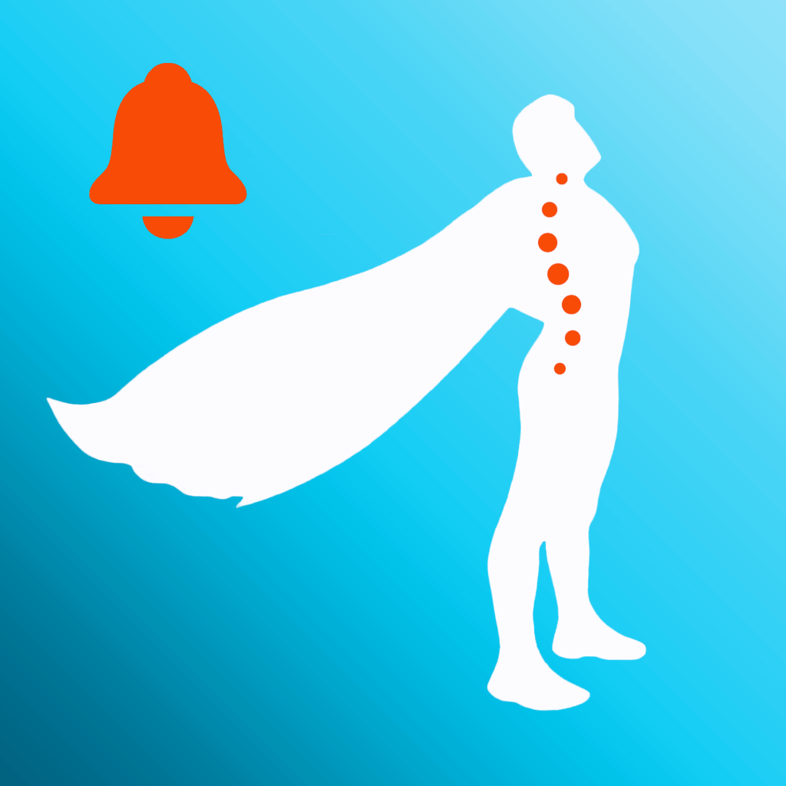

# Universidad Peruana de Ciencias Aplicadas

### **CURSO:** Arquitecturas De Software Emergentes

### **NRC**: 7291

### **Profesor:** Royer Edelwer Rojas Malasquez

### **Ingeniería de software**

## Informe de -

### **Nombre del startup:** NRG7

### **Nombre del producto:** -

## **Integrantes**

| **Nombre**                                | **Codigo** |
| ----------------------------------------- | ---------- |
| **Astonitas Díaz Juan Diego**             | U202110237 |
| **Casas Sanchez Gabriel Alexander**       | U202220033 |
| **Espinoza Delgado BárbaraAntonella**     | U201911727 |
| **Godofredo Quispe Tipo**                 | u202120772 |
| **Pasquale Barrenechea Gianluca Santino** | U202112078 |

**Agosto 2025**

## Registro de Versiones del Informe

<table>
  <thead>
    <tr>
      <th>Versión</th>
      <th>Fecha</th>
      <th>Autor</th>
      <th>Descripción de modificación</th>
    </tr>
  </thead>
  <tbody>
    <tr>
      <td></td>
      <td></td>
      <td></td>
      <td></td>
    </tr>
  </tbody>
</table>

## Project Report Collaboration Insights

El enlace a github del reporte del proyecto es el siguiente: [https://github.com/NRG7-Emergentes/report](https://github.com/NRG7-Emergentes/report).

## Contenido

- [Student Outcome](#student-outcome)
- [Capítulo I: Introducción](#capítulo-i-introducción)
  - [1.1 Startup Profile](#11-startup-profile)
    - [1.1.1 Descripción de la Startup](#111-descripción-de-la-startup)
    - [1.1.2 Perfiles de integrantes del equipo](#112-perfiles-de-integrantes-del-equipo)
  - [1.2 Solution Profile](#12-solution-profile)
    - [1.2.1 Antecedentes y problemática](#121-antecedentes-y-problemática)
    - [1.2.2 Lean UX Process](#122-lean-ux-process)
      - [1.2.2.1 Lean UX Problem Statements](#1221-lean-ux-problem-statements)
      - [1.2.2.2 Lean UX Assumptions](#1222-lean-ux-assumptions)
      - [1.2.2.3 Lean UX Hypothesis Statements](#1223-lean-ux-hypothesis-statements)
      - [1.2.2.4 Lean UX Canvas](#1224-lean-ux-canvas)
  - [1.3 Segmentos objetivo](#13-segmentos-objetivo)
- [Capítulo II: Requirements Elicitation \& Analysis](#capítulo-ii-requirements-elicitation--analysis)
  - [2.1 Competidores](#21-competidores)
    * [2.1.1 Análisis competitivo](#211-análisis-competitivo)
- [2.1.2 Estrategias y tácticas frente a competidores](#212-estrategias-y-tácticas-frente-a-competidores)
- [2.2 Entrevistas](#22-entrevistas)
  - [2.2.1 Diseño de entrevistas](#221-diseño-de-entrevistas)
  - [2.2.2 Registro de entrevistas](#222-registro-de-entrevistas)
  - [2.2.3 Análisis de entrevistas](#223-análisis-de-entrevistas)
- [2.3 Needfinding](#23-needfinding)
  - [2.3.1 User Personas](#231-user-personas)
  - [2.3.2 User Task Matrix](#232-user-task-matrix)
  - [2.3.3 Empathy Mapping](#233-empathy-mapping)
  - [2.3.4 As-is Scenario Mapping](#234-as-is-scenario-mapping)
- [2.4 Ubiquitous Language](#24-ubiquitous-language)
- [Capítulo III: Requirements Specification](#capítulo-iii-requirements-specification)
  - [3.1 To-Be Scenario Mapping](#31-to-be-scenario-mapping)
  - [3.2 User Stories](#32-user-stories)
  - [3.3 Impact Mapping](#33-impact-mapping)
  - [3.4 Product Backlog](#34-product-backlog)
- [Capítulo IV: Strategic-Level Software Design](#capítulo-iv-strategic-level-software-design)
  - [4.1 Strategic-Level Attribute-Driven Design](#41-strategic-level-attribute-driven-design)
    - [4.1.1 Design Purpose](#411-design-purpose)
    - [4.1.2 Attribute-Driven Design Inputs](#412-attribute-driven-design-inputs)
      - [4.1.2.1 Primary Functionality (Primary User Stories)](#4121-primary-functionality-primary-user-stories)
      - [4.1.2.2 Quality attribute Scenarios](#4122-quality-attribute-scenarios)
      - [4.1.2.3 Constraints](#4123-constraints)
    - [4.1.3 Architectural Drivers Backlog](#413-architectural-drivers-backlog)
    - [4.1.4 Architectural Design Decisions](#414-architectural-design-decisions)
    - [4.1.5 Quality Attribute Scenario Refinements](#415-quality-attribute-scenario-refinements)
  - [4.2 Strategic-Level Domain-Driven Design](#42-strategic-level-domain-driven-design)
    - [4.2.1 EventStorming](#421-eventstorming)
    - [4.2.2 Candidate Context Discovery](#422-candidate-context-discovery)
    - [4.2.3 Domain Message Flows Modeling](#423-domain-message-flows-modeling)
    - [4.2.4 Bounded Context Canvases](#424-bounded-context-canvases)
    - [4.2.5 Context Mapping](#425-context-mapping)
  - [4.3 Software Architecture](#43-software-architecture)
    - [4.3.1 Software Architecture System Landscape Diagram](#431-software-architecture-system-landscape-diagram)
    - [4.3.2 Software Architecture Context Level Diagrams](#432-software-architecture-context-level-diagrams)
    - [4.3.3 Software Architecture Container Level Diagrams](#433-software-architecture-container-level-diagrams)
    - [4.3.4 Software Architecture Deployment Diagrams](#434-software-architecture-deployment-diagrams)
- [Conclusiones](#conclusiones)
- [Bibliografía](#bibliografía)
- [Anexos](#anexos)

## Student Outcome

El curso contribuye al cumplimiento del Student Outcome ABET:

**ABET – EAC - Student Outcome 3**

Criterio: _Capacidad de comunicarse efectivamente con un rango de audiencias._
En el siguiente cuadro se describe las acciones realizadas y enunciados de
conclusiones por parte del grupo, que permiten sustentar el haber alcanzado el logro
del ABET – EAC - Student Outcome 3.

<table>
  <thead>
    <tr>
      <th style="text-align: left;">Criterio específico</th>
      <th style="text-align: left;">Acciones realizadas</th>
      <th style="text-align: left;">Conclusiones</th>
    </tr>
  </thead>
  <tbody>
    <tr>
      <td><strong>Comunica oralmente sus ideas y/o resultados con objetividad a público de diferentes especialidades y niveles jerarquicos, en el marco del desarrollo de un proyecto en ingeniería.</strong></td>
      <td>
        -
      </td>
      <td>
        -
      </td>
    </tr>
    <tr>
      <td><strong>Comunica en forma escrita ideas y/o resultados con objetividad a público de diferentes especialidades y niveles jerarquicos, en el marco del desarrollo de un proyecto eningeniería.</strong></td>
      <td>
        -
      </td>
      <td>
        -
      </td>
    </tr>
  </tbody>
</table>

## Capítulo I: Introducción

### 1.1 Startup Profile

#### 1.1.1 Descripción de la Startup

#### 1.1.2 Perfiles de integrantes del equipo

### 1.2 Solution Profile

#### 1.2.1 Antecedentes y problemática

#### 1.2.2 Lean UX Process

##### 1.2.2.1 Lean UX Problem Statements

##### 1.2.2.2 Lean UX Assumptions

##### 1.2.2.3 Lean UX Hypothesis Statements

##### 1.2.2.4 Lean UX Canvas

### 1.3 Segmentos objetivo

## Capítulo II: Requirements Elicitation & Analysis

### 2.1 Competidores

A continuación, se presenta un análisis competitivo que examina a las principales empresas que rivalizan con nuestra startup. Hemos identificado tanto competidores directos, aquellos que ofrecen una solución de software centralizada en la monitorización y corrección proactiva de la postura mediante el uso de la cámara, como indirectos que, si bien no son idénticos, compiten en áreas clave superpuestas como el bienestar digital en el puesto de trabajo, la ergonomía y la prevención de la fatiga física que impacta la productividad. Este análisis se centra en aquellos que ofrecen soluciones que se superponen con las de **\*\*\*\***.

1. **Posture Reminder**  
     
   **Descripción:**  
   Software de escritorio que utiliza la cámara web para detectar encorvamiento y emitir una alerta sonora inmediata.  
   **Características principales**
  - Monitorización pasiva con la cámara web.
  - Alerta sonora simple al detectar mala postura.
  - Personalización de sensibilidad.

---

2. **Upright Go**  
     
   **Descripción:**  
   Wearable (sensor portátil) que se adhiere a la espalda y vibra sutilmente al detectar que el usuario se está encorvando.  
   **Características principales**
  - Tecnología de sensor wearable (sin cámara).
  - Vibración discreta como retroalimentación táctil.
  - App móvil con seguimiento de progreso y métricas.
  - Solución portátil que funciona fuera del escritorio.
  - Informes de progreso.

---

3. **Workpace**  
     
   **Descripción:**  
   Plataforma integral de wellness laboral que gestiona la ergonomía, programa pausas activas y cumple con estándares de seguridad de la información.  
   **Características principales**
  - Recordatorios de pausas y estiramientos basados en la ciencia.
  - Cumplimiento de normas de seguridad (ISO 27002, RGPD).
  - Enfoque en la salud y seguridad ambiental (EHS).
  - Solución corporativa para la gestión del bienestar de equipos.

#### 2.1.1 Análisis competitivo

<table> 
  <tr>
    <th colspan="6"> Competitive Analysis Landscape </th>
  </tr>
  <tr>
    <td colspan="2" rowspan="2">¿Por qué llevar acabo este análisis? </td>
    <td colspan="4"> Pregunta </td>
  </tr>
  <tr>
    <td colspan="4"> Deberíamos llevar a cabo este análisis para conocer el entorno, la competencia, tomar decisiones de desarrollo y construir nuestra propuesta de valor. </td>
  </tr>
  <tr>
    <td colspan="2"> Productos </td>
    <td> Producto </td>
    <td> Posture Reminder </td>
    <td> Upright Go </td>
    <td> Workpace </td>
  </tr>
  <tr>
    <td rowspan="2">Perfil</td>
    <td>Overview</td>
    <td> PRODUCTO </td>
    <td> Software de monitorización postural mediante cámara web. </td>
    <td> Wearable (sensor portátil) que vibra al detectar encorvamiento. </td>
    <td> Plataforma corporativa de wellness laboral con foco en ergonomía y pausas activas. </td>
  </tr>
  <tr>
    <td>Ventaja
    competitiva
    ¿Qué valor
    ofrece a los
    clientes?</td>
    <td> Ofrece PRODUCTO. </td>
    <td> Ofrece solución simple, económica y no invasiva. Procesamiento local garantiza privacidad.</td>
    <td> Ofrece precisión en la detección y portabilidad para uso en cualquier entorno. </td>
    <td> Ofrece enfoque integral y normativo (ISO 27002, RGPD) para empresas. </td>
  </tr>
  <tr>
    <td rowspan="2">Perfil de Marketing</td>
    <td> Mercado Objetivo </td>
    <td> PRODUCTO. </td>
    <td> Individuos que buscan una solución simple y económica. </td>
    <td> Usuarios preocupados por la postura que prefieren una solución portable y discreta. </td>
    <td> Empresas medianas y grandes que necesitan cumplir normas de bienestar y seguridad laboral. </td>
  </tr>
  <tr>
    <td> Estrategias de Marketing </td>
    <td> PRODUCTO. </td>
    <td> Marketing orgánico, versiones freemium y recomendaciones. </td>
    <td> Marketing digital (redes sociales, influencers), reviews en medios especializados y Amazon. </td>
    <td> Ventas B2B, ferias sectoriales, partners de RH y demostraciones personalizadas. </td>
  </tr>
  <tr>

  </tr>
  <tr>
    <td rowspan="3">Perfil de Producto</td>
    <td> Productos & Servicios </td>
    <td> PRODUCTO. </td>
    <td> App desktop (Windows/macOS) con alertas sonoras y ajustes de sensibilidad. </td>
    <td> Sensor wearable + app móvil con programas de entrenamiento y tracking de progreso. </td>
    <td> Software de pausas activas, informes de bienestar y gestión centralizada para empresas. </td>
  </tr>
  <tr>
    <td> Precios & Costos </td>
    <td> PRODUCTO. </td>
    <td> Freemium. Versión Pro: $20-30 (pago único). </td>
    <td> $99-$150 (hardware + app). Modelo de pago único. </td>
    <td> Modelo de suscripción por usuario. </td>
  </tr>
  <tr> 
    <td>Canales de distribución (Web y/o Móvil)</td>
    <td> PRODUCTO. </td>
    <td> Sitio web propio y plataformas de descarga. </td>
    <td> Ecommerce propio, Amazon y retailers especializados en salud. </td>
    <td> Ventas directas y partners corporativos. </td>
  </tr>
  <tr>
    <td rowspan="4"> Análisis SWOT </td>
    <td> Fortalezas </td>
    <td> PRODUCTO. </td>
    <td> Bajo costo, fácil implementación, privacidad de datos. </td>
    <td> Alta portabilidad, retroalimentación táctil inmediata. </td>
    <td> Cumplimiento normativo, enfoque corporativo, escalabilidad. </td>
  </tr>
  <tr>
    <td> Debilidades </td>
    <td> PRODUCTO </td>
    <td> Dependencia de la cámara, alertas básicas que son sonidos. </td>
    <td> Costo inicial alto, requiere llevar puesto el sensor. </td>
    <td> Precio elevado para individuos, implementación compleja para pequeñas y medianas empresas. </td>
  </tr>
  <tr>
    <td> Oportunidades </td>
    <td> PRODUCTO. </td>
    <td> Integración con apps de productividad (Zoom, Teams) y versiones móviles. </td>
    <td> Expansión a mercados de wellness corporativo y programas de fisioterapia. </td>
    <td> Crecimiento del teletrabajo y mayor regulación en salud laboral post-pandemia. </td>
  </tr>
  <tr>
    <td> Amenazas </td>
    <td> PRODUCTO. </td>
    <td> Competencia de soluciones gratuitas o integradas en OS. </td>
    <td> Avances en IA de cámaras que replican la funcionalidad sin hardware. </td>
    <td> Completencias de grandes empresas (Microsoft,Viva, etc) y soluciones de bajo costo. </td>
  </tr>
</table>

#### 2.1.2 Estrategias y tácticas frente a competidores

**1. Estrategia de Diferenciación por Simplicidad y Usabilidad**
**Objetivo:** Ser la solución más intuitiva y fácil de usar para usuarios no técnicos.
**Tácticas:**

- Instalacion en solo 1 clic y con configuracion que no lleve mas de 10 seg.
- Diseñar una interfaz limpia y minimalista con solo 3 botones: encender/apagar, ajustar la posicion y ver el progreso.
- Alerta no intrusivas: Notificaciones suaves en la esquina de la pantalla más sonido personalizado.

**2. Estrategia de Enfoque en Nichos Desatendidos**
**Objetivo:** Dominar segmentos específicos dentro del mercado de estidantes y trabajadores remotos.
**Tácticas:**

- Descuentos para estudiantes: Verificacion con correo ".edu" para acceso premiun a precio muy bajos.
- Pack Equipos Remotos: Para pequeñas empresas con planes grupales.

**3. Estrategia de Humanización y Cercanía de Marca**
**Objetivo:** Crear una comunidad alrededor del bienestar postural, no solo vender software.
**Tácticas:**

- Restos semanales: "7 días de buena postura" con recompensa logros/descuentos.
- Testimonios en Redes sociales(Reels): De usuarios reales mostrando cómo el software les ayudo con el dolor de espaldo y mejoro su postura en 30 seg.
- Soporte: Chat en vivo para problemas técnicos, no solo correo electrónico.

**4. Estrategia de Precio Accesible y Transparente**
**Objetivo:** Reducir toda friccion finaciera para el usuario individual.
**Tácticas:**

- Plan Gratuito Limitado: Con alertas básicas y estadísticas de 7 días(para mantener el plan debe de contar su experiencia en las redes sociales o en forum de la misma web).
- Diseñar una estructura de precios clara, con un plan gratuito funcional y un plan premium económico.

### 2.2 Entrevistas

#### 2.2.1 Diseño de entrevistas

## 2.2.1. Diseño de entrevistas

**Entrevista para Trabajadores Remotos**

**Preguntas:**
1. ¿Cuál es tu nombre, edad y género?
2. ¿A qué te dedicas actualmente y desde hace cuánto trabajas de manera remota?
3. ¿Cuál es tu estado civil y dónde resides actualmente?
4. ¿Cuántas horas al día pasas frente a la computadora trabajando?
5. ¿En qué momentos del día sueles trabajar más (mañana, tarde, noche)?
6. ¿Has experimentado molestias físicas (dolor de cuello, espalda, muñecas, fatiga visual) por el trabajo remoto?
7. ¿Qué tan consciente eres de tu postura mientras trabajas?
8. ¿Qué herramientas digitales utilizas para mejorar tu zona de trabajo o tu organización diaria? (ej. Google Calendar, Notion, Slack, Trello)
9. ¿Qué elementos físicos tienes en tu espacio de trabajo para mejorar tu comodidad? (ej. escritorio amplio, silla ergonómica, reposapiés, lámpara de luz)
10. ¿Has probado aplicaciones o dispositivos que te recuerden moverte o corregir tu postura? ¿Cómo fue tu experiencia?
11. ¿Qué características valoras más en una aplicación que te ayude a cuidar tu postura y salud mientras trabajas?
12. ¿Estarías dispuesto(a) a usar una aplicación de este tipo en tu rutina diaria? ¿Por qué sí o por qué no?

**Entrevista para Estudiantes que Usan Computadoras** 

**Preguntas:**
1. ¿Cuál es tu nombre, edad y género?
2. ¿Qué estudias actualmente y en qué nivel educativo estás (pregrado, posgrado, curso técnico, etc.)?
3. ¿Cuál es tu estado civil y dónde resides actualmente?
4. ¿Cuántas horas al día pasas frente a la computadora estudiando o realizando trabajos académicos?
5. ¿En qué espacios sueles estudiar con más frecuencia? (ej. dormitorio, biblioteca, cafetería, sala de estudios)
6. ¿Has sentido molestias físicas (dolor de cuello, espalda, fatiga visual) debido a tus sesiones de estudio prolongadas?
7. ¿Sueles estar pendiente de tu postura mientras estudias?
8. ¿Qué herramientas digitales utilizas para organizarte o mejorar tu rutina académica? (ej. Google Calendar, Notion, apps de concentración, temporizadores Pomodoro)
9. ¿Qué elementos físicos usas en tu espacio de estudio para sentirte más cómodo(a)? (ej. mesa amplia, silla acolchada, cojines, lámpara de escritorio)
10. ¿Has probado alguna aplicación o recurso que te ayude a cuidar tu salud física o postura durante el estudio?
11. ¿Qué características consideras más importantes en una aplicación pensada para estudiantes que pasan mucho tiempo frente a la computadora?
12. ¿Te interesaría usar una aplicación que te ayude a mantener una buena postura y reducir molestias durante tus estudios? ¿Por qué sí o por qué no?  

#### 2.2.2 Registro de entrevistas

#### 2.2.3 Análisis de entrevistas

### 2.3 Needfinding

#### 2.3.1 User Personas

#### 2.3.2 User Task Matrix

#### 2.3.3 Empathy Mapping

#### 2.3.4 As-is Scenario Mapping

### 2.4 Ubiquitous Language

## Capítulo III: Requirements Specification

### 3.1 To-Be Scenario Mapping

### 3.2 User Stories

### 3.3 Impact Mapping

### 3.4 Product Backlog

## Capítulo IV: Strategic-Level Software Design

### 4.1 Strategic-Level Attribute-Driven Design

#### 4.1.1 Design Purpose

#### 4.1.2 Attribute-Driven Design Inputs

##### 4.1.2.1 Primary Functionality (Primary User Stories)

##### 4.1.2.2 Quality attribute Scenarios

##### 4.1.2.3 Constraints

#### 4.1.3 Architectural Drivers Backlog

#### 4.1.4 Architectural Design Decisions

#### 4.1.5 Quality Attribute Scenario Refinements

### 4.2 Strategic-Level Domain-Driven Design

#### 4.2.1 EventStorming

#### 4.2.2 Candidate Context Discovery

#### 4.2.3 Domain Message Flows Modeling

#### 4.2.4 Bounded Context Canvases

#### 4.2.5 Context Mapping

### 4.3 Software Architecture

#### 4.3.1 Software Architecture System Landscape Diagram

#### 4.3.2 Software Architecture Context Level Diagrams

#### 4.3.3 Software Architecture Container Level Diagrams

#### 4.3.4 Software Architecture Deployment Diagrams

## Conclusiones

## Bibliografía

## Anexos
