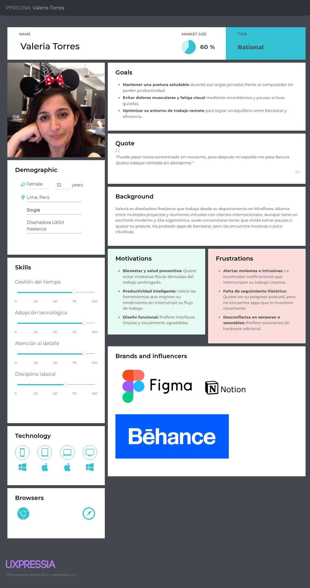
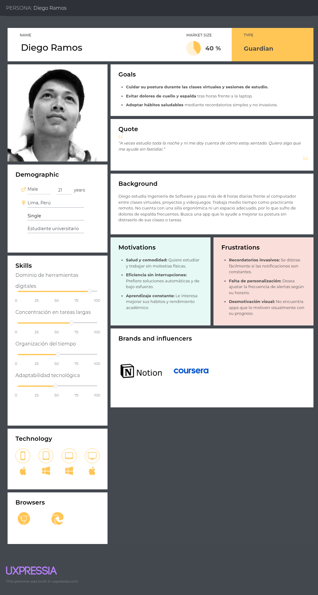

# Universidad Peruana de Ciencias Aplicadas

### **CURSO:** Arquitecturas De Software Emergentes

### **NRC**: 7291

### **Profesor:** Royer Edelwer Rojas Malasquez

### **Ingeniería de software**

## Informe de -

### **Nombre del startup:** NRG7

### **Nombre del producto:** -

## **Integrantes**

| **Nombre**                                | **Codigo** |
| ----------------------------------------- | ---------- |
| **Astonitas Díaz Juan Diego**             | U202110237 |
| **Casas Sanchez Gabriel Alexander**       | U202220033 |
| **Espinoza Delgado Bárbara Antonella**    | U201911727 |
| **Godofredo Quispe Tipo**                 | u202120772 |
| **Pasquale Barrenechea Gianluca Santino** | U202112078 |

**Agosto 2025**

## Registro de Versiones del Informe

<table>
  <thead>
    <tr>
      <th>Versión</th>
      <th>Fecha</th>
      <th>Autor</th>
      <th>Descripción de modificación</th>
    </tr>
  </thead>
  <tbody>
    <tr>
      <td></td>
      <td></td>
      <td></td>
      <td></td>
    </tr>
  </tbody>
</table>

## Project Report Collaboration Insights

El enlace a github del reporte del proyecto es el siguiente: [https://github.com/NRG7-Emergentes/report](https://github.com/NRG7-Emergentes/report).

## Contenido

- [Student Outcome](#student-outcome)
- [Capítulo I: Introducción](#capítulo-i-introducción)
  - [1.1 Startup Profile](#11-startup-profile)
    - [1.1.1 Descripción de la Startup](#111-descripción-de-la-startup)
    - [1.1.2 Perfiles de integrantes del equipo](#112-perfiles-de-integrantes-del-equipo)
  - [1.2 Solution Profile](#12-solution-profile)
    - [1.2.1 Antecedentes y problemática](#121-antecedentes-y-problemática)
    - [1.2.2 Lean UX Process](#122-lean-ux-process)
      - [1.2.2.1 Lean UX Problem Statements](#1221-lean-ux-problem-statements)
      - [1.2.2.2 Lean UX Assumptions](#1222-lean-ux-assumptions)
      - [1.2.2.3 Lean UX Hypothesis Statements](#1223-lean-ux-hypothesis-statements)
      - [1.2.2.4 Lean UX Canvas](#1224-lean-ux-canvas)
  - [1.3 Segmentos objetivo](#13-segmentos-objetivo)
- [Capítulo II: Requirements Elicitation \& Analysis](#capítulo-ii-requirements-elicitation--analysis)
  - [2.1 Competidores](#21-competidores)
    - [2.1.1 Análisis competitivo](#211-análisis-competitivo)
    - [2.1.2 Estrategias y tácticas frente a competidores](#212-estrategias-y-tácticas-frente-a-competidores)
  - [2.2 Entrevistas](#22-entrevistas)
    - [2.2.1 Diseño de entrevistas](#221-diseño-de-entrevistas)
    - [2.2.2 Registro de entrevistas](#222-registro-de-entrevistas)
    - [2.2.3 Análisis de entrevistas](#223-análisis-de-entrevistas)
  - [2.3 Needfinding](#23-needfinding)
    - [2.3.1 User Personas](#231-user-personas)
    - [2.3.2 User Task Matrix](#232-user-task-matrix)
    - [2.3.3 Empathy Mapping](#233-empathy-mapping)
    - [2.3.4 As-is Scenario Mapping](#234-as-is-scenario-mapping)
  - [2.4 Ubiquitous Language](#24-ubiquitous-language)
- [Capítulo III: Requirements Specification](#capítulo-iii-requirements-specification)
  - [3.1 To-Be Scenario Mapping](#31-to-be-scenario-mapping)
  - [3.2 User Stories](#32-user-stories)
  - [3.3 Impact Mapping](#33-impact-mapping)
  - [3.4 Product Backlog](#34-product-backlog)
- [Capítulo IV: Strategic-Level Software Design](#capítulo-iv-strategic-level-software-design)
  - [4.1 Strategic-Level Attribute-Driven Design](#41-strategic-level-attribute-driven-design)
    - [4.1.1 Design Purpose](#411-design-purpose)
    - [4.1.2 Attribute-Driven Design Inputs](#412-attribute-driven-design-inputs)
      - [4.1.2.1 Primary Functionality (Primary User Stories)](#4121-primary-functionality-primary-user-stories)
      - [4.1.2.2 Quality attribute Scenarios](#4122-quality-attribute-scenarios)
      - [4.1.2.3 Constraints](#4123-constraints)
    - [4.1.3 Architectural Drivers Backlog](#413-architectural-drivers-backlog)
    - [4.1.4 Architectural Design Decisions](#414-architectural-design-decisions)
    - [4.1.5 Quality Attribute Scenario Refinements](#415-quality-attribute-scenario-refinements)
  - [4.2 Strategic-Level Domain-Driven Design](#42-strategic-level-domain-driven-design)
    - [4.2.1 EventStorming](#421-eventstorming)
    - [4.2.2 Candidate Context Discovery](#422-candidate-context-discovery)
    - [4.2.3 Domain Message Flows Modeling](#423-domain-message-flows-modeling)
    - [4.2.4 Bounded Context Canvases](#424-bounded-context-canvases)
    - [4.2.5 Context Mapping](#425-context-mapping)
  - [4.3 Software Architecture](#43-software-architecture)
    - [4.3.1 Software Architecture System Landscape Diagram](#431-software-architecture-system-landscape-diagram)
    - [4.3.2 Software Architecture Context Level Diagrams](#432-software-architecture-context-level-diagrams)
    - [4.3.3 Software Architecture Container Level Diagrams](#433-software-architecture-container-level-diagrams)
    - [4.3.4 Software Architecture Deployment Diagrams](#434-software-architecture-deployment-diagrams)
- [Conclusiones](#conclusiones)
- [Bibliografía](#bibliografía)
- [Anexos](#anexos)

## Student Outcome

El curso contribuye al cumplimiento del Student Outcome ABET:

**ABET – EAC - Student Outcome 3**

Criterio: _Capacidad de comunicarse efectivamente con un rango de audiencias._
En el siguiente cuadro se describe las acciones realizadas y enunciados de
conclusiones por parte del grupo, que permiten sustentar el haber alcanzado el logro
del ABET – EAC - Student Outcome 3.

<table>
  <thead>
    <tr>
      <th style="text-align: left;">Criterio específico</th>
      <th style="text-align: left;">Acciones realizadas</th>
      <th style="text-align: left;">Conclusiones</th>
    </tr>
  </thead>
  <tbody>
    <tr>
      <td><strong>Comunica oralmente sus ideas y/o resultados con objetividad a público de diferentes especialidades y niveles jerarquicos, en el marco del desarrollo de un proyecto en ingeniería.</strong></td>
      <td>
        -
      </td>
      <td>
        -
      </td>
    </tr>
    <tr>
      <td><strong>Comunica en forma escrita ideas y/o resultados con objetividad a público de diferentes especialidades y niveles jerarquicos, en el marco del desarrollo de un proyecto eningeniería.</strong></td>
      <td>
        -
      </td>
      <td>
        -
      </td>
    </tr>
  </tbody>
</table>

## Capítulo I: Introducción

### 1.1 Startup Profile

#### 1.1.1 Descripción de la Startup

**NRG7** es una empresa peruana de tecnología dedicada a la investigación, desarrollo e implementación de herramientas software centradas en la mejora de la productividad. Nos especializamos en crear ecosistemas que combinan inteligencia artificial y análisis de datos para potenciar el desempeño del capital humano.

**Misión:** Proveer soluciones tecnológicas innovadoras que promuevan la productividad de las personas en sus entornos laborales y educativos.

**Visión:** Ser la solución líder en ergonomía digital en el Perú, reconocida por promover entornos laborales y educativos saludables y aumentar la productividad del capital humano.

#### 1.1.2 Perfiles de integrantes del equipo

<table>
  <tr>
    <th colspan="2"> Juan Diego Astonitas </th>
  </tr>
  <tr>
    <td>  </td>
    <td> Mi nombre es Juan Diego Astonitas Diaz, mi código de estudiante es u202110237 ,tengo 21 años, actualmente curso el 7to ciclo de la carrera de Ingeniería de Software, en la UPC en la sede San Miguel. Mis principales cualidades son el liderazgo y el dominio de NextJS. Haré todo lo que esté a mi alcance para respaldar al equipo en la finalización oportuna y efectiva de las tareas asignadas. </td>
  </tr> 
  <tr>
    <th colspan="2"> Casas Sanchez Gabriel Alexander </th>
  </tr>
  <tr>
    <td>  </td>
    <td> 	Soy estudiante de Ingeniería de Software en quinto ciclo, con habilidades para dirigir y trabajar bien bajo presión. Aunque no disfruto mucho de los trabajos grupales, siempre asumo un rol destacado y sobresaliente en ellos, aprovechando mi capacidad académica y versatilidad. </td>
  </tr>
  <tr>
    <th colspan="2"> Gianluca Santino Pasquale Barrenechea </th>
  </tr>
  <tr>
    <td>  </td>
    <td> Me llamo Gianluca Santino Pasquale Barrenechea, estudiante de Ingeniería de Software (código u202112078). En nuestra Startup, me enfoco en el desarrollo frontend y backend, utilizando C++, C#, Python, Java, HTML y JavaScript. Mi objetivo es crear soluciones escalables y eficientes, mejorando la experiencia del usuario y optimizando la operación de la plataforma, siempre aplicando metodologías ágiles como Scrum. </td>
  </tr>
  <tr>
    <th colspan="2">Godofredo Quispe Tipo</th>
  </tr>
  <tr>
    <td>  </td>
    <td>  Mi nombre es Godofredo y actualmente me encuentro cursando la carrera de Ingeniería de Software, un campo que me apasiona profundamente. Mi interés por las nuevas tecnologías es constante, y estoy siempre al tanto de las últimas innovaciones que están redefiniendo el panorama tecnológico. Me considero un entusiasta de la programación, área en la que he adquirido un dominio en diversos lenguajes, tales como Python, C++ y Assembler, lo que me ha permitido abordar una amplia gama de proyectos y desafíos técnicos. </td>
  </tr>
  <tr>
    <th colspan="2">Bárbara Espinoza Delgado</th>
  </tr>
  <tr>
    <td>  </td>
    <td> Mi nombre es Bárbara Antonella Espinoza Delgado, mi código de estudiante es u201911727 ,tengo 23 años, soy estudiante de Ingeniería de Software de 8vo ciclo. Tengo experiencia en trabajos en equipo y me considero una persona puntual con la realización y entrega de las tareas pendientes.
 </td>
  </tr>
</table>

### 1.2 Solution Profile

#### 1.2.1 Antecedentes y problemática

**What**

- ¿Cuál es el problema?

El problema principal es la adopción prolongada de posturas incorrectas y la proximidad excesiva a la pantalla durante actividades frente a la computadora, conductas que, al ser imperceptibles para el usuario en el momento,  afectan negativamente la salud y productividad a largo plazo

- ¿Cuál es la relación con la persona en cuestión?

La relación con el usuario es la de un asistente preventivo y pasivo que monitorea de forma continua e individual, proporcionando retroalimentación inmediata para fomentar la autoconciencia y la autocorrección de los malos hábitos posturales.

**When**

- ¿Cuándo sucede el problema?

El problema ocurre durante prolongadas horas de uso de la computadora de sobremesa, específicamente en los momentos de máxima concentración donde el usuario, absorto en sus tareas, adopta de manera inconsciente y mantenida una postura ergonómicamente incorrecta.

- ¿Cuándo utiliza el cliente el producto?

El cliente utiliza el producto de forma activa y constante durante toda su jornada laboral o de estudio frente al computador. La aplicación funciona en segundo plano, monitorizando de manera ininterrumpida desde el momento en que se inicia la sesión hasta que finaliza.

**Where**

- ¿Dónde está el cliente cuando usa el producto?

El cliente utiliza el producto en su espacio fijo de trabajo o estudio, específicamente frente al computador en una oficina doméstica o escritorio personal. 

- ¿Dónde surge el problema?

**Who**

- ¿Quienes se ven involucrados en el problema?

El problema surge en el entorno inmediato de trabajo del usuario, específicamente en su estación de computadora personal ubicada en el hogar u oficina. Se manifiesta en la interacción física entre el usuario y su puesto de trabajo, donde la disposición del espacio y los hábitos individuales propician las malas posturas.

**Why**

- ¿Cuáles son las causas del problema?

Las causas principales del problema radican en la falta de conciencia postural inmediata y la ausencia de retroalimentación correctiva en tiempo real, agravadas por entornos de trabajo no ergonómicos y la inmersión mental en las tareas digitales.

**How**

- ¿En qué condiciones los clientes usan nuestro producto?

Los clientes usan nuestro producto bajo condiciones de iluminación ambiental normal y con la cámara posicionada de manera lateral en su espacio de trabajo, manteniéndose sentados frente al computador durante sus actividades. La aplicación opera de forma discreta integrada en su rutina digital, sin requerir interacción activa más allá de la configuración inicial.

**How Much**

- ¿Cuál es la magnitud del problema?

La magnitud del problema es considerable, dado que un estudio reciente sobre el teletrabajo en Perú encontró que el 75% de los participantes reportaron haber sufrido dolores en cuello, espalda y extremidades superiores. Esto evidencia una alta prevalencia de dolencias musculoesqueléticas directamente asociadas a posturas incorrectas y forzadas durante largos períodos frente a la computadora.

#### 1.2.2 Lean UX Process

El lean UX process es un enfoque iterativo centrado en el usuario para el diseño de proyectos y productos. Este enfoque se basa en ciclos rápidos (sprints) de investigación, diseño y pruebas para validar la propuesta o ideas planteadas por el equipo. Estas propuestas estarán siempre orientadas a satisfacer las necesidades de los usuarios.

##### 1.2.2.1 Lean UX Problem Statements

En el contexto actual, millones de personas trabajan o estudian frente a una computadora durante largas jornadas, lo que conlleva la adopción inconsciente de posturas inadecuadas. Este problema se ha intensificado con el teletrabajo y la educación remota, generando un aumento en los casos de dolor músculo-esquelético y fatiga asociada.

Si bien existen recomendaciones ergonómicas y soluciones tradicionales (sillas especiales, escritorios ajustables, pausas activas), estas dependen de la disciplina del usuario y no ofrecen un monitoreo en tiempo real. La falta de retroalimentación inmediata hace que las correcciones posturales sean poco frecuentes y lleguen demasiado tarde.

ErgoVision surge como una propuesta innovadora basada en tecnologías emergentes: un sistema que emplea visión por computadora y análisis inteligente para identificar posturas inadecuadas y proximidad excesiva a la pantalla, ofreciendo alertas discretas y recomendaciones en tiempo real. Su objetivo es fomentar la autoconciencia, prevenir dolores y mejorar tanto la salud como la productividad de los usuarios en entornos digitales.

##### 1.2.2.2 Lean UX Assumptions

_**User Assumptions (Suposiciones de Usuario)**_

**¿Quién es el usuario?**
Profesionales, estudiantes y trabajadores remotos que pasan largas horas frente a una computadora y desean mejorar su postura y cuidar su bienestar.

**¿Dónde encaja nuestro producto en su trabajo o vida?**
Encaja directamente en su rutina diaria de estudio o trabajo frente al computador, en espacios como oficinas domésticas, escritorios personales y entornos laborales.

**¿Qué problemas resuelve nuestro producto?**
* Posturas incorrectas mantenidas de forma inconsciente.
* Dolor de cuello, espalda y fatiga visual.
* Falta de conciencia y retroalimentación en tiempo real.
* Ambientes de trabajo poco ergonómicos.

**¿Cuándo y cómo se usa nuestro producto?**
Se usa de manera continua y pasiva durante toda la jornada frente a la computadora. ErgoVision opera en segundo plano, monitoreando con una cámara lateral y/o frontal, enviando alertas discretas cuando detecta proximidad excesiva o malas posturas.

**¿Qué características son importantes?**
* Detección automática de posturas incorrectas.
* Alertas no invasivas (visuales/sonoras suaves).
* Recomendaciones de corrección simples y claras.
* Integración discreta en la rutina sin interrumpir la concentración.

**¿Cómo debe verse y comportarse nuestro producto?**
Debe ser minimalista, intuitivo y amigable, con un diseño discreto que no sature al usuario. El comportamiento debe ser pasivo, no intrusivo, con retroalimentación clara, rápida y de fácil interpretación.

**_Business Assumptions (Suposiciones de Negocio)_**

**Necesidades y problemas:** 
Los usuarios necesitan una solución preventiva y accesible que los ayude a cuidar su salud postural sin invertir en equipos costosos (sillas ergonómicas, escritorios ajustables) o terapias correctivas.

**Plataforma:** 
Aplicación de escritorio y expansión a aplicaciones móviles de acompañamiento para métricas y reportes.

**Segmentación:**
* Profesionales de oficina y teletrabajadores.
* Estudiantes universitarios o de posgrado.

**Comportamientos:** 
Los usuarios valoran la discreción, la facilidad de uso y la integración sin fricciones en su rutina diaria. Prefieren soluciones simples que no requieran aprendizaje complejo.

**Beneficios:**
* Prevención de dolores y lesiones.
* Incremento de la productividad y concentración.
* Mejora en la salud y bienestar a largo plazo.
* Conciencia ergonómica incorporada en la rutina.

**Captación de clientes:** 
Estrategias de inbound marketing, marketing digital enfocado en salud y productividad, alianzas con universidades, coworkings y empresas de teletrabajo.

**Modelo de ingresos:**
* Versión gratuita con funciones básicas de alerta.
* Modelo SaaS con suscripción mensual/anual para reportes avanzados, estadísticas de uso y personalización.

**Competencia:** 
Aplicaciones de recordatorio de pausas o dispositivos wearables que monitorean postura, aunque con menor precisión o mayor costo.

**Ventaja competitiva:** 
Monitoreo pasivo en tiempo real con visión por computadora, accesibilidad multiplataforma y retroalimentación inmediata sin hardware adicional.

**_Technical Assumptions (Suposiciones Técnicas)_**

**Tecnología utilizada:** 
Visión por computadora e inteligencia artificial (modelos de pose estimation). Desarrollo en frameworks multiplataforma (Flutter Desktop/Angular/Flutter Mobile) para garantizar compatibilidad.

**Integraciones:** 
Posibilidad de integrar notificaciones con sistemas operativos, apps de productividad (Google Workspace, Microsoft Teams) en fases futuras.

**Escalabilidad:** 
Arquitectura en la nube para el almacenamiento de estadísticas, con procesamiento local en el dispositivo para garantizar privacidad y bajo consumo de recursos.

**_Market Assumptions (Suposiciones de Mercado)_**

**Tamaño del mercado:** 
Alta demanda en el sector del teletrabajo y la educación online. Según tendencias post-pandemia, millones de personas buscan mejorar sus espacios y hábitos de trabajo desde casa.

**Competencia:** 
Herramientas de ergonomía tradicionales (sillas, escritorios ajustables, accesorios) y aplicaciones simples de recordatorio. Ninguna ofrece monitoreo postural inteligente continuo a bajo costo.

**Tendencias:** 
Creciente interés en salud digital, ergonomía, bienestar en el trabajo y uso de tecnologías emergentes (IA + visión por computadora) aplicadas al cuidado personal.

**_Design Assumptions (Suposiciones de Diseño)_**

**Interacción del usuario:** 
La experiencia debe ser clara y no intrusiva, con alertas visuales discretas en pantalla y posibilidad de configurar notificaciones auditivas.

**Experiencia del usuario:** 
Los usuarios valorarán una experiencia simple, con recomendaciones fáciles de seguir y reportes que motiven la mejora de hábitos.

**Colores y tipografía:** 
Paleta moderna y calmante (azules, verdes, tonos neutros) que transmitan confianza y bienestar. Tipografía clara y legible.

**Preferencias visuales:** 
Diseño minimalista, con iconos intuitivos y gráficos simples para mostrar métricas (tiempo en buena postura, alertas recibidas).

**Prototipos y pruebas:** 
Validación continua con usuarios reales (profesionales, estudiantes) mediante pruebas de usabilidad para asegurar adopción y aceptación de las alertas.

##### 1.2.2.3 Lean UX Hypothesis Statements

**Hypothesis Statement 01:**  
- Creemos que los usuarios de nuestra aplicación son trabajadores y estudiantes remotos que buscan mantener una postura saludable durante largas jornadas frente al computador.  
- Sabremos que estamos en lo correcto cuando veamos comentarios positivos sobre el impacto en su postura y un aumento en usuarios activos semanales.  

**Hypothesis Statement 02:**  
- Creemos que nuestra aplicación encaja en la rutina diaria al monitorear automáticamente la postura mientras el usuario trabaja o estudia.  
- Sabremos que estamos en lo correcto cuando veamos un uso recurrente de la aplicación durante más de 4 horas al día en sesiones continuas.  

**Hypothesis Statement 03:**  
- Creemos que nuestra aplicación resuelve el problema de malas posturas prolongadas y cercanía excesiva a la pantalla.  
- Sabremos que estamos en lo correcto cuando veamos una disminución en las alertas repetidas y un aumento en los reportes de corrección de postura.  

**Hypothesis Statement 04:**  
- Creemos que los usuarios emplearán la aplicación principalmente en horarios de trabajo y estudio (mañana y tarde).  
- Sabremos que estamos en lo correcto cuando el 70% del uso de la aplicación ocurra en franjas de 8:00–13:00 y 14:00–20:00.  

**Hypothesis Statement 05:**  
- Creemos que las características clave incluyen monitoreo en tiempo real, alertas visuales/sonoras y reportes de hábitos posturales.  
- Sabremos que estamos en lo correcto cuando los usuarios valoren estas funciones en encuestas y se incremente la tasa de retención mensual.  

**Hypothesis Statement 06:**  
- Creemos que el diseño debe ser simple, discreto y fácil de configurar para que al usuario no le tome mucho tiempo en empezar a usar la aplicación.  
- Sabremos que estamos en lo correcto cuando recibamos comentarios positivos sobre la facilidad de uso y una tasa de abandono inicial menor al 10%.  

**Hypothesis Statement 07:**  
- Creemos que nuestros usuarios necesitan saber rápidamente cuándo están encorvados o demasiado cerca de la pantalla.  
- Sabremos que estamos en lo correcto cuando la app emita alertas inmediatas y los usuarios reporten mejoras en su conciencia postural.  

**Hypothesis Statement 08:**  
- Creemos que estas necesidades se pueden resolver con IA de visión computacional que analice en tiempo real la postura mediante la webcam.  
- Sabremos que estamos en lo correcto cuando logremos una precisión de detección superior al 90% en pruebas con usuarios reales.  

**Hypothesis Statement 09:**  
- Creemos que nuestros usuarios iniciales serán personas entre 18 y 45 años que trabajan o estudian más de 5 horas frente al computador.  
- Sabremos que estamos en lo correcto cuando al menos el 70% de los registros pertenezcan a este rango etario.  

**Hypothesis Statement 10:**  
- Creemos que el valor número uno para el usuario es prevenir dolores y lesiones musculoesqueléticas mediante recordatorios oportunos.  
- Sabremos que estamos en lo correcto cuando recibamos retroalimentación positiva sobre reducción de molestias y mejor concentración.  

**Hypothesis Statement 11:**  
- Creemos que los usuarios también valorarán beneficios adicionales como reportes semanales y recomendaciones ergonómicas.  
- Sabremos que estamos en lo correcto cuando al menos el 50% de usuarios activen estas funciones adicionales.  

**Hypothesis Statement 12:**  
- Creemos que adquiriremos la mayoría de nuestros usuarios a través de marketing digital en redes sociales, comunidades estudiantiles y coworkings virtuales.  
- Sabremos que estamos en lo correcto cuando estas fuentes representen más del 60% de los nuevos registros.  

**Hypothesis Statement 13:**  
- Creemos que generaremos ingresos mediante un modelo freemium, cobrando por planes premium con funciones avanzadas (reportes, personalización de alertas).  
- Sabremos que estamos en lo correcto cuando al menos el 15% de usuarios migre al plan premium en los primeros seis meses.  

**Hypothesis Statement 14:**  
- Creemos que nuestra principal competencia serán apps de ergonomía, recordatorios de descanso y herramientas de productividad.  
- Sabremos que estamos en lo correcto cuando el análisis competitivo confirme coincidencia de mercado con este tipo de aplicaciones.  

**Hypothesis Statement 15:**  
- Creemos que superaremos a la competencia con nuestro enfoque en IA en tiempo real, personalización de alertas y bajo consumo de recursos del PC.  
- Sabremos que estamos en lo correcto cuando veamos comentarios positivos en estos aspectos y usuarios cambiando desde apps competidoras.  

**Hypothesis Statement 16:**  
- Creemos que podemos implementar la aplicación con tecnologías actuales de visión por computadora, IA ligera y frameworks.  
- Sabremos que estamos en lo correcto cuando logremos un prototipo funcional sin problemas críticos de rendimiento.    

**Hypothesis Statement 17:**  
- Creemos que la solución escalará para manejar cientos de usuarios concurrentes con baja latencia en la detección (menos de 200 ms).  
- Sabremos que estamos en lo correcto cuando las pruebas de carga confirmen el rendimiento estable.  

**Hypothesis Statement 18:**  
- Creemos que existe una gran cantidad de potenciales usuarios interesados en soluciones de salud digital y ergonomía laboral.  
- Sabremos que estamos en lo correcto cuando alcancemos un crecimiento sostenido de registros mensuales superiores al 20%.  

**Hypothesis Statement 19:**  
- Creemos que el mercado de salud digital y bienestar laboral está en expansión debido al auge del teletrabajo y la educación remota.  
- Sabremos que estamos en lo correcto cuando estudios de mercado y retroalimentación de usuarios confirmen esta tendencia, reflejada en la adopción de la app.  

**Hypothesis Statement 20:**  
- Creemos que nuestra principal competencia serán apps de ergonomía, recordatorios de descanso y herramientas de productividad.  
- Sabremos que estamos en lo correcto cuando el análisis competitivo confirme coincidencia de mercado con este tipo de aplicaciones.  

##### 1.2.2.4 Lean UX Canvas

Link del Lean UX Canvas: [Link Lean UX Canvas](https://miro.com/app/board/uXjVJLxX2xg=/?share_link_id=737970760824)
### 1.3 Segmentos objetivo
### Segmento Objetivo #1: Trabajadores Remotos
Personas que trabajan desde casa o espacios de coworking, pasando muchas horas frente a la computadora. Suelen perder la noción del tiempo y descuidar la postura por la carga laboral o la concentración en sus tareas. Buscan una solución tecnológica **discreta y práctica** que les ayude a mantener una buena postura sin interrumpir su productividad.

**Características clave:**
- **Edad:** 23 a 55 años
- **Género:** Ambos
- **Contexto:** Teletrabajo, oficinas en casa, coworkings
- **Ocupación:** Analistas, programadores, diseñadores, consultores, administrativos, contadores, abogados, freelancers
- **Uso de tecnología:** Acostumbrados a aplicaciones de productividad (Office, Teams, Zoom, Slack, etc.)
- **Necesidades:** Prevenir dolores musculares, mantener una postura correcta durante la jornada laboral, mejorar concentración y productividad.
### Segmento Objetivo #2: Estudiantes Remotos
Jóvenes que dedican largas horas al estudio en computadora, ya sea en clases virtuales, investigaciones, proyectos o preparación de trabajos. Suelen estudiar en espacios poco ergonómicos (dormitorios, bibliotecas, cafeterías), lo que aumenta los riesgos de malas posturas. Buscan una herramienta **fácil de usar y económica** que cuide su salud mientras estudian.

**Características clave:**
- **Edad:** 15 a 30 años
- **Género:** Ambos
- **Contexto:** Educación secundaria, superior y posgrado
- **Ocupación:** Estudiantes de colegio, universidad, posgrado o cursos online
- **Uso de tecnología:** Acostumbrados a apps académicas (Moodle, Google Classroom, Zoom, Notion) y redes sociales.
- **Necesidades:** Prevenir dolores y fatiga por largas jornadas de estudio, contar con alertas sencillas y no invasivas, mejorar hábitos posturales para mantener el rendimiento académico.

## Capítulo II: Requirements Elicitation & Analysis

### 2.1 Competidores

A continuación, se presenta un análisis competitivo que examina a las principales empresas que rivalizan con nuestra startup. Hemos identificado tanto competidores directos, aquellos que ofrecen una solución de software centralizada en la monitorización y corrección proactiva de la postura mediante el uso de la cámara, como indirectos que, si bien no son idénticos, compiten en áreas clave superpuestas como el bienestar digital en el puesto de trabajo, la ergonomía y la prevención de la fatiga física que impacta la productividad. Este análisis se centra en aquellos que ofrecen soluciones que se superponen con las de **ErgoVision**.

1. **Posture Reminder**  
     
   **Descripción:**  
   Software de escritorio que utiliza la cámara web para detectar encorvamiento y emitir una alerta sonora inmediata.  
   **Características principales**

- Monitorización pasiva con la cámara web.
- Alerta sonora simple al detectar mala postura.
- Personalización de sensibilidad.

---

2. **Upright Go**  
     
   **Descripción:**  
   Wearable (sensor portátil) que se adhiere a la espalda y vibra sutilmente al detectar que el usuario se está encorvando.  
   **Características principales**

- Tecnología de sensor wearable (sin cámara).
- Vibración discreta como retroalimentación táctil.
- App móvil con seguimiento de progreso y métricas.
- Solución portátil que funciona fuera del escritorio.
- Informes de progreso.

---

3. **Workpace**  
     
   **Descripción:**  
   Plataforma integral de wellness laboral que gestiona la ergonomía, programa pausas activas y cumple con estándares de seguridad de la información.  
   **Características principales**

- Recordatorios de pausas y estiramientos basados en la ciencia.
- Cumplimiento de normas de seguridad (ISO 27002, RGPD).
- Enfoque en la salud y seguridad ambiental (EHS).
- Solución corporativa para la gestión del bienestar de equipos.

#### 2.1.1 Análisis competitivo

<table> 
  <tr>
    <th colspan="6"> Competitive Analysis Landscape </th>
  </tr>
  <tr>
    <td colspan="2" rowspan="2">¿Por qué llevar acabo este análisis? </td>
    <td colspan="4"> Pregunta </td>
  </tr>
  <tr>
    <td colspan="4"> Deberíamos llevar a cabo este análisis para conocer el entorno, la competencia, tomar decisiones de desarrollo y construir nuestra propuesta de valor. </td>
  </tr>
  <tr>
    <td colspan="2"> Productos </td>
    <td> ErgoVision </td>
    <td> Posture Reminder </td>
    <td> Upright Go </td>
    <td> Workpace </td>
  </tr>
  <tr>
    <td rowspan="2">Perfil</td>
    <td>Overview</td>
    <td> Software de monitoreo postural inteligente mediante visión por computadora y IA, con alertas en tiempo real y enfoque en productividad. </td>
    <td> Software de monitorización postural mediante cámara web. </td>
    <td> Wearable (sensor portátil) que vibra al detectar encorvamiento. </td>
    <td> Plataforma corporativa de wellness laboral con foco en ergonomía y pausas activas. </td>
  </tr>
  <tr>
    <td>Ventaja
    competitiva
    ¿Qué valor
    ofrece a los
    clientes?</td>
    <td> Ofrece tecnología avanzada (IA) más facilidad de uso y precio accesible. Valor: Prevención proactiva sin interrumpir el flujo de trabajo y de estudio. </td>
    <td> Ofrece solución simple, económica y no invasiva. Procesamiento local garantiza privacidad.</td>
    <td> Ofrece precisión en la detección y portabilidad para uso en cualquier entorno. </td>
    <td> Ofrece enfoque integral y normativo (ISO 27002, RGPD) para empresas. </td>
  </tr>
  <tr>
    <td rowspan="2">Perfil de Marketing</td>
    <td> Mercado Objetivo </td>
    <td> Trabajadores remotos y estudiantes. </td>
    <td> Individuos que buscan una solución simple y económica. </td>
    <td> Usuarios preocupados por la postura que prefieren una solución portable y discreta. </td>
    <td> Empresas medianas y grandes que necesitan cumplir normas de bienestar y seguridad laboral. </td>
  </tr>
  <tr>
    <td> Estrategias de Marketing </td>
    <td> Marketing digital en redes sociales, alianzas con centros educativos y contenido educativo sobre ergonomía. </td>
    <td> Marketing orgánico, versiones freemium y recomendaciones. </td>
    <td> Marketing digital (redes sociales, influencers), reviews en medios especializados y Amazon. </td>
    <td> Ventas B2B, ferias sectoriales, partners de RH y demostraciones personalizadas. </td>
  </tr>
  <tr>

  </tr>
  <tr>
    <td rowspan="3">Perfil de Producto</td>
    <td> Productos & Servicios </td>
    <td> App desktop (Windows/macOS) con monitoreo en tiempo real, alertas visuales/sonoras personalizables y reportes semanales de postura (Mobil). </td>
    <td> App desktop (Windows/macOS) con alertas sonoras y ajustes de sensibilidad. </td>
    <td> Sensor wearable + app móvil con programas de entrenamiento y tracking de progreso. </td>
    <td> Software de pausas activas, informes de bienestar y gestión centralizada para empresas. </td>
  </tr>
  <tr>
    <td> Precios & Costos </td>
    <td> Freemium y suscripción premium. </td>
    <td> Freemium. Versión Pro: $20-30 (pago único). </td>
    <td> $99-$150 (hardware + app). Modelo de pago único. </td>
    <td> Modelo de suscripción por usuario. </td>
  </tr>
  <tr> 
    <td>Canales de distribución (Web y/o Móvil)</td>
    <td> Sitio web propio y alianzas con centros educativos. </td>
    <td> Sitio web propio y plataformas de descarga. </td>
    <td> Ecommerce propio, Amazon y retailers especializados en salud. </td>
    <td> Ventas directas y partners corporativos. </td>
  </tr>
  <tr>
    <td rowspan="4"> Análisis SWOT </td>
    <td> Fortalezas </td>
    <td> Precios accesibles, facilidad de uso y privacidad. </td>
    <td> Bajo costo, fácil implementación, privacidad de datos. </td>
    <td> Alta portabilidad, retroalimentación táctil inmediata. </td>
    <td> Cumplimiento normativo, enfoque corporativo, escalabilidad. </td>
  </tr>
  <tr>
    <td> Debilidades </td>
    <td> Depende de la calidad de la cámara y menor reconocimiento de marca. </td>
    <td> Dependencia de la cámara, alertas básicas que son sonidos. </td>
    <td> Costo inicial alto, requiere llevar puesto el sensor. </td>
    <td> Precio elevado para individuos, implementación compleja para pequeñas y medianas empresas. </td>
  </tr>
  <tr>
    <td> Oportunidades </td>
    <td> Crecimiento del teletrabajo. </td>
    <td> Integración con apps de productividad (Zoom, Teams) y versiones móviles. </td>
    <td> Expansión a mercados de wellness corporativo y programas de fisioterapia. </td>
    <td> Crecimiento del teletrabajo y mayor regulación en salud laboral post-pandemia. </td>
  </tr>
  <tr>
    <td> Amenazas </td>
    <td> Competencia de soluciones gratuitas y avances de IA en OS nativos. </td>
    <td> Competencia de soluciones gratuitas o integradas en OS. </td>
    <td> Avances en IA de cámaras que replican la funcionalidad sin hardware. </td>
    <td> Completencias de grandes empresas (Microsoft,Viva, etc) y soluciones de bajo costo. </td>
  </tr>
</table>

#### 2.1.2 Estrategias y tácticas frente a competidores

**1. Estrategia de Diferenciación por Simplicidad y Usabilidad**

**Objetivo:** Ser la solución más intuitiva y fácil de usar para usuarios no técnicos.

**Tácticas:**

- Configuración que no lleve más de 10 segundos para su uso.
- Diseñar una interfaz limpia y minimalista con solo 3 botones: encender/apagar, ajustar la posicion y ver el progreso.
- Alerta no intrusivas: Notificaciones suaves en la esquina de la pantalla más sonido personalizado.

**2. Estrategia de Enfoque en Nichos Desatendidos**

**Objetivo:** Dominar segmentos específicos dentro del mercado de estidantes y trabajadores remotos.

**Tácticas:**

- Descuentos para estudiantes: Verificacion con correo ".edu" para acceso premiun a precio muy bajos.
- Pack "Equipos Remotos": Para planes grupales de trabajadores remotos.

**3. Estrategia de Humanización y Cercanía de Marca**

**Objetivo:** Crear una comunidad alrededor del bienestar postural, no solo vender software.

**Tácticas:**

- Restos semanales: "7 días de buena postura" con recompensa logros/descuentos.
- Testimonios en Redes sociales(Reels): De usuarios reales mostrando cómo el software les ayudo con el dolor de espaldo y mejoro su postura en 30 seg.
- Soporte: Chat en vivo para problemas técnicos, no solo correo electrónico.

**4. Estrategia de Precio Accesible y Transparente**

**Objetivo:** Reducir toda friccion finaciera para el usuario individual.

**Tácticas:**

- Plan Gratuito Limitado: Con alertas básicas y estadísticas de 7 días(para mantener el plan debe de contar su experiencia en las redes sociales o en forum de la misma web).
- Diseñar una estructura de precios clara, con un plan gratuito funcional y un plan premium económico.

### 2.2 Entrevistas

#### 2.2.1 Diseño de entrevistas

**Entrevista para Trabajadores Remotos**

**Preguntas:**

1. ¿Cuál es tu nombre, edad y género?
2. ¿A qué te dedicas actualmente y desde hace cuánto trabajas de manera remota?
3. ¿Cuál es tu estado civil y dónde resides actualmente?
4. ¿Cuántas horas al día pasas frente a la computadora trabajando?
5. ¿En qué momentos del día sueles trabajar más (mañana, tarde, noche)?
6. ¿Has experimentado molestias físicas (dolor de cuello, espalda, muñecas, fatiga visual) por el trabajo remoto?
7. ¿Qué tan consciente eres de tu postura mientras trabajas?
8. ¿Qué herramientas digitales utilizas para mejorar tu zona de trabajo o tu organización diaria? (ej. Google Calendar, Notion, Slack, Trello)
9. ¿Qué elementos físicos tienes en tu espacio de trabajo para mejorar tu comodidad? (ej. escritorio amplio, silla ergonómica, reposapiés, lámpara de luz)
10. ¿Has probado aplicaciones o dispositivos que te recuerden moverte o corregir tu postura? ¿Cómo fue tu experiencia?
11. ¿Qué características valoras más en una aplicación que te ayude a cuidar tu postura y salud mientras trabajas?
12. ¿Estarías dispuesto(a) a usar una aplicación de este tipo en tu rutina diaria? ¿Por qué sí o por qué no?

**Entrevista para Estudiantes que Usan Computadoras**

**Preguntas:**

1. ¿Cuál es tu nombre, edad y género?
2. ¿Qué estudias actualmente y en qué nivel educativo estás (pregrado, posgrado, curso técnico, etc.)?
3. ¿Cuál es tu estado civil y dónde resides actualmente?
4. ¿Cuántas horas al día pasas frente a la computadora estudiando o realizando trabajos académicos?
5. ¿En qué espacios sueles estudiar con más frecuencia? (ej. dormitorio, biblioteca, cafetería, sala de estudios)
6. ¿Has sentido molestias físicas (dolor de cuello, espalda, fatiga visual) debido a tus sesiones de estudio prolongadas?
7. ¿Sueles estar pendiente de tu postura mientras estudias?
8. ¿Qué herramientas digitales utilizas para organizarte o mejorar tu rutina académica? (ej. Google Calendar, Notion, apps de concentración, temporizadores Pomodoro)
9. ¿Qué elementos físicos usas en tu espacio de estudio para sentirte más cómodo(a)? (ej. mesa amplia, silla acolchada, cojines, lámpara de escritorio)
10. ¿Has probado alguna aplicación o recurso que te ayude a cuidar tu salud física o postura durante el estudio?
11. ¿Qué características consideras más importantes en una aplicación pensada para estudiantes que pasan mucho tiempo frente a la computadora?
12. ¿Te interesaría usar una aplicación que te ayude a mantener una buena postura y reducir molestias durante tus estudios? ¿Por qué sí o por qué no?

#### 2.2.2 Registro de entrevistas

En esta sección registramos los puntos e ideas más importantes de las entrevistas realizadas a los trabajadores y estudiantes remotos. Los detalles completos de las entrevistas, incluyendo las grabaciones, se encuentran disponibles en el siguiente enlace: [Needfinding Interviews](https://upcedupe-my.sharepoint.com/:v:/g/personal/u202110237_upc_edu_pe/ESJ0SpDkAMBIp7F1FRM-3zYBa0b84g6SPKV2JWffqscDcg?e=IZbyLt&nav=eyJyZWZlcnJhbEluZm8iOnsicmVmZXJyYWxBcHAiOiJTdHJlYW1XZWJBcHAiLCJyZWZlcnJhbFZpZXciOiJTaGFyZURpYWxvZy1MaW5rIiwicmVmZXJyYWxBcHBQbGF0Zm9ybSI6IldlYiIsInJlZmVycmFsTW9kZSI6InZpZXcifX0%3D)

A continuación se presentan los detalles clave de las entrevistas realizadas a los trabajadores:

<table cellpadding="8" cellspacing="0">
  <tbody>
    <tr>
      <td>Entrevista 1</td>
      <td>  </td>
    </tr>
    <tr>
      <td>Nombre Entrevistado</td>
      <td>Llessuar Romero Rodriguez</td>
    </tr>
    <tr>
      <td>Edad</td>
      <td>21</td>
    </tr>
    <tr>
      <td>Distrito</td>
      <td>Los Olivos</td>
    </tr>
    <tr>
      <td>Ocupacion</td>
      <td>Profesora de Coreano</td>
    </tr>
    <tr>
      <td>Duración Entrevista</td>
      <td>07:22 </td>
    </tr>
    <tr>
      <td>Minuto de Inicio</td>
      <td>00:00 - 07:22</td>
    </tr>
  </tbody>
</table>

<table cellpadding="8" cellspacing="0">
  <tbody>
    <tr>
      <td>Entrevista 2</td>
      <td>  </td>
    </tr>
    <tr>
      <td>Nombre Entrevistado</td>
      <td>Flavio Gallardo Matos</td>
    </tr>
    <tr>
      <td>Edad</td>
      <td>22</td>
    </tr>
    <tr>
      <td>Distrito</td>
      <td>Breña</td>
    </tr>
    <tr>
      <td>Ocupacion</td>
      <td>Diseñador Grafico</td>
    </tr>
    <tr>
      <td>Duración Entrevista</td>
      <td>02:32 </td>
    </tr>
    <tr>
      <td>Minuto de Inicio</td>
      <td>07:23 - 9:54</td>
    </tr>
  </tbody>
</table>

<table cellpadding="8" cellspacing="0">
  <tbody>
    <tr>
      <td>Entrevista 3</td>
      <td>  </td>
    </tr>
    <tr>
      <td>Nombre Entrevistado</td>
      <td>Carlos Ordaz</td>
    </tr>
    <tr>
      <td>Edad</td>
      <td>23</td>
    </tr>
    <tr>
      <td>Distrito</td>
      <td>San Miguel</td>
    </tr>
    <tr>
      <td>Ocupacion</td>
      <td>Ingeniero de sistemas practicante</td>
    </tr>
    <tr>
      <td>Duración Entrevista</td>
      <td>04:22 </td>
    </tr>
    <tr>
      <td>Minuto de Inicio</td>
      <td>09:55 - 14:16</td>
    </tr>
  </tbody>
</table>

A continuación se presentan los detalles clave de las entrevistas realizadas a los estudiantes:

<table cellpadding="8" cellspacing="0">
  <tbody>
    <tr>
      <td>Entrevista 4</td>
      <td>  </td>
    </tr>
    <tr>
      <td>Nombre Entrevistado</td>
      <td>Sebastian Real Calderon</td>
    </tr>
    <tr>
      <td>Edad</td>
      <td>20</td>
    </tr>
    <tr>
      <td>Distrito</td>
      <td>La Perla</td>
    </tr>
    <tr>
      <td>Ocupacion</td>
      <td>Estudiante de Ingenieria de Software</td>
    </tr>
    <tr>
      <td>Duración Entrevista</td>
      <td>05:44 </td>
    </tr>
    <tr>
      <td>Minuto de Inicio</td>
      <td>14:17 - 20:00</td>
    </tr>
  </tbody>
</table>

<table cellpadding="8" cellspacing="0">
  <tbody>
    <tr>
      <td>Entrevista 5</td>
      <td>  </td>
    </tr>
    <tr>
      <td>Nombre Entrevistado</td>
      <td>Tyro Sotil</td>
    </tr>
    <tr>
      <td>Edad</td>
      <td>22</td>
    </tr>
    <tr>
      <td>Distrito</td>
      <td>San Juan de Lurigancho</td>
    </tr>
    <tr>
      <td>Ocupacion</td>
      <td>Estudiante</td>
    </tr>
    <tr>
      <td>Duración Entrevista</td>
      <td>05:44 </td>
    </tr>
    <tr>
      <td>Minuto de Inicio</td>
      <td>14:17 - 20:00</td>
    </tr>
  </tbody>
</table>

<table cellpadding="8" cellspacing="0">
  <tbody>
    <tr>
      <td>Entrevista 6</td>
      <td>  </td>
    </tr>
    <tr>
      <td>Nombre Entrevistado</td>
      <td>Juan Diego Cabrera</td>
    </tr>
    <tr>
      <td>Edad</td>
      <td>20</td>
    </tr>
    <tr>
      <td>Distrito</td>
      <td>USA, florida</td>
    </tr>
    <tr>
      <td>Ocupacion</td>
      <td>Estudiante</td>
    </tr>
    <tr>
      <td>Duración Entrevista</td>
      <td>09:31</td>
    </tr>
    <tr>
      <td>Minuto de Inicio</td>
      <td>24:03 - 33:34</td>
    </tr>
  </tbody>
</table>

#### 2.2.3 Análisis de entrevistas

**Segmento Objetivo 1: Trabajadores Remotos**

En el segmento de trabajadores remotos, se entrevistaron a tres personas con edades entre 21 y 23 años, dedicadas a actividades como enseñanza virtual, diseño gráfico e ingeniería de sistemas. El 100% trabaja entre 5 y 9 horas diarias frente a la computadora, con un 67% que prefiere trabajar en horarios nocturnos o matutinos según la demanda. El 100% reporta molestias físicas, principalmente fatiga visual (67%) y dolor de espalda (33%). En cuanto a la conciencia postural, el 67% intenta mantener una buena postura, aunque solo uno reconoce que a veces debe cambiarla para evitar cansancio. Ninguno ha utilizado dispositivos físicos para corrección postural, pero todos muestran interés en aplicaciones que les recuerden moverse o mejorar su postura, valorando que sean poco invasivas y con recordatorios prácticos.

**Segmento Objetivo 2: Estudiantes Remotos**

Para el segmento de estudiantes remotos, las seis entrevistas revelan que la mayoría tiene entre 20 y 22 años, con un estudiante residiendo en Estados Unidos. El 100% pasa entre 6 y 12 horas diarias frente a la computadora, principalmente en espacios privados como dormitorios o bibliotecas. El 83% ha experimentado molestias físicas, destacando dolor de espalda y fatiga visual, aunque solo un 33% está consciente de su postura durante el estudio. El 50% utiliza herramientas digitales para organización como Google Calendar, Trello o Notion, y el 67% cuenta con elementos físicos como sillas ergonómicas o escritorios amplios para mejorar la comodidad. Ninguno ha probado aplicaciones específicas para cuidado postural, pero todos manifiestan interés en usar aplicaciones con recordatorios poco invasivos y funciones de gamificación para mantener una buena postura y reducir molestias.

### 2.3 Needfinding

#### 2.3.1 User Personas

En esta sección se presentan las User Personas desarrolladas a partir del análisis de las entrevistas y la investigación de mercado. Estas representaciones ficticias de nuestros usuarios objetivo nos ayudan a comprender mejor sus necesidades, comportamientos y motivaciones, facilitando el diseño de soluciones centradas en el usuario.

**User Persona: Trabajador Remoto**

**User Persona: Estudiante Remoto**

#### 2.3.2 User Task Matrix

**Segmento 1: Trabajadores Remotos:**

| Tarea                                                                             | Frecuencia | Severidad |
| --------------------------------------------------------------------------------- | ---------- | --------- |
| Permanecer sentado frente a la computadora entre 5–9 horas                        | Alta       | Alta      |
| Mantener concentración en actividades digitales (enseñanza, diseño, programación) | Alta       | Alta      |
| Intentar corregir su postura de forma consciente                                  | Media      | Media     |
| Realizar pausas breves o cambios de posición                                      | Baja       | Media     |
| Monitorear molestias físicas (fatiga visual, dolor de espalda)                    | Media      | Alta      |
| Utilizar recordatorios o notificaciones de postura                                | Baja       | Alta      |
| Ajustar su espacio de trabajo (silla, escritorio, luz)                            | Baja       | Media     |

**Segmento 2: Estudiantes Remotos:**

| Tarea                                                                                | Frecuencia | Severidad |
| ------------------------------------------------------------------------------------ | ---------- | --------- |
| Estudiar entre 6–12 horas frente a la computadora                                    | Alta       | Alta      |
| Concentrarse en actividades académicas (lectura, clases, trabajos)                   | Alta       | Alta      |
| Mantener una postura correcta al estudiar                                            | Baja       | Alta      |
| Realizar pausas activas o estiramientos                                              | Baja       | Media     |
| Identificar y atender molestias físicas (dolor de espalda, fatiga visual)            | Media      | Alta      |
| Usar herramientas digitales de organización (Google Calendar, Notion, Trello)        | Media      | Media     |
| Ajustar entorno físico (silla ergonómica, escritorio)                                | Media      | Media     |
| Interesarse en aplicaciones de autocuidado postural con recordatorios y gamificación | Baja       | Alta      |

#### 2.3.3 Empathy Mapping

**Segmento 1: Trabajadores Remotos:**

**Segmento 2: Estudiantes Remotos:**

#### 2.3.4 As-is Scenario Mapping

**Segmento 1: Trabajador Remoto**

**Segmento 2: Estudiante con clases virtuales**

### 2.4 Ubiquitous Language

El siguiente glosario detalla los términos esenciales del Lenguaje Ubiquo que utilizamos en este proyecto. Este lenguaje común nos permite alinear nuestras conversaciones y asegurar que todos estemos trabajando con una misma comprensión del dominio del problema.

| Término (Inglés)        | Término (Español)                 | Definición                                                                                                                                                                                                                |
| ----------------------- | --------------------------------- | ------------------------------------------------------------------------------------------------------------------------------------------------------------------------------------------------------------------------- |
| **Task**                | Tarea                             | Acción específica asignada a un miembro del grupo para ser completada en un periodo.                                                                                                                                      |
| **Monitoring**          | Monitoreo                         | Proceso continuo mediante el cual el sistema observa y analiza la postura del usuario en tiempo real.                                                                                                                     |
| **Notification**        | Notificación                      | Aviso emitido por el sistema (visual o sonoro) para alertar al usuario sobre una postura incorrecta o recordarle una acción.                                                                                              |
| **Metric**              | Métrica                           | Indicador cuantitativo que mide hábitos posturales, como el tiempo en postura incorrecta o la frecuencia de correcciones.                                                                                                 |
| **Posture**             | Postura                           | Posición corporal adoptada por el usuario frente a la computadora, que puede ser correcta o incorrecta según criterios ergonómicos.                                                                                       |
| **Webcam**              | Cámara web                        | Dispositivo que captura imágenes en tiempo real y permite al sistema analizar la postura del usuario.                                                                                                                     |
| **Remote Student**      | Estudiante remoto                 | Usuario que accede al sistema desde un entorno académico a distancia, como clases en línea, y que utiliza ErgoVision para mantener hábitos posturales saludables mientras estudia desde casa u otro lugar fuera del aula. |
| **Remote Worker**       | Trabajador remoto                 | Usuario que desempeña sus funciones laborales desde casa u otro lugar fuera de la oficina tradicional, empleando ErgoVision para cuidar su postura durante la jornada laboral a distancia.                                |
| **MediaPipe**           | MediaPipe                         | Framework de visión por computadora desarrollado por Google, usado para detectar y procesar puntos clave del cuerpo humano.                                                                                               |
| **Pose Landmark**       | Punto de referencia de la postura | Coordenadas específicas del cuerpo (ej. hombros, cuello, rodillas) detectadas por la IA para evaluar la postura del usuario.                                                                                              |
| **Postural Biometrics** | Biometría postural                | Conjunto de datos únicos relacionados con la forma en que una persona se sienta, se mueve o mantiene su postura.                                                                                                          |
| **Workstation**         | Estación de trabajo               | Espacio físico compuesto por escritorio, silla y computadora donde el estudiante y trabajador remoto realiza sus actividades.                                                                                             |
| **Comfort Threshold**   | Umbral de confort                 | Límite dentro del cual una postura se considera aceptable sin generar molestias o riesgos ergonómicos.                                                                                                                    |
| **Correction Cycle**    | Ciclo de corrección               | Secuencia de eventos que inicia con una alerta, continúa con el ajuste de la postura por parte del estudiante y trabajador remoto y finaliza con la validación del cambio.                                                |

## Capítulo III: Requirements Specification

### 3.1 To-Be Scenario Mapping

### 3.2 User Stories

**Epics**

| EPIC ID | Título                                    | Descripción                                                                                                              |
| ------- | ----------------------------------------- | ------------------------------------------------------------------------------------------------------------------------ |
| EP-001  | Monitoreo de postura en tiempo real       | El sistema analice la postura usando la camra web, para brindar retroalimentacion y mejoras de hábitos ergonómicos.      |
| EP-002  | Gestión de alertas y notificaciones       | Notificar de manera visual/sonora para idicarle al estudinate y trabajador remoto sobre la correción de su postura.      |
| EP-003  | Configuración inicial y psoterior         | Realizar las configuraciones de manera rapida y sencilla                                                                 |
| EP-004  | Gestión de perfil de usuario              | Registro, inicio de sesión, edición de perfil y gestión de credenciales. Incluye autenticación y recuperación de acceso. |
| EP-005  | Ejecucion en segundo plano                | Recibir notificaciones y reportes estando en el entorono de trabajo o estudio.                                           |
| EP-006  | Gamificación y motivación                 | Dar reto, cumplir reto, premiar por cumplir el reto.                                                                     |
| EP-007  | Reportes y métricas de hábitos posturales | Aldiquision de datos registrados a lo largo de la semana, indicar su mejora y proyeccion a futuro.                       |
| EP-008  | Seguridad y privacidad de datos           | Autentificacion por usuario, encriptacion de imagenes procesados y guardado.                                             |

### 3.3 Impact Mapping

### 3.4 Product Backlog

## Capítulo IV: Strategic-Level Software Design

### 4.1 Strategic-Level Attribute-Driven Design

#### 4.1.1 Design Purpose

#### 4.1.2 Attribute-Driven Design Inputs

##### 4.1.2.1 Primary Functionality (Primary User Stories)

##### 4.1.2.2 Quality attribute Scenarios

##### 4.1.2.3 Constraints

#### 4.1.3 Architectural Drivers Backlog

#### 4.1.4 Architectural Design Decisions

#### 4.1.5 Quality Attribute Scenario Refinements

### 4.2 Strategic-Level Domain-Driven Design

#### 4.2.1 EventStorming

#### 4.2.2 Candidate Context Discovery

#### 4.2.3 Domain Message Flows Modeling

#### 4.2.4 Bounded Context Canvases

#### 4.2.5 Context Mapping

### 4.3 Software Architecture

#### 4.3.1 Software Architecture System Landscape Diagram

#### 4.3.2 Software Architecture Context Level Diagrams

#### 4.3.3 Software Architecture Container Level Diagrams

#### 4.3.4 Software Architecture Deployment Diagrams

## Conclusiones

## Bibliografía

## Anexos
