# Universidad Peruana de Ciencias Aplicadas

### **CURSO:** Arquitecturas De Software Emergentes

### **NRC**: 7291

### **Profesor:** Royer Edelwer Rojas Malasquez

### **Ingeniería de software**

## Informe del Trabajo Parcial

### **Nombre del startup:** NRG7

### **Nombre del producto:** ErgoVision

## **Integrantes**

| **Nombre**                                | **Codigo** |
| ----------------------------------------- | ---------- |
| **Astonitas Díaz Juan Diego**             | U202110237 |
| **Casas Sanchez Gabriel Alexander**       | U202220033 |
| **Espinoza Delgado Bárbara Antonella**    | U201911727 |
| **Godofredo Quispe Tipo**                 | u202120772 |
| **Pasquale Barrenechea Gianluca Santino** | U202112078 |

**Octubre 2025**

## Registro de Versiones del Informe

<table>
  <thead>
    <tr>
      <th>Versión</th>
      <th>Fecha</th>
      <th>Autor</th>
      <th>Descripción de modificación</th>
    </tr>
  </thead>
  <tbody>
    <tr>
      <td>0.1</td>
      <td>05-09-2025</td>
      <td>Casas Sanchez Gabriel Alexander, Astonitas Díaz Juan Diego, Pasquale Barrenechea Gianluca Santino, Quispe Tipo y Espinoza Delgado Bárbara Antonella </td>
      <td>Desarrollo de los items: Antecedentes y problemática, Lean UX Process y Segmentos objetivo</td>
    </tr>
    <tr>
      <td>0.2</td>
      <td>09-09-2025</td>
      <td>Casas Sanchez Gabriel Alexander, Astonitas Díaz Juan Diego, Pasquale Barrenechea Gianluca Santino, Quispe Tipo y Espinoza Delgado Bárbara Antonella </td>
      <td>Desarrollo de los items: Competidores, Diseño de entrevistas, Registro de entrevistas, Análisis de entrevistas, Needfinding, y ubiquitous language</td>
    </tr>
    <tr>
      <td>0.3</td>
      <td>17-09-2025</td>
      <td>Casas Sanchez Gabriel Alexander, Astonitas Díaz Juan Diego, Pasquale Barrenechea Gianluca Santino, Quispe Tipo y Espinoza Delgado Bárbara Antonella </td>
      <td>Desarrollo de los items: To-Be scenario Mapping, User Stories, Impact Mapping y Product Backlog</td>
    </tr>
    <tr>
      <td>0.4</td>
      <td>30-09-2025</td>
      <td>Casas Sanchez Gabriel Alexander, Astonitas Díaz Juan Diego, Pasquale Barrenechea Gianluca Santino, Quispe Tipo y Espinoza Delgado Bárbara Antonella </td>
      <td>Desarrollo de los items: Startup Profile, Strategic-Level Attribute-Driven Design, Strategic-Level Domain-Driven Design, Software Architecture y Conclusiones </td>
    </tr>
    <tr>
      <td>0.5</td>
      <td>20-09-2025</td>
      <td>Casas Sanchez Gabriel Alexander, Astonitas Díaz Juan Diego, Pasquale Barrenechea Gianluca Santino, Quispe Tipo y Espinoza Delgado Bárbara Antonella </td>
      <td>Desarrollo de los items: Tactical-Level Software Design para IAM, Notificaciones, Orquestrador, Estadisticas y Monitoreo. </td>
    </tr>
    <tr>
      <td>0.6</td>
      <td>08-09-2025</td>
      <td>Casas Sanchez Gabriel Alexander, Astonitas Díaz Juan Diego, Pasquale Barrenechea Gianluca Santino, Quispe Tipo y Espinoza Delgado Bárbara Antonella </td>
      <td>Desarrollo de los items: Style Guidelines, Information Architecture, Landing Page UI Design, Applications Wireframes y Applications Wireflow Diagrams </td>
    </tr>
<tr>
      <td>1.0</td>
      <td>08-10-2025</td>
      <td>Casas Sanchez Gabriel Alexander, Astonitas Díaz Juan Diego, Pasquale Barrenechea Gianluca Santino, Quispe Tipo y Espinoza Delgado Bárbara Antonella </td>
      <td>Desarrollo de los capitulos 5 y 6 </td>
    </tr>
<tr>
      <td>1.1</td>
      <td>10-10-2025</td>
      <td>Casas Sanchez Gabriel Alexander, Astonitas Díaz Juan Diego, Pasquale Barrenechea Gianluca Santino, Quispe Tipo y Espinoza Delgado Bárbara Antonella </td>
      <td>Agregar Anexos y bibliografia </td>
    </tr>
  </tbody>
</table>

## Project Report Collaboration Insights

El enlace a github del reporte del proyecto es el siguiente: [https://github.com/NRG7-Emergentes/report](https://github.com/NRG7-Emergentes/report).

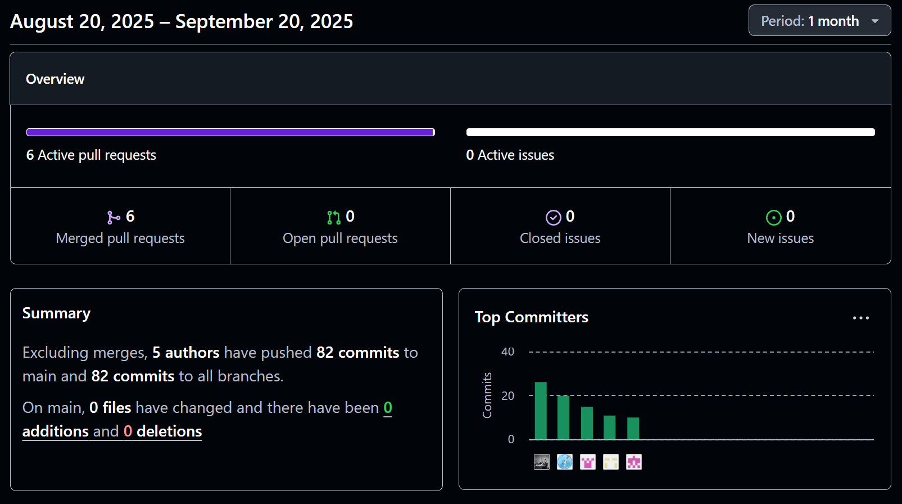

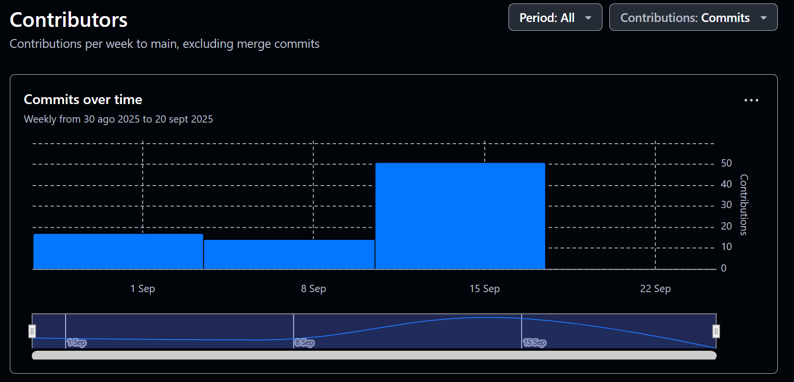

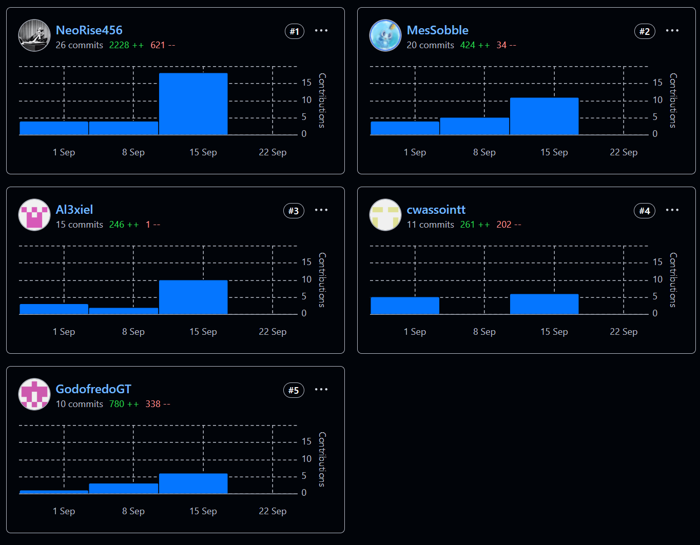

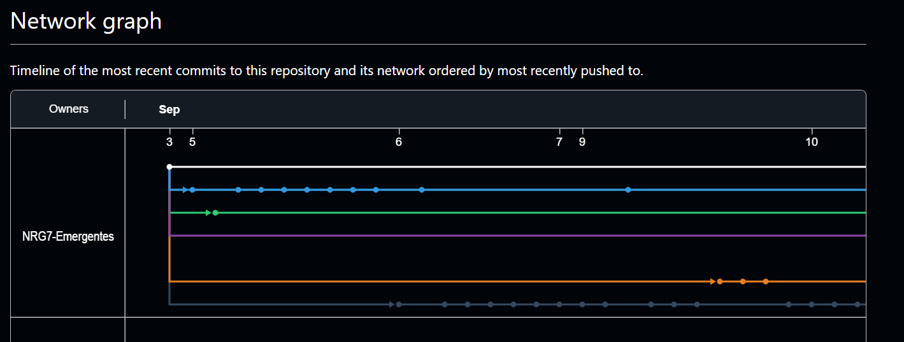

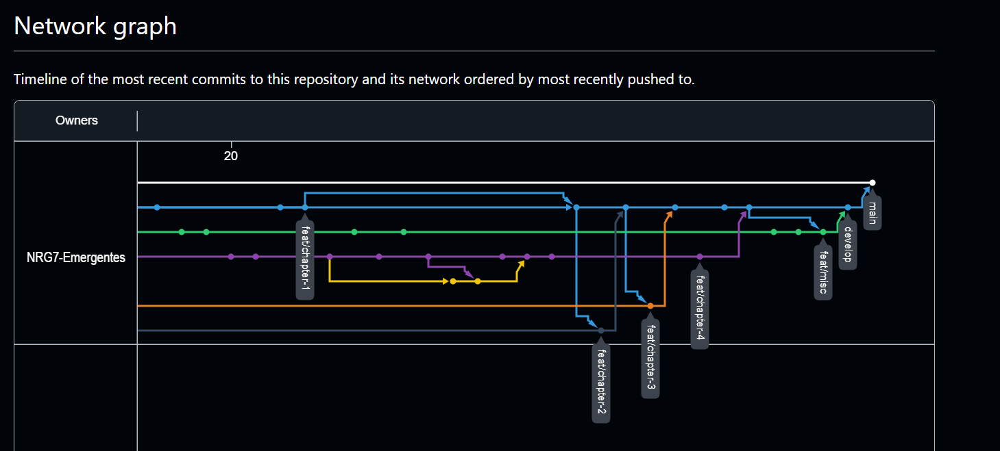

Para esta primera entrega se desarollaron los cpaítulos del 1 al 4, en la captura adjuntada se evidencia del trabajo colaborativo de github. Todos los integrantes del grupo trabajaron en el proyecto.

Recapitulando los commits se dividieron de la siguiente manera:

- Juan Astonitas (NeoRise456): 18 commits
- Gabriel Casas (Al3xiel): 10 commits
- Gianluca Pasquale (cwassointt): 6 commits
- Godofredo Quispe (GodofredoGT): 6 commits
- Bárbara Espinoza (MesSobble): 11 commits

## Contenido

- [Student Outcome](#student-outcome)
- [Capítulo I: Introducción](#capítulo-i-introducción)
  - [1.1 Startup Profile](#11-startup-profile)
    - [1.1.1 Descripción de la Startup](#111-descripción-de-la-startup)
    - [1.1.2 Perfiles de integrantes del equipo](#112-perfiles-de-integrantes-del-equipo)
  - [1.2 Solution Profile](#12-solution-profile)
    - [1.2.1 Antecedentes y problemática](#121-antecedentes-y-problemática)
    - [1.2.2 Lean UX Process](#122-lean-ux-process)
      - [1.2.2.1 Lean UX Problem Statements](#1221-lean-ux-problem-statements)
      - [1.2.2.2 Lean UX Assumptions](#1222-lean-ux-assumptions)
      - [1.2.2.3 Lean UX Hypothesis Statements](#1223-lean-ux-hypothesis-statements)
      - [1.2.2.4 Lean UX Canvas](#1224-lean-ux-canvas)
  - [1.3 Segmentos objetivo](#13-segmentos-objetivo)
- [Capítulo II: Requirements Elicitation \& Analysis](#capítulo-ii-requirements-elicitation--analysis)
  - [2.1 Competidores](#21-competidores)
    - [2.1.1 Análisis competitivo](#211-análisis-competitivo)
    - [2.1.2 Estrategias y tácticas frente a competidores](#212-estrategias-y-tácticas-frente-a-competidores)
  - [2.2 Entrevistas](#22-entrevistas)
    - [2.2.1 Diseño de entrevistas](#221-diseño-de-entrevistas)
    - [2.2.2 Registro de entrevistas](#222-registro-de-entrevistas)
    - [2.2.3 Análisis de entrevistas](#223-análisis-de-entrevistas)
  - [2.3 Needfinding](#23-needfinding)
    - [2.3.1 User Personas](#231-user-personas)
    - [2.3.2 User Task Matrix](#232-user-task-matrix)
    - [2.3.3 Empathy Mapping](#233-empathy-mapping)
    - [2.3.4 As-is Scenario Mapping](#234-as-is-scenario-mapping)
  - [2.4 Ubiquitous Language](#24-ubiquitous-language)
- [Capítulo III: Requirements Specification](#capítulo-iii-requirements-specification)
  - [3.1 To-Be Scenario Mapping](#31-to-be-scenario-mapping)
  - [3.2 User Stories](#32-user-stories)
  - [3.3 Impact Mapping](#33-impact-mapping)
  - [3.4 Product Backlog](#34-product-backlog)
- [Capítulo IV: Strategic-Level Software Design](#capítulo-iv-strategic-level-software-design)
  - [4.1 Strategic-Level Attribute-Driven Design](#41-strategic-level-attribute-driven-design)
    - [4.1.1 Design Purpose](#411-design-purpose)
    - [4.1.2 Attribute-Driven Design Inputs](#412-attribute-driven-design-inputs)
      - [4.1.2.1 Primary Functionality (Primary User Stories)](#4121-primary-functionality-primary-user-stories)
      - [4.1.2.2 Quality attribute Scenarios](#4122-quality-attribute-scenarios)
      - [4.1.2.3 Constraints](#4123-constraints)
    - [4.1.3 Architectural Drivers Backlog](#413-architectural-drivers-backlog)
    - [4.1.4 Architectural Design Decisions](#414-architectural-design-decisions)
    - [4.1.5 Quality Attribute Scenario Refinements](#415-quality-attribute-scenario-refinements)
  - [4.2 Strategic-Level Domain-Driven Design](#42-strategic-level-domain-driven-design)
    - [4.2.1 EventStorming](#421-eventstorming)
    - [4.2.2 Candidate Context Discovery](#422-candidate-context-discovery)
    - [4.2.3 Domain Message Flows Modeling](#423-domain-message-flows-modeling)
    - [4.2.4 Bounded Context Canvases](#424-bounded-context-canvases)
    - [4.2.5 Context Mapping](#425-context-mapping)
  - [4.3 Software Architecture](#43-software-architecture)
    - [4.3.1 Software Architecture System Landscape Diagram](#431-software-architecture-system-landscape-diagram)
    - [4.3.2 Software Architecture Context Level Diagrams](#432-software-architecture-context-level-diagrams)
    - [4.3.3 Software Architecture Container Level Diagrams](#433-software-architecture-container-level-diagrams)
    - [4.3.4 Software Architecture Deployment Diagrams](#434-software-architecture-deployment-diagrams)
- [Capítulo V: Tactical-Level Software Design](#capítulo-v-tactical-level-software-design)
  - [5.1 Bounded Context: Orquestrador](#51-bounded-context-orquestrator)
    - [5.1.1 Domain Layer](#511-domain-layer)
    - [5.1.2 Interface Layer](#521-domain-layer)
    - [5.1.3 Application Layer](#513-application-layer)
    - [5.1.4 Infrastructure Layer](#514-infrastructure-layer)
    - [5.1.6 Bounded Context Software Architecture Component Level Diagrams](#516-bounded-context-software-architecture-component-level-diagrams)
    - [5.1.7 Bounded Context Software Architecture Container Level Diagrams](#517-bounded-context-software-architecture-code-level-diagrams)
        - [5.1.7.1 Bounded Context Domain Layer Class Diagrams](#5171-bounded-context-domain-layer-class-diagrams)
        - [5.1.7.2 Bounded Context Database Design Diagram](#5172-bounded-context-database-design-diagram)
  - [5.2 Bounded Context: Monitoreo](#52-bounded-context-monitoreo)
      - [5.2.1 Domain Layer](#521-domain-layer)
      - [5.2.2 Interface Layer](#522-interface-layer)
      - [5.2.3 Application Layer](#523-application-layer)
      - [5.2.4 Infrastructure Layer](#524-infrastructure-layer)
      - [5.2.6 Bounded Context Software Architecture Component Level Diagrams](#526-bounded-context-software-architecture-component-level-diagrams)
      - [5.2.7 Bounded Context Software Architecture Container Level Diagrams](#527-bounded-context-software-architecture-code-level-diagrams)
          - [5.2.7.1 Bounded Context Domain Layer Class Diagrams](#5271-bounded-context-domain-layer-class-diagrams)
          - [5.2.7.2 Bounded Context Database Design Diagram](#5272-bounded-context-database-design-diagram)
  - [5.3 Bounded Context: Estadísticas](#53-bounded-context-estadísticas)
      - [5.3.1 Domain Layer](#531-domain-layer)
      - [5.3.2 Interface Layer](#532-interface-layer)
      - [5.3.3 Application Layer](#533-application-layer)
      - [5.3.4 Infrastructure Layer](#534-infrastructure-layer)
      - [5.3.6 Bounded Context Software Architecture Component Level Diagrams](#536-bounded-context-software-architecture-component-level-diagrams)
      - [5.3.7 Bounded Context Software Architecture Container Level Diagrams](#537-bounded-context-software-architecture-code-level-diagrams)
          - [5.3.7.1 Bounded Context Domain Layer Class Diagrams](#5371-bounded-context-domain-layer-class-diagrams)
          - [5.3.7.2 Bounded Context Database Design Diagram](#5372-bounded-context-database-design-diagram)
  - [5.4 Bounded Context: Notificaciones](#54-bounded-context-notificaciones)
      - [5.4.1 Domain Layer](#541-domain-layer)
      - [5.4.2 Interface Layer](#542-interface-layer)
      - [5.4.3 Application Layer](#543-application-layer)
      - [5.4.4 Infrastructure Layer](#544-infrastructure-layer)
      - [5.4.6 Bounded Context Software Architecture Component Level Diagrams](#546-bounded-context-software-architecture-component-level-diagrams)
      - [5.4.7 Bounded Context Software Architecture Container Level Diagrams](#547-bounded-context-software-architecture-code-level-diagrams)
          - [5.4.7.1 Bounded Context Domain Layer Class Diagrams](#5471-bounded-context-domain-layer-class-diagrams)
          - [5.4.7.2 Bounded Context Database Design Diagram](#5472-bounded-context-database-design-diagram)
  - [5.5 Bounded Context: Identity Access Management (IAM)](#55-bounded-context-identity-access-managementiam)
      - [5.5.1 Domain Layer](#551-domain-layer)
      - [5.5.2 Interface Layer](#552-interface-layer)
      - [5.5.3 Application Layer](#553-application-layer)
      - [5.5.4 Infrastructure Layer](#554-infrastructure-layer)
      - [5.5.6 Bounded Context Software Architecture Component Level Diagrams](#556-bounded-context-software-architecture-component-level-diagrams)
      - [5.5.7 Bounded Context Software Architecture Container Level Diagrams](#557-bounded-context-software-architecture-code-level-diagrams)
          - [5.5.7.1 Bounded Context Domain Layer Class Diagrams](#5571-bounded-context-domain-layer-class-diagrams)
          - [5.5.7.2 Bounded Context Database Design Diagram](#5572-bounded-context-database-design-diagram)
- [Capítulo VI: Solution UX Design](#capítulo-vi-solution-ux-design)
  - [6.1 Style Guidelines](#61-style-guidelines)
    - [6.1.1 General Style Guidelines](#611-general-style-guidelines)
    - [6.1.2 Web, Mobile & Devices Style Guidelines](#612-web-mobile--devices-style-guidelines)
  - [6.2 Information Architecture](#62-information-architecture)
    - [6.2.1 Organization Systems](#621-organization-systems)
    - [6.2.2 Labeling Systems](#622-labeling-systems)
    - [6.2.3 Searching Systems](#623-searching-systems)
    - [6.2.4 SEO Tags and Meta Tags](#624-seo-tags-and-meta-tags)
    - [6.2.5 Navigation Systems](#625-navigation-systems)
  - [6.3 Landing Page UI Design](#63-landing-page-ui-design)
    - [6.3.1 Landing Page Wireframe](#631-landing-page-wireframe)
    - [6.3.2 Landing Page Mock-up](#632-landing-page-mock-up)
  - [6.4 Applications UX/UI Design](#64-applications-uxui-design)
    - [6.4.1 Applications Wireframes](#641-applications-wireframes)
    - [6.4.2 Applications Wireflow Diagrams](#642-applications-wireflow-diagrams)
    - [6.4.3 Applications Mock-ups](#643-applications-mock-ups)
    - [6.4.4 Applications User Flow Diagrams](#644-applications-user-flow-diagrams)
  - [6.5 Applications Prototyping](#65-applications-prototyping)
- [Capítulo VII: Product Implementation, Validation & Deployment](#capítulo-vii-product-implementation-validation--deployment)
  - [7.1 Software Configuration Management](#71-software-configuration-management)
    - [7.1.1 Software Development Environment Configuration](#711-software-development-environment-configuration)
    - [7.1.2 Source Code Management](#712-source-code-management)
    - [7.1.3 Source Code Style Guide & Conventions](#713-source-code-style-guide--conventions)
    - [7.1.4 Software Deployment Configuration](#714-software-deployment-configuration)
  - [7.2 Solution Implementation](#72-solution-implementation)
    - [7.2.1 Sprint 1](#721-sprint-1)
      - [7.2.1.1 Sprint Planning 1](#7211-sprint-planning-1)
      - [7.2.1.2 Sprint Backlog 1](#7212-sprint-backlog-1)
      - [7.2.1.3 Development Evidence for Sprint Review](#7213-development-evidence-for-sprint-review)
      - [7.2.1.4 Testing Suite Evidence for Sprint Review](#7214-testing-suite-evidence-for-sprint-review)
      - [7.2.1.5 Execution Evidence for Sprint Review](#7215-execution-evidence-for-sprint-review)
      - [7.2.1.6 Services Documentation Evidence for Sprint Review](#7216-services-documentation-evidence-for-sprint-review)
      - [7.2.1.7 Software Deployment Evidence for Sprint Review](#7217-software-deployment-evidence-for-sprint-review)
      - [7.2.1.8 Team Collaboration Insights during Sprint](#7218-team-collaboration-insights-during-sprint)
  - [7.3 Validation Interviews](#73-validation-interviews)
    - [7.3.1 Diseño de Entrevistas](#731-diseño-de-entrevistas)
    - [7.3.2 Registro de Entrevistas](#732-registro-de-entrevistas)
    - [7.3.3 Evaluaciones según heurísticas](#733-evaluaciones-según-heurísticas)
  - [7.4 Video About-the-Product](#74-video-about-the-product)
- [Conclusiones](#conclusiones)
- [Bibliografía](#bibliografía)
- [Anexos](#anexos)

## Student Outcome

El curso contribuye al cumplimiento del Student Outcome ABET:

**ABET – EAC - Student Outcome 3**

Criterio: _Capacidad de comunicarse efectivamente con un rango de audiencias._
En el siguiente cuadro se describe las acciones realizadas y enunciados de
conclusiones por parte del grupo, que permiten sustentar el haber alcanzado el logro
del ABET – EAC - Student Outcome 3.

<table>
  <thead>
    <tr>
      <th style="text-align: left;">Criterio específico</th>
      <th style="text-align: left;">Acciones realizadas</th>
      <th style="text-align: left;">Conclusiones</th>
    </tr>
  </thead>
  <tbody>
    <tr>
      <td><strong>Comunica oralmente sus ideas y/o resultados con objetividad a público de diferentes especialidades y niveles jerarquicos, en el marco del desarrollo de un proyecto en ingeniería.</strong></td>
      <td>
        <b>TB1:</b> 
        - <b>Bárbara Antonella Espinoza Delgado:</b> Para esta primera entrega comuniqué oralmente ideas y dudas para la realización la realización del event storming los bounded contexts durante las reuniones grupales en discord, además, comunique activamente sobre la entrega de las tareas que se me asignaron semanalmente.  
        - <b>Gianluca Santino Pasquale Barrenechea:</b> Durante las reuniones grupales en Discord, comuniqué de manera efectiva las ideas y avances relacionados con la realización del Event Storming y los Bounded Contexts. Además, mantuve una comunicación activa sobre la entrega de las tareas asignadas semanalmente, asegurando que todos los miembros del equipo estuvieran informados y alineados con los objetivos del proyecto.  
        - <b>Godofredo Quispe Tipo:</b> Comuniqué oralmente ideas de cómo realizar partes del proyecto y expuse los resultados obtenidos, facilitando la revisión de la información por parte de los diferentes miembros del equipo.  
        - <b>Gabriel Alexander Casas Sanchez:</b> Exposición de los atributos de calidad, el propósito del proyecto y dirigí el proceso de eventstorming, simplifique los términos técnicos a un lenguaje común para la correcta compresión de los asistentes.   
        - <b>Juan Diego Astonitas Diaz:</b> Expuse el proyecto en clase para la retroalimentacion del profesor, además de ser lider del proyecto para poder orientarlo al exito   
        <b>TP:</b> 
        - <b>Bárbara Antonella Espinoza Delgado:</b> Para esta segunda entrega comuniqué oralmente ideas y dudas para la elaboración de los wireframes y wireflows durante las reuniones grupales en discord, además, comunique activamente sobre la entrega de las tareas que se me asignaron semanalmente.  
        - <b>Gianluca Santino Pasquale Barrenechea: Para esta segunda entrega comuniqué oralmente el enfoque y las decisiones tomadas para el desarrollo de las style guidelines y la information architecture del proyecto. Expliqué la estructura visual, la selección de componentes y la organización de la información durante las reuniones grupales en Discord, asegurando que todos los miembros comprendieran y aplicaran los lineamientos definidos en el diseño de la plataforma.</b>  
        - <b>Godofredo Quispe Tipo:</b> Para esta entrega comuniqué oralmente ideas y dudas para la elaboración del bounded context de estadisticas y los wireframer de Landing Pages  
        - <b>Gabriel Alexander Casas Sanchez:</b> Para esta entrega busque comunicar todas mis ideas sobre las opciones de diseño (arquitectura de bounded context y UI) de manera clara y sencilla para asegurarme el entendimiento de todos mis compañeros.  
        - <b>Juan Diego Astonitas Diaz:</b> Para esta entrega comunique las ideas fundamentales de la solucion para poder plasmarlas en en diseño de la arquitectura con DDD   
       </td>
      <td>
        <b>TB1:</b> El equipo ha demostrado un nivel de desarrollo satisfactorio y homogéneo en esta competencia. Todos los miembros participaron activamente en las reuniones de Discord, comunicando ideas, avances y asignaciones de manera clara y efectiva. Se evidencia una comunicación colaborativa que facilitó la alineación del grupo y la revisión de la información.   
        <b>TP: </b> Durante el TP, el equipo mantuvo una comunicación oral clara y objetiva en las reuniones de Discord, alineando la elaboración de wireframes/wireflows, las style guidelines y la arquitectura de la información. Cada integrante expuso y justificó decisiones sobre bounded contexts, diseño de UI y la definición arquitectónica con DDD, resolviendo dudas para asegurar un entendimiento compartido. Esta coordinación constante permitió integrar criterios de distintas especialidades y niveles, garantizando coherencia en el diseño y avance oportuno de las tareas.  
      </td>
    </tr>
    <tr>
      <td><strong>Comunica en forma escrita ideas y/o resultados con objetividad a público de diferentes especialidades y niveles jerarquicos, en el marco del desarrollo de un proyecto eningeniería.</strong></td>
      <td>
         <b>TB1:</b> 
        - <b>Bárbara Antonella Espinoza Delgado:</b> Para esta primera entrega realicé en el informe la redacción de las hipótesis, el Lean UX Canvas, la entrevista a uno de los segmentos objetivos y el bounded context canvas asignado, además, comuniqué mis avances diarios en el grupo.  
        - <b>Gianluca Santino Pasquale Barrenechea:</b> En la primera entrega del informe, me encargué de redactar las hipótesis, el Lean UX Canvas, la entrevista a uno de los segmentos objetivos y el Bounded Context Canvas asignado. Además, mantuve una comunicación constante sobre mis avances diarios en el grupo, asegurando que todos los miembros estuvieran al tanto del progreso del proyecto.  
        - <b>Godofredo Quispe Tipo:</b> A través de un análisis de competidores y una serie de entrevistas a usuarios clave, elaboré un informe detallado que presentaba un panorama objetivo del mercado. Con base en esta documentación, formulé y comuniqué estrategias y tácticas frente a competidores, lo que sirvió como guía para la toma de decisiones en el desarrollo del producto.  
        - <b>Gabriel Alexander Casas Sanchez:</b> Desarrollé los problem statement assumptions, task matrix, empathy mapping, atribute driven design process. Busque presentar los conceptos de manera clara y estructurada para facilitar la comprensión.   
        - <b>Juan Diego Astonitas Diaz:</b> Desarrolle las user y technical stories describiendo la funcionalidad de nuestra solucion    
        <b>TP:</b> 
        - <b>Bárbara Antonella Espinoza Delgado:</b> Para esta Segunda entrega realicé en el informe la redacción de las tablas de cada capa del Bounded Context IAM y Diagramas, además, comuniqué mis avances diarios en el grupo de Whatsapp.  
        - <b>Gianluca Santino Pasquale Barrenechea: Para esta segunda entrega realicé en el informe la redacción de la sección de style guidelines y la arquitectura de la información, detallando la estructura visual, los componentes principales y la organización de la plataforma. </b>   
        - <b>Godofredo Quispe Tipo:</b> Para esta segunda entrega, he preparado una redacción clara y concisa de la infraestructura y la descripción de los bounded contexts, asegurando que toda la audiencia comprenda la arquitectura del sistema.  
        - <b>Gabriel Alexander Casas Sanchez:</b> Para esta entrega busque que todas las descripciones y decisiones de arquitectura con respecto al bounded context que desarrolle se entiendad de manera clara, para asi evitar fallos de comunicación entre mis compañeros  
        - <b>Juan Diego Astonitas Diaz: </b> Comunique el diseño y funcionalidad base de la solucion a mis compañeros para poder hacer los wireframes y wireflows   
      </td>
      <td>
        <b>TB1:</b> En conjunto, las contribuciones escritas fueron fundamentales para sentar una base documental sólida, guiar la toma de decisiones y cumplir efectivamente los objetivos del proyecto.  
        <b>TP: </b> Durante el TP, el equipo articuló de forma clara y objetiva la documentación técnica clave, incluyendo tablas y diagramas del Bounded Context IAM, style guidelines, arquitectura de la información, infraestructura y la descripción de bounded contexts, asegurando consistencia terminológica y trazabilidad de decisiones. Las redacciones se orientaron a audiencias de distintas especialidades y niveles, facilitando la comprensión de la arquitectura, la justificación de componentes y la alineación entre diseño y desarrollo. Este trabajo escrito permitió elaborar coherentemente wireframes y wireflows, reducir malentendidos y consolidar una base documental robusta para la evolución del proyecto.  
      </td>
    </tr>
  </tbody>
</table>

## Capítulo I: Introducción

### 1.1 Startup Profile

#### 1.1.1 Descripción de la Startup

**NRG7** es una empresa peruana de tecnología dedicada a la investigación, desarrollo e implementación de herramientas software centradas en la mejora de la productividad. Nos especializamos en crear ecosistemas que combinan inteligencia artificial y análisis de datos para potenciar el desempeño del capital humano.

**Misión:** Proveer soluciones tecnológicas innovadoras que promuevan la productividad de las personas en sus entornos laborales y educativos.

**Visión:** Ser la solución líder en ergonomía digital en el Perú, reconocida por promover entornos laborales y educativos saludables y aumentar la productividad del capital humano.

#### 1.1.2 Perfiles de integrantes del equipo

<table>
  <tr>
    <th colspan="2"> Juan Diego Astonitas </th>
  </tr>
  <tr>
    <td>  </td>
    <td> Mi nombre es Juan Diego Astonitas Diaz, mi código de estudiante es u202110237 ,tengo 21 años, actualmente curso el 7to ciclo de la carrera de Ingeniería de Software, en la UPC en la sede San Miguel. Mis principales cualidades son el liderazgo y el dominio de NextJS. Haré todo lo que esté a mi alcance para respaldar al equipo en la finalización oportuna y efectiva de las tareas asignadas. </td>
  </tr> 
  <tr>
    <th colspan="2"> Casas Sanchez Gabriel Alexander </th>
  </tr>
  <tr>
    <td>  </td>
    <td> 	Soy estudiante de Ingeniería de Software en quinto ciclo, con habilidades para dirigir y trabajar bien bajo presión. Aunque no disfruto mucho de los trabajos grupales, siempre asumo un rol destacado y sobresaliente en ellos, aprovechando mi capacidad académica y versatilidad. </td>
  </tr>
  <tr>
    <th colspan="2"> Gianluca Santino Pasquale Barrenechea </th>
  </tr>
  <tr>
    <td>  </td>
    <td> Me llamo Gianluca Santino Pasquale Barrenechea, estudiante de Ingeniería de Software (código u202112078). En nuestra Startup, me enfoco en el desarrollo frontend y backend, utilizando C++, C#, Python, Java, HTML y JavaScript. Mi objetivo es crear soluciones escalables y eficientes, mejorando la experiencia del usuario y optimizando la operación de la plataforma, siempre aplicando metodologías ágiles como Scrum. </td>
  </tr>
  <tr>
    <th colspan="2">Godofredo Quispe Tipo</th>
  </tr>
  <tr>
    <td>  </td>
    <td>  Mi nombre es Godofredo y actualmente me encuentro cursando la carrera de Ingeniería de Software, un campo que me apasiona profundamente. Mi interés por las nuevas tecnologías es constante, y estoy siempre al tanto de las últimas innovaciones que están redefiniendo el panorama tecnológico. Me considero un entusiasta de la programación, área en la que he adquirido un dominio en diversos lenguajes, tales como Python, C++ y Assembler, lo que me ha permitido abordar una amplia gama de proyectos y desafíos técnicos. </td>
  </tr>
  <tr>
    <th colspan="2">Bárbara Espinoza Delgado</th>
  </tr>
  <tr>
    <td>  </td>
    <td> Mi nombre es Bárbara Antonella Espinoza Delgado, mi código de estudiante es u201911727 ,tengo 23 años, soy estudiante de Ingeniería de Software de 8vo ciclo. Tengo experiencia en trabajos en equipo y me considero una persona puntual con la realización y entrega de las tareas pendientes.
 </td>
  </tr>
</table>

### 1.2 Solution Profile

#### 1.2.1 Antecedentes y problemática

**What**

- ¿Cuál es el problema?

El problema principal es la adopción prolongada de posturas incorrectas y la proximidad excesiva a la pantalla durante actividades frente a la computadora, conductas que, al ser imperceptibles para el usuario, afectan negativamente la salud y productividad a largo plazo (Crisol-Deza, Zurita-Borja & Crisol-Deza, 2024).

- ¿Cuál es la relación con la persona en cuestión?

La relación con el usuario es la de un asistente preventivo y pasivo que monitorea de forma continua e individual, proporcionando retroalimentación inmediata para fomentar la autoconciencia y la autocorrección de los malos hábitos posturales.

**When**

- ¿Cuándo sucede el problema?

El problema ocurre durante prolongadas horas de uso de la computadora de sobremesa, específicamente en los momentos de máxima concentración donde el usuario, absorto en sus tareas, adopta de manera inconsciente y mantenida una postura ergonómicamente incorrecta.

- ¿Cuándo utiliza el cliente el producto?

El cliente utiliza el producto de forma activa y constante durante toda su jornada laboral o de estudio frente al computador. La aplicación funciona en segundo plano, monitorizando de manera ininterrumpida desde el momento en que se inicia la sesión hasta que finaliza.

**Where**

- ¿Dónde está el cliente cuando usa el producto?

El cliente utiliza el producto en su espacio fijo de trabajo o estudio, específicamente frente al computador en una oficina doméstica o escritorio personal. 

- ¿Dónde surge el problema?

**Who**

- ¿Quienes se ven involucrados en el problema?

El problema surge en el entorno inmediato de trabajo del usuario, específicamente en su estación de computadora personal ubicada en el hogar u oficina. Se manifiesta en la interacción física entre el usuario y su puesto de trabajo, donde la disposición del espacio y los hábitos individuales propician las malas posturas (Lazo, R. y Quispe, Y., 2024).

**Why**

- ¿Cuáles son las causas del problema?

Las causas principales del problema radican en la falta de conciencia postural inmediata y la ausencia de retroalimentación correctiva en tiempo real, agravadas por entornos de trabajo no ergonómicos y la inmersión mental en las tareas digitales (García-Salirrosas & Sánchez-Poma, 2021).

**How**

- ¿En qué condiciones los clientes usan nuestro producto?

Los clientes usan nuestro producto bajo condiciones de iluminación ambiental normal y con la cámara posicionada de manera lateral en su espacio de trabajo, manteniéndose sentados frente al computador durante sus actividades. La aplicación opera de forma discreta integrada en su rutina digital, sin requerir interacción activa más allá de la configuración inicial.

**How Much**

- ¿Cuál es la magnitud del problema?

La magnitud del problema es considerable, dado que un estudio reciente sobre el teletrabajo en Perú encontró que el 99% de los participantes reportaron haber sufrido dolores en cuello, espalda y extremidades superiores. Esto evidencia una alta prevalencia de dolencias musculoesqueléticas directamente asociadas a posturas incorrectas y forzadas durante largos períodos frente a la computadora (Asencios Román et al., 2021).

#### 1.2.2 Lean UX Process

El lean UX process es un enfoque iterativo centrado en el usuario para el diseño de proyectos y productos. Este enfoque se basa en ciclos rápidos (sprints) de investigación, diseño y pruebas para validar la propuesta o ideas planteadas por el equipo. Estas propuestas estarán siempre orientadas a satisfacer las necesidades de los usuarios.

##### 1.2.2.1 Lean UX Problem Statements

En el contexto actual, millones de personas trabajan o estudian frente a una computadora durante largas jornadas, lo que conlleva la adopción inconsciente de posturas inadecuadas. Este problema se ha intensificado con el teletrabajo y la educación remota, generando un aumento en los casos de dolor músculo-esquelético y fatiga asociada.

Si bien existen recomendaciones ergonómicas y soluciones tradicionales (sillas especiales, escritorios ajustables, pausas activas), estas dependen de la disciplina del usuario y no ofrecen un monitoreo en tiempo real. La falta de retroalimentación inmediata hace que las correcciones posturales sean poco frecuentes y lleguen demasiado tarde.

ErgoVision surge como una propuesta innovadora basada en tecnologías emergentes: un sistema que emplea visión por computadora y análisis inteligente para identificar posturas inadecuadas y proximidad excesiva a la pantalla, ofreciendo alertas discretas y recomendaciones en tiempo real. Su objetivo es fomentar la autoconciencia, prevenir dolores y mejorar tanto la salud como la productividad de los usuarios en entornos digitales.

##### 1.2.2.2 Lean UX Assumptions

_**User Assumptions (Suposiciones de Usuario)**_

**¿Quién es el usuario?**
Profesionales, estudiantes y trabajadores remotos que pasan largas horas frente a una computadora y desean mejorar su postura y cuidar su bienestar.

**¿Dónde encaja nuestro producto en su trabajo o vida?**
Encaja directamente en su rutina diaria de estudio o trabajo frente al computador, en espacios como oficinas domésticas, escritorios personales y entornos laborales.

**¿Qué problemas resuelve nuestro producto?**
* Posturas incorrectas mantenidas de forma inconsciente.
* Dolor de cuello, espalda y fatiga visual.
* Falta de conciencia y retroalimentación en tiempo real.
* Ambientes de trabajo poco ergonómicos.

**¿Cuándo y cómo se usa nuestro producto?**
Se usa de manera continua y pasiva durante toda la jornada frente a la computadora. ErgoVision opera en segundo plano, monitoreando con una cámara lateral y/o frontal, enviando alertas discretas cuando detecta proximidad excesiva o malas posturas.

**¿Qué características son importantes?**
* Detección automática de posturas incorrectas.
* Alertas no invasivas (visuales/sonoras suaves).
* Recomendaciones de corrección simples y claras.
* Integración discreta en la rutina sin interrumpir la concentración.

**¿Cómo debe verse y comportarse nuestro producto?**
Debe ser minimalista, intuitivo y amigable, con un diseño discreto que no sature al usuario. El comportamiento debe ser pasivo, no intrusivo, con retroalimentación clara, rápida y de fácil interpretación.

**_Business Assumptions (Suposiciones de Negocio)_**

**Necesidades y problemas:** 
Los usuarios necesitan una solución preventiva y accesible que los ayude a cuidar su salud postural sin invertir en equipos costosos (sillas ergonómicas, escritorios ajustables) o terapias correctivas.

**Plataforma:** 
Aplicación de escritorio y expansión a aplicaciones móviles de acompañamiento para métricas y reportes.

**Segmentación:**
* Profesionales de oficina y teletrabajadores.
* Estudiantes universitarios o de posgrado.

**Comportamientos:** 
Los usuarios valoran la discreción, la facilidad de uso y la integración sin fricciones en su rutina diaria. Prefieren soluciones simples que no requieran aprendizaje complejo.

**Beneficios:**
* Prevención de dolores y lesiones.
* Incremento de la productividad y concentración.
* Mejora en la salud y bienestar a largo plazo.
* Conciencia ergonómica incorporada en la rutina.

**Captación de clientes:** 
Estrategias de inbound marketing, marketing digital enfocado en salud y productividad, alianzas con universidades, coworkings y empresas de teletrabajo.

**Modelo de ingresos:**
* Versión gratuita con funciones básicas de alerta.
* Modelo SaaS con suscripción mensual/anual para reportes avanzados, estadísticas de uso y personalización.

**Competencia:** 
Aplicaciones de recordatorio de pausas o dispositivos wearables que monitorean postura, aunque con menor precisión o mayor costo.

**Ventaja competitiva:** 
Monitoreo pasivo en tiempo real con visión por computadora, accesibilidad multiplataforma y retroalimentación inmediata sin hardware adicional.

**_Technical Assumptions (Suposiciones Técnicas)_**

**Tecnología utilizada:** 
Visión por computadora e inteligencia artificial (modelos de pose estimation). Desarrollo en frameworks multiplataforma (Flutter Desktop/Angular/Flutter Mobile) para garantizar compatibilidad.

**Integraciones:** 
Posibilidad de integrar notificaciones con sistemas operativos, apps de productividad (Google Workspace, Microsoft Teams) en fases futuras.

**Escalabilidad:** 
Arquitectura en la nube para el almacenamiento de estadísticas, con procesamiento local en el dispositivo para garantizar privacidad y bajo consumo de recursos.

**_Market Assumptions (Suposiciones de Mercado)_**

**Tamaño del mercado:** 
Alta demanda en el sector del teletrabajo y la educación online. Según tendencias post-pandemia, millones de personas buscan mejorar sus espacios y hábitos de trabajo desde casa.

**Competencia:** 
Herramientas de ergonomía tradicionales (sillas, escritorios ajustables, accesorios) y aplicaciones simples de recordatorio. Ninguna ofrece monitoreo postural inteligente continuo a bajo costo.

**Tendencias:** 
Creciente interés en salud digital, ergonomía, bienestar en el trabajo y uso de tecnologías emergentes (IA + visión por computadora) aplicadas al cuidado personal.

**_Design Assumptions (Suposiciones de Diseño)_**

**Interacción del usuario:** 
La experiencia debe ser clara y no intrusiva, con alertas visuales discretas en pantalla y posibilidad de configurar notificaciones auditivas.

**Experiencia del usuario:** 
Los usuarios valorarán una experiencia simple, con recomendaciones fáciles de seguir y reportes que motiven la mejora de hábitos.

**Colores y tipografía:** 
Paleta moderna y calmante (azules, verdes, tonos neutros) que transmitan confianza y bienestar. Tipografía clara y legible.

**Preferencias visuales:** 
Diseño minimalista, con iconos intuitivos y gráficos simples para mostrar métricas (tiempo en buena postura, alertas recibidas).

**Prototipos y pruebas:** 
Validación continua con usuarios reales (profesionales, estudiantes) mediante pruebas de usabilidad para asegurar adopción y aceptación de las alertas.

##### 1.2.2.3 Lean UX Hypothesis Statements

**Hypothesis Statement 01:**  
- Creemos que los usuarios de nuestra aplicación son trabajadores y estudiantes remotos que buscan mantener una postura saludable durante largas jornadas frente al computador.  
- Sabremos que estamos en lo correcto cuando veamos comentarios positivos sobre el impacto en su postura y un aumento en usuarios activos semanales.  

**Hypothesis Statement 02:**  
- Creemos que nuestra aplicación encaja en la rutina diaria al monitorear automáticamente la postura mientras el usuario trabaja o estudia.  
- Sabremos que estamos en lo correcto cuando veamos un uso recurrente de la aplicación durante más de 4 horas al día en sesiones continuas.  

**Hypothesis Statement 03:**  
- Creemos que nuestra aplicación resuelve el problema de malas posturas prolongadas y cercanía excesiva a la pantalla.  
- Sabremos que estamos en lo correcto cuando veamos una disminución en las alertas repetidas y un aumento en los reportes de corrección de postura.  

**Hypothesis Statement 04:**  
- Creemos que los usuarios emplearán la aplicación principalmente en horarios de trabajo y estudio (mañana y tarde).  
- Sabremos que estamos en lo correcto cuando el 70% del uso de la aplicación ocurra en franjas de 8:00–13:00 y 14:00–20:00.  

**Hypothesis Statement 05:**  
- Creemos que las características clave incluyen monitoreo en tiempo real, alertas visuales/sonoras y reportes de hábitos posturales.  
- Sabremos que estamos en lo correcto cuando los usuarios valoren estas funciones en encuestas y se incremente la tasa de retención mensual.  

**Hypothesis Statement 06:**  
- Creemos que el diseño debe ser simple, discreto y fácil de configurar para que al usuario no le tome mucho tiempo en empezar a usar la aplicación.  
- Sabremos que estamos en lo correcto cuando recibamos comentarios positivos sobre la facilidad de uso y una tasa de abandono inicial menor al 10%.  

**Hypothesis Statement 07:**  
- Creemos que nuestros usuarios necesitan saber rápidamente cuándo están encorvados o demasiado cerca de la pantalla.  
- Sabremos que estamos en lo correcto cuando la app emita alertas inmediatas y los usuarios reporten mejoras en su conciencia postural.  

**Hypothesis Statement 08:**  
- Creemos que estas necesidades se pueden resolver con IA de visión computacional que analice en tiempo real la postura mediante la webcam.  
- Sabremos que estamos en lo correcto cuando logremos una precisión de detección superior al 90% en pruebas con usuarios reales.  

**Hypothesis Statement 09:**  
- Creemos que nuestros usuarios iniciales serán personas entre 18 y 45 años que trabajan o estudian más de 5 horas frente al computador.  
- Sabremos que estamos en lo correcto cuando al menos el 70% de los registros pertenezcan a este rango etario.  

**Hypothesis Statement 10:**  
- Creemos que el valor número uno para el usuario es prevenir dolores y lesiones musculoesqueléticas mediante recordatorios oportunos.  
- Sabremos que estamos en lo correcto cuando recibamos retroalimentación positiva sobre reducción de molestias y mejor concentración.  

**Hypothesis Statement 11:**  
- Creemos que los usuarios también valorarán beneficios adicionales como reportes semanales y recomendaciones ergonómicas.  
- Sabremos que estamos en lo correcto cuando al menos el 50% de usuarios activen estas funciones adicionales.  

**Hypothesis Statement 12:**  
- Creemos que adquiriremos la mayoría de nuestros usuarios a través de marketing digital en redes sociales, comunidades estudiantiles y coworkings virtuales.  
- Sabremos que estamos en lo correcto cuando estas fuentes representen más del 60% de los nuevos registros.  

**Hypothesis Statement 13:**  
- Creemos que generaremos ingresos mediante un modelo freemium, cobrando por planes premium con funciones avanzadas (reportes, personalización de alertas).  
- Sabremos que estamos en lo correcto cuando al menos el 15% de usuarios migre al plan premium en los primeros seis meses.  

**Hypothesis Statement 14:**  
- Creemos que nuestra principal competencia serán apps de ergonomía, recordatorios de descanso y herramientas de productividad.  
- Sabremos que estamos en lo correcto cuando el análisis competitivo confirme coincidencia de mercado con este tipo de aplicaciones.  

**Hypothesis Statement 15:**  
- Creemos que superaremos a la competencia con nuestro enfoque en IA en tiempo real, personalización de alertas y bajo consumo de recursos del PC.  
- Sabremos que estamos en lo correcto cuando veamos comentarios positivos en estos aspectos y usuarios cambiando desde apps competidoras.  

**Hypothesis Statement 16:**  
- Creemos que podemos implementar la aplicación con tecnologías actuales de visión por computadora, IA ligera y frameworks.  
- Sabremos que estamos en lo correcto cuando logremos un prototipo funcional sin problemas críticos de rendimiento.    

**Hypothesis Statement 17:**  
- Creemos que la solución escalará para manejar cientos de usuarios concurrentes con baja latencia en la detección (menos de 200 ms).  
- Sabremos que estamos en lo correcto cuando las pruebas de carga confirmen el rendimiento estable.  

**Hypothesis Statement 18:**  
- Creemos que existe una gran cantidad de potenciales usuarios interesados en soluciones de salud digital y ergonomía laboral.  
- Sabremos que estamos en lo correcto cuando alcancemos un crecimiento sostenido de registros mensuales superiores al 20%.  

**Hypothesis Statement 19:**  
- Creemos que el mercado de salud digital y bienestar laboral está en expansión debido al auge del teletrabajo y la educación remota.  
- Sabremos que estamos en lo correcto cuando estudios de mercado y retroalimentación de usuarios confirmen esta tendencia, reflejada en la adopción de la app.  

**Hypothesis Statement 20:**  
- Creemos que nuestra principal competencia serán apps de ergonomía, recordatorios de descanso y herramientas de productividad.  
- Sabremos que estamos en lo correcto cuando el análisis competitivo confirme coincidencia de mercado con este tipo de aplicaciones.  

##### 1.2.2.4 Lean UX Canvas

Link del Lean UX Canvas: [Link Lean UX Canvas](https://miro.com/app/board/uXjVJLxX2xg=/?share_link_id=737970760824)
### 1.3 Segmentos objetivo
### Segmento Objetivo #1: Trabajadores Remotos
Personas que trabajan desde casa o espacios de coworking, pasando muchas horas frente a la computadora. Suelen perder la noción del tiempo y descuidar la postura por la carga laboral o la concentración en sus tareas. Buscan una solución tecnológica **discreta y práctica** que les ayude a mantener una buena postura sin interrumpir su productividad.

**Características clave:**
- **Edad:** 23 a 55 años
- **Género:** Ambos
- **Contexto:** Teletrabajo, oficinas en casa, coworkings
- **Ocupación:** Analistas, programadores, diseñadores, consultores, administrativos, contadores, abogados, freelancers
- **Uso de tecnología:** Acostumbrados a aplicaciones de productividad (Office, Teams, Zoom, Slack, etc.)
- **Necesidades:** Prevenir dolores musculares, mantener una postura correcta durante la jornada laboral, mejorar concentración y productividad.
### Segmento Objetivo #2: Estudiantes Remotos
Jóvenes que dedican largas horas al estudio en computadora, ya sea en clases virtuales, investigaciones, proyectos o preparación de trabajos. Suelen estudiar en espacios poco ergonómicos (dormitorios, bibliotecas, cafeterías), lo que aumenta los riesgos de malas posturas. Buscan una herramienta **fácil de usar y económica** que cuide su salud mientras estudian.

**Características clave:**
- **Edad:** 15 a 30 años
- **Género:** Ambos
- **Contexto:** Educación secundaria, superior y posgrado
- **Ocupación:** Estudiantes de colegio, universidad, posgrado o cursos online
- **Uso de tecnología:** Acostumbrados a apps académicas (Moodle, Google Classroom, Zoom, Notion) y redes sociales.
- **Necesidades:** Prevenir dolores y fatiga por largas jornadas de estudio, contar con alertas sencillas y no invasivas, mejorar hábitos posturales para mantener el rendimiento académico.

## Capítulo II: Requirements Elicitation & Analysis

### 2.1 Competidores

A continuación, se presenta un análisis competitivo que examina a las principales empresas que rivalizan con nuestra startup. Hemos identificado tanto competidores directos, aquellos que ofrecen una solución de software centralizada en la monitorización y corrección proactiva de la postura mediante el uso de la cámara, como indirectos que, si bien no son idénticos, compiten en áreas clave superpuestas como el bienestar digital en el puesto de trabajo, la ergonomía y la prevención de la fatiga física que impacta la productividad. Este análisis se centra en aquellos que ofrecen soluciones que se superponen con las de **ErgoVision**.

1. **Posture Reminder**  
     
   **Descripción:**  
   Software de escritorio que utiliza la cámara web para detectar encorvamiento y emitir una alerta sonora inmediata.  
   **Características principales**

- Monitorización pasiva con la cámara web.
- Alerta sonora simple al detectar mala postura.
- Personalización de sensibilidad.

---

2. **Upright Go**  
     
   **Descripción:**  
   Wearable (sensor portátil) que se adhiere a la espalda y vibra sutilmente al detectar que el usuario se está encorvando.  
   **Características principales**

- Tecnología de sensor wearable (sin cámara).
- Vibración discreta como retroalimentación táctil.
- App móvil con seguimiento de progreso y métricas.
- Solución portátil que funciona fuera del escritorio.
- Informes de progreso.

---

3. **Workpace**  
     
   **Descripción:**  
   Plataforma integral de wellness laboral que gestiona la ergonomía, programa pausas activas y cumple con estándares de seguridad de la información.  
   **Características principales**

- Recordatorios de pausas y estiramientos basados en la ciencia.
- Cumplimiento de normas de seguridad (ISO 27002, RGPD).
- Enfoque en la salud y seguridad ambiental (EHS).
- Solución corporativa para la gestión del bienestar de equipos.

#### 2.1.1 Análisis competitivo

<table> 
  <tr>
    <th colspan="6"> Competitive Analysis Landscape </th>
  </tr>
  <tr>
    <td colspan="2" rowspan="2">¿Por qué llevar acabo este análisis? </td>
    <td colspan="4"> Pregunta </td>
  </tr>
  <tr>
    <td colspan="4"> Deberíamos llevar a cabo este análisis para conocer el entorno, la competencia, tomar decisiones de desarrollo y construir nuestra propuesta de valor. </td>
  </tr>
  <tr>
    <td colspan="2"> Productos </td>
    <td> ErgoVision </td>
    <td> Posture Reminder </td>
    <td> Upright Go </td>
    <td> Workpace </td>
  </tr>
  <tr>
    <td rowspan="2">Perfil</td>
    <td>Overview</td>
    <td> Software de monitoreo postural inteligente mediante visión por computadora y IA, con alertas en tiempo real y enfoque en productividad. </td>
    <td> Software de monitorización postural mediante cámara web. </td>
    <td> Wearable (sensor portátil) que vibra al detectar encorvamiento. </td>
    <td> Plataforma corporativa de wellness laboral con foco en ergonomía y pausas activas. </td>
  </tr>
  <tr>
    <td>Ventaja
    competitiva
    ¿Qué valor
    ofrece a los
    clientes?</td>
    <td> Ofrece tecnología avanzada (IA) más facilidad de uso y precio accesible. Valor: Prevención proactiva sin interrumpir el flujo de trabajo y de estudio. </td>
    <td> Ofrece solución simple, económica y no invasiva. Procesamiento local garantiza privacidad.</td>
    <td> Ofrece precisión en la detección y portabilidad para uso en cualquier entorno. </td>
    <td> Ofrece enfoque integral y normativo (ISO 27002, RGPD) para empresas. </td>
  </tr>
  <tr>
    <td rowspan="2">Perfil de Marketing</td>
    <td> Mercado Objetivo </td>
    <td> Trabajadores remotos y estudiantes. </td>
    <td> Individuos que buscan una solución simple y económica. </td>
    <td> Usuarios preocupados por la postura que prefieren una solución portable y discreta. </td>
    <td> Empresas medianas y grandes que necesitan cumplir normas de bienestar y seguridad laboral. </td>
  </tr>
  <tr>
    <td> Estrategias de Marketing </td>
    <td> Marketing digital en redes sociales, alianzas con centros educativos y contenido educativo sobre ergonomía. </td>
    <td> Marketing orgánico, versiones freemium y recomendaciones. </td>
    <td> Marketing digital (redes sociales, influencers), reviews en medios especializados y Amazon. </td>
    <td> Ventas B2B, ferias sectoriales, partners de RH y demostraciones personalizadas. </td>
  </tr>
  <tr>

  </tr>
  <tr>
    <td rowspan="3">Perfil de Producto</td>
    <td> Productos & Servicios </td>
    <td> App desktop (Windows/macOS) con monitoreo en tiempo real, alertas visuales/sonoras personalizables y reportes semanales de postura (Mobil). </td>
    <td> App desktop (Windows/macOS) con alertas sonoras y ajustes de sensibilidad. </td>
    <td> Sensor wearable + app móvil con programas de entrenamiento y tracking de progreso. </td>
    <td> Software de pausas activas, informes de bienestar y gestión centralizada para empresas. </td>
  </tr>
  <tr>
    <td> Precios & Costos </td>
    <td> Freemium y suscripción premium. </td>
    <td> Freemium. Versión Pro: $20-30 (pago único). </td>
    <td> $99-$150 (hardware + app). Modelo de pago único. </td>
    <td> Modelo de suscripción por usuario. </td>
  </tr>
  <tr> 
    <td>Canales de distribución (Web y/o Móvil)</td>
    <td> Sitio web propio y alianzas con centros educativos. </td>
    <td> Sitio web propio y plataformas de descarga. </td>
    <td> Ecommerce propio, Amazon y retailers especializados en salud. </td>
    <td> Ventas directas y partners corporativos. </td>
  </tr>
  <tr>
    <td rowspan="4"> Análisis SWOT </td>
    <td> Fortalezas </td>
    <td> Precios accesibles, facilidad de uso y privacidad. </td>
    <td> Bajo costo, fácil implementación, privacidad de datos. </td>
    <td> Alta portabilidad, retroalimentación táctil inmediata. </td>
    <td> Cumplimiento normativo, enfoque corporativo, escalabilidad. </td>
  </tr>
  <tr>
    <td> Debilidades </td>
    <td> Depende de la calidad de la cámara y menor reconocimiento de marca. </td>
    <td> Dependencia de la cámara, alertas básicas que son sonidos. </td>
    <td> Costo inicial alto, requiere llevar puesto el sensor. </td>
    <td> Precio elevado para individuos, implementación compleja para pequeñas y medianas empresas. </td>
  </tr>
  <tr>
    <td> Oportunidades </td>
    <td> Crecimiento del teletrabajo. </td>
    <td> Integración con apps de productividad (Zoom, Teams) y versiones móviles. </td>
    <td> Expansión a mercados de wellness corporativo y programas de fisioterapia. </td>
    <td> Crecimiento del teletrabajo y mayor regulación en salud laboral post-pandemia. </td>
  </tr>
  <tr>
    <td> Amenazas </td>
    <td> Competencia de soluciones gratuitas y avances de IA en OS nativos. </td>
    <td> Competencia de soluciones gratuitas o integradas en OS. </td>
    <td> Avances en IA de cámaras que replican la funcionalidad sin hardware. </td>
    <td> Completencias de grandes empresas (Microsoft,Viva, etc) y soluciones de bajo costo. </td>
  </tr>
</table>

#### 2.1.2 Estrategias y tácticas frente a competidores

**1. Estrategia de Diferenciación por Simplicidad y Usabilidad**

**Objetivo:** Ser la solución más intuitiva y fácil de usar para usuarios no técnicos.

**Tácticas:**

- Configuración que no lleve más de 10 segundos para su uso.
- Diseñar una interfaz limpia y minimalista con solo 3 botones: encender/apagar, ajustar la posicion y ver el progreso.
- Alerta no intrusivas: Notificaciones suaves en la esquina de la pantalla más sonido personalizado.

**2. Estrategia de Enfoque en Nichos Desatendidos**

**Objetivo:** Dominar segmentos específicos dentro del mercado de estidantes y trabajadores remotos.

**Tácticas:**

- Descuentos para estudiantes: Verificacion con correo ".edu" para acceso premiun a precio muy bajos.
- Pack "Equipos Remotos": Para planes grupales de trabajadores remotos.

**3. Estrategia de Humanización y Cercanía de Marca**

**Objetivo:** Crear una comunidad alrededor del bienestar postural, no solo vender software.

**Tácticas:**

- Restos semanales: "7 días de buena postura" con recompensa logros/descuentos.
- Testimonios en Redes sociales(Reels): De usuarios reales mostrando cómo el software les ayudo con el dolor de espaldo y mejoro su postura en 30 seg.
- Soporte: Chat en vivo para problemas técnicos, no solo correo electrónico.

**4. Estrategia de Precio Accesible y Transparente**

**Objetivo:** Reducir toda friccion finaciera para el usuario individual.

**Tácticas:**

- Plan Gratuito Limitado: Con alertas básicas y estadísticas de 7 días(para mantener el plan debe de contar su experiencia en las redes sociales o en forum de la misma web).
- Diseñar una estructura de precios clara, con un plan gratuito funcional y un plan premium económico.

### 2.2 Entrevistas

#### 2.2.1 Diseño de entrevistas

**Entrevista para Trabajadores Remotos**

**Preguntas:**

1. ¿Cuál es tu nombre, edad y género?
2. ¿A qué te dedicas actualmente y desde hace cuánto trabajas de manera remota?
3. ¿Cuál es tu estado civil y dónde resides actualmente?
4. ¿Cuántas horas al día pasas frente a la computadora trabajando?
5. ¿En qué momentos del día sueles trabajar más (mañana, tarde, noche)?
6. ¿Has experimentado molestias físicas (dolor de cuello, espalda, muñecas, fatiga visual) por el trabajo remoto?
7. ¿Qué tan consciente eres de tu postura mientras trabajas?
8. ¿Qué herramientas digitales utilizas para mejorar tu zona de trabajo o tu organización diaria? (ej. Google Calendar, Notion, Slack, Trello)
9. ¿Qué elementos físicos tienes en tu espacio de trabajo para mejorar tu comodidad? (ej. escritorio amplio, silla ergonómica, reposapiés, lámpara de luz)
10. ¿Has probado aplicaciones o dispositivos que te recuerden moverte o corregir tu postura? ¿Cómo fue tu experiencia?
11. ¿Qué características valoras más en una aplicación que te ayude a cuidar tu postura y salud mientras trabajas?
12. ¿Estarías dispuesto(a) a usar una aplicación de este tipo en tu rutina diaria? ¿Por qué sí o por qué no?

**Entrevista para Estudiantes que Usan Computadoras**

**Preguntas:**

1. ¿Cuál es tu nombre, edad y género?
2. ¿Qué estudias actualmente y en qué nivel educativo estás (pregrado, posgrado, curso técnico, etc.)?
3. ¿Cuál es tu estado civil y dónde resides actualmente?
4. ¿Cuántas horas al día pasas frente a la computadora estudiando o realizando trabajos académicos?
5. ¿En qué espacios sueles estudiar con más frecuencia? (ej. dormitorio, biblioteca, cafetería, sala de estudios)
6. ¿Has sentido molestias físicas (dolor de cuello, espalda, fatiga visual) debido a tus sesiones de estudio prolongadas?
7. ¿Sueles estar pendiente de tu postura mientras estudias?
8. ¿Qué herramientas digitales utilizas para organizarte o mejorar tu rutina académica? (ej. Google Calendar, Notion, apps de concentración, temporizadores Pomodoro)
9. ¿Qué elementos físicos usas en tu espacio de estudio para sentirte más cómodo(a)? (ej. mesa amplia, silla acolchada, cojines, lámpara de escritorio)
10. ¿Has probado alguna aplicación o recurso que te ayude a cuidar tu salud física o postura durante el estudio?
11. ¿Qué características consideras más importantes en una aplicación pensada para estudiantes que pasan mucho tiempo frente a la computadora?
12. ¿Te interesaría usar una aplicación que te ayude a mantener una buena postura y reducir molestias durante tus estudios? ¿Por qué sí o por qué no?

#### 2.2.2 Registro de entrevistas

En esta sección registramos los puntos e ideas más importantes de las entrevistas realizadas a los trabajadores y estudiantes remotos. Los detalles completos de las entrevistas, incluyendo las grabaciones, se encuentran disponibles en el siguiente enlace: [https://upcedupe-my.sharepoint.com/:v:/g/personal/u202110237_upc_edu_pe/ESJ0SpDkAMBIp7F1FRM-3zYBa0b84g6SPKV2JWffqscDcg?e=IZbyLt&nav=eyJyZWZlcnJhbEluZm8iOnsicmVmZXJyYWxBcHAiOiJTdHJlYW1XZWJBcHAiLCJyZWZlcnJhbFZpZXciOiJTaGFyZURpYWxvZy1MaW5rIiwicmVmZXJyYWxBcHBQbGF0Zm9ybSI6IldlYiIsInJlZmVycmFsTW9kZSI6InZpZXcifX0%3D](https://upcedupe-my.sharepoint.com/:v:/g/personal/u202110237_upc_edu_pe/ESJ0SpDkAMBIp7F1FRM-3zYBa0b84g6SPKV2JWffqscDcg?e=IZbyLt&nav=eyJyZWZlcnJhbEluZm8iOnsicmVmZXJyYWxBcHAiOiJTdHJlYW1XZWJBcHAiLCJyZWZlcnJhbFZpZXciOiJTaGFyZURpYWxvZy1MaW5rIiwicmVmZXJyYWxBcHBQbGF0Zm9ybSI6IldlYiIsInJlZmVycmFsTW9kZSI6InZpZXcifX0%3D)

A continuación se presentan los detalles clave de las entrevistas realizadas a los trabajadores:

<table cellpadding="8" cellspacing="0">
  <tbody>
    <tr>
      <td>Entrevista 1</td>
      <td>  </td>
    </tr>
    <tr>
      <td>Nombre Entrevistado</td>
      <td>Llessuar Romero Rodriguez</td>
    </tr>
    <tr>
      <td>Edad</td>
      <td>21</td>
    </tr>
    <tr>
      <td>Distrito</td>
      <td>Los Olivos</td>
    </tr>
    <tr>
      <td>Ocupacion</td>
      <td>Profesora de Coreano</td>
    </tr>
    <tr>
      <td>Duración Entrevista</td>
      <td>07:22 </td>
    </tr>
    <tr>
      <td>Minuto de Inicio</td>
      <td>00:00 - 07:22</td>
    </tr>
  </tbody>
</table>

<table cellpadding="8" cellspacing="0">
  <tbody>
    <tr>
      <td>Entrevista 2</td>
      <td> 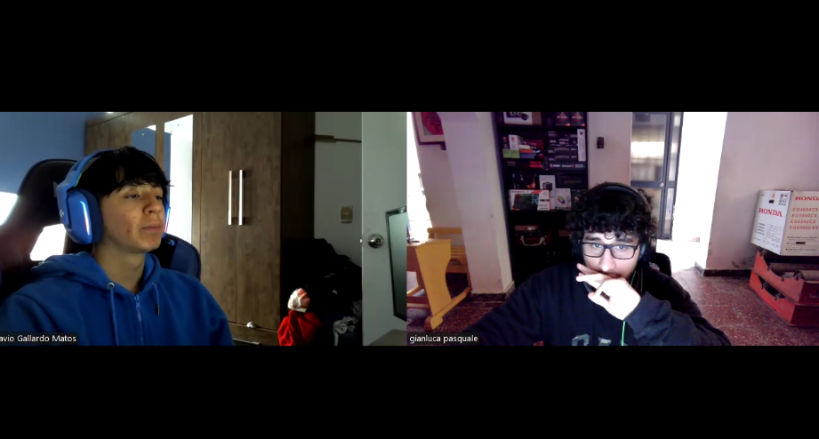 </td>
    </tr>
    <tr>
      <td>Nombre Entrevistado</td>
      <td>Flavio Gallardo Matos</td>
    </tr>
    <tr>
      <td>Edad</td>
      <td>22</td>
    </tr>
    <tr>
      <td>Distrito</td>
      <td>Breña</td>
    </tr>
    <tr>
      <td>Ocupacion</td>
      <td>Diseñador Grafico</td>
    </tr>
    <tr>
      <td>Duración Entrevista</td>
      <td>02:32 </td>
    </tr>
    <tr>
      <td>Minuto de Inicio</td>
      <td>07:23 - 9:54</td>
    </tr>
  </tbody>
</table>

<table cellpadding="8" cellspacing="0">
  <tbody>
    <tr>
      <td>Entrevista 3</td>
      <td>  </td>
    </tr>
    <tr>
      <td>Nombre Entrevistado</td>
      <td>Carlos Ordaz</td>
    </tr>
    <tr>
      <td>Edad</td>
      <td>23</td>
    </tr>
    <tr>
      <td>Distrito</td>
      <td>San Miguel</td>
    </tr>
    <tr>
      <td>Ocupacion</td>
      <td>Ingeniero de sistemas practicante</td>
    </tr>
    <tr>
      <td>Duración Entrevista</td>
      <td>04:22 </td>
    </tr>
    <tr>
      <td>Minuto de Inicio</td>
      <td>09:55 - 14:16</td>
    </tr>
  </tbody>
</table>

A continuación se presentan los detalles clave de las entrevistas realizadas a los estudiantes:

<table cellpadding="8" cellspacing="0">
  <tbody>
    <tr>
      <td>Entrevista 4</td>
      <td>  </td>
    </tr>
    <tr>
      <td>Nombre Entrevistado</td>
      <td>Sebastian Real Calderon</td>
    </tr>
    <tr>
      <td>Edad</td>
      <td>20</td>
    </tr>
    <tr>
      <td>Distrito</td>
      <td>La Perla</td>
    </tr>
    <tr>
      <td>Ocupacion</td>
      <td>Estudiante de Ingenieria de Software</td>
    </tr>
    <tr>
      <td>Duración Entrevista</td>
      <td>05:44 </td>
    </tr>
    <tr>
      <td>Minuto de Inicio</td>
      <td>14:17 - 20:00</td>
    </tr>
  </tbody>
</table>

<table cellpadding="8" cellspacing="0">
  <tbody>
    <tr>
      <td>Entrevista 5</td>
      <td>  </td>
    </tr>
    <tr>
      <td>Nombre Entrevistado</td>
      <td>Tyro Sotil</td>
    </tr>
    <tr>
      <td>Edad</td>
      <td>22</td>
    </tr>
    <tr>
      <td>Distrito</td>
      <td>San Juan de Lurigancho</td>
    </tr>
    <tr>
      <td>Ocupacion</td>
      <td>Estudiante</td>
    </tr>
    <tr>
      <td>Duración Entrevista</td>
      <td>05:44 </td>
    </tr>
    <tr>
      <td>Minuto de Inicio</td>
      <td>14:17 - 20:00</td>
    </tr>
  </tbody>
</table>

<table cellpadding="8" cellspacing="0">
  <tbody>
    <tr>
      <td>Entrevista 6</td>
      <td>  </td>
    </tr>
    <tr>
      <td>Nombre Entrevistado</td>
      <td>Juan Diego Cabrera</td>
    </tr>
    <tr>
      <td>Edad</td>
      <td>20</td>
    </tr>
    <tr>
      <td>Distrito</td>
      <td>USA, florida</td>
    </tr>
    <tr>
      <td>Ocupacion</td>
      <td>Estudiante</td>
    </tr>
    <tr>
      <td>Duración Entrevista</td>
      <td>09:31</td>
    </tr>
    <tr>
      <td>Minuto de Inicio</td>
      <td>24:03 - 33:34</td>
    </tr>
  </tbody>
</table>

#### 2.2.3 Análisis de entrevistas

**Segmento Objetivo 1: Trabajadores Remotos**

En el segmento de trabajadores remotos, se entrevistaron a tres personas con edades entre 21 y 23 años, dedicadas a actividades como enseñanza virtual, diseño gráfico e ingeniería de sistemas. El 100% trabaja entre 5 y 9 horas diarias frente a la computadora, con un 67% que prefiere trabajar en horarios nocturnos o matutinos según la demanda. El 100% reporta molestias físicas, principalmente fatiga visual (67%) y dolor de espalda (33%). En cuanto a la conciencia postural, el 67% intenta mantener una buena postura, aunque solo uno reconoce que a veces debe cambiarla para evitar cansancio. Ninguno ha utilizado dispositivos físicos para corrección postural, pero todos muestran interés en aplicaciones que les recuerden moverse o mejorar su postura, valorando que sean poco invasivas y con recordatorios prácticos.

**Segmento Objetivo 2: Estudiantes Remotos**

Para el segmento de estudiantes remotos, las seis entrevistas revelan que la mayoría tiene entre 20 y 22 años, con un estudiante residiendo en Estados Unidos. El 100% pasa entre 6 y 12 horas diarias frente a la computadora, principalmente en espacios privados como dormitorios o bibliotecas. El 83% ha experimentado molestias físicas, destacando dolor de espalda y fatiga visual, aunque solo un 33% está consciente de su postura durante el estudio. El 50% utiliza herramientas digitales para organización como Google Calendar, Trello o Notion, y el 67% cuenta con elementos físicos como sillas ergonómicas o escritorios amplios para mejorar la comodidad. Ninguno ha probado aplicaciones específicas para cuidado postural, pero todos manifiestan interés en usar aplicaciones con recordatorios poco invasivos y funciones de gamificación para mantener una buena postura y reducir molestias.

### 2.3 Needfinding

#### 2.3.1 User Personas

En esta sección se presentan las User Personas desarrolladas a partir del análisis de las entrevistas y la investigación de mercado. Estas representaciones ficticias de nuestros usuarios objetivo nos ayudan a comprender mejor sus necesidades, comportamientos y motivaciones, facilitando el diseño de soluciones centradas en el usuario.

**User Persona: Trabajador Remoto**

**User Persona: Estudiante Remoto**

#### 2.3.2 User Task Matrix

**Segmento 1: Trabajadores Remotos:**

| Tarea                                                                             | Frecuencia | Severidad |
| --------------------------------------------------------------------------------- | ---------- | --------- |
| Permanecer sentado frente a la computadora entre 5–9 horas                        | Alta       | Alta      |
| Mantener concentración en actividades digitales (enseñanza, diseño, programación) | Alta       | Alta      |
| Intentar corregir su postura de forma consciente                                  | Media      | Media     |
| Realizar pausas breves o cambios de posición                                      | Baja       | Media     |
| Monitorear molestias físicas (fatiga visual, dolor de espalda)                    | Media      | Alta      |
| Utilizar recordatorios o notificaciones de postura                                | Baja       | Alta      |
| Ajustar su espacio de trabajo (silla, escritorio, luz)                            | Baja       | Media     |

**Segmento 2: Estudiantes Remotos:**

| Tarea                                                                                | Frecuencia | Severidad |
| ------------------------------------------------------------------------------------ | ---------- | --------- |
| Estudiar entre 6–12 horas frente a la computadora                                    | Alta       | Alta      |
| Concentrarse en actividades académicas (lectura, clases, trabajos)                   | Alta       | Alta      |
| Mantener una postura correcta al estudiar                                            | Baja       | Alta      |
| Realizar pausas activas o estiramientos                                              | Baja       | Media     |
| Identificar y atender molestias físicas (dolor de espalda, fatiga visual)            | Media      | Alta      |
| Usar herramientas digitales de organización (Google Calendar, Notion, Trello)        | Media      | Media     |
| Ajustar entorno físico (silla ergonómica, escritorio)                                | Media      | Media     |
| Interesarse en aplicaciones de autocuidado postural con recordatorios y gamificación | Baja       | Alta      |

#### 2.3.3 Empathy Mapping

**Segmento 1: Trabajadores Remotos:**

**Segmento 2: Estudiantes Remotos:**

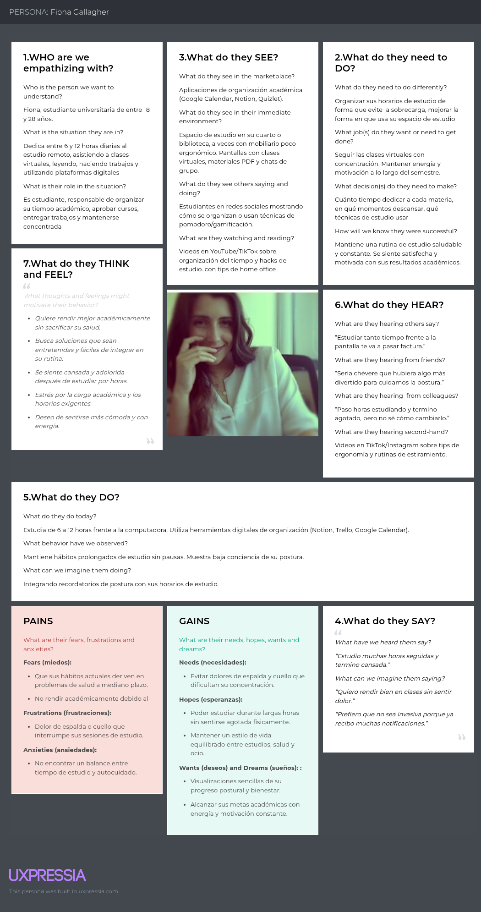

#### 2.3.4 As-is Scenario Mapping

**Segmento 1: Trabajador Remoto**

**Segmento 2: Estudiante con clases virtuales**

### 2.4 Ubiquitous Language

El siguiente glosario detalla los términos esenciales del Lenguaje Ubiquo que utilizamos en este proyecto. Este lenguaje común nos permite alinear nuestras conversaciones y asegurar que todos estemos trabajando con una misma comprensión del dominio del problema.

| Término (Inglés)        | Término (Español)                 | Definición                                                                                                                                                                                                                |
| ----------------------- | --------------------------------- | ------------------------------------------------------------------------------------------------------------------------------------------------------------------------------------------------------------------------- |
| **Task**                | Tarea                             | Acción específica asignada a un miembro del grupo para ser completada en un periodo.                                                                                                                                      |
| **Monitoring**          | Monitoreo                         | Proceso continuo mediante el cual el sistema observa y analiza la postura del usuario en tiempo real.                                                                                                                     |
| **Notification**        | Notificación                      | Aviso emitido por el sistema (visual o sonoro) para alertar al usuario sobre una postura incorrecta o recordarle una acción.                                                                                              |
| **Metric**              | Métrica                           | Indicador cuantitativo que mide hábitos posturales, como el tiempo en postura incorrecta o la frecuencia de correcciones.                                                                                                 |
| **Posture**             | Postura                           | Posición corporal adoptada por el usuario frente a la computadora, que puede ser correcta o incorrecta según criterios ergonómicos.                                                                                       |
| **Webcam**              | Cámara web                        | Dispositivo que captura imágenes en tiempo real y permite al sistema analizar la postura del usuario.                                                                                                                     |
| **Remote Student**      | Estudiante remoto                 | Usuario que accede al sistema desde un entorno académico a distancia, como clases en línea, y que utiliza ErgoVision para mantener hábitos posturales saludables mientras estudia desde casa u otro lugar fuera del aula. |
| **Remote Worker**       | Trabajador remoto                 | Usuario que desempeña sus funciones laborales desde casa u otro lugar fuera de la oficina tradicional, empleando ErgoVision para cuidar su postura durante la jornada laboral a distancia.                                |
| **MediaPipe**           | MediaPipe                         | Framework de visión por computadora desarrollado por Google, usado para detectar y procesar puntos clave del cuerpo humano.                                                                                               |
| **Pose Landmark**       | Punto de referencia de la postura | Coordenadas específicas del cuerpo (ej. hombros, cuello, rodillas) detectadas por la IA para evaluar la postura del usuario.                                                                                              |
| **Postural Biometrics** | Biometría postural                | Conjunto de datos únicos relacionados con la forma en que una persona se sienta, se mueve o mantiene su postura.                                                                                                          |
| **Workstation**         | Estación de trabajo               | Espacio físico compuesto por escritorio, silla y computadora donde el estudiante y trabajador remoto realiza sus actividades.                                                                                             |
| **Comfort Threshold**   | Umbral de confort                 | Límite dentro del cual una postura se considera aceptable sin generar molestias o riesgos ergonómicos.                                                                                                                    |
| **Correction Cycle**    | Ciclo de corrección               | Secuencia de eventos que inicia con una alerta, continúa con el ajuste de la postura por parte del estudiante y trabajador remoto y finaliza con la validación del cambio.                                                |

## Capítulo III: Requirements Specification

### 3.1 To-Be Scenario Mapping

**Segmento 1: Trabajador Remoto**

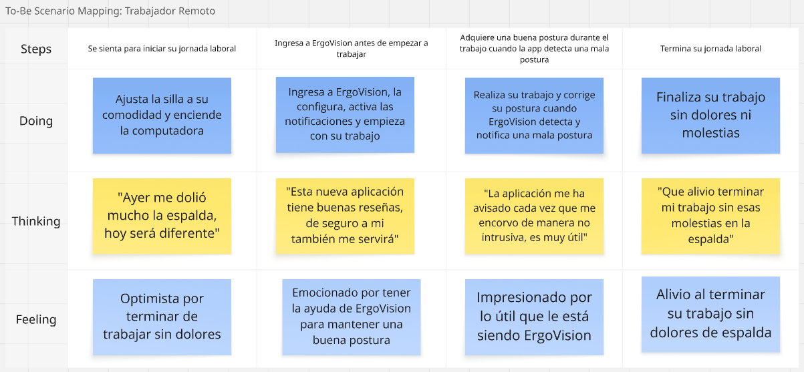

**Segmento 2: Estudiante con clases virtuales**

### 3.2 User Stories

**Epics:**

<table>
  <thead>
    <tr>
      <th>Epic ID</th>
      <th>Título</th>
      <th>Descripción</th>
    </tr>
  </thead>
  <tbody>
    <tr>
      <td>EP-001</td>
      <td>Monitoreo Postural en Tiempo Real</td>
      <td>Sistema central de captura y análisis de video para detectar la postura del usuario mediante IA. Incluye visualización del esqueleto, procesamiento de landmarks y detección de anomalías en hombros, cabeza y proximidad a la pantalla.</td>
    </tr>
    <tr>
      <td>EP-002</td>
      <td>Sistema de Alertas y Notificaciones</td>
      <td>Mecanismos de retroalimentación inmediata para corregir la postura. Incluye alertas visuales no intrusivas, alertas sonoras personalizables por tipo de error y gestión de preferencias de notificaciones.</td>
    </tr>
    <tr>
      <td>EP-003</td>
      <td>Personalización y Calibración</td>
      <td>Funcionalidades para adaptar la experiencia al usuario específico. Incluye un wizard de calibración inicial, ajustes de sensibilidad para cada tipo de alerta y gestión de umbrales personalizados.</td>
    </tr>
    <tr>
      <td>EP-004</td>
      <td>Seguimiento de Progreso y Analytics</td>
      <td>Panel de control y historial para que el usuario visualice su evolución. Incluye gráficos de estadísticas (tiempo de uso, postura correcta), historial diario/semanal detallado e identificación de patrones de error.</td>
    </tr>
    <tr>
      <td>EP-005</td>
      <td>Gestión de Bienestar y Prevención</td>
      <td>Funciones proactivas para promover hábitos saludables. Incluye un recordatorio inteligente de pausas activas, guía de ejercicios de estiramiento y gestión de temporizadores de descanso.</td>
    </tr>
    <tr>
      <td>EP-006</td>
      <td>Gestión de Usuario y Perfil</td>
      <td>Sistema de autenticación y administración de la cuenta. Incluye registro, inicio de sesión, verificación de correo, recuperación de contraseña, edición del perfil y gestión de preferencias de la cuenta.</td>
    </tr>
  </tbody>
</table>

**User Stories:**
    
<table>
  <thead>
    <tr>
      <th>User Story ID</th>
      <th>Título</th>
      <th>Descripción</th>
      <th>Criterios de Aceptación</th>
      <th>Relacionado con (Epic ID)</th>
    </tr>
  </thead>
  <tbody>
    <tr>
        <td>US-001</td>
        <td>Acceso a la Cámara</td>
        <td>Como usuario, quiere permitir el acceso a su cámara web para que el sistema pueda comenzar a analizar su postura.</td>
        <td>
            <b>Escenario 1: Permiso concedido</b> 
            Dado que el usuario ha iniciado sesión, 
            Cuando inicia el monitoreo, 
            Entonces el navegador solicita permiso para acceder a la cámara y, al concederlo, el feed de video se muestra en la interfaz. 
            <b>Escenario 2: Permiso denegado</b> 
            Dado que el navegador solicita acceso a la cámara, 
            Cuando el usuario deniega el permiso, 
            Entonces se muestra un mensaje de error claro con instrucciones para habilitar el acceso manualmente.
        </td>
        <td>EP-001</td>
    </tr>
    <tr>
        <td>US-002</td>
        <td>Visualización del Esqueleto en Tiempo Real</td>
        <td>Como usuario, quiere ver una superposición del esqueleto detectado sobre su imagen de video para entender cómo el sistema interpreta su postura.</td>
        <td>
            <b>Escenario: Renderizado del modelo</b> 
            Dado que la cámara está activa y el usuario está en el campo de visión, 
            Cuando MediaPipe Pose detecta los 33 landmarks, 
            Entonces se dibuja un esqueleto semitransparente que se ajusta en tiempo real a los movimientos del usuario.
        </td>
        <td>EP-001</td>
    </tr>
    <tr>
        <td>US-003</td>
        <td>Detección de Postura Encorvada</td>
        <td>Como usuario, quiere que el sistema detecte automáticamente cuando sus hombros están desalineados o encorvados para poder corregirlo.</td>
        <td>
            <b>Escenario 1: Detección de encorvamiento</b> 
            Dado que el usuario está siendo monitoreado, 
            Cuando la inclinación de sus hombros supera el umbral configurado, 
            Entonces el sistema registra el evento como una "mala postura" y lo almacena para su análisis. 
            <b>Escenario 2: Postura correcta</b> 
            Dado que el usuario estaba encorvado, 
            Cuando corrige su postura y sus hombros vuelven a estar alineados, 
            Entonces el sistema deja de registrar el evento de "mala postura".
        </td>
        <td>EP-001</td>
    </tr>
    <tr>
        <td>US-004</td>
        <td>Detección de Proximidad a la Pantalla</td>
        <td>Como usuario, quiere que el sistema le alerte cuando su rostro está demasiado cerca de la pantalla para prevenir fatiga visual.</td>
        <td>
            <b>Escenario 1: Rostro demasiado cerca</b> 
            Dado que la cámara está calibrada, 
            Cuando la distancia estimada entre su rostro y la pantalla es menor a 50 cm, 
            Entonces el sistema activa una alerta de proximidad. 
            <b>Escenario 2: Distancia correcta</b> 
            Dado que su rostro estaba demasiado cerca, 
            Cuando se aleja a una distancia mayor a 50 cm, 
            Entonces la alerta de proximidad se desactiva.
        </td>
        <td>EP-001</td>
    </tr>
    <tr>
        <td>US-005</td>
        <td>Detección de Inclinación de Cabeza</td>
        <td>Como usuario, quiere que el sistema detecte si su cabeza no está en una posición neutral (demasiado hacia adelante o hacia los lados) para mantener una columna vertebral alineada.</td>
        <td>
            <b>Escenario: Cabeza hacia adelante</b> 
            Dado que el usuario está siendo monitoreado, 
            Cuando la proyección de su nariz está significativamente por delante de la línea de sus hombros, 
            Entonces el sistema registra un evento de "postura de avestruz".
        </td>
        <td>EP-001</td>
    </tr>
    <tr>
        <td>US-006</td>
        <td>Toggle de Visualización de Esqueleto</td>
        <td>Como usuario, quiere poder activar o desactivar la visualización del esqueleto sobre el video para reducir la distracción cuando no la necesita.</td>
        <td>
            <b>Escenario: Ocultar superposición</b> 
            Dado que el esqueleto se está mostrando, 
            Cuando el usuario oculta la visualización del esqueleto, 
            Entonces la superposición gráfica desaparece pero el análisis de postura continúa en segundo plano.
        </td>
        <td>EP-001</td>
    </tr>
    <tr>
        <td>US-007</td>
        <td>Detección de Ángulo Brazo-Antebrazo</td>
        <td>Como usuario, quiere que el sistema verifique el ángulo de su articulación del codo (brazo-antebrazo) para detectar posiciones tensionantes y prevenir lesiones por mal apoyo.</td>
        <td>
            <b>Escenario 1: Ángulo correcto (~90 grados)</b> 
            Dado que el usuario está sentado frente a la computadora, 
            Cuando su ángulo de codo se mantiene entre 80-100 grados, 
            Entonces el sistema no emite ninguna alerta. 
            <b>Escenario 2: Ángulo incorrecto (extensión excesiva)</b> 
            Dado que el usuario está trabajando, 
            Cuando su ángulo de codo supera los 120 grados o es menor a 60 grados, 
            Entonces el sistema registra un evento de "mala postura de brazo" y activa la alerta correspondiente.
        </td>
        <td>EP-001</td>
    </tr>
    <tr>
        <td>US-008</td>
        <td>Detección de Alineación Pierna-Cadera-Espalda</td>
        <td>Como usuario, quiere que el sistema monitoree el ángulo entre sus muslos, cadera y hombros para asegurar una posición sentada ergonómicamente correcta.</td>
        <td>
            <b>Escenario 1: Postura correcta (ángulos adecuados)</b> 
            Dado que el usuario está sentado correctamente, 
            Cuando sus muslos forman un ángulo de 90-110 grados con su cadera y su espalda está entre 90-110 grados con sus muslos, 
            Entonces el sistema mantiene el estado de postura correcta. 
            <b>Escenario 2: Postura incorrecta (inclinación pélvica)</b> 
            Dado que el usuario está sentado, 
            Cuando el ángulo entre sus muslos y cadera es menor a 80 grados o mayor a 120 grados, 
            Entonces el sistema detecta "mala postura pélvica" y genera la alerta correspondiente.
        </td>
        <td>EP-001</td>
    </tr>
    <tr>
        <td>US-009</td>
        <td>Alertas Visuales para Mala Postura</td>
        <td>Como usuario, quiere recibir alertas visuales no intrusivas cuando su postura es incorrecta, para corregirla inmediatamente sin interrupciones bruscas.</td>
        <td>
            <b>Escenario 1: Alerta visual activa</b> 
            Dado que el sistema detecta una mala postura, 
            Cuando se activa el evento de alerta, 
            Entonces aparece un borde de color suave alrededor de la interfaz indicando el tipo de error postural. 
            <b>Escenario 2: Alerta persistente</b> 
            Dado que la mala postura continúa, 
            Cuando pasan más de 5 segundos sin corrección, 
            Entonces la alerta visual aumenta ligeramente su intensidad para reforzar la notificación.
        </td>
        <td>EP-002</td>
    </tr>
    <tr>
        <td>US-010</td>
        <td>Alertas Sonoras Personalizables</td>
        <td>Como usuario, quiere asignar sonidos diferentes para cada tipo de error postural, para identificar rápidamente el problema específico sin mirar la pantalla.</td>
        <td>
            <b>Escenario 1: Sonido de encorvamiento</b> 
            Dado que se detecta espalda encorvada, 
            Cuando se activa la alerta, 
            Entonces se reproduce el sonido específico configurado para "encorvamiento". 
            <b>Escenario 2: Sonido de proximidad</b> 
            Dado que se detecta proximidad excesiva a la pantalla, 
            Cuando se activa la alerta, 
            Entonces se reproduce un sonido diferente configurado para "proximidad".
        </td>
        <td>EP-002</td>
    </tr>
    <tr>
        <td>US-011</td>
        <td>Personalización de Volumen de Alertas</td>
        <td>Como usuario, quiere ajustar el volumen de las alertas sonoras para adaptarlas a su entorno de trabajo y no molestar a otras personas.</td>
        <td>
            <b>Escenario 1: Ajuste de volumen</b> 
            Dado que el usuario está en la configuración de sonidos, 
            Cuando mueve el control deslizante de volumen al 50%, 
            Entonces las próximas alertas sonoras se reproducirán a ese nivel de volumen. 
            <b>Escenario 2: Silenciar alertas</b> 
            Dado que el usuario necesita concentrarse en una tarea, 
            Cuando ajusta el volumen al 0%, 
            Entonces las alertas sonoras se desactivan completamente.
        </td>
        <td>EP-002</td>
    </tr>
    <tr>
        <td>US-012</td>
        <td>Selección de Alertas Activas</td>
        <td>Como usuario, quiere elegir qué tipos de alertas quiere recibir (visuales, sonoras o ambas) para personalizar su experiencia de notificaciones.</td>
        <td>
            <b>Escenario 1: Solo alertas visuales</b> 
            Dado que el usuario está en un entorno silencioso, 
            Cuando desactiva las alertas sonoras pero mantiene las visuales, 
            Entonces solo recibirá notificaciones visuales para errores posturales. 
            <b>Escenario 2: Solo alertas sonoras</b> 
            Dado que el usuario no está mirando constantemente la pantalla, 
            Cuando desactiva las alertas visuales pero mantiene las sonoras, 
            Entonces solo recibirá notificaciones sonoras para errores posturales.
        </td>
        <td>EP-002</td>
    </tr>
    <tr>
        <td>US-013</td>
        <td>Modo Silencio Temporal</td>
        <td>Como usuario, quiere pausar temporalmente todas las alertas durante reuniones o llamadas importantes, para evitar interrupciones inoportunas.</td>
        <td>
            <b>Escenario: Silencio por 30 minutos</b> 
            Dado que el usuario tiene una reunión importante, 
            Cuando activa el "modo silencio" por 30 minutos, 
            Entonces el sistema no emitirá alertas visuales ni sonoras durante ese período.
        </td>
        <td>EP-002</td>
    </tr>
    <tr>
        <td>US-014</td>
        <td>Panel de Gestión de Alertas</td>
        <td>Como usuario, quiere acceder a un panel centralizado donde pueda gestionar todas sus preferencias de notificaciones, para tener control completo sobre su experiencia de alertas.</td>
        <td>
            <b>Escenario: Configuración completa</b> 
            Dado que el usuario accede al panel de gestión de alertas, 
            Cuando modifica múltiples configuraciones (volumen, tipos, sonidos), 
            Entonces todos los cambios se guardan correctamente y se aplican inmediatamente.
        </td>
        <td>EP-002</td>
    </tr>
    <tr>
        <td>US-015</td>
        <td>Calibración Inicial de Postura</td>
        <td>Como usuario, quiere realizar una calibración inicial de su postura correcta para que el sistema reconozca su posición ideal al sentarse.</td>
        <td>
            <b>Escenario: Calibración exitosa</b> 
            Dado que el usuario inicia el wizard de calibración, 
            Cuando mantiene una postura correcta durante 5 segundos, 
            Entonces el sistema registra esta posición como referencia para futuras comparaciones.
        </td>
        <td>EP-003</td>
    </tr>
    <tr>
        <td>US-016</td>
        <td>Ajuste de Sensibilidad de Detección</td>
        <td>Como usuario, quiere ajustar la sensibilidad del detector de espalda encorvada para personalizar qué tan estricto es el sistema con su postura.</td>
        <td>
            <b>Escenario: Ajuste de sensibilidad media</b> 
            Dado que el usuario accede a configuraciones de sensibilidad, 
            Cuando mueve el slider a un nivel medio (50%), 
            Entonces el sistema se vuelve moderadamente estricto al detectar encorvamiento.
        </td>
        <td>EP-003</td>
    </tr>
    <tr>
        <td>US-017</td>
        <td>Ajuste de Frecuencia de Detección</td>
        <td>Como usuario, quiere controlar la frecuencia con la que el sistema analiza su postura para equilibrar precisión y rendimiento.</td>
        <td>
            <b>Escenario: Frecuencia moderada</b> 
            Dado que el usuario necesita optimizar el rendimiento, 
            Cuando ajusta la frecuencia a "moderada" (2 segundos), 
            Entonces el sistema realiza chequeos posturales cada 2 segundos.
        </td>
        <td>EP-003</td>
    </tr>
    <tr>
        <td>US-018</td>
        <td>Restablecer Configuración Predeterminada</td>
        <td>Como usuario, quiere poder restablecer todos los ajustes a los valores predeterminados del sistema para comenzar de cero si es necesario.</td>
        <td>
            <b>Escenario: Reset completo</b> 
            Dado que los ajustes actuales del usuario no funcionan correctamente, 
            Cuando restablece los valores predeterminados, 
            Entonces todos los parámetros de calibración vuelven a su estado original.
        </td>
        <td>EP-003</td>
    </tr>
    <tr>
        <td>US-020</td>
        <td>Panel Principal de Estadísticas</td>
        <td>Como usuario, quiere ver un dashboard con sus métricas principales de postura para tener una visión general de su progreso diario.</td>
        <td>
            <b>Escenario: Visualización de métricas</b> 
            Dado que el usuario ha usado el sistema por más de 1 hora, 
            Cuando accede al panel principal, 
            Entonces ve porcentaje de postura correcta, tiempo total de uso y número de alertas recibidas.
        </td>
        <td>EP-004</td>
    </tr>
    <tr>
        <td>US-021</td>
        <td>Gráfico de Progreso Semanal</td>
        <td>Como usuario, quiere visualizar su evolución semanal mediante un gráfico de líneas para identificar tendencias en su mejora postural.</td>
        <td>
            <b>Escenario: Gráfico interactivo</b> 
            Dado que el usuario tiene datos de varios días, 
            Cuando selecciona la vista "semanal", 
            Entonces se muestra un gráfico con su porcentaje de postura correcta por día de la semana.
        </td>
        <td>EP-004</td>
    </tr>
    <tr>
        <td>US-022</td>
        <td>Historial Detallado de Sesiones</td>
        <td>Como usuario, quiere revisar el historial completo de sus sesiones de trabajo para analizar su comportamiento postural a lo largo del tiempo.</td>
        <td>
            <b>Escenario: Filtrado por fecha</b> 
            Dado que el usuario quiere ver sus datos de ayer, 
            Cuando selecciona la fecha en el calendario, 
            Entonces el sistema muestra sus estadísticas detalladas de postura para ese día específico.
        </td>
        <td>EP-004</td>
    </tr>
    <tr>
        <td>US-023</td>
        <td>Recordatorio de Pausas Activas</td>
        <td>Como usuario, quiere recibir recordatorios automáticos para tomar pausas activas cada cierto tiempo para prevenir la fatiga y mejorar su bienestar postural.</td>
        <td>
            <b>Escenario: Recordatorio cada 45 minutos</b> 
            Dado que el usuario ha estado trabajando continuamente, 
            Cuando transcurren 45 minutos de actividad, 
            Entonces el sistema muestra una notificación sugiriendo una pausa activa de 5 minutos.
        </td>
        <td>EP-005</td>
    </tr>
    <tr>
        <td>US-024</td>
        <td>Personalización de Temporizador de Descansos</td>
        <td>Como usuario, quiere configurar la frecuencia y duración de sus pausas activas para adaptarlas a su flujo de trabajo y necesidades personales.</td>
        <td>
            <b>Escenario: Configurar pausas personalizadas</b> 
            Dado que el usuario accede a la configuración de descansos, 
            Cuando establece pausas cada 30 minutos con duración de 7 minutos, 
            Entonces el sistema aplica estos nuevos intervalos para sus recordatorios.
        </td>
        <td>EP-005</td>
    </tr>
    <tr>
        <td>US-025</td>
        <td>Sugerencias de Ejercicios Generales</td>
        <td>Como usuario, quiere recibir sugerencias generales de ejercicios durante las pausas activas para realizar estiramientos básicos que beneficien su postura.</td>
        <td>
            <b>Escenario: Sugerencias aleatorias</b> 
            Dado que el usuario ha iniciado una pausa activa, 
            Cuando el sistema muestra sugerencias de ejercicios, 
            Entonces presenta 3 opciones diferentes de estiramientos generales seleccionados aleatoriamente de un banco predefinido.
        </td>
        <td>EP-005</td>
    </tr>
    <tr>
        <td>US-026</td>
        <td>Registro de Nueva Cuenta</td>
        <td>Como usuario nuevo, quiere registrarse con su correo electrónico y contraseña para poder acceder a todas las funcionalidades de la aplicación.</td>
        <td>
            <b>Escenario 1: Registro exitoso</b> 
            Dado que el usuario es nuevo, 
            Cuando completa el formulario con email válido y contraseña segura, 
            Entonces recibe un email de verificación y su cuenta queda creada en estado pendiente. 
            <b>Escenario 2: Email ya registrado</b> 
            Dado que el usuario intenta registrarse con un email existente, 
            Cuando envía el formulario, 
            Entonces recibe un mensaje indicando que el email ya está registrado.
        </td>
        <td>EP-006</td>
    </tr>
    <tr>
        <td>US-027</td>
        <td>Verificación de Correo Electrónico</td>
        <td>Como usuario registrado, quiere verificar su dirección de correo electrónico para activar completamente su cuenta y asegurar su autenticidad.</td>
        <td>
            <b>Escenario: Verificación exitosa</b> 
            Dado que el usuario se ha registrado y recibió el email de verificación, 
            Cuando hace clic en el enlace de verificación, 
            Entonces su cuenta se activa y puede iniciar sesión normalmente.
        </td>
        <td>EP-006</td>
    </tr>
    <tr>
        <td>US-028</td>
        <td>Inicio de Sesión</td>
        <td>Como usuario registrado, quiere iniciar sesión con sus credenciales para acceder a su perfil personalizado y datos de postura.</td>
        <td>
            <b>Escenario 1: Login exitoso</b> 
            Dado que el usuario tiene una cuenta verificada, 
            Cuando ingresa sus credenciales correctas, 
            Entonces accede a su dashboard personal. 
            <b>Escenario 2: Credenciales incorrectas</b> 
            Dado que el usuario ingresa contraseña incorrecta, 
            Cuando intenta iniciar sesión, 
            Entonces recibe un mensaje de error sin especificar si el error es en usuario o contraseña.
        </td>
        <td>EP-006</td>
    </tr>
    <tr>
        <td>US-029</td>
        <td>Recuperación de Contraseña</td>
        <td>Como usuario que olvidó su contraseña, quiere restablecerla mediante un enlace enviado a su email para recuperar el acceso a su cuenta.</td>
        <td>
            <b>Escenario: Restablecimiento exitoso</b> 
            Dado que el usuario solicita restablecer su contraseña, 
            Cuando establece una nueva contraseña, 
            Entonces puede iniciar sesión con sus nuevas credenciales.
        </td>
        <td>EP-006</td>
    </tr>
    <tr>
        <td>US-030</td>
        <td>Edición de Perfil</td>
        <td>Como usuario registrado, quiere editar su información personal para mantener su perfil actualizado.</td>
        <td>
            <b>Escenario: Actualización de perfil</b> 
            Dado que el usuario está en su perfil, 
            Cuando modifica su nombre y guarda los cambios, 
            Entonces los nuevos datos se almacenan correctamente y se muestran inmediatamente.
        </td>
        <td>EP-006</td>
    </tr>
    <tr>
        <td>US-031</td>
        <td>Gestión de Preferencias</td>
        <td>Como usuario, quiere configurar sus preferencias de notificaciones y privacidad para personalizar su experiencia en la aplicación.</td>
        <td>
            <b>Escenario: Cambio de preferencias</b> 
            Dado que el usuario accede a configuración, 
            Cuando modifica sus preferencias de notificaciones, 
            Entonces los cambios se aplican inmediatamente en el sistema.
        </td>
        <td>EP-006</td>
    </tr>
        <tr>
        <td>TS-001</td>
        <td>Integración de MediaPipe Pose</td>
        <td>Como developer, quiero integrar la librería MediaPipe Pose en la aplicación web para poder detectar los 33 landmarks corporales en tiempo real.</td>
        <td>
            <b>Escenario: Detección exitosa de landmarks</b> 
            Dado que la cámara está activa, 
            Cuando se inicializa MediaPipe Pose, 
            Entonces el sistema debe detectar continuamente los 33 puntos corporales con una tasa de frames mayor a 30fps.
        </td>
        <td>EP-001</td>
    </tr>
    <tr>
        <td>TS-002</td>
        <td>Manejo de Permisos de Cámara</td>
        <td>Como developer, quiero implementar el sistema de permisos de cámara del navegador para garantizar el acceso al video stream necesario para el análisis.</td>
        <td>
            <b>Escenario 1: Permiso concedido</b> 
            Dado que el usuario inicia la aplicación, 
            Cuando solicita acceso a la cámara, 
            Entonces el navegador debe mostrar el diálogo de permisos y al aceptar, obtener el stream de video. 
            <b>Escenario 2: Permiso denegado</b> 
            Dado que el usuario deniega el permiso, 
            Cuando se intenta acceder a la cámara, 
            Entonces el sistema debe mostrar un mensaje de error apropiado.
        </td>
        <td>EP-001</td>
    </tr>
    <tr>
        <td>TS-003</td>
        <td>Renderizado del Esqueleto en Canvas</td>
        <td>Como developer, quiero implementar el renderizado del esqueleto detectado sobre el video para visualizar los resultados del análisis postural.</td>
        <td>
            <b>Escenario: Visualización en tiempo real</b> 
            Dado que MediaPipe detecta los landmarks, 
            Cuando se reciben los puntos corporales, 
            Entonces se debe dibujar un esqueleto semitransparente superpuesto al video con actualización continua.
        </td>
        <td>EP-001</td>
    </tr>
    <tr>
        <td>TS-004</td>
        <td>Algoritmo de Detección de Postura</td>
        <td>Como developer, quiero implementar los algoritmos de cálculo angular para determinar desviaciones posturales basado en los landmarks detectados.</td>
        <td>
            <b>Escenario: Cálculo de ángulos posturales</b> 
            Dado que se tienen los landmarks corporales, 
            Cuando se calculan los ángulos de hombros, cadera y columna, 
            Entonces el sistema debe identificar correctamente posturas incorrectas según los umbrales definidos.
        </td>
        <td>EP-001</td>
    </tr>
    <tr>
        <td>TS-005</td>
        <td>Sistema de Alertas en Tiempo Real</td>
        <td>Como developer, quiero implementar el sistema de notificaciones visuales que se active inmediatamente al detectar posturas incorrectas.</td>
        <td>
            <b>Escenario: Activación de alerta visual</b> 
            Dado que se detecta una postura incorrecta, 
            Cuando persiste por más de 3 segundos, 
            Entonces se debe mostrar una alerta visual no intrusiva en los bordes de la pantalla.
        </td>
        <td>EP-001</td>
    </tr>
    <tr>
        <td>TS-006</td>
        <td>Manejo de Estados de Monitoreo</td>
        <td>Como developer, quiero implementar el sistema de gestión de estados (activo/inactivo/pausado) para controlar el ciclo de vida del monitoreo.</td>
        <td>
            <b>Escenario: Cambio de estados</b> 
            Dado que el usuario inicia una sesión, 
            Cuando cambia entre estados de monitoreo, 
            Entonces el sistema debe responder adecuadamente liberando o asignando recursos según sea necesario.
        </td>
        <td>EP-001</td>
    </tr>
    <tr>
        <td>TS-007</td>
        <td>Optimización de Rendimiento</td>
        <td>Como developer, quiero optimizar el rendimiento del procesamiento de video para garantizar un funcionamiento fluido sin consumo excesivo de CPU.</td>
        <td>
            <b>Escenario: Uso eficiente de recursos</b> 
            Dado que la aplicación está en funcionamiento, 
            Cuando se procesa el video en tiempo real, 
            Entonces el uso de CPU no debe exceder el 30% en equipos de gama media.
        </td>
        <td>EP-001</td>
    </tr>
    <tr>
        <td>TS-008</td>
        <td>Manejo de Errores y Excepciones</td>
        <td>Como developer, quiero implementar un sistema robusto de manejo de errores para gestionar fallos en la detección o procesamiento de video.</td>
        <td>
            <b>Escenario: Recuperación de errores</b> 
            Dado que ocurre un error en la detección, 
            Cuando el sistema falla temporalmente, 
            Entonces debe recuperarse automáticamente sin requerir intervención del usuario.
        </td>
        <td>EP-001</td>
    </tr>
       <tr>
        <td>TS-009</td>
        <td>Sistema de Alertas Visuales</td>
        <td>Como developer, quiero implementar un sistema de alertas visuales no intrusivas que se activen al detectar mala postura para proporcionar retroalimentación inmediata al usuario.</td>
        <td>
            <b>Escenario: Activación de borde coloreado</b> 
            Dado que se detecta una postura incorrecta, 
            Cuando persiste por más de 3 segundos, 
            Entonces se debe mostrar un borde de color suave alrededor de la interfaz indicando el tipo de error.
        </td>
        <td>EP-002</td>
    </tr>
    <tr>
        <td>TS-010</td>
        <td>Reproducción de Sonidos Personalizados</td>
        <td>Como developer, quiero implementar un sistema de reproducción de sonidos personalizables para cada tipo de error postural que permita identificar problemas sin mirar la pantalla.</td>
        <td>
            <b>Escenario: Sonido específico por error</b> 
            Dado que se configura un sonido para "encorvamiento", 
            Cuando se detecta este tipo de error postural, 
            Entonces se debe reproducir el sonido específico asignado.
        </td>
        <td>EP-002</td>
    </tr>
    <tr>
        <td>TS-011</td>
        <td>Control de Volumen de Alertas</td>
        <td>Como developer, quiero implementar un control de volumen ajustable para las alertas sonoras que permita adaptarse a diferentes entornos de trabajo.</td>
        <td>
            <b>Escenario: Ajuste de volumen personalizado</b> 
            Dado que el usuario ajusta el volumen al 50%, 
            Cuando se activa una alerta sonora, 
            Entonces el sonido debe reproducirse al nivel de volumen configurado.
        </td>
        <td>EP-002</td>
    </tr>
    <tr>
        <td>TS-012</td>
        <td>Sistema de Preferencias de Alertas</td>
        <td>Como developer, quiero implementar un sistema de gestión de preferencias que permita habilitar/deshabilitar tipos específicos de alertas según las necesidades del usuario.</td>
        <td>
            <b>Escenario: Desactivación de alertas sonoras</b> 
            Dado que el usuario desactiva las alertas sonoras, 
            Cuando se detecta una mala postura, 
            Entonces solo se deben mostrar alertas visuales sin reproducción de sonido.
        </td>
        <td>EP-002</td>
    </tr>
    <tr>
        <td>TS-013</td>
        <td>Modo Silencio Temporal</td>
        <td>Como developer, quiero implementar un sistema de modo silencio temporal que permita pausar todas las alertas durante periodos específicos.</td>
        <td>
            <b>Escenario: Silencio programado</b> 
            Dado que se activa el modo silencio por 30 minutos, 
            Cuando se detecta cualquier error postural, 
            Entonces el sistema no debe emitir alertas visuales ni sonoras durante ese período.
        </td>
        <td>EP-002</td>
    </tr>
    <tr>
        <td>TS-014</td>
        <td>Panel de Configuración de Alertas</td>
        <td>Como developer, quiero crear un panel centralizado de configuración donde los usuarios puedan gestionar todas sus preferencias de notificaciones.</td>
        <td>
            <b>Escenario: Configuración múltiple</b> 
            Dado que el usuario accede al panel de configuración, 
            Cuando modifica varias preferencias simultáneamente, 
            Entonces todos los cambios deben guardarse y aplicarse inmediatamente.
        </td>
        <td>EP-002</td>
    </tr>
    <tr>
        <td>TS-015</td>
        <td>Persistencia de Configuraciones</td>
        <td>Como developer, quiero implementar un sistema de almacenamiento local para guardar las preferencias de alertas y asegurar que persistan entre sesiones.</td>
        <td>
            <b>Escenario: Persistencia de configuraciones</b> 
            Dado que el usuario configura sus preferencias, 
            Cuando cierra y reabre la aplicación, 
            Entonces todas las configuraciones deben mantenerse igual.
        </td>
        <td>EP-002</td>
    </tr>
    <tr>
        <td>TS-016</td>
        <td>Sincronización de Estados de Alerta</td>
        <td>Como developer, quiero implementar un sistema que sincronice el estado de las alertas entre diferentes componentes de la aplicación para evitar inconsistencia.</td>
        <td>
            <b>Escenario: Sincronización de estados</b> 
            Dado que se activa una alerta visual, 
            Cuando el usuario cambia de pestaña o componente, 
            Entonces el estado de la alerta debe mantenerse consistente en toda la aplicación.
        </td>
        <td>EP-002</td>
    </tr>
    <tr>
        <td>TS-016</td>
        <td>Wizard de Calibración Inicial</td>
        <td>Como developer, quiero implementar un wizard interactivo que guíe al usuario en el proceso de calibración inicial para establecer su postura de referencia correcta.</td>
        <td>
            <b>Escenario: Calibración exitosa</b> 
            Dado que el usuario inicia el wizard de calibración, 
            Cuando completa todos los pasos y mantiene una postura correcta durante 5 segundos, 
            Entonces el sistema guarda los parámetros de calibración como referencia para futuras comparaciones.
        </td>
        <td>EP-003</td>
    </tr>
    <tr>
        <td>TS-017</td>
        <td>Sistema de Control de Sensibilidad</td>
        <td>Como developer, quiero implementar un control deslizante ajustable que permita modificar la sensibilidad del detector de postura para adaptarse a las preferencias del usuario.</td>
        <td>
            <b>Escenario: Ajuste de sensibilidad</b> 
            Dado que el usuario accede a la configuración de sensibilidad, 
            Cuando ajusta el slider a un valor específico (ej: 50%), 
            Entonces el sistema actualiza los umbrales de detección en tiempo real con el nuevo valor.
        </td>
        <td>EP-003</td>
    </tr>
    <tr>
        <td>TS-018</td>
        <td>Control de Frecuencia de Análisis</td>
        <td>Como developer, quiero implementar un selector de frecuencia que permita configurar el intervalo entre chequeos posturales para optimizar el rendimiento del sistema.</td>
        <td>
            <b>Escenario: Cambio de frecuencia</b> 
            Dado que el usuario selecciona una frecuencia de 2 segundos, 
            Cuando guarda la configuración, 
            Entonces el sistema ajusta el intervalo de análisis postural a cada 2 segundos.
        </td>
        <td>EP-003</td>
    </tr>
    <tr>
        <td>TS-019</td>
        <td>Función de Restablecimiento de Configuración</td>
        <td>Como developer, quiero implementar una función que restablezca todas las configuraciones personalizadas a los valores predeterminados del sistema.</td>
        <td>
            <b>Escenario: Restablecimiento completo</b> 
            Dado que el usuario tiene configuraciones personalizadas, 
            Cuando activa la opción "Restablecer valores predeterminados", 
            Entonces todas las configuraciones vuelven a su estado original de fábrica.
        </td>
        <td>EP-003</td>
    </tr>
    <tr>
        <td>TS-020</td>
        <td>Persistencia de Configuraciones de Usuario</td>
        <td>Como developer, quiero implementar un sistema de almacenamiento local para guardar las configuraciones de calibración y preferencias del usuario entre sesiones.</td>
        <td>
            <b>Escenario: Persistencia de datos</b> 
            Dado que el usuario ajusta sus configuraciones, 
            Cuando cierra y reabre la aplicación, 
            Entonces todas las configuraciones personales se mantienen igual.
        </td>
        <td>EP-003</td>
    </tr>
    <tr>
        <td>TS-021</td>
        <td>API de Recolección de Datos de Postura</td>
        <td>Como developer, quiero implementar una API que capture y almacene los datos de postura en tiempo real para generar análisis históricos.</td>
        <td>
            <b>Escenario: Captura de datos exitosa</b> 
            Dado que el sistema está monitoreando postura, 
            Cuando se detecta un evento postural (correcto/incorrecto), 
            Entonces los datos se almacenan con marca de tiempo en la base de datos.
        </td>
        <td>EP-004</td>
    </tr>
    <tr>
        <td>TS-022</td>
        <td>Sistema de Dashboard de Métricas</td>
        <td>Como developer, quiero desarrollar un sistema de dashboard que muestre métricas clave de postura en tiempo real para el usuario.</td>
        <td>
            <b>Escenario: Visualización de métricas principales</b> 
            Dado que el usuario accede al dashboard, 
            Cuando hay datos de más de 1 hora de uso, 
            Entonces se muestran porcentaje de postura correcta, tiempo total y alertas recibidas.
        </td>
        <td>EP-004</td>
    </tr>
    <tr>
        <td>TS-023</td>
        <td>Gráficos Interactivos de Progreso</td>
        <td>Como developer, quiero implementar gráficos interactivos que muestren la evolución postural semanal para identificar tendencias de mejora.</td>
        <td>
            <b>Escenario: Generación de gráfico semanal</b> 
            Dado que existen datos de varios días, 
            Cuando el usuario selecciona "vista semanal", 
            Entonces se genera un gráfico de líneas con el progreso diario de postura correcta.
        </td>
        <td>EP-004</td>
    </tr>
    <tr>
        <td>TS-024</td>
        <td>Sistema de Filtrado por Fechas</td>
        <td>Como developer, quiero implementar un sistema de filtrado que permita consultar el historial de sesiones por fechas específicas.</td>
        <td>
            <b>Escenario: Filtrado por fecha específica</b> 
            Dado que el usuario quiere ver datos de ayer, 
            Cuando selecciona la fecha en el calendario, 
            Entonces el sistema muestra solo las estadísticas de ese día.
        </td>
        <td>EP-004</td>
    </tr>
    <tr>
        <td>TS-025</td>
        <td>Exportación de Reportes</td>
        <td>Como developer, quiero implementar funcionalidad de exportación de datos para permitir generar reportes en formatos comunes.</td>
        <td>
            <b>Escenario: Exportación a CSV</b> 
            Dado que el usuario quiere exportar sus datos, 
            Cuando selecciona "Exportar a CSV", 
            Entonces se genera y descarga un archivo con todos sus datos históricos.
        </td>
        <td>EP-004</td>
    </tr>
    <tr>
        <td>TS-026</td>
        <td>Sistema de Temporizador de Pausas Activas</td>
        <td>Como developer, quiero implementar un sistema de temporizador que active recordatorios de pausas activas basado en intervalos configurables para promover hábitos saludables.</td>
        <td>
            <b>Escenario: Recordatorio automático</b> 
            Dado que el usuario ha estado activo por 45 minutos, 
            Cuando se cumple el intervalo configurado, 
            Entonces el sistema muestra una notificación sugiriendo una pausa activa.
        </td>
        <td>EP-005</td>
    </tr>
    <tr>
        <td>TS-027</td>
        <td>Configuración Personalizada de Intervalos</td>
        <td>Como developer, quiero implementar un sistema de configuración que permita personalizar la frecuencia y duración de las pausas activas según preferencias del usuario.</td>
        <td>
            <b>Escenario: Personalización de intervalos</b> 
            Dado que el usuario configura pausas cada 30 minutos, 
            Cuando guarda la configuración, 
            Entonces el sistema programa los recordatorios con el nuevo intervalo.
        </td>
        <td>EP-005</td>
    </tr>
    <tr>
        <td>TS-028</td>
        <td>Banco de Ejercicios de Estiramiento</td>
        <td>Como developer, quiero crear un banco de ejercicios de estiramiento con instrucciones visuales que pueda ser accedido durante las pausas activas.</td>
        <td>
            <b>Escenario: Selección aleatoria de ejercicios</b> 
            Dado que el usuario inicia una pausa activa, 
            Cuando solicita sugerencias de ejercicios, 
            Entonces el sistema muestra 3 opciones diferentes del banco de ejercicios.
        </td>
        <td>EP-005</td>
    </tr>
    <tr>
        <td>TS-029</td>
        <td>Sistema de Notificaciones de Bienestar</td>
        <td>Como developer, quiero implementar un sistema de notificaciones no intrusivas que muestre recordatorios de pausas y sugerencias de ejercicios.</td>
        <td>
            <b>Escenario: Notificación de pausa</b> 
            Dado que se cumple el intervalo programado, 
            Cuando el sistema está activo, 
            Entonces se muestra una notificación suave sugiriendo una pausa activa.
        </td>
        <td>EP-005</td>
    </tr>
    <tr>
        <td>TS-030</td>
        <td>Gestor de Rutinas de Estiramiento</td>
        <td>Como developer, quiero desarrollar un sistema que gestione y roté las rutinas de estiramiento para evitar repetir los mismos ejercicios consecutivamente.</td>
        <td>
            <b>Escenario: Rotación de ejercicios</b> 
            Dado que el usuario ha realizado varios ejercicios, 
            Cuando inicia una nueva pausa activa, 
            Entonces el sistema sugiere ejercicios no recientemente mostrados.
        </td>
        <td>EP-005</td>
    </tr>
    <tr>
        <td>TS-031</td>
        <td>Sistema de Registro de Usuarios</td>
        <td>Como developer, quiero implementar un sistema de registro seguro que valide credenciales y envíe emails de verificación para crear nuevas cuentas de usuario.</td>
        <td>
            <b>Escenario 1: Registro exitoso</b> 
            Dado que un nuevo usuario completa el formulario, 
            Cuando los datos son válidos y el email no existe, 
            Entonces se crea la cuenta y se envía email de verificación. 
            <b>Escenario 2: Email duplicado</b> 
            Dado que un usuario intenta registrarse con email existente, 
            Cuando envía el formulario, 
            Entonces el sistema muestra error de email ya registrado.
        </td>
        <td>EP-006</td>
    </tr>
    <tr>
        <td>TS-032</td>
        <td>Sistema de Verificación de Email</td>
        <td>Como developer, quiero implementar un sistema de verificación por email que valide la autenticidad de las cuentas mediante tokens seguros.</td>
        <td>
            <b>Escenario: Verificación exitosa</b> 
            Dado que el usuario recibe el email de verificación, 
            Cuando hace clic en el enlace con token válido, 
            Entonces la cuenta se activa y puede iniciar sesión.
        </td>
        <td>EP-006</td>
    </tr>
    <tr>
        <td>TS-033</td>
        <td>Sistema de Autenticación</td>
        <td>Como developer, quiero implementar un sistema de login seguro que valide credenciales y maneje sesiones de usuario.</td>
        <td>
            <b>Escenario 1: Login exitoso</b> 
            Dado que el usuario ingresa credenciales correctas, 
            Cuando el sistema valida la información, 
            Entonces se inicia sesión y redirige al dashboard. 
            <b>Escenario 2: Credenciales inválidas</b> 
            Dado que el usuario ingresa credenciales incorrectas, 
            Cuando el sistema valida la información, 
            Entonces muestra error genérico sin especificar el campo erróneo.
        </td>
        <td>EP-006</td>
    </tr>
    <tr>
        <td>TS-034</td>
        <td>Sistema de Recuperación de Contraseña</td>
        <td>Como developer, quiero implementar un sistema seguro de recuperación de contraseña que genere tokens temporales y permita restablecer credenciales.</td>
        <td>
            <b>Escenario: Recuperación exitosa</b> 
            Dado que el usuario solicita restablecer contraseña, 
            Cuando sigue el enlace del email y establece nueva contraseña, 
            Entonces puede iniciar sesión con las nuevas credenciales.
        </td>
        <td>EP-006</td>
    </tr>
    <tr>
        <td>TS-035</td>
        <td>API de Gestión de Perfil</td>
        <td>Como developer, quiero implementar una API para gestionar perfiles de usuario que permita editar y actualizar información personal.</td>
        <td>
            <b>Escenario: Actualización de perfil</b> 
            Dado que el usuario modifica su información, 
            Cuando guarda los cambios, 
            Entonces los datos se actualizan inmediatamente en la base de datos.
        </td>
        <td>EP-006</td>
    </tr>
    <tr>
        <td>TS-036</td>
        <td>Sistema de Preferencias de Usuario</td>
        <td>Como developer, quiero implementar un sistema de gestión de preferencias que almacene y recupere configuraciones personalizadas.</td>
        <td>
            <b>Escenario: Cambio de preferencias</b> 
            Dado que el usuario modifica sus preferencias, 
            Cuando guarda los cambios, 
            Entonces las configuraciones se aplican inmediatamente y persisten entre sesiones.
        </td>
        <td>EP-006</td>
    </tr>
    <tr>
        <td>TS-037</td>
        <td>Manejo de Sesiones Seguras</td>
        <td>Como developer, quiero implementar un sistema de manejo de sesiones con tokens JWT seguros y renovación automática.</td>
        <td>
            <b>Escenario: Sesión segura</b> 
            Dado que el usuario inicia sesión, 
            Cuando navega por la aplicación, 
            Entonces la sesión se mantiene activa y segura con token JWT.
        </td>
        <td>EP-006</td>
    </tr>
  </tbody>
</table>

### 3.3 Impact Mapping

### 3.4 Product Backlog

| **Prioridad** | **Story ID** | **Título**                                    | **Descripción**                                                                                                   | **SP** |
| ------------- | ------------ | --------------------------------------------- | ----------------------------------------------------------------------------------------------------------------- | ------ |
| 1             | US-001       | Acceso a la Cámara                            | Como usuario, quiere permitir el acceso a su cámara web para que el sistema pueda comenzar a analizar su postura. | 5      |
| 4             | US-002       | Visualización del Esqueleto en Tiempo Real    | Como usuario, quiere ver una superposición del esqueleto detectado sobre su imagen de video.                      | 8      |
| 1             | US-003       | Detección de Postura Encorvada                | Como usuario, quiere que el sistema detecte automáticamente cuando sus hombros están encorvados.                  | 8      |
| 1             | US-004       | Detección de Proximidad a la Pantalla         | Como usuario, quiere que el sistema le alerte cuando su rostro está demasiado cerca de la pantalla.               | 8      |
| 2             | US-005       | Detección de Inclinación de Cabeza            | Como usuario, quiere que el sistema detecte si su cabeza no está en posición neutral.                             | 8      |
| 4             | US-006       | Toggle de Visualización de Esqueleto          | Como usuario, quiere poder activar o desactivar la visualización del esqueleto.                                   | 5      |
| 5             | US-007       | Detección de Ángulo Brazo-Antebrazo           | Como usuario, quiere que el sistema verifique el ángulo de su codo para prevenir lesiones.                        | 8      |
| 3             | US-008       | Detección de Alineación Pierna-Cadera-Espalda | Como usuario, quiere que el sistema monitoree el ángulo entre muslos, cadera y hombros.                           | 8      |
| 1             | US-009       | Alertas Visuales para Mala Postura            | Como usuario, quiere recibir alertas visuales no intrusivas cuando su postura es incorrecta.                      | 5      |
| 3             | US-010       | Alertas Sonoras Personalizables               | Como usuario, quiere asignar sonidos diferentes para cada tipo de error postural.                                 | 5      |
| 3             | US-011       | Personalización de Volumen de Alertas         | Como usuario, quiere ajustar el volumen de las alertas sonoras.                                                   | 3      |
| 2             | US-012       | Selección de Alertas Activas                  | Como usuario, quiere elegir qué tipos de alertas quiere recibir.                                                  | 5      |
| 3             | US-013       | Modo Silencio Temporal                        | Como usuario, quiere pausar temporalmente todas las alertas.                                                      | 5      |
| 3             | US-014       | Panel de Gestión de Alertas                   | Como usuario, quiere acceder a un panel para gestionar preferencias de notificaciones.                            | 8      |
| 1             | US-015       | Calibración Inicial de Postura                | Como usuario, quiere realizar una calibración inicial de su postura correcta.                                     | 5      |
| 2             | US-016       | Ajuste de Sensibilidad de Detección           | Como usuario, quiere ajustar la sensibilidad del detector de postura.                                             | 5      |
| 5             | US-017       | Ajuste de Frecuencia de Detección             | Como usuario, quiere controlar la frecuencia del análisis postural.                                               | 5      |
| 1             | US-018       | Restablecer Configuración Predeterminada      | Como usuario, quiere restablecer todos los ajustes a valores predeterminados.                                     | 3      |
| 2             | US-020       | Panel Principal de Estadísticas               | Como usuario, quiere ver un dashboard con métricas principales de postura.                                        | 8      |
| 2             | US-021       | Gráfico de Progreso Semanal                   | Como usuario, quiere visualizar su evolución semanal en un gráfico.                                               | 5      |
| 3             | US-022       | Historial Detallado de Sesiones               | Como usuario, quiere revisar el historial completo de sus sesiones.                                               | 8      |
| 2             | US-023       | Recordatorio de Pausas Activas                | Como usuario, quiere recibir recordatorios automáticos de pausas.                                                 | 5      |
| 2             | US-024       | Personalización de Temporizador de Descansos  | Como usuario, quiere configurar frecuencia y duración de pausas.                                                  | 5      |
| 3             | US-025       | Sugerencias de Ejercicios Generales           | Como usuario, quiere recibir sugerencias de ejercicios durante pausas.                                            | 3      |
| 4             | US-026       | Registro de Nueva Cuenta                      | Como usuario nuevo, quiere registrarse con su correo y contraseña.                                                | 5      |
| 2             | US-027       | Verificación de Correo Electrónico            | Como usuario, quiere verificar su correo electrónico para activar su cuenta.                                      | 3      |
| 4             | US-028       | Inicio de Sesión                              | Como usuario, quiere iniciar sesión con sus credenciales.                                                         | 5      |
| 3             | US-029       | Recuperación de Contraseña                    | Como usuario, quiere restablecer su contraseña olvidada.                                                          | 5      |
| 4             | US-030       | Edición de Perfil                             | Como usuario, quiere editar su información personal.                                                              | 3      |
| 4             | US-031       | Gestión de Preferencias                       | Como usuario, quiere configurar sus preferencias de notificaciones y privacidad.                                  | 5      |

## Capítulo IV: Strategic-Level Software Design

### 4.1 Strategic-Level Attribute-Driven Design

El enfoque Attribute-Driven Design (ADD) permite estructurar la arquitectura de una solución priorizando los atributos de calidad que impulsan las decisiones clave de diseño. En esta sección se presenta el proceso a nivel estratégico, donde se establecen los drivers arquitectónicos, se justifican las decisiones de diseño y se ilustran los escenarios de atributos de calidad, concluyendo con una primera vista de la arquitectura de alto nivel.

#### 4.1.1 Design Purpose

El propósito del proceso de diseño en ErgoVision es establecer una arquitectura de solución que aborde de manera integral la problemática de los riesgos ergonómicos derivados del uso prolongado de dispositivos digitales. Este diseño se orienta a garantizar que la plataforma cumpla con los requerimientos de monitoreo postural en tiempo real, retroalimentación inmediata del comportamiento del usuario. De esta manera, se busca responder a las necesidades específicas de los segmentos objetivo, usuarios expuestos a posturas inadecuadas durante jornadas de trabajo o estudio, mediante un sistema que fomente hábitos saludables y prevenga lesiones. Al mismo tiempo, el proceso de diseño asegura la alineación con los objetivos estratégicos del negocio, fortaleciendo la propuesta de valor en el marco de la transformación digital aplicada a la salud y el bienestar.

#### 4.1.2 Attribute-Driven Design Inputs

En esta sección se fundamentará la identificación y análisis de insumos clave que orientan las decisiones arquitectónicas. Estos insumos constituyen la base para garantizar que la solución responda tanto a los requerimientos funcionales como a los atributos de calidad y restricciones que condicionan el diseño. En el caso de ErgoVision, los inputs se organizan en tres categorías: las funcionalidades primarias representadas por las historias de usuario más relevantes, los escenarios de atributos de calidad que reflejan las propiedades críticas de la solución, y las restricciones tecnológicas, organizacionales y de entorno que delimitan el espacio de diseño.

##### 4.1.2.1 Primary Functionality (Primary User Stories)

La primary user stories se refiere a aquellas historias de usuario que tienen un impacto directo en el cómo se va a estructurar la arquitectura de aplicación. Las primary user stories identificadas son las siguientes:

| User Story ID | Título                                     | Descripción                                                                                                                                                  | Criterios de Aceptación                                                                                                                                                                                                                                                                                                                                                                                                                                                                                    | Epic ID |
|---------------|--------------------------------------------|--------------------------------------------------------------------------------------------------------------------------------------------------------------|------------------------------------------------------------------------------------------------------------------------------------------------------------------------------------------------------------------------------------------------------------------------------------------------------------------------------------------------------------------------------------------------------------------------------------------------------------------------------------------------------------|---------|
| US-001        | Acceso a la Cámara                         | Como usuario, quiero permitir el acceso a mi cámara web para que el sistema pueda comenzar a analizar mi postura.                                            | <b>Escenario 1: Permiso concedido</b> Dado que el usuario ha iniciado sesión, Cuando inicia el monitoreo, Entonces el navegador solicita permiso para acceder a la cámara y, al concederlo, el feed de video se muestra en la interfaz. <b>Escenario 2: Permiso denegado</b> Dado que el navegador solicita acceso a la cámara, Cuando el usuario deniega el permiso, Entonces se muestra un mensaje de error claro con instrucciones para habilitar el acceso manualmente.    | EP-001  |
| US-002        | Visualización del Esqueleto en Tiempo Real | Como usuario, quiero ver una superposición del esqueleto detectado sobre mi imagen de video para entender cómo el sistema interpreta mi postura.             | <b>Escenario 1: Renderizado del modelo</b>Dado que la cámara está activa y el usuario está en el campo de visión,Cuando MediaPipe Pose detecta los 33 landmarks,Entonces se dibuja un esqueleto semitransparente que se ajusta en tiempo real a los movimientos del usuario.                                                                                                                                                                                                                               | EP-001  |
| US-003        | Detección de Postura Encorvada             | Como usuario, quiero que el sistema detecte automáticamente cuando mis hombros están desalineados o encorvados para poder corregirlo.                        | <b>Escenario 1: Detección de encorvamiento</b> Dado que el usuario está siendo monitoreado, Cuando la inclinación de sus hombros supera el umbral configurado, Entonces el sistema registra el evento como una "mala postura" y lo almacena para su análisis. <b>Escenario 2: Postura correcta</b> Dado que el usuario estaba encorvado, Cuando corrige su postura y sus hombros vuelven a estar alineados, Entonces el sistema deja de registrar el evento de "mala postura". | EP-001  |
| US-004        | Detección de Proximidad a la Pantalla      | Como usuario, quiero que el sistema me alerte cuando mi rostro está demasiado cerca de la pantalla para prevenir fatiga visual.                              | <b>Escenario 1: Rostro demasiado cerca</b> Dado que la cámara está calibrada, Cuando la distancia estimada entre su rostro y la pantalla es menor a 50 cm, Entonces el sistema activa una alerta de proximidad. <b>Escenario 2: Distancia correcta</b> Dado que su rostro estaba demasiado cerca, Cuando se aleja a una distancia mayor a 50 cm, Entonces la alerta de proximidad se desactiva.                                                                                | EP-001  |
| US-009        | Alertas Visuales para Mala Postura         | Como usuario, quiero recibir alertas visuales no intrusivas cuando mi postura es incorrecta, para corregirla inmediatamente sin interrupciones bruscas.      | <b>Escenario 1: Alerta visual activa</b> Dado que el sistema detecta una mala postura, Cuando se activa el evento de alerta, Entonces aparece un borde de color suave alrededor de la interfaz indicando el tipo de error postural. <b>Escenario 2: Alerta persistente</b> Dado que la mala postura continúa, Cuando pasan más de 5 segundos sin corrección, Entonces la alerta visual aumenta ligeramente su intensidad para reforzar la notificación.                        | EP-002  |
| US-010        | Alertas Sonoras Personalizables            | Como usuario, quiero asignar sonidos diferentes para cada tipo de error postural, para identificar rápidamente el problema específico sin mirar la pantalla. | <b>Escenario 1: Sonido de encorvamiento</b> Dado que se detecta espalda encorvada, Cuando se activa la alerta, Entonces se reproduce el sonido específico configurado para "encorvamiento". <b>Escenario 2: Sonido de proximidad</b> Dado que se detecta proximidad excesiva a la pantalla, Cuando se activa la alerta, Entonces se reproduce un sonido diferente configurado para "proximidad".                                                                               | EP-002  |
| US-015        | Calibración Inicial de Postura             | Como usuario, quiero realizar una calibración inicial de mi postura correcta para que el sistema reconozca mi posición ideal al sentarme.                    | <b>Escenario 1: Calibración exitosa</b> Dado que el usuario inicia el wizard de calibración, Cuando mantiene una postura correcta durante 5 segundos, Entonces el sistema registra esta posición como referencia para futuras comparaciones.                                                                                                                                                                                                                                                   | EP-003  |
| US-020        | Panel Principal de Estadísticas            | Como usuario, quiero ver un dashboard con mis métricas principales de postura para tener una visión general de mi progreso diario.                           | <b>Escenario 1: Visualización de métricas</b> Dado que el usuario ha usado el sistema por más de 1 hora, Cuando accede al panel principal, Entonces ve porcentaje de postura correcta, tiempo total de uso y número de alertas recibidas.                                                                                                                                                                                                                                                      | EP-004  |
| US-023        | Recordatorio de Pausas Activas             | Como usuario, quiero recibir recordatorios automáticos para tomar pausas activas cada cierto tiempo para prevenir la fatiga y mejorar mi bienestar postural. | <b>Escenario: Recordatorio cada 45 minutos</b> Dado que el usuario ha estado trabajando continuamente, Cuando transcurren 45 minutos de actividad, Entonces el sistema muestra una notificación sugiriendo una pausa activa de 5 minutos.                                                                                                                                                                                                                                                      | EP-005  |

##### 4.1.2.2 Quality attribute Scenarios

Los escenarios de atributos de calidad de ErgoVision constituyen un insumo crítico para el diseño arquitectónico, ya que permiten anticipar cómo debe comportarse el sistema ante condiciones específicas relacionadas con el uso real. Estos escenarios reflejan las propiedades clave que aseguran la efectividad de la solución.

| **Atributo**       | **Fuente**    | **Estímulo**                                                              | **Artefacto**              | **Entorno**                              | **Respuesta**                                                               | **Medida**                                                          |
|--------------------|---------------|---------------------------------------------------------------------------|----------------------------|------------------------------------------|-----------------------------------------------------------------------------|---------------------------------------------------------------------|
| **Rendimiento**    | Usuario       | El usuario habilita la cámara para iniciar monitoreo postural.            | Módulo de IA + Cámara      | Operación normal del sistema.            | El sistema procesa video y muestra esqueleto en tiempo real.                | Latencia ≤ 200 ms en la visualización del esqueleto.                |
| **Usabilidad**     | Usuario       | El usuario recibe una notificación de postura incorrecta.                 | Interfaz de Alertas        | Durante el uso continuo del sistema.     | El sistema despliega alerta visual no intrusiva y clara.                    | El 90% de usuarios entiende y actúa en < 3 segundos tras la alerta. |
| **Disponibilidad** | Usuario       | El usuario utiliza la app en una jornada de 8 horas.                      | Plataforma completa        | Carga de trabajo prolongada.             | El sistema mantiene el monitoreo sin interrupciones críticas.               | Uptime ≥ 99% durante sesiones de 8h.                                |
| **Escalabilidad**  | Administrador | La base de usuarios crece de 100 a 10,000 en 6 meses.                     | Infraestructura en la nube | Escenario de crecimiento progresivo.     | El sistema mantiene tiempos de respuesta consistentes al aumentar usuarios. | Tiempo de respuesta ≤ 500 ms con 10,000 usuarios concurrentes.      |
| **Fiabilidad**     | Usuario       | El sistema detecta un fallo en la conexión de cámara.                     | Módulo de Captura de Video | Cámara desconectada o error de hardware. | El sistema informa al usuario y permite reconectar automáticamente.         | Reconexión exitosa en < 10 segundos en el 95% de los casos.         |
| **Privacidad**     | Usuario       | El usuario configura su cuenta para no almacenar imágenes, solo métricas. | Módulo de Persistencia     | Configuración personalizada habilitada.  | El sistema guarda únicamente datos agregados sin imágenes sensibles.        | 100% de cumplimiento con la preferencia del usuario.                |

##### 4.1.2.3 Constraints

El proceso de diseño de ErgoVisión debe considerar restricciones no negociables que han sido impuestas tanto por las necesidades del negocio como por requerimientos técnicos mínimos para garantizar la viabilidad de la solución. Estas restricciones actúan como guías ineludibles para orientar la arquitectura hacia una plataforma confiable, segura y escalable, asegurando el cumplimiento de normativas y la alineación con las capacidades actuales del equipo de desarrollo y la infraestructura disponible. A continuación, se detallan las principales restricciones identificadas:

<table>
  <thead>
    <tr>
      <th>Technical Story ID</th>
      <th>Título</th>
      <th>Descripción</th>
      <th>Criterios de Aceptación</th>
      <th>Relacionado con (Epic ID)</th>
    </tr>
  </thead>
  <tbody>
    <tr>
        <td>TS-001</td>
        <td>Integración de MediaPipe Pose</td>
        <td>Como developer, debo utilizar exclusivamente MediaPipe Pose para la detección de landmarks corporales, ya que es la tecnología central que define las capacidades de análisis postural del sistema.</td>
        <td>
            <b>Escenario: Dependencia tecnológica</b> 
            Dado que MediaPipe es el core tecnológico, 
            Cuando se implementa el análisis postural, 
            Entonces no se pueden utilizar alternativas o complementos de otros proveedores de IA.
        </td>
        <td>EP-001</td>
    </tr>
    <tr>
        <td>TS-002</td>
        <td>Manejo de Permisos de Cámara</td>
        <td>Como developer, debo implementar el acceso a cámara como requisito obligatorio, ya que el sistema no puede funcionar sin este recurso hardware.</td>
        <td>
            <b>Escenario: Dependencia de hardware</b> 
            Dado que la cámara es esencial, 
            Cuando el usuario deniega el permiso, 
            Entonces la aplicación no puede ofrecer funcionalidad alguna de monitoreo.
        </td>
        <td>EP-001</td>
    </tr>
    <tr>
        <td>TS-007</td>
        <td>Optimización de Rendimiento</td>
        <td>Como developer, debo garantizar que el consumo de CPU no exceda el 30% en equipos de gama media, ya que es un requisito de performance crítico para la usabilidad.</td>
        <td>
            <b>Escenario: Límite de consumo recursos</b> 
            Dado que es una aplicación web, 
            Cuando se procesa video en tiempo real, 
            Entonces el uso de CPU debe mantenerse bajo el umbral definido.
        </td>
        <td>EP-001</td>
    </tr>
    <tr>
        <td>TS-025</td>
        <td>Almacenamiento Persistente de Datos</td>
        <td>Como developer, debo implementar el almacenamiento local para datos de postura, ya que la arquitectura prohibe el envío de video o imágenes a servidores externos por privacidad.</td>
        <td>
            <b>Escenario: Restricción de privacidad</b> 
            Dado que se procesa video personal, 
            Cuando se almacenan datos, 
            Entonces toda la información debe permanecer en el dispositivo del usuario.
        </td>
        <td>EP-004</td>
    </tr>
    <tr>
        <td>TS-032</td>
        <td>Sistema de Verificación de Email</td>
        <td>Como developer, debo implementar verificación por email como requisito obligatorio para activar cuentas, ya que es una restricción de seguridad no negociable.</td>
        <td>
            <b>Escenario: Constraint de seguridad</b> 
            Dado que se manejan datos personales, 
            Cuando un usuario se registra, 
            Entonces debe verificar su email antes de poder usar la aplicación.
        </td>
        <td>EP-006</td>
    </tr>
    <tr>
        <td>TS-037</td>
        <td>Manejo de Sesiones Seguras</td>
        <td>Como developer, debo implementar autenticación con tokens JWT como estándar obligatorio, ya que es una restricción arquitectural para garantizar seguridad en todas las comunicaciones.</td>
        <td>
            <b>Escenario: Standard de seguridad</b> 
            Dado que se maneja información sensible, 
            Cuando se autentica un usuario, 
            Entonces todas las comunicaciones deben usar tokens JWT firmados.
        </td>
        <td>EP-006</td>
    </tr>
  </tbody>
</table>

#### 4.1.3 Architectural Drivers Backlog

El proceso de identificación de Architectural Drivers se desarrolló de manera iterativa mediante un Quality Attribute Workshop, en el cual el equipo analizó los requisitos funcionales clave, los atributos de calidad prioritarios y las restricciones no negociables que condicionan el diseño de ErgoVisión.

El resultado de este análisis se consolida en un backlog de drivers arquitecturales, el cual sirve como guía estratégica para la definición y evolución de la solución. Dichos drivers se han clasificado según su importancia para los stakeholders y su impacto en la complejidad técnica de la arquitectura, priorizando aquellos con mayor influencia en ambas dimensiones.

Se siguió la siguiente leyenda para los drivers ID: FD = Functional Driver, QD = Quality Driver, TS = Technical Story.

| Driver ID | Título de Driver                    | Descripción                                                                                                                                                                                          | Importancia para Stakeholders | Impacto en Architecture Technical Complexity |
|-----------|-------------------------------------|------------------------------------------------------------------------------------------------------------------------------------------------------------------------------------------------------|-------------------------------|----------------------------------------------|
| FD-01     | Monitoreo postural en tiempo real   | Permite capturar y analizar la postura del usuario mediante IA, identificando desviaciones en hombros, cabeza y distancia a la pantalla.                                                             | High                          | High                                         |
| FD-02     | Sistema de alertas y notificaciones | Proporciona retroalimentación inmediata (visual, sonora o push) para corregir la postura y prevenir riesgos.                                                                                         | High                          | Medium                                       |
| FD-03     | Personalización y calibración       | Facilita un proceso de configuración inicial y ajustes de sensibilidad según el usuario.                                                                                                             | Medium                        | Medium                                       |
| FD-04     | Seguimiento de progreso y analytics | Ofrece paneles con métricas de evolución, hábitos y patrones de error.                                                                                                                               | Medium                        | Medium                                       |
| FD-05     | Gestión de bienestar y prevención   | Incluye recordatorios de pausas activas y guías de estiramiento.                                                                                                                                     | Medium                        | Low                                          |
| FD-06     | Gestión de usuario y perfil         | Permite registro, login, recuperación de contraseña y preferencias de cuenta.                                                                                                                        | High                          | Medium                                       |
| QD-01     | Performance y baja latencia         | El sistema debe procesar video y emitir alertas en menos de 200 ms.                                                                                                                                  | High                          | High                                         |
| QD-02     | Usabilidad y accesibilidad          | La interfaz debe ser clara, accesible y adaptada a usuarios con diferentes perfiles.                                                                                                                 | High                          | Medium                                       |
| QD-03     | Escalabilidad                       | La plataforma debe soportar un incremento progresivo de usuarios y dispositivos IoT.                                                                                                                 | High                          | High                                         |
| QD-04     | Seguridad de datos                  | Los datos de postura y salud deben almacenarse y transmitirse de forma encriptada.                                                                                                                   | High                          | High                                         |
| QD-05     | Disponibilidad                      | El sistema debe mantener un uptime mínimo de 99.5% en entorno cloud.                                                                                                                                 | High                          | Medium                                       |
| QD-06     | Interoperabilidad IoT               | La plataforma debe integrarse con sensores IoT heterogéneos.                                                                                                                                         | Medium                        | High                                         |
| TS-01     | Integración de MediaPipe Pose       | Como developer, debo utilizar exclusivamente MediaPipe Pose para la detección de landmarks corporales, ya que es la tecnología central que define las capacidades de análisis postural del sistema.  | High                          | High                                         |
| TS-02     | Manejo de Permisos de Cámara        | Como developer, debo implementar el acceso a cámara como requisito obligatorio, ya que el sistema no puede funcionar sin este recurso hardware.                                                      | High                          | Medium                                       |
| TS-07     | Optimización de Rendimiento         | Como developer, debo garantizar que el consumo de CPU no exceda el 30% en equipos de gama media, ya que es un requisito de performance crítico para la usabilidad.                                   | High                          | Medium                                       |
| TS-25     | Almacenamiento Persistente de Datos | Como developer, debo implementar el almacenamiento local para datos de postura, ya que la arquitectura prohibe el envío de video o imágenes a servidores externos por privacidad.	                   | Medium                        | Medium                                       |
| TS-32     | Sistema de Verificación de Email    | Como developer, debo implementar verificación por email como requisito obligatorio para activar cuentas, ya que es una restricción de seguridad no negociable.	                                      | Medium                        | Medium                                       |
| TS-37     | Manejo de Sesiones Seguras          | Como developer, debo implementar autenticación con tokens JWT como estándar obligatorio, ya que es una restricción arquitectural para garantizar seguridad en todas las comunicaciones.	             | High                          | High                                         |

#### 4.1.4 Architectural Design Decisions

Las Architectural Design Decisions de ErgoVision representan una especificación detallada de las elecciones arquitectónicas clave que guiaran el diseño de la solución y las alternativas que se tomaron en cuenta |

| Driver ID | Driver                              | Decisión Relacionada                                       | Motivación                                                                             | Alternativas Consideradas                         | Estado   |
|-----------|-------------------------------------|------------------------------------------------------------|----------------------------------------------------------------------------------------|---------------------------------------------------|----------|
| FD-01     | Monitoreo postural en tiempo real   | DD1: Uso de Google AI Mediapipe Pose Landmark              | Aprovechar un modelo probado de visión por computadora para detección precisa y rápida | Desarrollar un modelo propio de IA, usar OpenPose | Aprobada |
| FD-02     | Sistema de alertas y notificaciones | DD2: Uso de Firebase Cloud Messaging                       | Permite notificaciones push en tiempo real en múltiples dispositivos                   | Socket.io, servicios de terceros de mensajería    | Aprobada |
| FD-06     | Gestión de usuario y perfil         | DD3: Base de datos PostgreSQL                              | Ofrece robustez, consistencia ACID y buena integración con Spring Boot                 | MySQL, MongoDB                                    | Aprobada |
| QD-01     | Performance y baja latencia         | DD4: Arquitectura monolítica con Spring Boot               | Reduce complejidad y overhead, garantizando menor latencia en despliegues iniciales    | Arquitectura de microservicios                    | Aprobada |
| QD-01     | Performance y baja latencia         | DD10: Uso de Redis como caché en memoria                   | Permite reducir la carga de PostgreSQL y acelerar la respuesta a consultas frecuentes  | Memcached, solo acceso directo a Postgres         | Aprobada |
| QD-02     | Usabilidad y accesibilidad          | DD5: Frontend en Angular + Tailwind                        | Permite una UI escalable, responsive y de fácil mantenimiento                          | React, NextJS                                     | Aprobada |
| QD-03     | Escalabilidad                       | DD6: Contenerización con Docker y orquestación con Compose | Facilita replicación del servicio en distintos entornos y despliegues ágiles           | Kubernetes, despliegue manual sin contenedores    | Aprobada |
| QD-04     | Seguridad de datos                  | DD7: Nginx como balanceador + TLS                          | Provee capa de seguridad y manejo eficiente de tráfico entrante                        | Apache HTTP Server, Caddy                         | Aprobada |
| QD-05     | Disponibilidad                      | DD8: Hosting en Render con autoescalado básico             | Plataforma gestionada que ofrece despliegue sencillo con redundancia mínima            | AWS EC2, Azure App Services                       | Aprobada |
| QD-06     | Interoperabilidad IoT               | DD9: Uso de webcam externa estándar                        | Garantiza compatibilidad amplia con librerías de visión por computadora                | Cámaras IP propietarias, sensores personalizados  | Aprobada |
| TS-01     | Integración de MediaPipe Pose       | DD1: Uso de Google AI Mediapipe Pose Landmark              | Aprovechar un modelo probado de visión por computadora para detección precisa y rápida | Desarrollar un modelo propio de IA, usar OpenPose | Aprobada |
| TS-02     | Manejo de Permisos de Cámara        | DD9: Uso de webcam externa estándar                        | Garantiza compatibilidad amplia con librerías de visión por computadora                | Cámaras IP propietarias, sensores personalizados  | Aprobada |
| TS-07     | Optimización de Rendimiento         | DD7: Nginx como balanceador + TLS                          | Provee capa de seguridad y manejo eficiente de tráfico entrante                        | Apache HTTP Server, Caddy                         | Aprobada |
| TS-25     | Almacenamiento Persistente de Datos | DD8: DB Hosting en Render con autoescalado básico          | Plataforma gestionada que ofrece despliegue sencillo con redundancia mínima            | AWS EC2, Azure App Services                       | Aprobada |
| TS-32     | Sistema de Verificación de Email    | DD11: Spring Mail como herramienta de envío de correo      | Integración nativa con Spring Boot y configuración sencilla para envío de emails       | Servicios de terceros (SendGrid, MailChimp)       | Aprobada |
| TS-37     | Manejo de Sesiones Seguras          | DD12: JWT como herramienta de autenticación                | Estándar industry para autenticación stateless, seguro y escalable                     | Session-based auth, OAuth2 con terceros           | Aprobada |

#### 4.1.5 Quality Attribute Scenario Refinements

Los escenarios refinados de atributos de calidad de ErgoVision representan una especificación detallada de cómo los atributos deben manifestarse en situaciones de uso concretas. A través de su refinamiento, se convierten en condiciones medibles y verificables, que permiten evaluar de manera objetiva el desempeño del sistema bajo distintos estímulos.

| Atributo de Calidad | Estímulo                                              | Escenario Refinado                                           | Evaluación Esperada                      |
|---------------------|-------------------------------------------------------|--------------------------------------------------------------|------------------------------------------|
| Rendimiento         | Usuario habilita la cámara para iniciar monitoreo.    | El sistema procesa video y muestra esqueleto en <200 ms.     | 95% de las pruebas cumplen con ≤200 ms.  |
| Usabilidad          | Usuario recibe notificación de postura incorrecta.    | El sistema despliega alerta clara y entendible en < 3 s.     | 90% de usuarios comprenden y reaccionan. |
| Disponibilidad      | Usuario utiliza la app durante una jornada de 8 h.    | El sistema mantiene monitoreo continuo sin interrupciones.   | Uptime ≥99.5% en jornadas de 8h.         |
| Escalabilidad       | La base de usuarios crece de 100 a 10,000 en 6 meses. | El sistema mantiene tiempos de respuesta ≤500 ms.            | Respuesta ≤500 ms con 10k usuarios.      |
| Fiabilidad          | El sistema detecta un fallo en la conexión de cámara. | El sistema informa al usuario y reconecta en <10 s.          | Reconexión exitosa en ≥95% de casos.     |
| Privacidad          | Usuario configura su cuenta para no guardar imágenes. | El sistema guarda únicamente datos agregados y no sensibles. | 100% cumplimiento GDPR e ISO 27001.      |

### 4.2 Strategic-Level Domain-Driven Design

#### 4.2.1 EventStorming

Para la sección de Event Storming el equipo de desarrollo tuvo una reunión donde expusimos ideas acerca de las funcionalidades y caracteristicas a implementar en el proyecto. En el transcurso de la reunión, se lograron plantar varias ideas para la plataforma y la aplicación mobil, además de las primeras versiones para los bounded context.

En esta etapa, se identificaron los eventos clave que representan las acciones significativas dentro de la solución IoT. La herramienta utilizada fue Miro.

1.  Define the Purpose
    En esta fase se generan ideas relacionadas con el objetivo del proyecto, aprovechando la lluvia de ideas como recurso clave.

    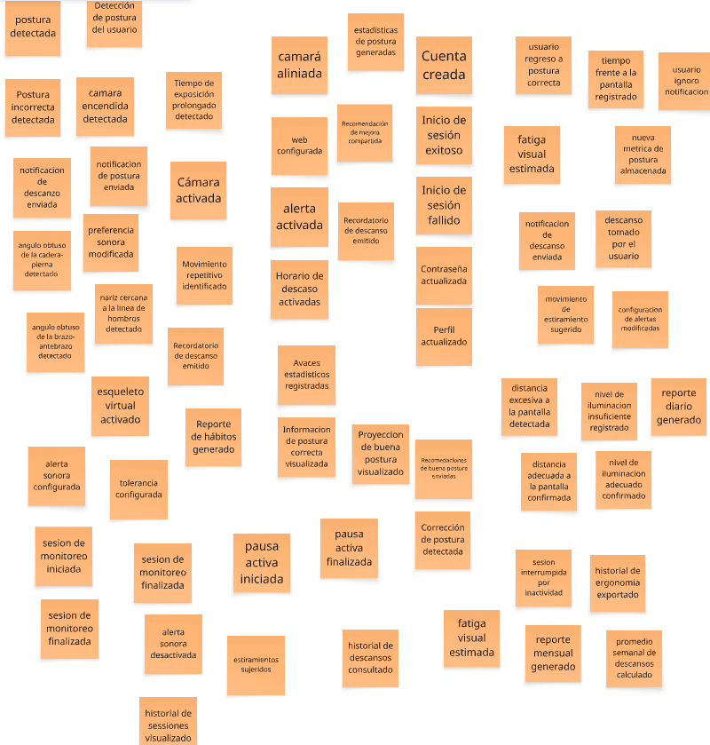

2.  Timelines
    Durante esta fase, los eventos identificados fueron agrupados en subgrupos liderados por un evento en general que encapsula la función principal del grupo.

    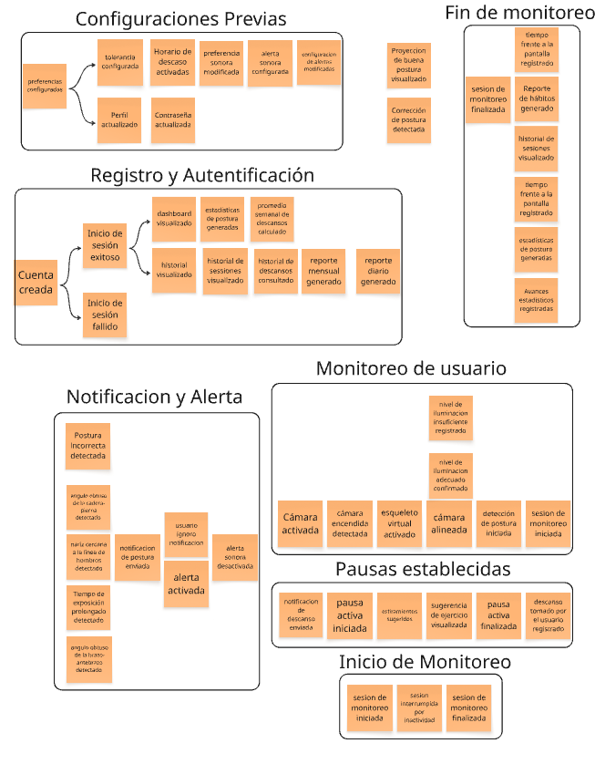

3.  Paint Points
    En este proceso, se identificaron paint points o puntos problemáticos, que son áreas donde los usuarios pueden experimentar dificultados o fricciones en su interacción con la aplicación. Estos puntos son cruciales para mejorar la experiencia del usuario y optimizar el diseño del sistema.

    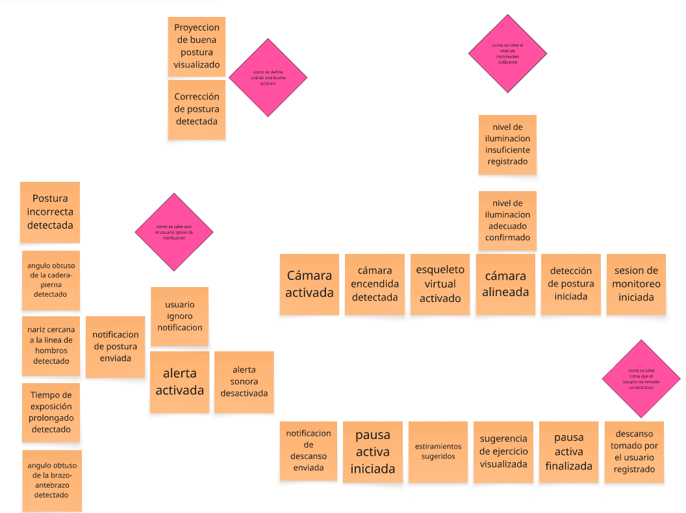

4.  Pivotal points
    Se señalaron los pivotal points o puntos clave, que son eventos críticos que marcan hitos improtantes en el flujo de la plataforma. Estos eventos tienden a ser significativos en el comportamiento del sistema o en la experiencia del usuario.

    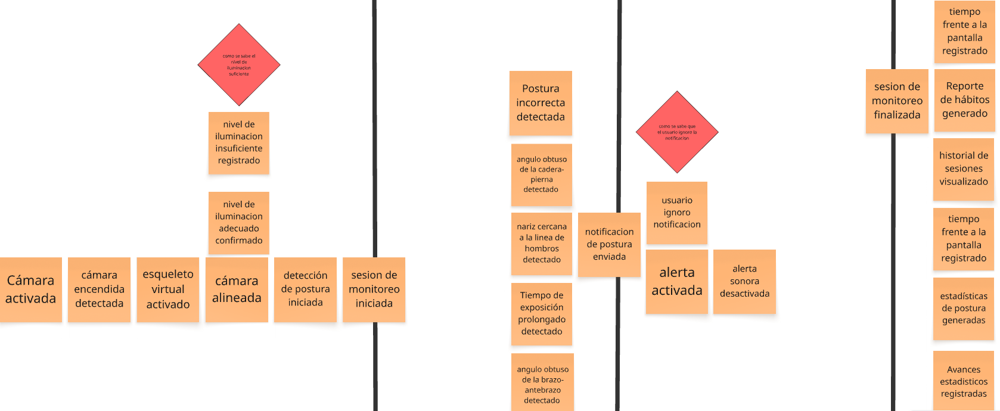

5.  Commands
    Cada evento se asoció a un comando en específico que lo desencadena y un actor que lo realiza. Esto ayudó a tener un mejor reconocimiento de cómo interactúan los diferentes usuarios con el sistema.

    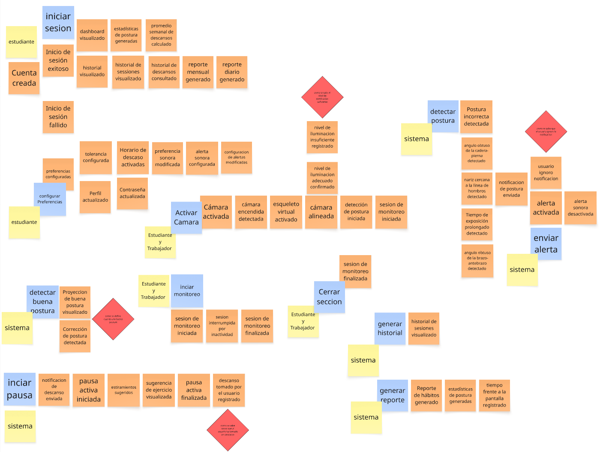

6.  Policies
    Durante esta etapa, se identifican las politicas relevantes para cada contexto del sistema. Estas politicas pueden incluir restricciones de negocio, reglas de validación, etc.

    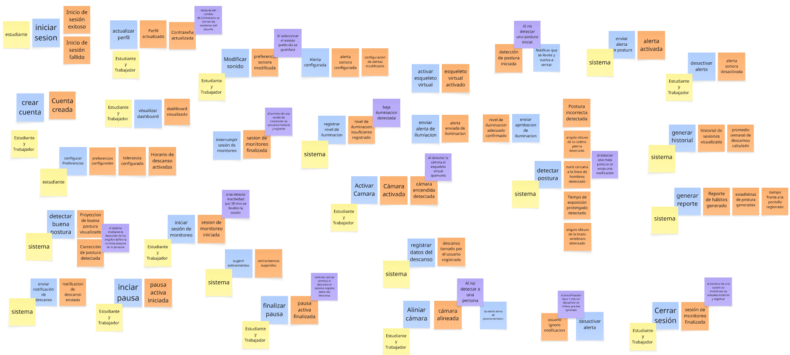

7.  Read Models
    Durante esta fase, se diseñan y desarrollan lso modelos de lectura para cada contexto de sistema, asegurando que proporcionen la información necesaria de manera eficiente y coherente.

    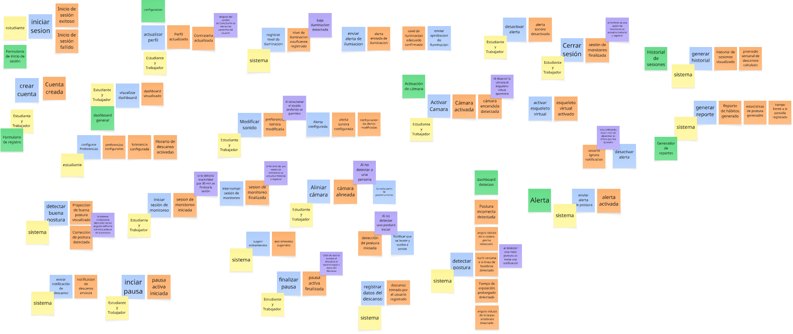

8.  External Systems
    Durante esta etapa, se identifican los sistemas externos relevantes para la plataforma y se establecen las interfaces necesarias para integrarlos de manera efectiva.

    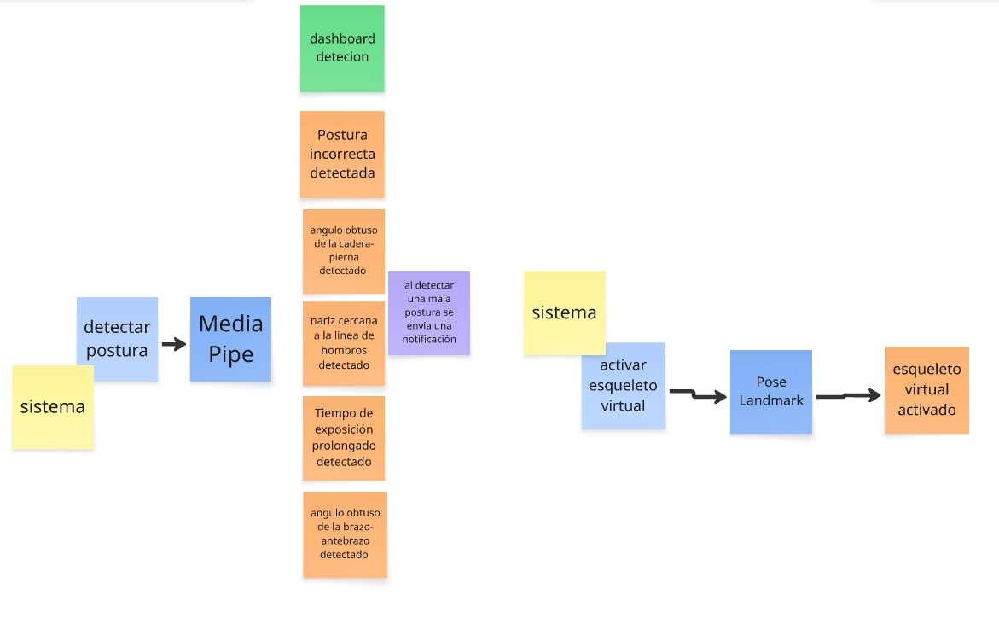

9.  Aggregates
    Durante esta etapa, se definen aggregates para cada contexto del sistema, asegurando que representen correctamente las transacciones y operaciones coherentes dentro del sistema.
    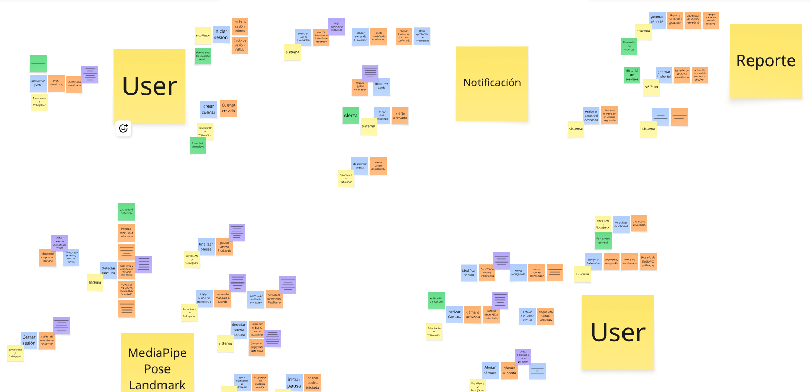

El enlace al Miro: [https://miro.com/app/board/uXjVJIOOJ5E=/](https://miro.com/app/board/uXjVJIOOJ5E=/).

#### 4.2.2 Candidate Context Discovery

A continuación, elegimos utilizar la técnica de start-with-value ya que el equipo de desarrollo decidió empezar por el valor de la aplicación (core), esto es importante para tener una mejor visión del producto.

- **Identificación de Valores del Negocio** : Analizamos los valores clave del negocio, como la experiencia del usuario al estar en su entorno de trabajo/estudio y monitorear su postura, la alertas/notificaciones y la eficiencia en la gestión de usuarios.
- **Identificación de Funcionalidades clave** : Identificar las funcionalidades esenciales de la aplicación, el monitoreo postura correcta, notificaciones/alertas y registro de su proceso que contribuyen directamente a la mejora de salud e eficioencia en su entorno.

**Candidate para Bounded Context: IAM**

Este contexto está encargado de manejar el ciclo de vida de los usuarios en la plataforma, desde el registro hasta la validación de credenciales y el acceso a la plataforma, de acuerdo con su rol, ya sea estudiante o trabajador remoto. Se cubren tres políticas clave: Política de Registro , Registro de Roles y Política de Autenticación.

Posibles responsabilidades del Bounded Context:

- Gestionar el registro y autenticación de usuarios.
- Definir y aplicar políticas de roles para asegurarse de que cada usuario tenga las capacidades correctas dentro del sistema.
- Proveer un sistema de validación de credenciales utilizando estándares de seguridad como JWT.
- Facilitar el acceso a la plataforma basado en los roles asignados al usuario al registrarse.

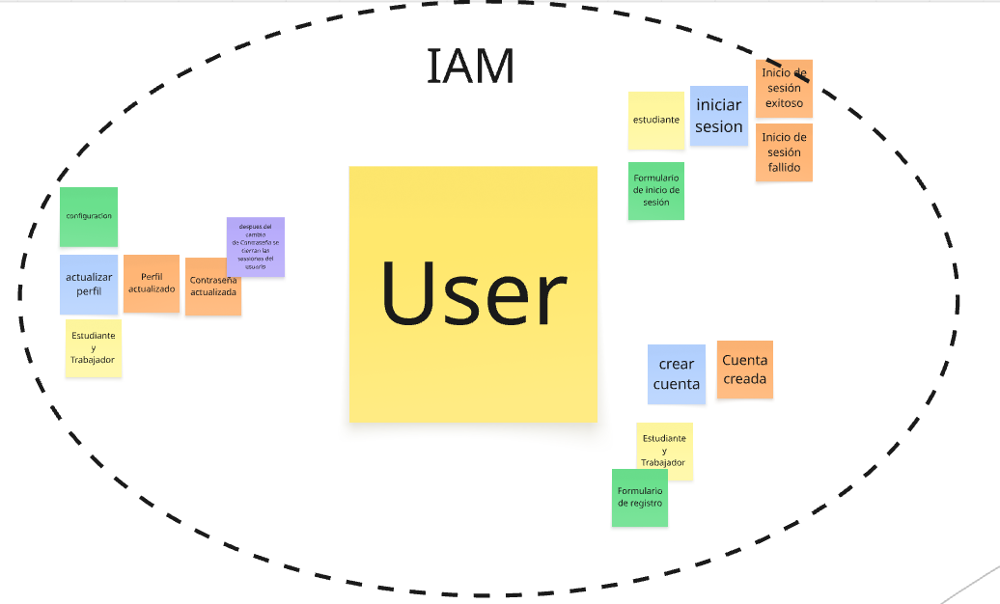

**Candidate para Bounded Context: Orquestrador**

Este contexto se encarga de administrar y coordinar las configuraciones externas a la plataforma, garantizando que los dispositivos y el entorno estén correctamente preparados para el monitoreo.

Posibles responsabilidades del Bounded Context:

- Gestionar la configuración de la cámara web (posición, encuadre, resolución).
- Ajustar la iluminación y otros parámetros del entorno que influyen en la detección postural.
- Coordinar la comunicación entre los distintos módulos (Monitoreo, Notificaciones, Estadísticas).

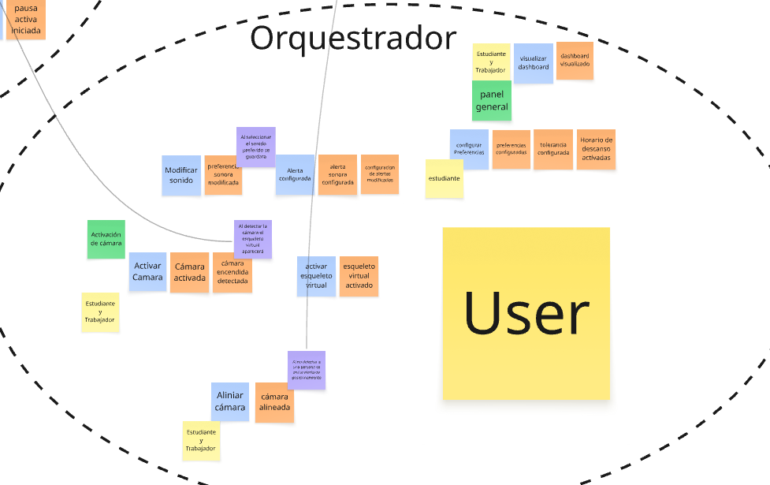

**Candidate para Bounded Context: Monitoreo**

Este contexto se encarga de supervisar en tiempo real la postura del usuario durante sus actividades frente a la estación de trabajo/estudio, utilizando modelos de visión por computadora.

Posibles responsabilidades del Bounded Context:

- Capturar datos de video y extraer puntos clave del cuerpo del usuario.
- Analizar la postura del usuario en función de umbrales de confort previamente definidos.
- Detectar desviaciones o malas posturas de forma continua.
- Registrar la evolución de la postura del usuario a lo largo de la sesión de trabajo.

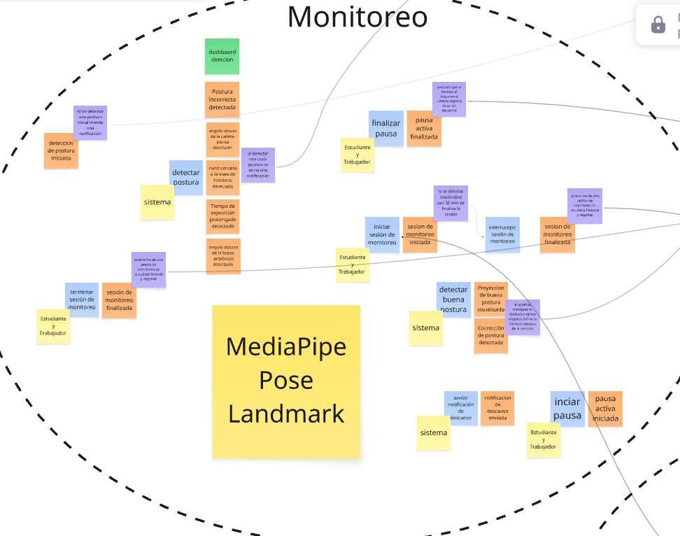

**Candidate para Bounded Context: Notificaciones**

Este contexto se encarga de alertar y comunicar al usuario cuando se detecta una postura inadecuada, ofreciendo recordatorios y sugerencias de corrección.

Posibles responsabilidades del Bounded Context:

- Emitir notificaciones en tiempo real al detectar malas posturas.
- Generar recordatorios de pausas activas o microdescansos.
- Adaptar la frecuencia e intensidad de las alertas según la severidad de la desviación postural.
- Permitir personalización de notificaciones (tono).

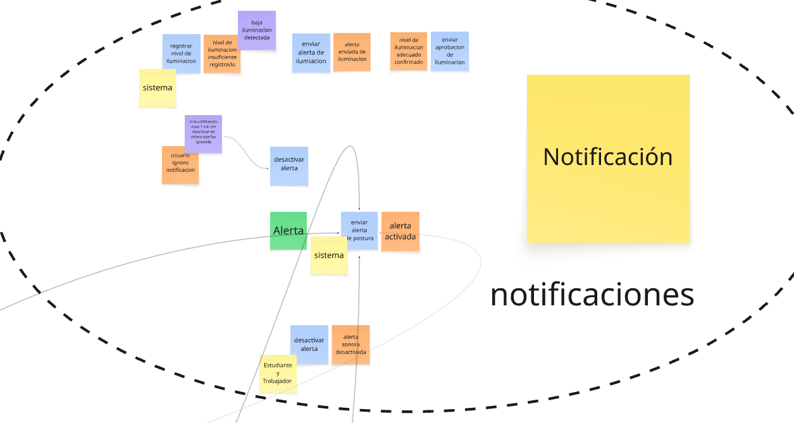

**Candidate para Bounded Context: Estadisticas**

Este contexto se encarga de recolectar, procesar y presentar métricas relacionadas con el comportamiento postural del usuario, con el fin de apoyar la mejora continua y la prevención de lesiones.

Posibles responsabilidades del Bounded Context:

- Generar reportes semanales o mensuales sobre la postura del usuario.
- Consolidar métricas de tiempo en buena/mala postura.
- Identificar patrones de riesgo o tendencias a lo largo del tiempo.
- Proveer visualizaciones de datos para el usuario y/o administradores.

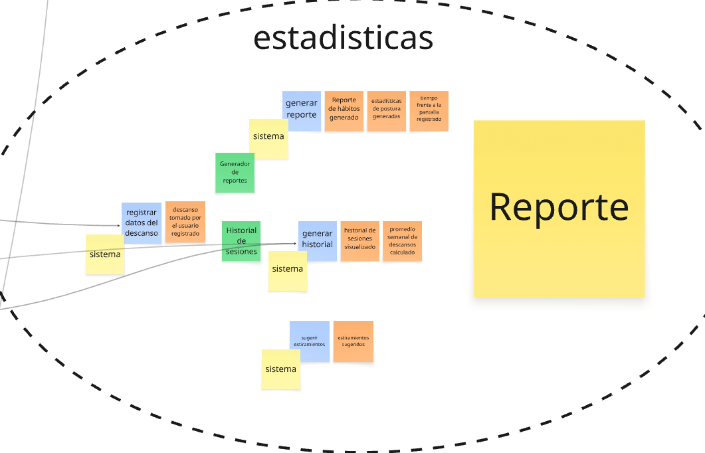

Vista completa:

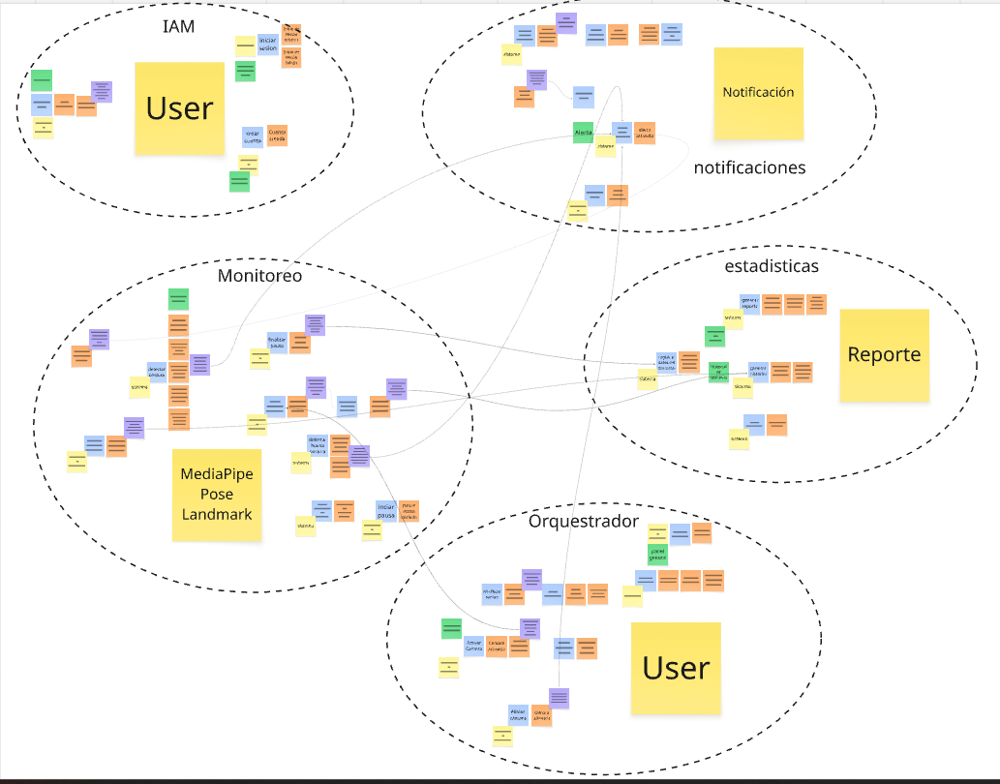

#### 4.2.3 Domain Message Flows Modeling

**Caso 1: Inicio de sesión y preparación del monitoreo**

1. El usuario ingresa sus credenciales en la aplicación.
2. El contexto IAM valida la identidad del usuario y emite el evento UsuarioAutenticado.
3. El contexto Orquestador recibe el evento y valida dependencias críticas (cámara, permisos de notificaciones, conexión).
4. El contexto Orquestador emite el evento SesionPreparada para iniciar la experiencia de monitoreo.
5. El contexto Monitoreo se activa y comienza la captura en tiempo real.

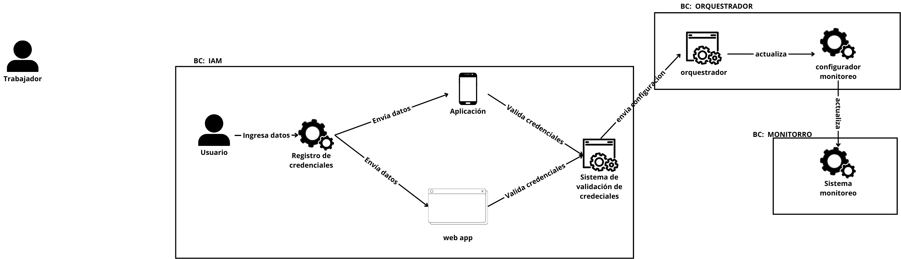

**Caso 2: Detección de mala postura en tiempo real**

1. El contexto Monitoreo detecta que la postura del usuario no es correcta.
2. El contexto Monitoreo emite el evento MalaPosturaDetectada.
3. El contexto Notificaciones recibe el evento y genera un recordatorio visual o sonoro.
4. El usuario recibe la notificación y corrige su postura.
5. El contexto Estadísticas registra la detección y actualización del estado postural.

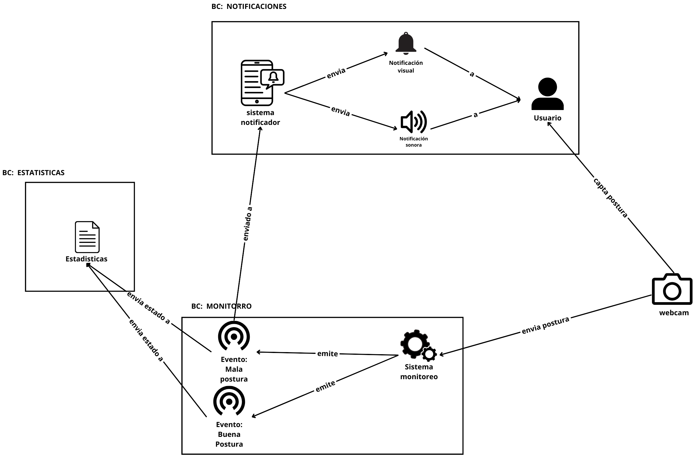

**Caso 3: Generación de reportes de progreso**

1. El usuario consulta su historial de desempeño.
2. El contexto Estadísticas solicita datos del contexto Monitoreo (posturas detectadas, tiempo de corrección, frecuencia de errores).
3. El contexto Estadísticas procesa la información y genera métricas de evolución.
4. El usuario recibe un reporte gráfico con patrones y recomendaciones.

**Caso 4: Recordatorio de pausa activa**

1. El usuario ha permanecido frente a la computadora por un tiempo prolongado.
2. El contexto Estadísticas detecta el exceso de tiempo y genera el evento PausaRecomendada.
3. El contexto Notificaciones recibe el evento y envía un recordatorio para realizar ejercicios o un descanso.
4. El usuario toma la pausa y el contexto Estadísticas registra el cumplimiento.

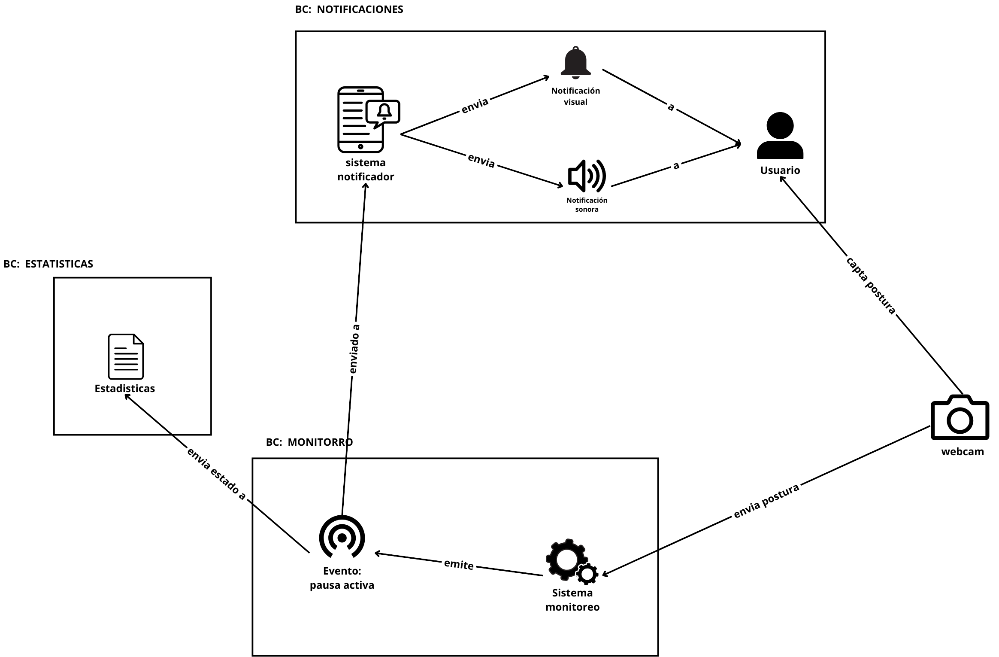

**Caso 5: Personalización del sistema**

1. El usuario ajusta la sensibilidad de detección en la aplicación.
2. El contexto Orquestador recibe los nuevos parámetros de configuración.
3. El contexto Orquestador envía las configuraciones actualizadas al contexto Monitoreo.
4. El contexto Monitoreo adapta sus umbrales de IA según las preferencias del usuario.

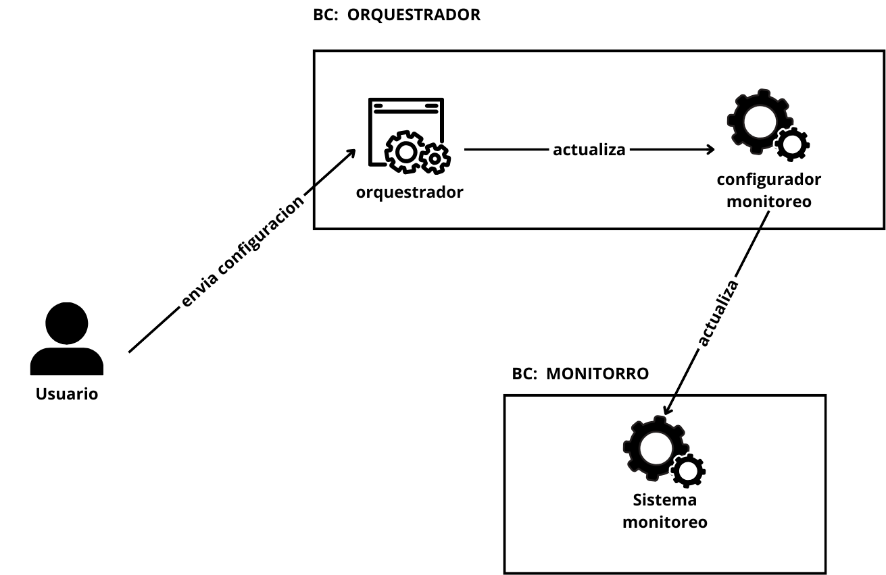

#### 4.2.4 Bounded Context Canvases

**Estadísticas**

El diseño del bounded context se centra en proporcionar visibilidad del comportamiento postural de los usuarios a través de métricas y reportes. Al ser parte del dominio Core, el valor del sistema depende en gran medida de la capacidad de ofrecer retroalimentación clara y confiable que permita prevenir problemas de salud relacionados con la ergonomía. La solución está orientada a consolidar datos de monitoreo en información útil y visualizaciones que promuevan la mejora continua.

1. **Propósito (Purpose):**

El contexto está diseñado para gestionar la recolección, procesamiento y visualización de estadísticas posturales, permitiendo a los usuarios conocer su comportamiento a lo largo del tiempo y tomar decisiones que favorezcan una postura saludable.

2. **Clasificación Estratégica (Strategic Classification):**

- **Dominio:** Core, ya que la interpretación de los datos de monitoreo es fundamental para cumplir con el objetivo del sistema: mejorar la salud postural de los usuarios.
- **Modelo de Negocio:** Funciona como un decision enabler, al transformar datos en información que guía la prevención de riesgos.
- **Evolución:** Clasificado como custom build, ya que las métricas y reportes deben adaptarse al contexto específico del monitoreo ergonómico y a las necesidades de usuarios remotos.

3. **Roles del Dominio (Domain Roles):**

El contexto actúa bajo el rol de Analytical Context, donde los usuarios consumen reportes y visualizaciones para comprender patrones de comportamiento y tendencias relacionadas con su postura.

4. **Comunicación Entrante (Inbound Communication):**

Los datos provienen principalmente de los módulos de **Monitoreo** e **IAM**.
Mensajes clave entrantes:

- Posture session data
- Metrics request
- User identification

5. **Comunicación Saliente (Outbound Communication):**

El sistema genera salidas hacia el **Frontend** y potencialmente al módulo de **Notificaciones**.
Mensajes clave salientes:

- Statistics report generated
- Trend visualization ready
- Risk pattern identified

6. **Lenguaje Ubicuo (Ubiquitous Language):**

- **Métrica (Metric):** Valor cuantitativo que refleja un aspecto del comportamiento postural.
- **Reporte (Report):** Resumen visual o textual de las métricas en un período definido.
- **Tendencia (Trend):** Variación de una métrica en el tiempo.
- **Sesión (Session):** Intervalo en el que se recopilan datos de monitoreo postural.

7. **Decisiones de Negocio (Business Decisions):**

- Los reportes deben segmentarse en diferentes períodos (día, semana, mes).
- Los datos históricos se deben preservar para comparación a largo plazo.
- Solo los usuarios autenticados pueden acceder a sus propias estadísticas.
- La detección de tendencias de riesgo debe generar recomendaciones preventivas.

8. **Suposiciones (Assumptions):**

- Los datos de monitoreo son confiables y están previamente validados.
- Los reportes generados son utilizados activamente por los usuarios para mejorar su postura.
- El sistema debe ser capaz de manejar un volumen creciente de datos históricos.

9. Métricas de Verificación (Verification Metrics):

El éxito del contexto se medirá por:

- El número de reportes generados y consultados por los usuarios.
- El nivel de interacción de los usuarios con las visualizaciones de tendencias.
- La reducción de alertas por malas posturas a lo largo del tiempo (como efecto indirecto).
- La satisfacción de los usuarios con la claridad y utilidad de los reportes generados.

 

**Orquestador**

El diseño del bounded context se centra en garantizar que todas las dependencias, configuraciones y recursos necesarios estén alineados y listos antes de iniciar el monitoreo postural en tiempo real. Al ser parte del dominio Core, su valor radica en asegurar la preparación del sistema, evitando fallos operativos y mejorando la fiabilidad del proceso de detección. La solución está orientada a coordinar validaciones previas que permitan un inicio de sesión fluido y sin interrupciones.

1. **Propósito (Purpose):**

El contexto está diseñado para coordinar y validar dependencias, configuraciones y recursos (como cámara y notificaciones) antes de iniciar el monitoreo postural, asegurando que el sistema funcione correctamente desde el primer momento.

2. **Clasificación Estratégica (Strategic Classification):**

 - **Dominio:** Core, ya que la preparación del sistema es fundamental para el éxito del monitoreo postural.

 - **Modelo de Negocio:** Actúa como un enabler, asegurando que las condiciones previas estén listas y sincronizadas.

 - **Evolución:** Clasificado como custom build, porque las validaciones y configuraciones deben adaptarse al contexto específico del sistema.

3. **Roles del Dominio (Domain Roles):**

El contexto cumple el rol de Orchestrator Context, coordinando y confirmando configuraciones antes de que comience el monitoreo en tiempo real.

4. **Comunicación Entrante (Inbound Communication):**

Los mensajes provienen de módulos de soporte y del usuario.

Mensajes clave entrantes:

 - Configuration preferences set

 - Camera status check

5. **Comunicación Saliente (Outbound Communication):**

El sistema envía información hacia el módulo de Monitoreo y Notificaciones.

Mensajes clave salientes:

 - Configurations ready

 - Camera enabled

6. **Lenguaje Ubicuo (Ubiquitous Language):**

 - Preferencia Sonora (Sound Preference): Configuración de alertas auditivas definidas por el usuario.

 - Alineación de Cámara (Camera Alignment): Estado correcto de la cámara frente al esqueleto virtual.

 - Esqueleto Virtual (Virtual Skeleton): Representación digital del usuario necesaria para validar la cámara.

 - Orquestador (Orchestrator): Módulo que centraliza y confirma las dependencias y configuraciones antes del inicio del monitoreo.

7. **Decisiones de Negocio (Business Decisions):**

 - El monitoreo no puede comenzar si la cámara no está alineada.

 - Las preferencias del usuario deben estar confirmadas antes de la sesión.

 - Todas las dependencias deben estar sincronizadas en tiempo real.

 - El sistema debe notificar al usuario cuando todo esté listo para iniciar.

8. **Suposiciones (Assumptions):**

 - La cámara estará disponible y alineada.

 - El usuario confirma sus configuraciones previas antes de iniciar.

 - Los módulos de soporte responden sin fallos.

Métricas de Verificación (Verification Metrics):

9. **El éxito del contexto se medirá por:**

 - El porcentaje de sesiones iniciadas sin errores de configuración.

 - El tiempo promedio requerido para validar configuraciones y comenzar el monitoreo.

 - La reducción de fallos en la ejecución debido a configuraciones incompletas.

 - El nivel de satisfacción de los usuarios respecto a la preparación del sistema.

 

**IAM (Identity and Access Management)**

El diseño del bounded context IAM se centra en gestionar la identificación y autenticación de los usuarios de la plataforma, asegurando que cada interacción esté apropiada para cada usuario/contexto. Este contexto maneja identidades verificadas y permisos de acceso.

1. **Propósito (Purpose):** El contexto está diseñado para gestionar la identificación y autenticación de usuarios, asegurando que solo usuarios autorizados puedan acceder a los recursos del sistema y manteniendo la seguridad de las sesiones.

2. **Clasificación Estratégica (Strategic Classification):**
   - **Dominio:** Support, ya que proporciona servicios de autenticación y autorización necesarios para el funcionamiento del sistema.
   - **Modelo de Negocio:** Funciona como compliance enforcer, garantizando que el acceso a los recursos se realice de manera segura y controlada.
   - **Evolución:** Clasificado como commodity, utilizando patrones estándar de autenticación y autorización.

3. **Roles del Dominio (Domain Roles):** El contexto actúa bajo el rol de Gateway Context, controlando el acceso y validando credenciales antes de permitir interacciones con otros contextos del sistema.

4. **Comunicación Entrante (Inbound Communication):** Los datos provienen de las interfaces de usuario y otros contextos que requieren validación. Mensajes clave entrantes:
   - Login request
   - Token validation request
   - User registration request

5. **Comunicación Saliente (Outbound Communication):** El sistema genera tokens de autenticación y respuestas de autorización hacia otros contextos. Mensajes clave salientes:
   - Authentication token issued
   - Access granted/denied
   - User session established

6. **Lenguaje Ubicuo (Ubiquitous Language):**
   - **Usuario:** Entidad que interactúa con la plataforma (cliente, mecánico, visitante, técnico).
   - **Rol:** Conjunto de permisos asignados a un usuario (ej. admin, mecánico, cliente).
   - **Sesión:** Período activo de interacción entre el usuario autenticado y la plataforma.
   - **Permiso:** Autorización para realizar acciones.

7. **Decisiones de Negocio (Business Decisions):**
   - Todos los usuarios deben tener una identidad única asociada a un correo o número de referencia.
   - Un usuario puede decidir si mayor/menor acceso sin restricción.
   - Los roles determinan los permisos de acceso a cada contexto.
   - Las sesiones expiran automáticamente por inactividad o al llegar a un tiempo máximo definido.

8. **Suposiciones (Assumptions):**
   - Los usuarios proporcionan información de registro válida.
   - Las credenciales se almacenan de forma segura y encriptada.
   - El sistema debe manejar múltiples sesiones concurrentes por usuario.

9. **Métricas de Verificación (Verification Metrics):** El éxito del contexto se medirá por:
   - Tiempo de respuesta de autenticación menor a 2 segundos.
   - Tasa de éxito en la validación de credenciales superior al 99%.
   - Número de intentos de acceso no autorizado bloqueados.
   - Disponibilidad del servicio de autenticación superior al 99.9%.

**Monitoreo**

El diseño del bounded context Monitoreo se centra en la gestión del usuario durante su sesión de trabajo, mediante el uso de inteligencia artificial (IA) y una cámara web para detectar malas posturas.

1. **Propósito (Purpose):** Monitorear en tiempo real la postura del usuario durante su sesión mediante inteligencia artificial y una cámara web, detectando malas posturas para prevenir problemas de salud relacionados con la ergonomía.

2. **Clasificación Estratégica (Strategic Classification):**
   - **Dominio:** Core, ya que la detección y análisis de posturas es fundamental para el propósito principal del sistema.
   - **Modelo de Negocio:** Funciona como innovation differentiator, proporcionando valor único a través de la detección automática de posturas.
   - **Evolución:** Clasificado como custom build, ya que requiere desarrollo específico de algoritmos de IA para análisis postural.

3. **Roles del Dominio (Domain Roles):** El contexto actúa como Processing Context, donde se procesan datos de video para generar información sobre la postura del usuario en tiempo real.

4. **Comunicación Entrante (Inbound Communication):** Los datos provienen de cámaras web y sensores del dispositivo del usuario. Mensajes clave entrantes:
   - Video stream data
   - Session start/stop commands
   - User calibration data

5. **Comunicación Saliente (Outbound Communication):** El sistema envía resultados del análisis hacia **Notificaciones** y **Estadísticas**. Mensajes clave salientes:
   - Posture analysis completed
   - Bad posture detected
   - Session monitoring data

6. **Lenguaje Ubicuo (Ubiquitous Language):**
   - **Landmarks Corporales:** Los puntos clave del cuerpo utilizados para detectar posturas (cabeza, hombros, espalda).
   - **Pausa Activa:** Interrupción manual o programada del monitoreo.
   - **Sesión de Monitoreo:** Período durante el cual el sistema analiza la postura del usuario.
   - **Procesamiento Local:** Análisis en el dispositivo sin envío de datos externos.
   - **Umbral Probabilístico:** Nivel de confianza mínimo para considerar una detección de postura válida.

7. **Decisiones de Negocio (Business Decisions):**
   - Una sesión de monitoreo solo puede iniciarse con acceso autenticado a la cámara.
   - Una postura solo será análisis para ser reportada para detectar una incidencia.
   - El análisis postural debe ser en tiempo real mediante un procesamiento streaming.
   - El procesamiento de video debe ocurrir localmente por privacidad streaming.

8. **Suposiciones (Assumptions):**
   - Los usuarios tienen acceso a una cámara web funcional.
   - La iluminación del entorno es suficiente para el análisis.
   - Los modelos de IA son precisos en la detección de posturas.
   - El dispositivo del usuario tiene capacidad de procesamiento suficiente.

9. **Métricas de Verificación (Verification Metrics):** El éxito del contexto se medirá por:
   - Precisión en la detección de posturas superior al 90%.
   - Latencia de procesamiento menor a 100ms.
   - Disponibilidad del servicio de monitoreo superior al 95%.
   - Satisfacción del usuario con la precisión de las detecciones.

**Notificaciones**

El diseño del bounded context Notificaciones se centra únicamente en gestionar la comunicación entre la plataforma y los usuarios, asegurando que reciban alertas, recordatorios y actualizaciones pertinentes en el momento adecuado.

1. **Propósito (Purpose):** Gestionar la comunicación entre la plataforma y los usuarios, enviando notificaciones push, correos electrónicos, SMS y otros métodos de comunicación para mantener a los usuarios informados sobre alertas críticas y recordatorios.

2. **Clasificación Estratégica (Strategic Classification):**
   - **Dominio:** Support, ya que facilita la comunicación pero no es parte del core business del monitoreo postural.
   - **Modelo de Negocio:** Funciona como engagement driver, manteniendo a los usuarios conectados y conscientes de su comportamiento postural.
   - **Evolución:** Clasificado como commodity/product, utilizando servicios estándar de notificación disponibles en el mercado.

3. **Roles del Dominio (Domain Roles):** El contexto actúa como Communication Context, distribuyendo información relevante a los usuarios a través de múltiples canales de comunicación.

4. **Comunicación Entrante (Inbound Communication):** Los datos provienen principalmente de **Monitoreo** y **Estadísticas**. Mensajes clave entrantes:
   - Bad posture alert triggered
   - Report generation completed
   - User threshold exceeded

5. **Comunicación Saliente (Outbound Communication):** El sistema envía notificaciones a través de múltiples canales hacia los usuarios. Mensajes clave salientes:
   - Push notification sent
   - Email notification delivered

6. **Lenguaje Ubicuo (Ubiquitous Language):**
   - **Notificación:** Mensaje enviado a un usuario por la plataforma.
   - **Alerta:** Notificación de alta prioridad (ej. postura crítica).
   - **Recordatorio:** Notificación programada para reforzar hábitos (ej. descansar cada 45 min).
   - **Preferencias:** Configuración elegida por el usuario sobre qué mensajes recibe.

7. **Decisiones de Negocio (Business Decisions):**
   - Todo mensaje debe estar asociado a un usuario autenticado y activo.
   - El usuario puede configurar la frecuencia y tipo de notificaciones que desea recibir.
   - Las alertas críticas tienen prioridad sobre los recordatorios.
   - Las notificaciones deben personalizarse en el historial del usuario.

8. **Suposiciones (Assumptions):**
   - Los usuarios tienen dispositivos capaces de recibir notificaciones.
   - Los servicios de notificación externos están disponibles.
   - Los usuarios revisan y actúan sobre las notificaciones recibidas.
   - El sistema puede acceder a los canales de comunicación necesarios.

9. **Métricas de Verificación (Verification Metrics):** El éxito del contexto se medirá por:
   - Tasa de entrega exitosa de notificaciones superior al 95%.
   - Tiempo de entrega de notificaciones críticas menor a 30 segundos.
   - Tasa de apertura de notificaciones por parte de los usuarios.
   - Reducción en comportamientos de riesgo postural tras recibir alertas.

#### 4.2.5 Context Mapping

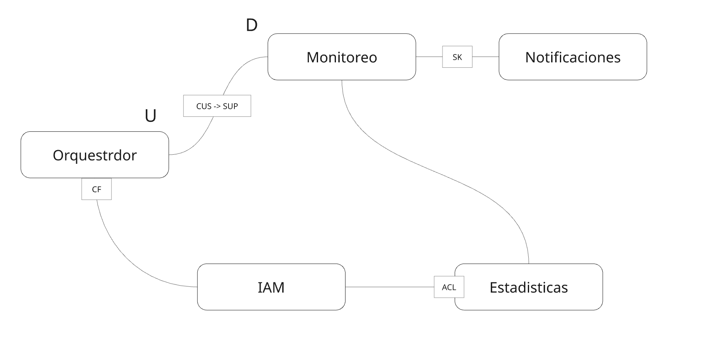

### 4.3 Software Architecture

#### 4.3.1 Software Architecture System Landscape Diagram

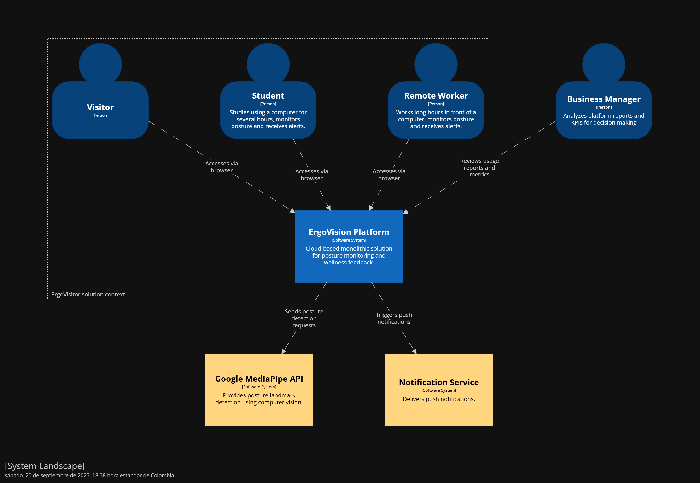

#### 4.3.2 Software Architecture Context Level Diagrams

#### 4.3.3 Software Architecture Container Level Diagrams

#### 4.3.4 Software Architecture Deployment Diagrams

## Capítulo V: Tactical-Level Software Design

### 5.1 Bounded Context: Orquestrador
#### 5.1.1 Domain Layer

En la **Capa de Dominio** del Bounded Context de **Orquestrador (Orchestrator)**, los principales agregados son `AlertSetting`, `PostureSetting`, y `Calibration`. Estos encapsulan los conceptos de negocio necesarios para gestionar la configuración y calibración del sistema de monitoreo postural: configuraciones de alertas, ajustes de detección postural y parámetros de calibración personalizados.

La lógica de dominio para el manejo de configuraciones y calibraciones se concentra en servicios de dominio especializados que aplican las reglas de negocio relacionadas con la gestión de preferencias del usuario, validación de parámetros de calibración y consistencia en las configuraciones del sistema.

Agregado `AlertSetting`

Descripción: Gestiona la configuración de alertas del monitoreo.

| Atributo             | Tipo    | Visibilidad | Descripción                                                   |
|----------------------|---------|-------------|---------------------------------------------------------------|
| id                   | Long    | Privado     | Identificador único de la configuración.                      |
| visualAlertsEnabled  | Boolean | Privado     | Indica si las alertas visuales están habilitadas.             |
| soundAlertsEnabled   | Boolean | Privado     | Indica si las alertas sonoras están habilitadas.              |
| alertVolume          | Integer | Privado     | Volumen de las alertas sonoras (0-100).                       |
| alertInterval        | Integer | Privado     | Intervalo entre alertas consecutivas (segundos).              |
| createdAt            | Date    | Privado     | Fecha de creación del registro.                               |
| updatedAt            | Date    | Privado     | Fecha de última actualización.                                |

| Método                             | Tipo de Retorno | Visibilidad | Descripción                        |
|------------------------------------|-----------------|-------------|------------------------------------|
| enableVisualAlerts()               | void            | Público     | Habilita las alertas visuales.     |
| disableVisualAlerts()              | void            | Público     | Deshabilita las alertas visuales.  |
| enableSoundAlerts()                | void            | Público     | Habilita las alertas sonoras.      |
| disableSoundAlerts()               | void            | Público     | Deshabilita las alertas sonoras.   |
| adjustVolume(Integer volume)       | void            | Público     | Ajusta el volumen (0-100).         |
| setAlertInterval(Integer interval) | void            | Público     | Define el intervalo entre alertas. |

Agregado `PostureSetting`

Descripción: Configura los parámetros de detección postural.

| Atributo               | Tipo    | Visibilidad | Descripción                                                   |
|------------------------|---------|-------------|---------------------------------------------------------------|
| id                     | Long    | Privado     | Identificador único de la configuración.                      |
| postureSensitivity     | Integer | Privado     | Sensibilidad general de detección (0-100).                    |
| shoulderAngleThreshold | Integer | Privado     | Umbral angular para detección de hombros.                     |
| headAngleThreshold     | Integer | Privado     | Umbral angular para detección de cabeza.                      |
| samplingFrequency      | Integer | Privado     | Frecuencia de muestreo (segundos).                            |
| showSkeleton           | Boolean | Privado     | Muestra/oculta el esqueleto en la interfaz.                   |
| createdAt              | Date    | Privado     | Fecha de creación del registro.                               |
| updatedAt              | Date    | Privado     | Fecha de última actualización.                                |

| Método                              | Tipo de Retorno | Visibilidad | Descripción                                      |
|-------------------------------------|-----------------|-------------|--------------------------------------------------|
| adjustSensitivity(Integer level)    | void            | Público     | Ajusta la sensibilidad de detección.             |
| setShoulderThreshold(Integer angle) | void            | Público     | Define umbral angular para hombros.              |
| setHeadThreshold(Integer angle)     | void            | Público     | Define umbral angular para cabeza.               |
| setSamplingFrequency(Integer freq)  | void            | Público     | Establece frecuencia de muestreo.                |
| toggleSkeletonVisibility()          | void            | Público     | Alterna visibilidad del esqueleto.               |

Agregado `Calibration`

Descripción: Almacena y gestiona los resultados de calibración del usuario.

| Atributo           | Tipo               | Visibilidad | Descripción                                                   |
|--------------------|--------------------|-------------|---------------------------------------------------------------|
| id                 | Long               | Privado     | Identificador único de la calibración.                        |
| userId             | Long               | Privado     | Identificador del usuario asociado.                           |
| calibrationDate    | Date               | Privado     | Fecha de realización de la calibración.                       |
| referenceLandmarks | ReferenceLandmarks | Privado     | Puntos de referencia corporales establecidos.                 |
| postureThresholds  | PostureThresholds  | Privado     | Umbrales posturales personalizados.                           |
| cameraDistance     | Float              | Privado     | Distancia estimada a la cámara.                               |
| cameraVisibility   | Integer            | Privado     | Nivel de visibilidad de la cámara (0-100).                    |
| cameraResolution   | String             | Privado     | Resolución de cámara utilizada.                               |
| calibrationScore   | Integer            | Privado     | Puntuación de calidad de calibración (0-100).                 |
| createdAt          | Date               | Privado     | Fecha de creación del registro.                               |
| updatedAt          | Date               | Privado     | Fecha de última actualización.                                |

| Método                                                  | Tipo de Retorno | Visibilidad | Descripción                             |
|---------------------------------------------------------|-----------------|-------------|-----------------------------------------|
| updateLandmarks(ReferenceLandmarks landmarks)           | void            | Público     | Actualiza los puntos de referencia.     |
| adjustThresholds(PostureThresholds thresholds)          | void            | Público     | Modifica los umbrales posturales.       |
| setCameraParameters(Float distance, Integer visibility) | void            | Público     | Configura parámetros de cámara.         |
| validateCalibration()                                   | Boolean         | Público     | Valida la integridad de la calibración. |

Entidad `ReferenceLandmarks`

Descripción: Representa los puntos de referencia corporales para calibración.

| Atributo  | Tipo           | Visibilidad | Descripción                           |
|-----------|----------------|-------------|---------------------------------------|
| landmarks | List<Landmark> | Privado     | Colección de puntos clave del cuerpo. |

Objeto de Valor `Landmark`

Descripción: Representa un punto clave del cuerpo en el espacio 3D.

| Atributo   | Tipo    | Descripción                             |
|------------|---------|-----------------------------------------|
| x          | Integer | Coordenada X en el espacio.             |
| y          | Integer | Coordenada Y en el espacio.             |
| z          | Integer | Coordenada Z en el espacio.             |
| visibility | Integer | Nivel de visibilidad/confianza (0-100). |

Objeto de Valor `PostureThresholds`

Descripción: Define los umbrales angulares para detección de postura.

| Atributo      | Tipo    | Descripción                          |
|---------------|---------|--------------------------------------|
| shoulderAngle | Integer | Umbral para ángulo de hombros.       |
| neckAngle     | Integer | Umbral para ángulo de cuello.        |
| backAngle     | Integer | Umbral para ángulo de espalda.       |
| headTilt      | Integer | Umbral para inclinación de cabeza.   |

Servicio de Dominio: `AlertsSettingCommandService`

Descripción: Gestiona las operaciones de escritura para configuraciones de alertas.

| Método                                       | Tipo de Retorno | Descripción                                               |
|----------------------------------------------|-----------------|-----------------------------------------------------------|
| handle(CreateAlertsSettingCommand command)   | void            | Crea una nueva configuración de alertas.                  |
| handle(UpdateAlertsSettingCommand command)   | void            | Actualiza una configuración existente.                    |
| handle(DeleteAlertsSettingCommand command)   | void            | Elimina una configuración de alertas.                     |

Servicio de Dominio: `PostureSettingCommandService`

Descripción: Gestiona las operaciones de escritura para configuraciones posturales.

| Método                                        | Tipo de Retorno | Descripción                                               |
|-----------------------------------------------|-----------------|-----------------------------------------------------------|
| handle(CreatePostureSettingCommand command)   | void            | Crea una nueva configuración postural.                    |
| handle(UpdatePostureSettingCommand command)   | void            | Actualiza una configuración existente.                    |
| handle(DeletePostureSettingCommand command)   | void            | Elimina una configuración postural.                       |

Servicio de Dominio: `CalibrationCommandService`

Descripción: Gestiona las operaciones de escritura para calibraciones.

| Método                                   | Tipo de Retorno | Descripción                                       |
|------------------------------------------|-----------------|---------------------------------------------------|
| handle(CreateCalibrationCommand command) | void            | Crea una nueva calibración.                       |
| handle(UpdateCalibrationCommand command) | void            | Actualiza una calibración existente.              |
| handle(DeleteCalibrationCommand command) | void            | Elimina una calibración.                          |

Servicio de Dominio: `AlertsSettingQueryService`

Descripción: Gestiona las consultas de configuraciones de alertas.

| Método                                 | Tipo de Retorno | Descripción                                       |
|----------------------------------------|-----------------|---------------------------------------------------|
| handle(GetUserAlertSettingQuery query) | AlertSetting    | Recupera la configuración de alertas del usuario. |

Servicio de Dominio: `PostureSettingQueryService`

Descripción: Gestiona las consultas de configuraciones posturales.

| Método                                   | Tipo de Retorno | Descripción                                     |
|------------------------------------------|-----------------|-------------------------------------------------|
| handle(GetUserPostureSettingQuery query) | PostureSetting  | Recupera la configuración postural del usuario. |

Servicio de Dominio: `CalibrationQueryService`

Descripción: Gestiona las consultas de calibraciones.

| Método                                | Tipo de Retorno | Descripción                          |
|---------------------------------------|-----------------|--------------------------------------|
| handle(GetUserCalibrationQuery query) | Calibration     | Recupera la calibración del usuario. |

#### 5.1.2 Interface Layer

En la **Capa de Interfaz** del Bounded Context de **Orquestrador (Orchestrator)**, se exponen los controladores `AlertsSettingController`, `PostureSettingController` y `CalibrationController`, los cuales ofrecen endpoints RESTful para la gestión integral de configuraciones y calibraciones del sistema. Estos endpoints permiten al frontend obtener y modificar las configuraciones personalizadas de alertas, ajustes posturales y parámetros de calibración que son fundamentales para el correcto funcionamiento del monitoreo postural.

**Justificación:**

Esta capa sirve como puente entre la interfaz de usuario y la lógica de negocio del sistema de orquestración, proporcionando una API robusta y segura para la personalización completa de la experiencia de monitoreo. Permite desacoplar la configuración del usuario del núcleo de monitoreo, facilitando la integración con otros bounded contexts como Monitoring (para aplicar configuraciones) y User Management (para la gestión de perfiles). Gracias a esta capa, se garantiza la consistencia en las configuraciones, la trazabilidad de los cambios y la capacidad de personalización que requiere el sistema para adaptarse a las necesidades específicas de cada usuario.

Controlador: `AlertsSettingController`

| Método               | Verbo HTTP | Ruta                                                    | Descripción                                              |
|----------------------|------------|---------------------------------------------------------|----------------------------------------------------------|
| getAlertsSetting     | GET        | /api/v1/orchestrator/alerts-settings/{userId}           | Obtiene la configuración de alertas del usuario          |
| createAlertsSetting  | POST       | /api/v1/orchestrator/alerts-settings                    | Crea una nueva configuración de alertas                  |
| updateAlertsSetting  | PUT        | /api/v1/orchestrator/alerts-settings/{settingId}        | Actualiza la configuración de alertas existente          |
| deleteAlertsSetting  | DELETE     | /api/v1/orchestrator/alerts-settings/{settingId}        | Elimina la configuración de alertas                      |

Controlador: `PostureSettingController`

| Método                | Verbo HTTP | Ruta                                                     | Descripción                                              |
|-----------------------|------------|----------------------------------------------------------|----------------------------------------------------------|
| getPostureSetting     | GET        | /api/v1/orchestrator/posture-settings/{userId}           | Obtiene la configuración postural del usuario            |
| createPostureSetting  | POST       | /api/v1/orchestrator/posture-settings                    | Crea una nueva configuración postural                    |
| updatePostureSetting  | PUT        | /api/v1/orchestrator/posture-settings/{settingId}        | Actualiza la configuración postural existente            |
| deletePostureSetting  | DELETE     | /api/v1/orchestrator/posture-settings/{settingId}        | Elimina la configuración postural                        |

Controlador: `CalibrationController`

| Método             | Verbo HTTP | Ruta                                               | Descripción                                      |
|--------------------|------------|----------------------------------------------------|--------------------------------------------------|
| getUserCalibration | GET        | /api/v1/orchestrator/calibrations/{userId}         | Obtiene la calibración del usuario               |
| createCalibration  | POST       | /api/v1/orchestrator/calibrations                  | Crea una nueva calibración                       |
| updateCalibration  | PUT        | /api/v1/orchestrator/calibrations/{calibrationId}  | Actualiza la calibración existente               |
| deleteCalibration  | DELETE     | /api/v1/orchestrator/calibrations/{calibrationId}  | Elimina la calibración                           |

#### 5.1.3 Application Layer

En el **Application Layer** del Bounded Context de **Orquestrador (Orchestrator)** se implementan los servicios de aplicación que orquestan los casos de uso principales relacionados con la gestión de configuraciones y calibraciones: creación, actualización y eliminación de configuraciones de alertas, ajustes posturales y parámetros de calibración, así como la recuperación de estas configuraciones para su uso en el sistema de monitoreo. Los servicios de comandos (`CommandServiceImpl`) gestionan las operaciones de modificación del dominio, mientras que los servicios de consultas (`QueryServiceImpl`) se centran en la recuperación eficiente de la información de configuración.

**Justificación**

La separación de la lógica en servicios de Command y Query sigue el patrón CQRS, permitiendo un diseño más claro, mantenible y escalable. Esta división facilita la optimización independiente de las operaciones de lectura y escritura, soporta la integración con otros bounded contexts como Monitoring (para aplicar configuraciones) y User Management (para la gestión de perfiles), y permite la evolución futura del sistema con bajo acoplamiento. Además, garantiza la consistencia y trazabilidad de las configuraciones personalizadas de cada usuario.

`AlertsSettingCommandServiceImpl`

Descripción: Implementación del servicio de comandos encargado de gestionar el ciclo de vida de las configuraciones de alertas del usuario.

| Método                                       | Descripción                                                  |
|----------------------------------------------|--------------------------------------------------------------|
| handle(CreateAlertsSettingCommand)           | Crea una nueva configuración de alertas para un usuario.     |
| handle(UpdateAlertsSettingCommand)           | Actualiza una configuración de alertas existente.            |
| handle(DeleteAlertsSettingCommand)           | Elimina una configuración de alertas del sistema.            |

`PostureSettingCommandServiceImpl`

Descripción: Implementación del servicio de comandos encargado de gestionar el ciclo de vida de las configuraciones posturales del usuario.

| Método                                        | Descripción                                                  |
|-----------------------------------------------|--------------------------------------------------------------|
| handle(CreatePostureSettingCommand)           | Crea una nueva configuración postural para un usuario.       |
| handle(UpdatePostureSettingCommand)           | Actualiza una configuración postural existente.              |
| handle(DeletePostureSettingCommand)           | Elimina una configuración postural del sistema.              |

`CalibrationCommandServiceImpl`

Descripción: Implementación del servicio de comandos encargado de gestionar el ciclo de vida de las calibraciones del usuario.

| Método                                   | Descripción                                              |
|------------------------------------------|----------------------------------------------------------|
| handle(CreateCalibrationCommand)         | Crea una nueva calibración para un usuario.              |
| handle(UpdateCalibrationCommand)         | Actualiza una calibración existente.                     |
| handle(DeleteCalibrationCommand)         | Elimina una calibración del sistema.                     |

`AlertsSettingQueryServiceImpl`

Descripción: Implementación del servicio de consultas encargado de recuperar información de configuraciones de alertas.

| Método                                 | Descripción                                                  |
|----------------------------------------|--------------------------------------------------------------|
| handle(GetUserAlertSettingQuery)       | Recupera la configuración de alertas de un usuario específico. |

`PostureSettingQueryServiceImpl`

Descripción: Implementación del servicio de consultas encargado de recuperar información de configuraciones posturales.

| Método                                  | Descripción                                                  |
|-----------------------------------------|--------------------------------------------------------------|
| handle(GetUserPostureSettingQuery)      | Recupera la configuración postural de un usuario específico.   |

`CalibrationQueryServiceImpl`

Descripción: Implementación del servicio de consultas encargado de recuperar información de calibraciones.

| Método                             | Descripción                                              |
|------------------------------------|----------------------------------------------------------|
| handle(GetUserCalibrationQuery)    | Recupera la calibración de un usuario específico.        |

#### 5.1.4 Infrastructure Layer

En la **Capa de Infraestructura** del Bounded Context de **Orquestrador (Orchestrator)** se implementan los repositorios que permiten la persistencia y recuperación de datos relacionados con las configuraciones de alertas, ajustes posturales y calibraciones de usuarios. Esta capa actúa como puente entre la lógica de dominio y la base de datos PostgreSQL, asegurando que los objetos del dominio se almacenen y consulten de manera eficiente y consistente.

**Justificación**

Separar la persistencia en la capa de infraestructura garantiza el desacoplamiento entre la lógica del dominio y la tecnología de almacenamiento. Utilizando Spring Data JPA se simplifica la implementación de repositorios, mientras que la serialización JSON para objetos de valor complejos permite flexibilidad en el esquema de datos. Esta arquitectura facilita pruebas unitarias mediante repositorios en memoria y asegura que la lógica de negocio no dependa de detalles técnicos específicos de la base de datos.

`AlertSettingRepository`

Descripción: Administra la persistencia y recuperación de entidades relacionadas con configuraciones de alertas.

| Método                           | Descripción                                                   |
|----------------------------------|---------------------------------------------------------------|
| save(AlertSetting alertSetting)  | Persiste una nueva configuración o actualiza una existente.   |
| findById(Long settingId)         | Recupera una configuración por su identificador.              |
| findByUserId(Long userId)        | Obtiene la configuración de alertas asociada a un usuario.    |
| delete(Long settingId)           | Elimina una configuración de alertas registrada.              |

`PostureSettingRepository`

Descripción: Gestiona la persistencia de las configuraciones posturales personalizadas.

| Método                               | Descripción                                                   |
|--------------------------------------|---------------------------------------------------------------|
| save(PostureSetting postureSetting)  | Persiste una configuración postural detectada.                |
| findById(Long settingId)             | Recupera una configuración por su ID.                         |
| findByUserId(Long userId)            | Obtiene la configuración postural asociada a un usuario.      |
| delete(Long settingId)               | Elimina una configuración postural de la base de datos.       |

`CalibrationRepository`

Descripción: Administra las calibraciones realizadas por los usuarios del sistema.

| Método                         | Descripción                                                   |
|--------------------------------|---------------------------------------------------------------|
| save(Calibration calibration)  | Registra o actualiza una calibración.                         |
| findById(Long calibrationId)   | Recupera una calibración por su ID.                           |
| findByUserId(Long userId)      | Obtiene la calibración asociada a un usuario.                 |
| findLatestByUserId(Long userId)| Recupera la calibración más reciente de un usuario.           |
| delete(Long calibrationId)     | Elimina una calibración de la base de datos.                  |

#### 5.1.6 Bounded Context Software Architecture Component Level Diagrams

El diagrama de componentes del sistema ErgoVision presenta una arquitectura con cinco bounded contexts, Landing Page en HTML/CSS/JS, Web App en Angular y Mobile App en Kotlin, conectados a través de un REST API en Spring Boot con PostgreSQL e integrando servicios externos de Google MediaPipe para detección postural y Firebase Cloud Messaging para notificaciones push.

#### 5.1.7 Bounded Context Software Architecture Code Level Diagrams
##### 5.1.7.1 Bounded Context Domain Layer Class Diagrams

##### 5.1.7.2 Bounded Context Database Design Diagram

### 5.2 Bounded Context: Monitoreo
#### 5.2.1 Domain Layer

En la **Capa de Dominio** del Bounded Context de **Monitoreo (Monitoring)**, los principales agregados son `MonitoringSession`, `PostureEvent`, y `ActiveBreak`. Estos encapsulan los conceptos de negocio necesarios para gestionar la captura estructurada de la actividad postural de los usuarios: seguimiento de sesiones de monitoreo, registro de eventos relevantes sobre la postura y control de pausas activas durante el proceso.

La lógica de dominio para el manejo de sesiones y eventos se concentra en el servicio de dominio `MonitoringService`, que aplica las reglas de negocio relacionadas con el ciclo de vida de una sesión, la validación de eventos posturales y la administración de pausas activas, garantizando que la información se registre de manera coherente y consistente para su posterior análisis y retroalimentación.

Agregado `MonitoringSession`

Descripción: Representa una sesión de monitoreo iniciada por el usuario.

| Atributo  | Tipo               | Visibilidad | Descripción                                                   |
|-----------|--------------------|-------------|---------------------------------------------------------------|
| id        | Long               | Privado     | Identificador único de la sesión.                             |
| userId    | Long               | Privado     | Identificador del usuario asociado a la sesión.               |
| startTime | LocalDateTime      | Privado     | Fecha y hora de inicio de la sesión.                          |
| endTime   | LocalDateTime      | Privado     | Fecha y hora de finalización de la sesión.                    |
| status    | SessionStatus      | Privado     | Estado actual de la sesión (eenum: ACTIVE, PAUSED, FINISHED). |
| events    | List<PostureEvent> | Privado     | Lista de eventos posturales registrados.                      |
| breaks    | List<ActiveBreak>  | Privado     | Lista de pausas activas durante la sesión.                    |

| Método                                  | Tipo de Retorno | Visibilidad | Descripción                            |
|-----------------------------------------|-----------------|-------------|----------------------------------------|
| startSession()                          | void            | Público     | Inicia una nueva sesión de monitoreo.  |
| pauseSession()                          | void            | Público     | Pausa la sesión de monitoreo.          |
| resumeSession()                         | void            | Público     | Reanuda una sesión pausada.            |
| endSession()                            | void            | Público     | Finaliza la sesión de monitoreo.       |
| addPostureEvent(PostureEvent event)     | void            | Público     | Agrega un evento postural a la sesión. |
| addActiveBreak(ActiveBreak activeBreak) | void            | Público     | Agrega una pausa activa a la sesión.   |

Agregado `PostuireEvent`

Descripción: Registra los eventos de postura durante la sesión.

| Atributo    | Tipo                    | Visibilidad | Descripción                                                |
|-------------|-------------------------|-------------|------------------------------------------------------------|
| id          | Long                    | Privado     | Identificador único del evento.                            |
| sessionId   | Long                    | Privado     | Identificador de la sesión asociada.                       |
| timestamp   | LocalDateTime           | Privado     | Fecha y hora del evento.                                   |
| postureType | PostureType             | Privado     | Tipo de postura detectada (enum: CORRECT, INCORRECT)       |
| landmarks   | List<LandmarksSnapshot> | Privado     | Lista de puntos clave del cuerpo en el momento del evento. |

| Método                                             | Tipo de Retorno | Visibilidad | Descripción                            |
|----------------------------------------------------|-----------------|-------------|----------------------------------------|
| markAsCorrect()                                    | void            | Público     | Marca el evento como postura correcta. |
| markAsIncorrect()                                  | void            | Público     | Marca el evento como postura incorrect |
| attachLandmarks(List<LandmarksSnapshot> landmarks) | void            | Público     | Adjunta puntos clave al evento.        |

Agregado `ActiveBreak`

Descripción: Gestiona pausas activas dentro de una sesión.

| Atributo    | Tipo                    | Visibilidad | Descripción                                               |
|-------------|-------------------------|-------------|-----------------------------------------------------------|
| id          | Long                    | Privado     | Identificador único de la pausa activa.                   |
| sessionId   | Long                    | Privado     | Identificador de la sesión asociada.                      |
| startTime   | LocalDateTime           | Privado     | Fecha y hora de inicio de la pausa.                       |
| endTime     | LocalDateTime           | Privado     | Fecha y hora de finalización de la pausa.                 |
| status      | BreakStatus             | Privado     | Estado de la pausa (enum: ONGOING, SCHEDULED , FINISHED). |

| Método       | Tipo de Retorno | Visibilidad | Descripción               |
|--------------|-----------------|-------------|---------------------------|
| startBreak() | void            | Público     | Inicia una pausa activa.  |
| endBreak()   | void            | Público     | Finaliza la pausa activa. |

Objeto de Valor: LandmarksSnapshot

Descripción: Captura de puntos clave del cuerpo en un momento específico.

| Nombre          | Descripción                                                   |
|-----------------|---------------------------------------------------------------|
| points          | Mapa de puntos clave (nombre del punto -> coordenadas 2D/3D). |
| confidenceScore | Nivel de confianza en la detección de puntos (0.0 - 1.0).     |

Objeto de Valor: SessionStatus

Descripción: Enum que define los posibles estados de una sesión de monitoreo.

| Nombre   | Descripción                           |
|----------|---------------------------------------|
| ACTIVE   | La sesión está en curso.              |
| PAUSED   | La sesión está temporalmente pausada. |
| FINISHED | La sesión ha finalizado.              |

Objeto de Valor: PostureType

Descripción: Enum que define los tipos de postura detectados.

| Nombre    | Descripción                     |
|-----------|---------------------------------|
| CORRECT   | Postura considerada correcta.   |
| INCORRECT | Postura considerada incorrecta. |

Objeto de Valor: BreakStatus

Descripción: Enum que define los estados de una pausa activa.

| Nombre    | Descripción                                    |
|-----------|------------------------------------------------|
| ONGOING   | La pausa está en curso.                        |
| SCHEDULED | La pausa está programada pero no ha comenzado. |
| FINISHED  | La pausa ha finalizado.                        |

Servicio de Dominio: `MonitoringCommandService`

Descripción: Encargado de acciones que cambian el estado del sistema.

| Método                                                                                   | Tipo de Retorno   | Descripción                                                  |
|------------------------------------------------------------------------------------------|-------------------|--------------------------------------------------------------|
| `createSession(Long userId)`                                                             | MonitoringSession | Crea e inicia una nueva sesión de monitoreo para un usuario. |
| `addPostureEvent(Long sessionId, PostureEvent event, List<LandmarksSnapshot> landmarks)` | void              | Registra un evento postural en una sesión activa.            |
| `scheduleActiveBreak(Long sessionId, LocalDateTime startTime, LocalDateTime endTime)`    | ActiveBreak       | Programa una pausa activa dentro de una sesión de monitoreo. |
| `startBreak(Long breakId)`                                                               | void              | Inicia una pausa activa previamente programada.              |
| `endBreak(Long breakId)`                                                                 | void              | Finaliza una pausa activa en curso.                          |
| `endSession(Long sessionId)`                                                             | void              | Finaliza formalmente una sesión de monitoreo activa.         |

Servicio de Dominio: `MonitoringQueryService`

Descripción: Encargado de consultas y recuperación de datos, sin modificar el estado.

| Método                             | Tipo de Retorno           | Descripción                                                             |
|------------------------------------|---------------------------|-------------------------------------------------------------------------|
| `getSession(Long sessionId)`       | MonitoringSession         | Recupera los detalles de una sesión específica.                         |
| `getSessionsByUser(Long userId)`   | List<MonitoringSession>   | Obtiene todas las sesiones asociadas a un usuario.                      |
| `getActiveBreaks(Long sessionId)`  | List<ActiveBreak>         | Recupera todas las pausas activas de una sesión determinada.            |
| `getPostureEvents(Long sessionId)` | List<PostureEvent>        | Consulta los eventos posturales de una sesión.                          |
| `getUserStatistics(Long userId)`   | MonitoringStatistics (VO) | Calcula métricas agregadas (tiempo en buena/mala postura, pausas, etc.) |

#### 5.2.2 Interface Layer

En la Capa de Interfaz del Bounded Context de Monitoring, se expone el controlador MonitoringController, el cual ofrece endpoints RESTful para la gestión de sesiones de monitoreo, registro de eventos posturales y pausas activas. Estos endpoints permiten iniciar, pausar y finalizar sesiones, registrar eventos de postura detectados en tiempo real desde el frontend, y administrar las pausas activas que contribuyen al bienestar del usuario durante su jornada.

**Justificación:**

Esta capa cumple el propósito de desacoplar la lógica de dominio del acceso externo al sistema, proporcionando una API clara, coherente y segura para que el frontend (web o móvil) pueda interactuar con el backend de manera uniforme. Asimismo, habilita la integración con otros bounded contexts como Orchestrator (para configuraciones iniciales) y Notifications (para emitir alertas de postura o pausas). Gracias a esta capa, se garantiza la trazabilidad de las sesiones de monitoreo, la persistencia confiable de eventos y la gestión adecuada de las interrupciones activas, alineando la experiencia del usuario con los objetivos de ergonomía y salud de la plataforma.

Controlador: `MonitoringController`

| Método            | Verbo HTTP | Ruta                                           | Descripción                              |
|-------------------|------------|------------------------------------------------|------------------------------------------|
| startSession      | POST       | /api/v1/monitoring/sessions/{userId}           | Inicia una nueva sesión                  |
| pauseSession      | PATCH      | /api/v1/monitoring/sessions/{sessionId}/pause  | Pausa la sesión actual                   |
| resumeSession     | PATCH      | /api/v1/monitoring/sessions/{sessionId}/resume | Reanuda la sesión pausada                |
| endSession        | PATCH      | /api/v1/monitoring/sessions/{sessionId}/end    | Finaliza la sesión actual                |
| getSession        | GET        | /api/v1/monitoring/sessions/{sessionId}        | Obtiene detalles de la sesión            |
| getSessionsByUser | GET        | /api/v1/monitoring/sessions/user/{userId}      | Obtiene todas las sesiones de un usuario |
| addPostureEvent   | POST       | /api/v1/monitoring/sessions/{sessionId}/events | Registra un evento postural              |
| getPostureEvents  | GET        | /api/v1/monitoring/sessions/{sessionId}/events | Obtiene eventos posturales de la sesión  |
| scheduleBreak     | POST       | /api/v1/monitoring/sessions/{sessionId}/breaks | Programa una pausa activa                |
| getBreaks         | GET        | /api/v1/monitoring/sessions/{sessionId}/breaks | Obtiene pausas activas de la sesión      |
| startBreak        | PATCH      | /api/v1/monitoring/breaks/{breakId}/start      | Inicia una pausa activa programada       |
| endBreak          | PATCH      | /api/v1/monitoring/breaks/{breakId}/end        | Finaliza una pausa activa en curso       |

#### 5.2.3 Application Layer

En el Application Layer del Bounded Context de Monitoring se implementan los servicios de aplicación que orquestan los casos de uso principales: creación y finalización de sesiones de monitoreo, registro de eventos posturales, programación de pausas activas y consultas sobre sesiones, pausas y métricas. El MonitoringCommandService gestiona las operaciones de modificación del dominio, mientras que el MonitoringQueryService se centra en la recuperación de información estructurada y estadísticas de uso.

**Justificación**

Dividir la lógica en servicios de Command y Query asegura un diseño más claro, mantenible y escalable, siguiendo el patrón CQRS. Esta separación permite optimizar las operaciones de lectura y escritura de manera independiente, facilitar la integración con bounded contexts como Notifications o Statistics, y soportar la evolución futura del sistema con bajo acoplamiento.

`MonitoringCommandServiceImpl`

Descripción: Implementación del servicio de comandos encargado de gestionar el ciclo de vida de las sesiones de monitoreo, los eventos posturales y las pausas activas.

| Método                                 | Descripción                                                  |
|----------------------------------------|--------------------------------------------------------------|
| handle(CreateMonitoringSessionCommand) | Crea e inicia una nueva sesión de monitoreo para un usuario. |
| handle(EndMonitoringSessionCommand)    | Finaliza una sesión de monitoreo activa.                     |
| handle(AddPostureEventCommand)         | Registra un nuevo evento postural dentro de una sesión.      |
| handle(ScheduleActiveBreakCommand)     | Programa una pausa activa dentro de una sesión de monitoreo. |
| handle(StartActiveBreakCommand)        | Inicia una pausa activa programada.                          |
| handle(EndActiveBreakCommand)          | Finaliza una pausa activa en curso.                          |

`MonitoringQueryServiceImpl`

Descripción: Implementación del servicio de consultas encargado de recuperar información de sesiones de monitoreo, pausas activas y eventos posturales asociados a los usuarios.

| Método                                 | Descripción                                                                                                   |
|----------------------------------------|---------------------------------------------------------------------------------------------------------------|
| handle(GetMonitoringSessionByIdQuery)  | Recupera los detalles de una sesión de monitoreo por su ID.                                                   |
| handle(GetSessionsByUserQuery)         | Obtiene todas las sesiones de monitoreo asociadas a un usuario.                                               |
| handle(GetActiveBreaksBySessionQuery)  | Lista las pausas activas programadas o finalizadas de una sesión.                                             |
| handle(GetPostureEventsBySessionQuery) | Recupera todos los eventos posturales registrados durante una sesión.                                         |
| handle(GetMonitoringStatisticsQuery)   | Obtiene métricas agregadas del historial de sesiones (duración promedio, frecuencia de malas posturas, etc.). |

#### 5.2.4 Infrastructure Layer

En la Capa de Infraestructura del Bounded Context de Posture Monitoring se implementan los repositorios que permiten la persistencia y recuperación de datos relacionados con las sesiones de monitoreo, eventos posturales y pausas activas. Esta capa actúa como puente entre la lógica de dominio y la base de datos, asegurando que los objetos del dominio se almacenen y consulten de manera eficiente y consistente.

**Justificación**

Separar la persistencia en la capa de infraestructura garantiza el desacoplamiento entre la lógica del dominio y la tecnología de almacenamiento. Esto permite flexibilidad en la elección del motor de base de datos (SQL, NoSQL u otro), facilita pruebas unitarias mediante repositorios en memoria y asegura que la lógica de negocio no dependa de detalles técnicos.

`MonitoringSessionRepository`

Descripción: Administra la persistencia y recuperación de entidades relacionadas con sesiones de monitoreo.

| Método                          | Descripción                                          |
|---------------------------------|------------------------------------------------------|
| save(MonitoringSession session) | Persiste una nueva sesión o actualiza una existente. |
| findById(Long sessionId)        | Recupera una sesión por su identificador.            |
| findByUser(Long userId)         | Obtiene todas las sesiones asociadas a un usuario.   |
| delete(Long sessionId)          | Elimina una sesión registrada.                       |

`PostureEventRepository`

Descripción: Gestiona la persistencia de los eventos posturales capturados durante las sesiones.

| Método                             | Descripción                                                   |
|------------------------------------|---------------------------------------------------------------|
| save(PostureEvent event)           | Persiste un evento postural detectado.                        |
| findBySession(Long sessionId)      | Recupera todos los eventos asociados a una sesión específica. |
| findCriticalEvents(Long sessionId) | Obtiene eventos de postura clasificados como críticos.        |

`ActiveBreakRepository`

Descripción: Administra las pausas activas programadas, iniciadas o finalizadas dentro de una sesión de monitoreo.

| Método                        | Descripción                                            |
|-------------------------------|--------------------------------------------------------|
| save(ActiveBreak break)       | Registra o actualiza una pausa activa.                 |
| findById(Long breakId)        | Recupera una pausa activa por su ID.                   |
| findBySession(Long sessionId) | Lista todas las pausas activas asociadas a una sesión. |
| delete(Long breakId)          | Elimina una pausa activa de la base de datos.          |

#### 5.2.6 Bounded Context Software Architecture Component Level Diagrams

El diagrama de componentes del sistema ErgoVision presenta una arquitectura con cinco bounded contexts, Landing Page en HTML/CSS/JS, Web App en Angular y Mobile App en Kotlin, conectados a través de un REST API en Spring Boot con PostgreSQL e integrando servicios externos de Google MediaPipe para detección postural y Firebase Cloud Messaging para notificaciones push.

#### 5.2.7 Bounded Context Software Architecture Code Level Diagrams
##### 5.2.7.1 Bounded Context Domain Layer Class Diagrams

##### 5.2.7.2 Bounded Context Database Design Diagram

### 5.3 Bounded Context: Estadísticas
#### 5.3.1 Domain Layer

En la **Capa de Dominio** del Bounded Context de **Statistics**, los principales agregados son `StatisticsReport`, `PostureMetrics`, `BreakMetrics` y `SessionMetrics`. Estos encapsulan los conceptos de negocio necesarios para calcular y consolidar reportes estadísticos relacionados con el tiempo de postura, pausas activas y duración de sesiones.

La lógica de dominio se concentra en el servicio de dominio `StatisticsService`, que aplica las reglas de negocio para calcular métricas como el tiempo promedio de buena postura, el porcentaje de mala postura, las pausas tomadas y la duración de la última sesión, asegurando consistencia en los cálculos y coherencia en la presentación de resultados.

**Agregado `StatisticsReport`**
**Descripción:** Representa un reporte consolidado de estadísticas para un usuario en un período específico.

| Atributo    | Tipo           | Visibilidad | Descripción                                            |
|-------------|----------------|-------------|--------------------------------------------------------|
| id          | Long           | Privado     | Identificador único del reporte.                       |
| userId      | Long           | Privado     | Identificador del usuario al que pertenece el reporte. |
| period      | Periodo        | Privado     | Intervalo del reporte (SEMANA, GENERAL).               |
| posture     | PostureMetrics | Privado     | Métricas relacionadas con la postura.                  |
| breaks      | BreakMetrics   | Privado     | Métricas relacionadas con las pausas activas.          |
| sessions    | SessionMetrics | Privado     | Métricas relacionadas con las sesiones de monitoreo.   |
| generatedAt | Date           | Privado     | Fecha y hora de generación del reporte.                |

| Método                    | Tipo de Retorno | Visibilidad | Descripción                              |
|---------------------------|-----------------|-------------|------------------------------------------|
| calculatePostureMetrics() | PostureMetrics  | Público     | Calcula métricas de postura.             |
| calculateBreakMetrics()   | BreakMetrics    | Público     | Calcula métricas de pausas activas.      |
| calculateSessionMetrics() | SessionMetrics  | Público     | Calcula métricas de sesiones.            |
| generateSummary()         | String          | Público     | Devuelve un resumen textual del reporte. |

---

*Objeto de Valor: `PostureMetrics`**
**Descripción:** Contiene métricas relacionadas con la postura del usuario.

| Nombre               | Tipo   | Descripción                                          |
|----------------------|--------|------------------------------------------------------|
| avgGoodPostureTime   | Double | Tiempo promedio de buena postura (minutos/hora/día). |
| badPosturePercentage | Double | Porcentaje de mala postura respecto al total.        |

---

*Objeto de Valor: `BreakMetrics`**
**Descripción:** Contiene métricas de pausas activas y descansos.

| Nombre           | Tipo   | Descripción                                            |
|------------------|--------|--------------------------------------------------------|
| totalBreaks      | int    | Número total de pausas registradas.                    |
| avgBreakDuration | Double | Duración promedio de una pausa activa (minutos/horas). |
| avgRestTime      | Double | Tiempo promedio de descanso entre sesiones.            |

---

*Objeto de Valor: `SessionMetrics`**
**Descripción:** Contiene métricas de pausas activas y descansos.

| Nombre              | Tipo   | Descripción                                |
|---------------------|--------|--------------------------------------------|
| lastSessionDuration | Double | Duración de la última sesión de monitoreo. |
| totalSessions       | int    | Cantidad total de sesiones registradas.    |

---
*Objeto de Valor: `ReportPeriod`**
**Descripción:** Enum que define los períodos de un reporte.

| Nombre | Descripción                |
|--------|----------------------------|
| WEEKLY | Estadísticas de la semana. |
| WEEKLY | Estadísticas históricas.   |

---

**Servicios de Dominio:** `StatisticsService`
 **Descripción:** Encargado de generar los reportes estadísticos a partir de los datos del BC de Monitoring.

| Método                                                    | Tipo de Retorno  | Descripción                                                               |
|-----------------------------------------------------------|------------------|---------------------------------------------------------------------------|
| generateReport(Long userId, ReportPeriod period)          | StatisticsReport | Genera un reporte de estadísticas para un usuario en un período definido. |
| calculatePostureMetrics(Long userId, ReportPeriod period) | PostureMetrics   | Calcula métricas de postura.                                              |
| calculateBreakMetrics(Long userId, ReportPeriod period)   | BreakMetrics     | Calcula métricas de pausas activas y descansos.                           |
| calculateSessionMetrics(Long userId, ReportPeriod period) | SessionMetrics   | Calcula métricas de sesiones, incluida la última sesión registrada.       |

#### 5.3.2 Interface Layer
En la Capa de Interfaz del Bounded Context de Statistics, se expone el controlador `StatisticsController`, el cual ofrece endpoints RESTful para la generación y consulta de reportes.

**Justificación:**
Esta capa desacopla la lógica de dominio del acceso externo, permitiendo a aplicaciones web, móviles u otros bounded contexts consumir los reportes de manera uniforme. Facilita la integración con **Monitoring** para extraer información base y asegura que las métricas se entreguen listas para su visualización o análisis por el usuario.

**Controlador: `StatisticsController`**

| Método            | Verbo HTTP | Ruta                                 | Descripción                            |
|-------------------|------------|--------------------------------------|----------------------------------------|
| getWeeklyReport   | GET        | /api/v1/statistics/{userId}/weekly   | Genera y retorna el reporte semanal.   |
| getGeneralReport  | GET        | /api/v1/statistics/{userId}/general  | Genera y retorna el reporte histórico. |
| getPostureMetrics | GET        | /api/v1/statistics/{userId}/posture  | Retorna métricas de postura.           |
| getBreakMetrics   | GET        | /api/v1/statistics/{userId}/breaks   | Retorna métricas de pausas activas.    |
| getSessionMetrics | GET        | /api/v1/statistics/{userId}/sessions | Retorna métricas de sesiones.          |

#### 5.3.3 Application Layer

En el Application Layer de Statistics se implementan los servicios de aplicación que orquestan los cálculos y consultas sobre reportes.

**Justificación**

Separar los servicios de **Command** y **Query** siguiendo el patrón **CQRS** permite claridad en el diseño:

 * **Commands**: generan y actualizan reportes.
 * **Queries**: consultan métricas específicas.

---
`StatisticsCommandServiceImpl`
**Descripción:** Implementación del servicio de comandos encargado de generar reportes estadísticos para los usuarios.

| Método                                  | Descripción                                              |
|-----------------------------------------|----------------------------------------------------------|
| handle(GenerateStatisticsReportCommand) | Genera un reporte consolidado para un usuario y período. |

`StatisticsQueryServiceImpl`

**Descripción:** Implementación del servicio de consultas encargado de recuperar métricas específicas relacionadas con postura, pausas y sesiones.

| Método                         | Descripción                                                         |
|--------------------------------|---------------------------------------------------------------------|
| handle(GetWeeklyReportQuery)   | Recupera métricas semanales.                                        |
| handle(GetGeneralReportQuery)  | Recupera métricas históricas.                                       |
| handle(GetPostureMetricsQuery) | Obtiene métricas de postura.                                        |
| handle(GetBreakMetricsQuery)   | Obtiene métricas de pausas activas y descansos.                     |
| handle(GetSessionMetricsQuery) | Obtiene métricas de sesiones, incluida la última sesión registrada. |

#### 5.3.4 Infrastructure Layer

En la **Capa de Infraestructura** del Bounded Context de Statistics se implementan los adaptadores para conectarse al BC de Monitoring y, opcionalmente, persistir reportes ya generados para evitar recálculo.

**Justificación**

Separar la infraestructura asegura independencia de las tecnologías externas (bases de datos, APIs externas) y flexibilidad en la consulta de datos de *Monitoring*. Esto también permite caching de reportes, optimizando la eficiencia.

---

`StatisticsReportRepository`

**Descripción:** Gestiona la persistencia de los reportes estadísticos generados.

| Método                                                | Descripción                                                 |
|-------------------------------------------------------|-------------------------------------------------------------|
| save(StatisticsReport report)                         | Persiste un reporte generado.                               |
| findById(Long reportId)                               | Recupera un reporte por su ID.                              |
| findByUserAndPeriod(Long userId, ReportPeriod period) | Recupera un reporte generado para un usuario en un período. |

---

`MonitoringAdapter`

**Descripción:** Adaptador para interactuar con el Bounded Context de Monitoring y recuperar datos necesarios para cálculos estadísticos.

| Método                                  | Descripción                                                      |
|-----------------------------------------|------------------------------------------------------------------|
| fetchPostureEvents(Long userId, Period) | Consulta los eventos de postura desde Monitoring.                |
| fetchBreaks(Long userId, Period)        | Consulta las pausas activas desde Monitoring.                    |
| fetchSessions(Long userId, Period)      | Consulta las sesiones de monitoreo desde Monitoring.             |
| fetchLastSession(Long userId)           | Recupera la última sesión de monitoreo registrada en Monitoring. |

###### 5.3.6. Bounded Context Software Architecture Component Level Diagrams
###### 5.3.7. Bounded Context Software Architecture Code Level Diagrams

#### 5.3.6 Bounded Context Software Architecture Component Level Diagrams

El diagrama de componentes del sistema ErgoVision presenta una arquitectura con cinco bounded contexts, Landing Page en HTML/CSS/JS, Web App en Angular y Mobile App en Kotlin, conectados a través de un REST API en Spring Boot con PostgreSQL e integrando servicios externos de Google MediaPipe para detección postural y Firebase Cloud Messaging para notificaciones push.

#### 5.3.7 Bounded Context Software Architecture Code Level Diagrams
##### 5.3.7.1 Bounded Context Domain Layer Class Diagrams

##### 5.3.7.2 Bounded Context Database Design Diagram

### 5.4 Bounded Context: Notificaciones
#### 5.4.1 Domain Layer

    En la <strong>Capa de Dominio</strong> del <strong>Bounded Context de Notificaciones</strong>,
    los principales agregados son <code>Notification</code> y <code>UserPreferences</code>.
    Estos encapsulan los conceptos de negocio necesarios para gestionar mensajes en toda la
    plataforma: creación, validación, priorización y entrega según la configuración de cada usuario.
  

  

    La lógica de dominio para el envío y validación de notificaciones se concentra en el servicio
    de dominio <code>NotificationService</code>, que aplica las reglas de negocio (prioridades,
    preferencias de usuario, persistencia).
  

  

<h6>Agregado: <code>Notification</code></h6>
  
<strong>Descripción:</strong> Representa una notificación generada por el sistema para un usuario específico.

  <table>
    <thead>
      <tr>
        <th>Atributo</th>
        <th>Tipo</th>
        <th>Visibilidad</th>
        <th>Descripción</th>
      </tr>
    </thead>
    <tbody>
      <tr><td>id</td><td>Long</td><td>Privado</td><td>Identificador único de la notificación.</td></tr>
      <tr><td>userId</td><td>Long</td><td>Privado</td><td>Identificador del usuario destinatario.</td></tr>
      <tr><td>title</td><td>String</td><td>Privado</td><td>Título corto de la notificación.</td></tr>
      <tr><td>message</td><td>String</td><td>Privado</td><td>Contenido principal de la notificación.</td></tr>
      <tr><td>type</td><td>NotificationType</td><td>Privado</td><td>Categoría de la notificación (INFO, REMINDER, ALERT).</td></tr>
      <tr><td>status</td><td>NotificationStatus</td><td>Privado</td><td>Estado de entrega/lectura (PENDING, SENT, FAILED, READ).</td></tr>
      <tr><td>channel</td><td>DeliveryChannel</td><td>Privado</td><td>Medio de entrega (PUSH, SMS).</td></tr>
      <tr><td>timestamp</td><td>LocalDateTime</td><td>Privado</td><td>Fecha y hora de creación.</td></tr>
    </tbody>
  </table>

  <table>
    <thead>
      <tr>
        <th>Método</th>
        <th>Tipo de Retorno</th>
        <th>Visibilidad</th>
        <th>Descripción</th>
      </tr>
    </thead>
    <tbody>
      <tr><td>send()</td><td>void</td><td>Público</td><td>Inicia el envío de la notificación usando el canal configurado.</td></tr>
      <tr><td>markAsRead()</td><td>void</td><td>Público</td><td>Marca la notificación como leída por el usuario.</td></tr>
      <tr><td>isRead()</td><td>Boolean</td><td>Público</td><td>Indica si la notificación ha sido leída.</td></tr>
      <tr><td>resend()</td><td>void</td><td>Público</td><td>Intenta reenviar una notificación fallida.</td></tr>
    </tbody>
  </table>

  

<h6>Agregado: <code>UserPreferences</code></h6>
  
<strong>Descripción:</strong> Encapsula la configuración de entrega de notificaciones personalizable por el usuario.

  <table>
    <thead>
      <tr>
        <th>Atributo</th>
        <th>Tipo</th>
        <th>Visibilidad</th>
        <th>Descripción</th>
      </tr>
    </thead>
    <tbody>
      <tr><td>userId</td><td>Long</td><td>Privado</td><td>Identificador del usuario.</td></tr>
      <tr><td>preferredChannels</td><td>List&lt;DeliveryChannel&gt;</td><td>Privado</td><td>Canales de entrega preferidos (PUSH, SMS).</td></tr>
      <tr><td>frequency</td><td>FrequencyType</td><td>Privado</td><td>Frecuencia de entrega (IMMEDIATE, DAILY, WEEKLY).</td></tr>
      <tr><td>doNotDisturb</td><td>Boolean</td><td>Privado</td><td>Habilita/deshabilita notificaciones en ciertos horarios.</td></tr>
    </tbody>
  </table>

  <table>
    <thead>
      <tr>
        <th>Método</th>
        <th>Tipo de Retorno</th>
        <th>Visibilidad</th>
        <th>Descripción</th>
      </tr>
    </thead>
    <tbody>
      <tr><td>getPreferences()</td><td>UserPreferences</td><td>Público</td><td>Devuelve las preferencias del usuario.</td></tr>
      <tr><td>updatePreferences()</td><td>void</td><td>Público</td><td>Actualiza las preferencias de notificación.</td></tr>
      <tr><td>isChannelAllowed(DeliveryChannel)</td><td>Boolean</td><td>Público</td><td>Verifica si un canal está habilitado.</td></tr>
    </tbody>
  </table>

  

<h6>Objeto de Valor: <code>NotificationType</code></h6>
  <table>
    <thead>
      <tr><th>Nombre</th><th>Descripción</th></tr>
    </thead>
    <tbody>
      <tr><td>INFO</td><td>Notificación informativa general.</td></tr>
      <tr><td>REMINDER</td><td>Recordatorio de tareas, eventos o actividades programadas.</td></tr>
      <tr><td>ALERT</td><td>Notificación de alta prioridad (ej. alerta crítica o evento urgente).</td></tr>
    </tbody>
  </table>

  

<h6>Objeto de Valor: <code>DeliveryChannel</code></h6>
  <table>
    <thead>
      <tr><th>Nombre</th><th>Descripción</th></tr>
    </thead>
    <tbody>
      <tr><td>PUSH</td><td>Notificación push a clientes web/móvil.</td></tr>
      <tr><td>SMS</td><td>Entrega por mensaje de texto (SMS).</td></tr>
    </tbody>
  </table>

  

<h6>Objeto de Valor: <code>NotificationStatus</code></h6>
  <table>
    <thead>
      <tr><th>Nombre</th><th>Descripción</th></tr>
    </thead>
    <tbody>
      <tr><td>PENDING</td><td>En cola para procesamiento.</td></tr>
      <tr><td>SENT</td><td>Entregado exitosamente al canal correspondiente.</td></tr>
      <tr><td>FAILED</td><td>Entrega fallida (posible reintento).</td></tr>
      <tr><td>READ</td><td>Marcado como leído por el usuario.</td></tr>
    </tbody>
  </table>

  

<h6>Servicio de Dominio: <code>NotificationService</code></h6>
  
<strong>Descripción:</strong> Encapsula las reglas de negocio para construir, validar, priorizar, persistir y despachar notificaciones según las preferencias del usuario y las políticas del sistema.

  <table>
    <thead>
      <tr>
        <th>Método</th>
        <th>Tipo de Retorno</th>
        <th>Descripción</th>
      </tr>
    </thead>
    <tbody>
      <tr><td>sendNotification(Notification n)</td><td>void</td><td>Envía la notificación respetando preferencias, prioridad y canales disponibles.</td></tr>
      <tr><td>validateType(Notification n)</td><td>Boolean</td><td>Verifica que el tipo de notificación sea permitido y esté correctamente formado.</td></tr>
      <tr><td>applyUserPreferences(UserPreferences up)</td><td>void</td><td>Ajusta la lógica de entrega (canales, frecuencia, DND) antes del despacho.</td></tr>
      <tr><td>persist(Notification n)</td><td>void</td><td>Almacena la notificación en el historial para auditoría y UI.</td></tr>
      <tr><td>retryDelivery(Notification n)</td><td>void</td><td>Reintenta la entrega de notificaciones fallidas.</td></tr>
    </tbody>
  </table>

#### 5.4.2 Interface Layer

  En la <strong>Capa de Interfaz</strong> del <strong>Bounded Context de Notificaciones</strong>, se expone el 
  controlador <code>NotificationController</code>, el cual ofrece endpoints RESTful para la gestión de 
  notificaciones. Estos incluyen listar notificaciones, consultar detalles, marcarlas como leídas, 
  reenviarlas en caso de fallo y crear nuevas notificaciones respetando las preferencias de usuario.

<strong>Justificación:</strong>

  Esta capa cumple el propósito de desacoplar la lógica de dominio del acceso externo al sistema, 
  proporcionando una API clara, coherente y segura que puede ser consumida por la aplicación móvil, 
  la interfaz web y otros bounded contexts como <em>Analytics</em> o <em>Monitoring</em>. 
  Asimismo, habilita la integración con funcionalidades como notificaciones emergentes, recordatorios configurados 
  y resúmenes personalizados. Gracias a esta capa se asegura la trazabilidad de las notificaciones, 
  la correcta aplicación de preferencias de usuario y la entrega oportuna mediante canales soportados.

<strong>Controlador:</strong> <code>NotificationController</code>

<table>
  <thead>
    <tr>
      <th>Método</th>
      <th>Verbo HTTP</th>
      <th>Ruta</th>
      <th>Descripción</th>
    </tr>
  </thead>
  <tbody>
    <tr>
      <td>getUserNotifications</td>
      <td>GET</td>
      <td>/api/v1/notifications/user/{userId}</td>
      <td>Devuelve todas las notificaciones de un usuario, considerando filtros de estado y tipo.</td>
    </tr>
    <tr>
      <td>getNotificationById</td>
      <td>GET</td>
      <td>/api/v1/notifications/{notificationId}</td>
      <td>Obtiene los detalles de una notificación específica.</td>
    </tr>
    <tr>
      <td>markAsRead</td>
      <td>PATCH</td>
      <td>/api/v1/notifications/{notificationId}/read</td>
      <td>Marca una notificación como leída.</td>
    </tr>
    <tr>
      <td>sendNotification</td>
      <td>POST</td>
      <td>/api/v1/notifications</td>
      <td>Crea y envía una nueva notificación a un usuario o grupo según sus preferencias.</td>
    </tr>
    <tr>
      <td>resendNotification</td>
      <td>PATCH</td>
      <td>/api/v1/notifications/{notificationId}/resend</td>
      <td>Reintenta enviar una notificación fallida.</td>
    </tr>
  </tbody>
</table>

#### 5.4.3 Application Layer

  En el <strong>Application Layer</strong> del <strong>Bounded Context de Notificaciones</strong>, se implementan los servicios 
  de aplicación que orquestan los principales casos de uso: creación, envío, reenvío y actualización de notificaciones, 
  así como su recuperación y filtrado según estado, usuario o prioridad. 

  El <code>NotificationCommandService</code> gestiona las operaciones de modificación del dominio, como la creación, 
  validación y envío de notificaciones, además de marcar como leídas o reenviar en caso de fallo. 
  Por otro lado, el <code>NotificationQueryService</code> se centra en la recuperación de información estructurada, 
  devolviendo notificaciones según filtros de estado o tipo. 
  Adicionalmente, los <code>Command Handlers</code> y <code>Event Handlers</code> permiten mantener un flujo reactivo 
  y bajo acoplamiento con otros bounded contexts de la plataforma.

<strong>Justificación</strong>

  Dividir la lógica en servicios de Command y Query asegura un diseño más claro, mantenible y escalable, siguiendo 
  el patrón CQRS. Esta separación permite optimizar las operaciones de lectura y escritura de manera independiente, 
  responder a eventos del dominio de forma inmediata y extender la lógica de negocio sin afectar el núcleo de la aplicación.

<code>NotificationCommandServiceImpl</code>

<strong>Descripción:</strong> Implementación del servicio de comandos encargado de gestionar el ciclo de vida de las notificaciones.

<table>
  <thead>
    <tr><th>Método</th><th>Descripción</th></tr>
  </thead>
  <tbody>
    <tr>
      <td>handle(SendNotificationCommand)</td>
      <td>Crea y envía una nueva notificación para un usuario o grupo.</td>
    </tr>
    <tr>
      <td>handle(MarkNotificationAsReadCommand)</td>
      <td>Actualiza el estado de una notificación a "leída".</td>
    </tr>
    <tr>
      <td>handle(ResendNotificationCommand)</td>
      <td>Reintenta el envío de una notificación que falló previamente.</td>
    </tr>
  </tbody>
</table>

<code>NotificationQueryServiceImpl</code>

<strong>Descripción:</strong> Implementación del servicio de consultas encargado de recuperar notificaciones.

<table>
  <thead>
    <tr><th>Método</th><th>Descripción</th></tr>
  </thead>
  <tbody>
    <tr>
      <td>handle(GetUserNotificationsQuery)</td>
      <td>Devuelve todas las notificaciones de un usuario específico.</td>
    </tr>
    <tr>
      <td>handle(GetUnreadNotificationsQuery)</td>
      <td>Obtiene únicamente las notificaciones no leídas.</td>
    </tr>
    <tr>
      <td>handle(GetNotificationsByStatusQuery)</td>
      <td>Filtra notificaciones según su estado (leídas, enviadas, fallidas, etc.).</td>
    </tr>
  </tbody>
</table>

<h3>Command Handlers</h3>
<ul>
  <li><strong>SendNotificationCommandHandler:</strong> Ejecuta la lógica de creación y envío de notificaciones.</li>
  <li><strong>MarkNotificationAsReadCommandHandler:</strong> Coordina el marcado de notificaciones como leídas.</li>
  <li><strong>ResendNotificationCommandHandler:</strong> Gestiona el reenvío de notificaciones en estado fallido.</li>
</ul>

<h3>Event Handlers</h3>
<ul>
  <li><strong>TaskAssignedEventHandler:</strong> Envía automáticamente una notificación al usuario asignado a una tarea.</li>
  <li><strong>GroupJoinedEventHandler:</strong> Notifica a los miembros cuando un usuario se une a un grupo.</li>
  <li><strong>DeadlineReminderEventHandler:</strong> Genera recordatorios cuando una tarea está próxima a vencer.</li>
</ul>

#### 5.4.4 Infrastructure Layer

  En la <strong>Infrastructure Layer</strong> del contexto de <strong>Notificaciones</strong>, se concentran las implementaciones concretas 
  que permiten al sistema interactuar con la base de datos y con servicios externos de mensajería. 
  Esta capa materializa los contratos definidos en el <em>Domain Layer</em>, garantizando la persistencia de notificaciones, 
  el acceso a preferencias de usuario y la entrega real de mensajes (push o SMS).

  Se implementan los repositorios <code>NotificationRepository</code> y <code>UserPreferencesRepository</code>, además de adaptadores 
  para integrarse con proveedores externos como <strong>Firebase Cloud Messaging</strong> y un servicio de <strong>SMS Gateway</strong>. 
  De esta manera, la lógica de negocio en capas superiores se mantiene desacoplada de las dependencias tecnológicas.

<h3>Justificación:</h3>

  Separar la infraestructura de la lógica de dominio permite reemplazar motores de base de datos o proveedores externos 
  sin afectar la lógica central. Esto asegura un sistema modular, mantenible y fácilmente testeable, 
  donde la infraestructura es intercambiable y configurable según las necesidades del proyecto.

<h3>Repository: <code>NotificationRepositoryImpl</code></h3>

<strong>Descripción:</strong> Implementación concreta del repositorio de notificaciones, que maneja operaciones de lectura y escritura en la base de datos relacional.

<table>
  <thead>
    <tr><th>Método</th><th>Tipo de retorno</th><th>Visibilidad</th><th>Descripción</th></tr>
  </thead>
  <tbody>
    <tr>
      <td>findByUserId(Long userId)</td>
      <td>List&lt;Notification&gt;</td>
      <td>Public</td>
      <td>Obtiene todas las notificaciones de un usuario desde la base de datos.</td>
    </tr>
    <tr>
      <td>findUnreadByUserId(Long userId)</td>
      <td>List&lt;Notification&gt;</td>
      <td>Public</td>
      <td>Recupera las notificaciones no leídas de un usuario.</td>
    </tr>
    <tr>
      <td>save(Notification notification)</td>
      <td>void</td>
      <td>Public</td>
      <td>Guarda una nueva notificación en la base de datos.</td>
    </tr>
    <tr>
      <td>updateStatus(Long notificationId, String status)</td>
      <td>void</td>
      <td>Public</td>
      <td>Actualiza el estado de una notificación en la base de datos.</td>
    </tr>
  </tbody>
</table>

<h3>Repository: <code>UserPreferencesRepositoryImpl</code></h3>

<strong>Descripción:</strong> Implementación del repositorio que administra las preferencias de notificación de cada usuario.

<table>
  <thead>
    <tr><th>Método</th><th>Tipo de retorno</th><th>Visibilidad</th><th>Descripción</th></tr>
  </thead>
  <tbody>
    <tr>
      <td>findByUserId(Long userId)</td>
      <td>UserPreferences</td>
      <td>Public</td>
      <td>Obtiene las preferencias de notificación configuradas por un usuario.</td>
    </tr>
    <tr>
      <td>update(Long userId, UserPreferences preferences)</td>
      <td>void</td>
      <td>Public</td>
      <td>Actualiza las preferencias de notificación en la base de datos.</td>
    </tr>
  </tbody>
</table>

<h3>Adapter: <code>FirebaseNotificationAdapter</code></h3>

<strong>Descripción:</strong> Adaptador que envía notificaciones push a través de Firebase Cloud Messaging.

<table>
  <thead>
    <tr><th>Método</th><th>Tipo de retorno</th><th>Visibilidad</th><th>Descripción</th></tr>
  </thead>
  <tbody>
    <tr>
      <td>sendPush(Notification notification, String deviceToken)</td>
      <td>void</td>
      <td>Public</td>
      <td>Envía una notificación push a un dispositivo registrado.</td>
    </tr>
  </tbody>
</table>

<h3>Adapter: <code>SmsNotificationAdapter</code></h3>

<strong>Descripción:</strong> Adaptador que se encarga de enviar notificaciones por SMS usando un servicio externo de mensajería.

<table>
  <thead>
    <tr><th>Método</th><th>Tipo de retorno</th><th>Visibilidad</th><th>Descripción</th></tr>
  </thead>
  <tbody>
    <tr>
      <td>sendSms(Notification notification, String phoneNumber)</td>
      <td>void</td>
      <td>Public</td>
      <td>Envía una notificación vía SMS al número de teléfono del usuario.</td>
    </tr>
  </tbody>
</table>

<h3>Adapter: <code>NotificationDispatcher</code></h3>

<strong>Descripción:</strong> Componente orquestador que decide, según las preferencias del usuario, si la notificación se envía por push o SMS.

<table>
  <thead>
    <tr><th>Método</th><th>Tipo de retorno</th><th>Visibilidad</th><th>Descripción</th></tr>
  </thead>
  <tbody>
    <tr>
      <td>dispatch(Notification notification, UserPreferences preferences)</td>
      <td>void</td>
      <td>Public</td>
      <td>Determina el canal adecuado (push o SMS) y envía la notificación.</td>
    </tr>
  </tbody>
</table>

#### 5.4.6 Bounded Context Software Architecture Component Level Diagrams
El diagrama de componentes del sistema ErgoVision presenta una arquitectura con cinco bounded contexts, Landing Page en HTML/CSS/JS, Web App en Angular y Mobile App en Kotlin, conectados a través de un REST API en Spring Boot con PostgreSQL e integrando servicios externos de Google MediaPipe para detección postural y Firebase Cloud Messaging para notificaciones push.

#### 5.4.7 Bounded Context Software Architecture Code Level Diagrams
##### 5.4.7.1 Bounded Context Domain Layer Class Diagrams

El diagrama de clases muestra cómo se relacionan los elementos del bounded context de Notificaciones.

##### 5.4.7.2 Bounded Context Database Design Diagram

En el diagrama de base, se observa las tablas y la relación entre estas.

### 5.5 Bounded Context: Identity Access Management(IAM)
#### 5.5.1 Domain Layer

  En la <strong>Capa de Dominio</strong> del <strong>Bounded Context de Identity and Access Management (IAM)</strong>, 
  los principales agregados y entidades son <code>User</code> y <code>Role</code>. 
  Estos encapsulan la lógica de negocio para la gestión de autenticación, autorización y asignación de roles en la aplicación.

<h5>Agregado: <code>User</code></h5>

<strong>Descripción:</strong> Representa el agregado raíz "Usuario", que contiene los datos de la cuenta y sus roles asociados.

<table>
  <thead>
    <tr><th>Atributo</th><th>Tipo</th><th>Visibilidad</th><th>Descripción</th></tr>
  </thead>
  <tbody>
    <tr><td>email</td><td>String</td><td>Privado</td><td>Correo electrónico del usuario.</td></tr>
    <tr><td>password</td><td>String</td><td>Privado</td><td>Contraseña del usuario.</td></tr>
    <tr><td>roles</td><td>Set&lt;Role&gt;</td><td>Privado</td><td>Conjunto de roles asociados al usuario.</td></tr>
  </tbody>
</table>

<table>
  <thead>
    <tr><th>Método</th><th>Tipo de Retorno</th><th>Visibilidad</th><th>Descripción</th></tr>
  </thead>
  <tbody>
    <tr><td>addRole(Role role)</td><td>void</td><td>Público</td><td>Añade un rol al usuario.</td></tr>
    <tr><td>addRoles(List&lt;Role&gt; roles)</td><td>void</td><td>Público</td><td>Añade múltiples roles al usuario.</td></tr>
    <tr><td>getSerializedRoles()</td><td>List&lt;String&gt;</td><td>Público</td><td>Devuelve los roles del usuario como lista serializada.</td></tr>
  </tbody>
</table>

<h5>Entidad: <code>Role</code></h5>

<strong>Descripción:</strong> Representa un rol dentro del sistema, asociado a un objeto de valor <code>Roles</code>.

<table>
  <thead>
    <tr><th>Atributo</th><th>Tipo</th><th>Visibilidad</th><th>Descripción</th></tr>
  </thead>
  <tbody>
    <tr><td>id</td><td>Long</td><td>Privado</td><td>Identificador único del rol.</td></tr>
    <tr><td>name</td><td>Roles</td><td>Privado</td><td>Nombre del rol como value object.</td></tr>
  </tbody>
</table>

<table>
  <thead>
    <tr><th>Método</th><th>Tipo de Retorno</th><th>Visibilidad</th><th>Descripción</th></tr>
  </thead>
  <tbody>
    <tr><td>getStringName()</td><td>String</td><td>Público</td><td>Obtiene el nombre del rol como texto.</td></tr>
    <tr><td>getDefaultRole()</td><td>Role</td><td>Público</td><td>Retorna el rol por defecto (ej: ROLE_ADMIN).</td></tr>
    <tr><td>toRoleFromName(String name)</td><td>Role</td><td>Público</td><td>Crea un rol a partir de un nombre string.</td></tr>
    <tr><td>validateRoleSet(List&lt;Role&gt; roles)</td><td>List&lt;Role&gt;</td><td>Público</td><td>Valida una lista de roles y asigna uno por defecto si está vacía.</td></tr>
  </tbody>
</table>

<h5>Objeto de Valor: <code>Roles</code></h5>

<strong>Descripción:</strong> Enumeración que define los roles disponibles en el sistema.

<table>
  <thead><tr><th>Nombre</th><th>Descripción</th></tr></thead>
  <tbody>
    <tr><td>ROLE_ADMIN</td><td>Administrador del sistema.</td></tr>
    <tr><td>ROLE_WORKER</td><td>Trabajador que utiliza el sistema de monitoreo postural.</td></tr>
    <tr><td>ROLE_STUDENT</td><td>Estudiante que utiliza el sistema de monitoreo postural.</td></tr>
  </tbody>
</table>

<h5>Servicios de Dominio</h5>

<h6>Servicio: <code>RoleCommandService</code></h6>

<strong>Descripción:</strong> Define operaciones para la creación e inicialización de roles.

<table>
  <thead><tr><th>Método</th><th>Tipo de Retorno</th><th>Descripción</th></tr></thead>
  <tbody>
    <tr><td>handle(SeedRolesCommand command)</td><td>void</td><td>Maneja la creación inicial de roles en el sistema.</td></tr>
  </tbody>
</table>

<h6>Servicio: <code>RoleQueryService</code></h6>

<strong>Descripción:</strong> Permite consultar información de roles registrados.

<table>
  <thead><tr><th>Método</th><th>Tipo de Retorno</th><th>Descripción</th></tr></thead>
  <tbody>
    <tr><td>handle(GetAllRolesQuery query)</td><td>List&lt;Role&gt;</td><td>Obtiene todos los roles registrados.</td></tr>
    <tr><td>handle(GetRoleByNameQuery query)</td><td>Role</td><td>Busca un rol por su nombre.</td></tr>
  </tbody>
</table>

<h6>Servicio: <code>UserCommandService</code></h6>

<strong>Descripción:</strong> Define operaciones para registro y autenticación de usuarios.

<table>
  <thead><tr><th>Método</th><th>Tipo de Retorno</th><th>Descripción</th></tr></thead>
  <tbody>
    <tr><td>handle(SignInCommand command)</td><td>User</td><td>Autentica a un usuario y devuelve su información con token.</td></tr>
    <tr><td>handle(SignUpCommand command)</td><td>User</td><td>Registra un nuevo usuario</td></tr>
  </tbody>
</table>

<h6>Servicio: <code>UserQueryService</code></h6>

<strong>Descripción:</strong> Permite obtener información y verificar la existencia de usuarios.

<table>
  <thead><tr><th>Método</th><th>Tipo de Retorno</th><th>Descripción</th></tr></thead>
  <tbody>
    <tr><td>handle(GetUserByIdQuery query)</td><td>User</td><td>Busca un usuario por ID.</td></tr>
    <tr><td>handle(GetUserByUsernameQuery query)</td><td>User</td><td>Busca un usuario por nombre de usuario.</td></tr>
  </tbody>
</table>

#### 5.5.2 Interface Layer

  El <strong>Interface Layer</strong> sirve como la capa de comunicación entre el mundo exterior 
  (como los controladores HTTP) y la lógica del dominio. 
  Este nivel contiene los controladores responsables de gestionar las solicitudes de los usuarios, 
  como el inicio de sesión, registro y obtención de información de usuarios.

<h6>Controlador: <code>AuthenticationController</code></h6>

<strong>Descripción:</strong> 
El controlador <code>AuthenticationController</code> se encarga de manejar las solicitudes relacionadas con la autenticación de los usuarios. 
A través de sus métodos, permite realizar el inicio de sesión y registro de usuarios, ya sea estudiantes o trabajadores.

<table>
  <thead>
    <tr><th>Método</th><th>Descripción</th><th>HTTP</th><th>Respuesta</th></tr>
  </thead>
  <tbody>
    <tr><td>signIn(SignInResource signInResource)</td><td>Maneja la solicitud de inicio de sesión.</td><td>POST /sign-in</td><td>Devuelve el recurso de usuario autenticado.</td></tr>
    <tr><td>signUpStudent(SignUpStudentResource signUpStudentResource)</td><td>Maneja la solicitud de registro para estudiantes.</td><td>POST /sign-up/student</td><td>Devuelve el recurso del usuario creado.</td></tr>
    <tr><td>signUpWorker(SignUpWorkerResource signUpWorkerResource)</td><td>Maneja la solicitud de registro para trabajadores.</td><td>POST /sign-up/worker</td><td>Devuelve el recurso del usuario creado.</td></tr>
  </tbody>
</table>

<h6>Controlador: <code>RolesController</code></h6>

<strong>Descripción:</strong> 
El controlador <code>RolesController</code> permite obtener la lista de todos los roles disponibles en el sistema.

<table>
  <thead>
    <tr><th>Método</th><th>Descripción</th><th>HTTP</th><th>Respuesta</th></tr>
  </thead>
  <tbody>
    <tr><td>getAllRoles()</td><td>Devuelve todos los roles.</td><td>GET /roles</td><td>Lista de recursos de roles.</td></tr>
  </tbody>
</table>

<h6>Controlador: <code>UsersController</code></h6>

<strong>Descripción:</strong> 
El controlador <code>UsersController</code> gestiona las solicitudes para obtener información sobre los usuarios registrados en el sistema.

<table>
  <thead>
    <tr><th>Método</th><th>Descripción</th><th>HTTP</th><th>Respuesta</th></tr>
  </thead>
  <tbody>
    <tr><td>getAllUsers()</td><td>Devuelve todos los usuarios.</td><td>GET /users</td><td>Lista de recursos de usuarios.</td></tr>
    <tr><td>getUserById(Long userId)</td><td>Devuelve un usuario por su ID.</td><td>GET /users/{userId}</td><td>Recurso de usuario por ID.</td></tr>
  </tbody>
</table>

#### 5.5.3 Application Layer

  El <strong>Application Layer</strong> contiene la lógica necesaria para procesar las operaciones relacionadas con las entidades, 
  como la creación de roles y usuarios, y la gestión de sus acciones. 
  Esta capa maneja la lógica del negocio que no forma parte del dominio central, 
  sino que orquesta las acciones entre diferentes componentes del sistema.

<h6>Clase: <code>RoleCommandServiceImpl</code></h6>

<strong>Descripción:</strong> La clase <code>RoleCommandServiceImpl</code> se encarga de manejar los comandos relacionados con los roles.

<table>
  <thead>
    <tr><th>Método</th><th>Descripción</th><th>HTTP</th><th>Respuesta</th></tr>
  </thead>
  <tbody>
    <tr><td>handle(SeedRolesCommand command)</td><td>Maneja el comando para crear roles si no existen.</td><td>POST /roles/seed</td><td>Devuelve la lista de roles creados.</td></tr>
  </tbody>
</table>

<h6>Clase: <code>UserCommandServiceImpl</code></h6>

<strong>Descripción:</strong> La clase <code>UserCommandServiceImpl</code> maneja los comandos relacionados con los usuarios.

<table>
  <thead>
    <tr><th>Método</th><th>Descripción</th><th>HTTP</th><th>Respuesta</th></tr>
  </thead>
  <tbody>
    <tr><td>handle(SignInCommand command)</td><td>Maneja el inicio de sesión de un usuario.</td><td>POST /sign-in</td><td>Devuelve el recurso de usuario autenticado.</td></tr>
    <tr><td>handle(SignUpCommand command)</td><td>Maneja el registro de un usuario</td><td>POST /sign-up/</td><td>Devuelve el recurso del usuario creado.</td></tr>
  </tbody>
</table>

<h6>Clase: <code>RoleQueryServiceImpl</code></h6>

<strong>Descripción:</strong> La clase <code>RoleQueryServiceImpl</code> maneja las consultas relacionadas con los roles.

<table>
  <thead>
    <tr><th>Método</th><th>Descripción</th><th>HTTP</th><th>Respuesta</th></tr>
  </thead>
  <tbody>
    <tr><td>handle(GetAllRolesQuery query)</td><td>Devuelve todos los roles.</td><td>GET /roles</td><td>Lista de recursos de roles.</td></tr>
    <tr><td>handle(GetRoleByNameQuery query)</td><td>Devuelve un rol por su nombre.</td><td>GET /roles/{name}</td><td>Recurso de rol.</td></tr>
  </tbody>
</table>

<h6>Clase: <code>UserQueryServiceImpl</code></h6>

<strong>Descripción:</strong> La clase <code>UserQueryServiceImpl</code> maneja las consultas relacionadas con los usuarios.

<table>
  <thead>
    <tr><th>Método</th><th>Descripción</th><th>HTTP</th><th>Respuesta</th></tr>
  </thead>
  <tbody>
    <tr><td>handle(GetUserByIdQuery query)</td><td>Devuelve un usuario por su ID.</td><td>GET /users/{userId}</td><td>Recurso de usuario por ID.</td></tr>
    <tr><td>handle(GetUserByUsernameQuery query)</td><td>Devuelve un usuario por su correo electrónico.</td><td>GET /users/username/{email}</td><td>Recurso de usuario.</td></tr>
  </tbody>
</table>

<h6>Clase: <code>ApplicationInitializer</code></h6>

<strong>Descripción:</strong> La clase <code>ApplicationInitializer</code> escucha el evento 
<code>ApplicationReadyEvent</code> y ejecuta procesos de inicialización como la creación de roles por defecto o la carga de configuraciones iniciales.

<table>
  <thead>
    <tr><th>Método</th><th>Descripción</th><th>Evento</th><th>Respuesta</th></tr>
  </thead>
  <tbody>
    <tr>
      <td>onApplicationReady(ApplicationReadyEvent event)</td>
      <td>Ejecuta procesos de inicialización al arrancar la aplicación.</td>
      <td>ApplicationReadyEvent</td>
      <td>Confirma la inicialización (por ejemplo, roles creados, usuario admin creado).</td>
    </tr>
  </tbody>
</table>

#### 5.5.4 Infrastructure Layer

  La capa de <strong>Infrastructure</strong> se encarga de la interacción con fuentes externas de datos, 
  como bases de datos, APIs de terceros o cualquier recurso fuera del ámbito de la lógica de negocio del sistema. 
  En este caso, los repositorios <code>UserRepository</code> y <code>RoleRepository</code> son responsables de la persistencia de los datos.

<h6>Repositorio: <code>UserRepository</code></h6>

<strong>Descripción:</strong> Repositorio que maneja las operaciones de persistencia relacionadas con los usuarios en la base de datos.

<table>
  <thead>
    <tr><th>Método</th><th>Descripción</th><th>HTTP</th><th>Respuesta</th></tr>
  </thead>
  <tbody>
    <tr><td>findByEmail(String email)</td><td>Busca un usuario en la base de datos utilizando su correo electrónico.</td><td>GET /users/email/{email}</td><td>Devuelve un Optional&lt;User&gt;.</td></tr>
    <tr><td>existsByEmail(String email)</td><td>Verifica si un usuario con el correo especificado ya existe.</td><td>GET /users/exists/email/{email}</td><td>Devuelve un boolean.</td></tr>
    <tr><td>existsById(Long userId)</td><td>Verifica si un usuario con el ID especificado ya existe.</td><td>GET /users/exists/{userId}</td><td>Devuelve un boolean.</td></tr>
  </tbody>
</table>

<h6>Repositorio: <code>RoleRepository</code></h6>

<strong>Descripción:</strong> Repositorio encargado de gestionar la persistencia de los roles del sistema.

<table>
  <thead>
    <tr><th>Método</th><th>Descripción</th><th>HTTP</th><th>Respuesta</th></tr>
  </thead>
  <tbody>
    <tr><td>findByName(Roles name)</td><td>Busca un rol en la base de datos por su nombre.</td><td>GET /roles/{name}</td><td>Devuelve un Optional&lt;Role&gt;.</td></tr>
    <tr><td>existsByName(Roles name)</td><td>Verifica si un rol con el nombre especificado ya existe.</td><td>GET /roles/exists/{name}</td><td>Devuelve un boolean.</td></tr>
  </tbody>
</table>

#### 5.5.6 Bounded Context Software Architecture Component Level Diagrams

El diagrama de componentes del sistema ErgoVision presenta una arquitectura con cinco bounded contexts, Landing Page en HTML/CSS/JS, Web App en Angular y Mobile App en Kotlin, conectados a la base de datos PostgreSQL e integrando servicios externos de Google MediaPipe para detección postural y Firebase Cloud Messaging para notificaciones push.

#### 5.5.7 Bounded Context Software Architecture Code Level Diagrams
##### 5.5.7.1 Bounded Context Domain Layer Class Diagrams

El diagrama de clases muestra cómo se relacionan las entidades User y Role, así como los objetos de valor asociados a ellas.

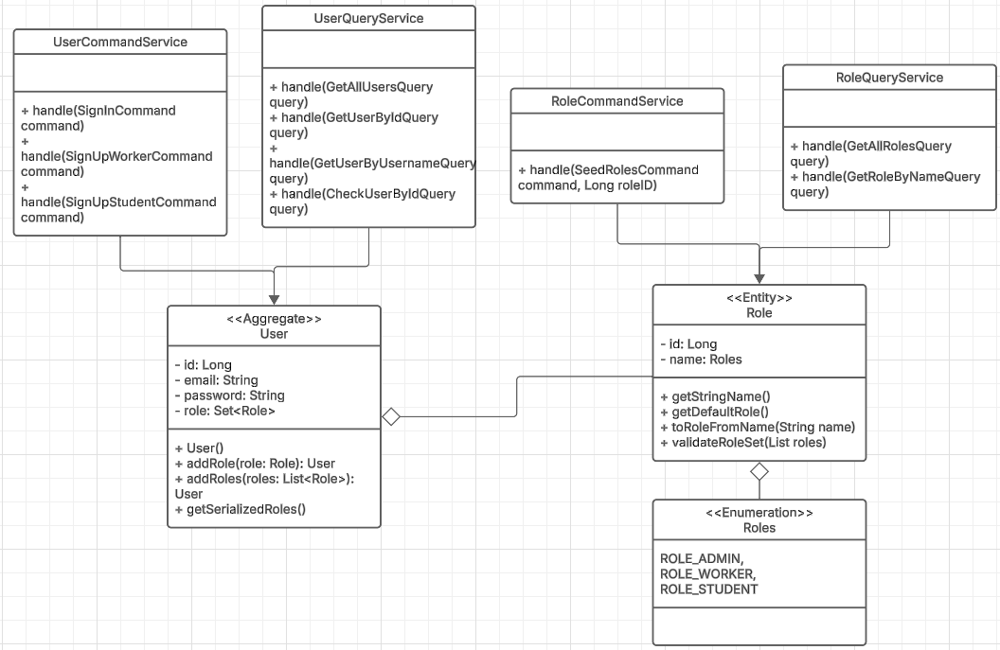

##### 5.5.7.2 Bounded Context Database Design Diagram

En el diagrama de base, se observa la tabla users y roles, así como la relación entre estas.

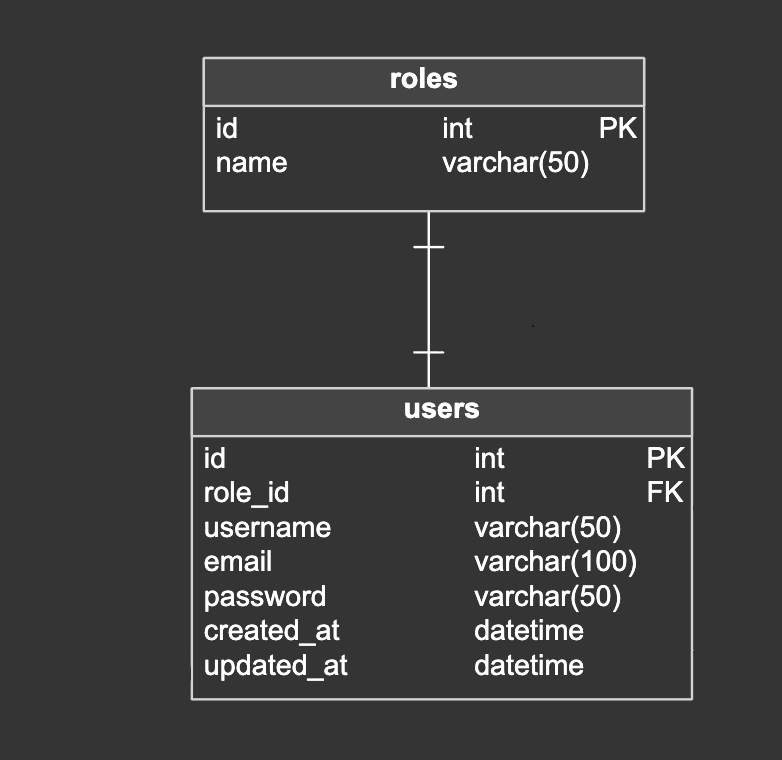

## Capítulo VI: Solution UX Design

### 6.1 Style Guidelines

El objetivo de estas directrices es asegurar que todas las interfaces de usuario (UI) de ErgoVision mantengan una identidad visual coherente, profesional y accesible, alineada con la misión del proyecto de promover el bienestar postural y la salud ergonómica a través de la tecnología. Estas guías establecen los principios visuales y funcionales que regirán el diseño tanto del entorno web como de la aplicación móvil, garantizando consistencia en el uso de colores, tipografías, iconografía y componentes visuales.

Al seguir estas directrices, ErgoVision busca ofrecer una experiencia centrada en el usuario, intuitiva y clara, que refleje confianza, bienestar y modernidad. Cada elemento visual ha sido concebido para apoyar la comprensión de la información, reducir la carga cognitiva y facilitar la interacción del usuario con las funciones de monitoreo, análisis y mejora postural.

#### 6.1.1 General Style Guidelines

**Branding:**  

El logo de ErgoVision es un logo simple y minimalista. El color principal es el azul, el cual será el color principal que se usará para la Landing Page, Aplicación web y Aplicación Móvil.

**Colores:**

Para ErgoVision, una plataforma dedicada al monitoreo postural y al bienestar ergonómico, la selección de colores busca transmitir profesionalismo, confianza y bienestar, reflejando el equilibrio entre tecnología y salud. La paleta combina tonos fríos y sobrios con acentos vibrantes, reforzando una experiencia visual moderna y centrada en el usuario.

**Tipografía:**  

La tipografía Inter, fue elegida por su claridad, modernidad y legibilidad, cualidades fundamentales en una aplicación que busca mejorar el bienestar físico mediante la tecnología. Sus formas redondeadas y proporciones balanceadas aportan una sensación de cercanía y comodidad visual, mientras su versatilidad permite mantener coherencia entre los textos informativos, métricas de monitoreo y mensajes de alerta.

**Espaciado:** 

Para el espacio entre los elemento, títulos y textos se usará un interlineado de múltiplos de 4px para asegurar la legibilidad en todas las aplicaciones.

**Principios de Diseño: Simplicidad y Claridad**

El diseño de ErgoVision se rige por principios de simplicidad, claridad y enfoque ergonómico, que buscan reducir la fatiga visual y cognitiva del usuario, al tiempo que mantienen una estética moderna y profesional.

Objetivos principales:

- Interfaz minimalista: Priorizar la información esencial y eliminar distracciones visuales, destacando solo los componentes funcionales relevantes.

- Uso estratégico del espacio en blanco: Facilita la lectura y comprensión, creando una sensación de equilibrio y confort visual.

- Flujos de usuarios intuitivos: Los procesos deben ser directos y naturales, alineados con las rutinas de trabajo y descanso del usuario.

- Jerarquía visual coherente: Diferenciar los niveles de información mediante tamaño, color y posición, guiando la atención del usuario de forma orgánica.

- Iconografía comprensible: Usar íconos claros y universales para representar acciones o estados, reduciendo la necesidad de texto adicional.

- Lenguaje accesible y respetuoso: Emplear un tono sereno, profesional y cercano, que inspire confianza sin perder formalidad.
  
#### 6.1.2 Web, Mobile & Devices Style Guidelines

<h4>Web Style Guide</h3>

<h4>Componentes</h4>
<ul>
  <li>
    <strong>Botones:</strong>
    <ul>
      <li><em>Primario:</em> fondo <code>#2b7fff</code> con texto blanco (<code>#ffffff</code>) para destacar acciones principales.</li>
      <li><em>Secundario:</em> fondo <code>#256ad6</code> con texto <code>#ffffff</code> para acciones complementarias.</li>
      <li><em>Deshabilitado:</em> fondo <code>#9ca5ae</code> con opacidad reducida.</li>
    </ul>
  </li>
  <li>
    <strong>Formularios:</strong>
    <ul>
      <li>Campos con bordes redondeados y validaciones visuales para estados <em>focus</em>, <em>error</em> y <em>success</em>.</li>
      <li>Las etiquetas se ubican sobre el campo, priorizando la legibilidad.</li>
    </ul>
  </li>
  <li>
    <strong>Cards:</strong>
    <ul>
      <li>Tarjetas con fondo blanco (<code>#ffffff</code>), sombra sutil (<code>#a5aab1</code>) y bordes suaves.</li>
      <li>Se usan para mostrar información resumida como historial o métricas posturales.</li>
    </ul>
  </li>
  <li>
    <strong>Tablas y Gráficos:</strong>
    <ul>
      <li>Líneas internas grises suaves y jerarquía tipográfica en cabeceras.</li>
      <li>Los gráficos emplean tonos azules y grises para transmitir calma visual.</li>
    </ul>
  </li>
</ul>

<h4>Comportamiento de Componentes</h4>
<ul>
  <li>Transiciones suaves (150 ms) para estados <em>hover</em>, <em>active</em> y <em>focus</em>.</li>
  <li>Evita animaciones excesivas que distraigan al usuario durante el monitoreo.</li>
  <li>Mensajes emergentes discretos y con tono informativo.</li>
</ul>

<h4>Responsive Design</h4>
<ul>
  <li>Diseño adaptable desde 1024 px (desktop) hasta 360 px (mobile).</li>
  <li>Distribución en cuadrículas flexibles que priorizan la legibilidad y el contenido clave.</li>
  <li>Contraste mínimo AA garantizado según las normas <strong>WCAG 2.1</strong>.</li>
</ul>

<h4>Íconos e Ilustraciones</h4>
<ul>
  <li>Íconos lineales monocromáticos (color <code>#5a6472</code> o <code>#ffffff</code> sobre fondos oscuros).</li>
  <li>Ilustraciones simples en tonos neutros, usadas solo en la landing page.</li>
  <li>Evita elementos decorativos innecesarios para mantener la estética profesional y ergonómica.</li>
</ul>

<h4>Mobile Style Guide</h3>

<h4>Componentes</h4>
<ul>
  <li>
    <strong>Botones:</strong>
    <ul>
      <li>Áreas táctiles amplias (mínimo 48 px). Conservan la jerarquía de color de la versión web.</li>
    </ul>
  </li>
  <li>
    <strong>Formularios:</strong>
    <ul>
      <li>Campos optimizados para teclado móvil, con mensajes de error claros y botones de acción grandes.</li>
    </ul>
  </li>
  <li>
    <strong>Cards:</strong>
    <ul>
      <li>Diseño compacto, apilado verticalmente, con tipografía jerárquica y colores de contraste.</li>
    </ul>
  </li>
</ul>

<h4>Gestos</h4>
<ul>
  <li><strong>Tap:</strong> acción principal (selección o confirmación).</li>
  <li><strong>Swipe vertical:</strong> desplazamiento entre secciones como historial o estadísticas.</li>
  <li><strong>Swipe horizontal:</strong> navegación entre pantallas o inicio/pausa del monitoreo.</li>
  <li><strong>Long Press:</strong> acceso a opciones secundarias, como detalles de historial.</li>
</ul>

<h4>Responsive Design</h4>
<ul>
  <li>Adaptación fluida a smartphones y tablets (360–768 px).</li>
  <li>Tipografía legible <strong>Lato</strong>, mínimo 14 px.</li>
  <li>Uso de espacios amplios para reducir la carga visual y favorecer la precisión táctil.</li>
  <li>Prioriza accesos rápidos a: “Iniciar Monitoreo”, “Pausa Activa”, “Historial” y “Mi Perfil”.</li>
</ul>

<h4>Consistencia Visual</h4>
<ul>
  <li><strong>Colores:</strong> #121720, #141e2d, #2b7fff, #256ad6, #ffffff.</li>
  <li><strong>Tipografía:</strong> Lato — limpia, moderna y ergonómica.</li>
  <li><strong>Iconografía:</strong> Minimalista y funcional, trazos finos en alto contraste.</li>
  <li><strong>Tono general:</strong> Profesional, calmado y centrado en el bienestar físico y visual del usuario.</li>
</ul>

### 6.2 Information Architecture

La Arquitectura de la Información cumple un papel esencial en la creación de experiencias digitales claras y funcionales, al definir cómo se estructura, nombra y conecta el contenido dentro de las plataformas web y móvil. En esta sección, el equipo presenta las decisiones estratégicas que sustentan la organización de la información, garantizando que los usuarios puedan orientarse fácilmente, comprender la lógica de navegación y acceder sin dificultad a los recursos o funciones que buscan.

#### 6.2.1. Organization Systems

En esta sección, el equipo describe cómo se aplicarán los sistemas de organización de la información dentro de ErgoVision, con el propósito de optimizar la experiencia del usuario y facilitar el acceso rápido y claro a las funcionalidades principales. La estructura propuesta busca mantener una navegación fluida, intuitiva y coherente tanto en la interfaz web como en la aplicación móvil.

- Jerárquica (Visual Hierarchy): Este sistema se aplicará en la Landing Page y en las pantallas principales de la aplicación para resaltar los elementos más relevantes, como botones de acción, indicadores de análisis ergonómico y accesos a reportes o configuraciones. Se empleará el uso estratégico de tamaños, contrastes de color y espaciado para guiar la atención del usuario hacia las tareas más importantes.

- Organización Secuencial (Step-by-Step): Se implementará en los procesos de evaluación ergonómica y configuración de perfil, donde el usuario deberá seguir una serie de pasos lógicos (por ejemplo, registrar su espacio de trabajo, ingresar medidas posturales y visualizar resultados). Este enfoque permitirá una experiencia guiada y estructurada, reduciendo la complejidad cognitiva y ayudando a completar tareas con claridad.

- Organización Matricial: Se aplicará en secciones que involucren la comparación de datos o métricas, como los reportes de desempeño ergonómico y la visualización de estadísticas entre diferentes periodos o usuarios. Este sistema permitirá observar múltiples variables de forma simultánea, facilitando el análisis y la toma de decisiones basadas en los resultados obtenidos.

Con esta estructura, ErgoVision garantiza una presentación organizada, priorizada y adaptable de la información, que favorece tanto la comprensión como la interacción eficiente del usuario con las distintas funcionalidades de la plataforma.

#### 6.2.2 Labeling Systems
El sistema de etiquetado en ErgoVision se diseña con el propósito de garantizar que los usuarios comprendan de forma inmediata la función y el contenido de cada sección. Las etiquetas se seleccionan utilizando un lenguaje claro, conciso y accesible, evitando tecnicismos innecesarios y priorizando la simplicidad visual y semántica. 
Este enfoque busca reducir la carga cognitiva, permitir una navegación intuitiva y asegurar una experiencia uniforme entre las versiones web y móvil.

La propuesta de etiquetado para las principales secciones de ErgoVision es la siguiente:

<table>
  <thead>
    <tr>
      <th>Sección</th>
      <th>Etiqueta Propuesta</th>
    </tr>
  </thead>
  <tbody>
    <tr>
      <td>Creación e inicio de sesión</td>
      <td>“Iniciar Sesión”</td>
    </tr>
    <tr>
      <td>Registro de nuevo usuario</td>
      <td>“Crear Cuenta”</td>
    </tr>
    <tr>
      <td>Edición de datos de usuario</td>
      <td>“Editar Perfil”</td>
    </tr>
    <tr>
      <td>Visualización de historial detallado</td>
      <td>“Historial”</td>
    </tr>
    <tr>
      <td>Visualización de estadísticas</td>
      <td>“Estadísticas”</td>
    </tr>
    <tr>
      <td>Inicio de monitoreo ergonómico</td>
      <td>“Monitoreo”</td>
    </tr>
    <tr>
      <td>Ejecución de pausa activa</td>
      <td>“Pausa Activa”</td>
    </tr>
    <tr>
      <td>Perfil de usuario</td>
      <td>“Mi Perfil”</td>
    </tr>
  </tbody>
</table>

Estas etiquetas se mantendrán coherentes en todas las plataformas y vistas, asegurando que cada término represente de forma precisa la funcionalidad o información que agrupa. Además, se prioriza el uso de sustantivos directos y familiares para los usuarios, promoviendo una comunicación efectiva y una navegación libre de confusión dentro del ecosistema ErgoVision.

#### 6.2.3 Searching Systems

El sistema de búsqueda en <strong>ErgoVision</strong> ha sido diseñado para que los usuarios puedan acceder a información relevante de manera rápida y sin complicaciones. El objetivo es evitar la sensación de pérdida dentro del volumen de datos recopilados por el sistema, especialmente en los módulos de <em>historial de monitoreo</em> y <em>estadísticas de bienestar</em>. 
A través de diferentes medios de ayuda, filtros y opciones visuales, se garantiza una experiencia eficiente y centrada en el usuario.

<h4>Barra de búsqueda en el Historial Detallado</h4>

En la sección de <strong>Historial Detallado</strong>, los usuarios contarán con una <strong>barra de búsqueda avanzada</strong> que permitirá localizar sesiones específicas de monitoreo basadas en criterios como fecha, duración, nivel de corrección postural o incidencias detectadas. 
Esta barra se ubicará en la parte superior del historial y ofrecerá resultados dinámicos que se actualizarán en tiempo real conforme el usuario escriba.

<ul>
  <li><strong>Filtros disponibles:</strong> fecha de sesión, tipo de postura, duración de monitoreo, alertas recibidas.</li>
  <li><strong>Presentación de resultados:</strong> se mostrará una lista cronológica con tarjetas informativas que incluirán los datos clave de cada sesión (fecha, tiempo, incidencias y nivel de desempeño).</li>
</ul>

<h4>Búsqueda en Estadísticas</h4>

En la sección de <strong>Visualización de Estadísticas</strong>, el usuario podrá aplicar filtros para observar tendencias específicas en su desempeño ergonómico. 
El sistema permitirá seleccionar periodos de tiempo (semanal, mensual, personalizado) y tipos de métricas, como <em>tiempo de buena postura</em> o <em>número de correcciones diarias</em>.

<ul>
  <li><strong>Filtros disponibles:</strong> rango de fechas, tipo de métrica, frecuencia de pausas activas.</li>
  <li><strong>Presentación de resultados:</strong> gráficos interactivos que se actualizarán en función de los filtros aplicados, con valores destacados y comparativos.</li>
</ul>

<h4>Filtrado en Monitoreo Activo</h4>

Durante el <strong>inicio de monitoreo</strong>, el usuario podrá visualizar un registro en tiempo real de sus eventos posturales. 
Aunque el monitoreo es continuo, el sistema ofrecerá una vista filtrable para mostrar únicamente las <em>alertas recientes</em> o las <em>correcciones realizadas</em> dentro de una sesión específica. 
Esto permitirá analizar patrones de comportamiento sin necesidad de revisar todo el flujo de datos.

<ul>
  <li><strong>Filtros disponibles:</strong> tipo de evento (alerta o corrección), intervalo de tiempo, nivel de desviación postural.</li>
  <li><strong>Presentación de resultados:</strong> lista de eventos en tiempo real con indicadores visuales por color según la gravedad de la desviación.</li>
</ul>

<h4>Búsqueda en Pausas Activas</h4>

En la sección de <strong>Pausa Activa</strong>, los usuarios podrán buscar y filtrar ejercicios o rutinas recomendadas según el tipo de molestia o zona corporal afectada. 
Esto facilitará la selección de pausas más adecuadas para su situación actual.

<ul>
  <li><strong>Filtros disponibles:</strong> tipo de ejercicio, duración, nivel de intensidad, zona corporal (cuello, espalda, muñeca, etc.).</li>
  <li><strong>Presentación de resultados:</strong> catálogo visual con tarjetas de ejercicios, cada una mostrando imagen, nombre y duración.</li>
</ul>

<h4>Gestión de Perfil y Datos de Usuario</h4>

En las secciones de <strong>Edición de datos de usuario</strong> y <strong>Mi Perfil</strong>, el sistema permitirá realizar búsquedas internas de configuraciones o campos específicos, como datos personales o preferencias ergonómicas. 
Esto facilitará la personalización de la experiencia sin recorrer todas las secciones manualmente.

<ul>
  <li><strong>Filtros disponibles:</strong> nombre de campo, categoría de configuración (notificaciones, datos biométricos, preferencias de monitoreo).</li>
  <li><strong>Presentación de resultados:</strong> lista editable con campos resaltados según la palabra clave buscada.</li>
</ul>

<h4>Accesibilidad y Experiencia de Búsqueda</h4>

Todos los sistemas de búsqueda de <strong>ErgoVision</strong> seguirán los principios de <em>claridad, consistencia y velocidad de respuesta</em>. 
El usuario siempre visualizará un mensaje de ayuda o sugerencias automáticas al no encontrar resultados, reduciendo la frustración y promoviendo una navegación guiada. 
Además, las búsquedas estarán disponibles mediante texto y comandos de voz para mejorar la accesibilidad general.

#### 6.2.4 SEO Tags and Meta Tags

Esta sección define la estrategia de optimización para motores de búsqueda (SEO) y tiendas de aplicaciones (ASO) de ErgoVision, orientada a maximizar la visibilidad del proyecto tanto en entornos web como móviles. El objetivo es asegurar que los usuarios puedan encontrar fácilmente la plataforma al buscar soluciones relacionadas con ergonomía, bienestar laboral y monitoreo postural.

Las etiquetas propuestas buscan reflejar la esencia de ErgoVision: una herramienta digital centrada en la salud, la prevención y la productividad consciente, brindando una experiencia accesible y confiable en todos los dispositivos.

<h3>Para Landing Page Web</h3>
<ul>
  <li><strong>Title:</strong> ErgoVision – Mejora tu bienestar postural con tecnología inteligente</li>
  <li><strong>Meta Description:</strong> Plataforma digital diseñada para promover hábitos ergonómicos saludables. Descubre cómo ErgoVision puede ayudarte a prevenir la fatiga y mejorar tu postura mediante recordatorios, monitoreo y pausas activas personalizadas.</li>
  <li><strong>Meta Keywords:</strong> ergonomía, bienestar postural, salud digital, prevención de fatiga, pausas activas, monitoreo ergonómico, hábitos saludables, postura correcta</li>
  <li><strong>Meta Author:</strong> Equipo ErgoVision</li>
</ul>

<h3>Para Página Web (Plataforma Web Interactiva)</h3>
<ul>
  <li><strong>Title:</strong> ErgoVision Web – Monitoreo en tiempo real y análisis ergonómico</li>
  <li><strong>Meta Description:</strong> Accede a tu panel de control de ErgoVision, donde podrás visualizar tu historial ergonómico, revisar estadísticas personalizadas y gestionar tus hábitos de pausa activa. Optimiza tu jornada laboral con herramientas de bienestar inteligente.</li>
  <li><strong>Meta Keywords:</strong> ergonomía en el trabajo, análisis postural, productividad saludable, monitoreo de postura, bienestar digital, panel ergonómico, hábitos laborales</li>
  <li><strong>Meta Author:</strong> Equipo ErgoVision</li>
</ul>

<h3>Para Mobile App (App Store / Play Store)</h3>
<ul>
  <li><strong>App Title:</strong> ErgoVision: Monitoreo Ergonómico y Bienestar Postural</li>
  <li><strong>App Keywords:</strong> ergonomía, postura, salud, pausas activas, bienestar, trabajo saludable, productividad, fatiga, monitoreo</li>
  <li><strong>App Subtitle:</strong> Cuida tu postura y bienestar mientras trabajas o estudias.</li>
  <li><strong>App Description:</strong> ErgoVision es una aplicación inteligente que te ayuda a mantener una postura correcta, prevenir la fatiga y mejorar tu bienestar diario. Ofrece monitoreo ergonómico en tiempo real, recordatorios de pausas activas y estadísticas personalizadas. ¡Optimiza tu rutina y cuida tu cuerpo con ErgoVision!</li>
</ul>

Estas configuraciones SEO y ASO garantizan una comunicación clara y atractiva en todos los puntos de contacto digitales, fortaleciendo la identidad de ErgoVision como una solución moderna, accesible y comprometida con la salud y el bienestar de sus usuarios.

#### 6.2.5 Navigation Systems

La estructura de navegación de <strong>ErgoVision</strong> está diseñada para ofrecer una experiencia de usuario fluida, clara y accesible, permitiendo que tanto nuevos usuarios como recurrentes puedan orientarse fácilmente dentro de la plataforma. 
La navegación busca guiar a los usuarios hacia sus objetivos principales monitorear su postura, analizar su progreso y promover hábitos saludables de manera intuitiva y sin fricciones.

<h4>Landing Page</h4>

La <strong>Landing Page</strong> presenta una navegación superior fija que permite explorar los principales apartados informativos y de conversión. Incluye los siguientes elementos:

<ul>
  <li><strong>Inicio:</strong> Acceso directo al encabezado principal y presentación del producto.</li>
  <li><strong>Sobre ErgoVision:</strong> Sección que explica la misión, visión y propósito del proyecto.</li>
  <li><strong>Características:</strong> Detalle de las funcionalidades principales de la plataforma, como monitoreo postural, pausas activas y estadísticas de bienestar.</li>
  <li><strong>Beneficios:</strong> Explicación de los impactos positivos en la salud y productividad del usuario.</li>
  <li><strong>Equipo:</strong> Presentación del equipo de desarrollo y colaboradores del proyecto.</li>
  <li><strong>Contacto:</strong> Enlace para comunicarse con el equipo de soporte o solicitar más información.</li>
</ul>

<h4>Web Application</h4>

En la <strong>versión web de ErgoVision</strong>, se utilizará una <strong>barra lateral de navegación persistente</strong>, que facilitará el acceso a las funcionalidades clave de monitoreo y gestión de usuario:

<ul>
  <li><strong>Dashboard:</strong> Vista general del estado postural actual y acceso rápido a las métricas principales.</li>
  <li><strong>Historial Detallado:</strong> Registro cronológico de sesiones y eventos de monitoreo.</li>
  <li><strong>Estadísticas:</strong> Gráficos e indicadores sobre el progreso del usuario en el tiempo.</li>
  <li><strong>Monitoreo:</strong> Sección para iniciar, pausar o detener el seguimiento postural.</li>
  <li><strong>Pausas Activas:</strong> Ejercicios y recordatorios programados para reducir la fatiga.</li>
  <li><strong>Perfil de Usuario:</strong> Edición de datos personales y preferencias ergonómicas.</li>
  <li><strong>Configuración:</strong> Ajustes del sistema, notificaciones SMS y preferencias visuales.</li>
</ul>

<h4>Mobile Application</h4>

La <strong>aplicación móvil</strong> prioriza la usabilidad en pantallas pequeñas mediante una <strong>navegación por pestañas inferiores (bottom navigation bar)</strong>, complementada con un <strong>menú lateral desplegable</strong> para secciones secundarias. Las secciones principales incluyen:

<ul>
  <li><strong>Inicio:</strong> Estado postural actual y acceso rápido a monitoreo.</li>
  <li><strong>Estadísticas:</strong> Visualización compacta de métricas y progreso.</li>
  <li><strong>Pausas:</strong> Acceso directo a ejercicios guiados y recordatorios activos.</li>
  <li><strong>Perfil:</strong> Configuración personal, historial resumido y ajustes de usuario.</li>
</ul>

### 6.3 Landing Page UI Design

#### 6.3.1 Landing Page Wireframe

Para tener una primera idea de cómo lucirá nuetra landing page, se realizaron los Wireframes tanto para pantallas de escritorio como para dispositivos móviles, asegurando un correcto tamaño y distribución de los elementos y textos.

 **Wireframes Desktop**  
 

 **Wireframes Móvil**  

Link del Figma: [https://www.figma.com/design/FRNZ8shiNR4qp3QbvECyw0/LandingPage?node-id=0-1&t=tUt2TuwoHmFV3ka1-1]

#### 6.3.2 Landing Page Mock-up

Posterior a la versión final de los Wireframes, se realizaron los Mockups de la Landing Page, nuevamente, tanto para pantallas de escritorio como para dispositivos móviles, siguiendo la guia de estilos establecida.

 **Mockups Desktop**  
 

 **Mockups Móvil**  

Link del Figma: [https://www.figma.com/design/FRNZ8shiNR4qp3QbvECyw0/LandingPage?node-id=0-1&t=tUt2TuwoHmFV3ka1-1]

### 6.4 Applications UX/UI Design

#### 6.4.1 Applications Wireframes

**Wireframes Web:**

Los wireframes de la aplicación web de ErgoVision presentan las interfaces de registro/login, perfil editable, dashboard con resúmenes semanales, estadísticas visuales, configuración de notificaciones, calibración del sistema de cámara, monitoreo en tiempo real con detección de postura activa, y pantallas de pausas con ejercicios sugeridos y temporizadores para descansos programados.

**Wireframes Móvil:**

Los wireframes de la aplicación móvil de ErgoVision muestran el flujo completo de ErgoVision desde autenticación (login/registro con datos personales y antropométricos), pasando por gestión de perfil, visualización de estadísticas con gráficos de postura y tiempos de descanso, historial de sesiones, hasta detalles específicos de cada sesión con porcentajes de postura correcta y pausas realizadas.

Link del Figma: [https://www.figma.com/design/fhUt25HP4MGhLEtHliG1hy/ErgoVision?node-id=0-1&t=bFgnvM760zhmxcYL-1]

#### 6.4.2 Applications Wireflow Diagrams

Los wireflow diagrams de ErgoVision representan la secuencia de interacciones y pantallas que los usuarios experimentarán al navegar por la aplicación.

Link del Figma: [https://www.figma.com/design/fhUt25HP4MGhLEtHliG1hy/ErgoVision?node-id=0-1&t=bFgnvM760zhmxcYL-1]

**Edición de Datos de Usuario:** Este wireflow corresponde a cuando un usuario quiere modificar sus datos personales luego de haberse registrado.

- **Web:**

- **Móvil:**

**Creación de Cuenta:** Este wireflow corresponde a cuando un usuario no tiene una cuenta creada y debe registrarse para empezar a utilizar la aplicación.

- **Web:**

- **Móvil:**

**Visualización de Historial Detallado:** Este wireflow corresponde a cuando un usuario quiere visualizar los detalles de sus sesiones de monitoreo pasadas en el historial.

- **Web:**

- **Móvil:**

**Visualización de Estadísticas:** Este wireflow corresponde a cuando un usuario quiere visualizar las estadisticas sobre tiempos de buenas/malas posturas que ha tenido en lo que va utilizando la aplicación.

- **Web:**

- **Móvil:**

**Inicio de Monitoreo:** Este wireflow corresponde a cuando un usuario quiere iniciar una sesión de monitoreo postural en tiempo real.
 - **Web:**

**Inicio de Pausa Activa:** Este wireflow corresponde a cuando se activa automáticamente o un usuario quiere iniciar una pausa activa con ejercicios sugeridos por la aplicación.
 - **Web:**

**Calibración del Sistema de Cámara:** Este wireflow corresponde a cuando un usuario quiere calibrar el sistema de cámara para mejorar la detección postural.
 - **Web:**

#### 6.4.3 Applications Mock-ups

#### 6.4.4 Applications User Flow Diagrams

### 6.5 Applications Prototyping

## Capítulo VII: Product Implementation, Validation & Deployment

### 7.1 Software Configuration Management

En este ítem se definirán todas las reglas y procesos que hemos seguido en el proyecto al momento de crear y desplegar ErgoVision. El objetivo de estas reglas y procesos es garantizar la integridad y consistencia del software, desde el inicio hasta el despliegue y mantenimiento.

#### 7.1.1 Software Development Environment Configuration

**Project Management**

Para la organización del proyecto requerimos de un sistema de de asignación de tareas, palataformas y puntos de reunión y un repositorio dónde trabajaremos en conjunto cada avance del proyecto. A continuación se menciona los nombres de los productos y el propósito de uso en el proyecto:

- Centro de organización de trabajo: Github
- Planificación de tareas: Trello
- Reuniones con el equipo: Discord
- Coordinación grupal: WhatsApp

**Requirements Management**

Utilizamos Trello para designar las tareas y actividades de cada integrante del grupo en caso de revisión o cambios.

| Herramienta | Descripción                                                                                        | Enlace             |
| ----------- | --------------------------------------------------------------------------------------------------- | ------------------ |
| Trello      | Para designar las tareas y actividades de cada integrante del grupo en caso de revisión o cambios. | [https://trello.com](https://trello.com) |

**Product UX/UI Design**

Para el diseño de los wireframes y mockups, además de la realización del prototipo de la mobile application, utilizamos Figma.

| Herramienta | Descripción                                                                                    | Enlace                 |
| ----------- | ----------------------------------------------------------------------------------------------- | ---------------------- |
| Figma       | Para el diseño de los wireframe y mockups, además de la realización del prototipo de Web App | [https://www.figma.com/](https://www.figma.com/) |

**Software Development**

Empleamos **Angular** para la creación del frontend de la aplicación web, **Flutter** para la app móvil, y **Spring Boot** para la creación de la API REST.  

Para el desarrollo de la **landing page** utilizamos **HTML** y **Tailwind CSS**.

| Herramienta  | Descripción                                                                  | Enlace                                                                                                 |
| ------------ | ---------------------------------------------------------------------------- | ------------------------------------------------------------------------------------------------------ |
| Angular      | Framework utilizado para la creación del frontend de la aplicación web       | [https://angular.io/](https://angular.io/)                                                             |
| Flutter      | Framework utilizado para la creación de la aplicación móvil multiplataforma  | [https://flutter.dev/](https://flutter.dev/)                                                           |
| Spring Boot  | Framework utilizado para la creación de la API REST                          | [https://spring.io/projects/spring-boot](https://spring.io/projects/spring-boot)                       |
| HTML         | Lenguaje de marcado utilizado para el desarrollo de la landing page estática | [https://developer.mozilla.org/en-US/docs/Web/HTML](https://developer.mozilla.org/en-US/docs/Web/HTML) |
| Tailwind CSS | Framework utilizado para la maquetación y diseño de la landing page          | [https://tailwindcss.com/](https://tailwindcss.com/)                                                   |

**Software Deployment**

Se empleó los siguientes software para desplegar los servicios del proyecto. Base de datos: Render, Landing Page: Github Actions, Web Application: Render, Mobile Application: Android Studio.

| Herramienta    | Descripción                                                                                     | Enlace                                                                       |
| -------------- | ----------------------------------------------------------------------------------------------- | ---------------------------------------------------------------------------- |
| Render         | Plataforma utilizada para el despliegue de la base de datos, API, aplicación web y landing page | [https://render.com/](https://render.com/)                                   |
| Android Studio | Herramienta utilizada para la creación de la mobile application (APK e IPA)                     | [https://developer.android.com/studio](https://developer.android.com/studio) |
| GitHub Actions | Despliegue de la landing estática                                                               | [https://github.com/features/actions](https://github.com/features/actions)   |

**Software Documentation**

Para la documentación del software utilizamos Markdown, y para el trabajo colaborativo Github.

| Herramienta | Descripción                                                      | Enlace                                                                                 |
| ----------- | ---------------------------------------------------------------- | -------------------------------------------------------------------------------------- |
| Markdown    | Lenguaje de marcado utilizado para la documentación del proyecto | [https://www.markdownguide.org/](https://www.markdownguide.org/)                       |
| GitHub      | Para gestionar la documentación del proyecto                     | [https://github.com/NRG7-Emergentes/report](https://github.com/NRG7-Emergentes/report) |

#### 7.1.2 Source Code Management

Para la gestión del código fuente, utilizamos los siguientes repositorios:

| Producto           | Repositorio       | Enlace                                                                                                         |
| ------------------ | ----------------- | -------------------------------------------------------------------------------------------------------------- |
| Web Application    | ergovision-web-app    | [https://github.com/NRG7-Emergentes/ergovision-webapp](https://github.com/NRG7-Emergentes/ergovision-webapp)   |
| Mobile Application |  ergovision-mobile-app | [https://github.com/NRG7-Emergentes/ergovision-mobile](https://github.com/NRG7-Emergentes/ergovision-mobile)   |
| Backend            |  ergovision-backend    | [https://github.com/NRG7-Emergentes/ergovision-backend](https://github.com/NRG7-Emergentes/ergovision-backend) |
| Landing Page       |  ergovision-landing-page    | [https://github.com/NRG7-Emergentes/landing-page](https://github.com/NRG7-Emergentes/landing-page)             |

**Flujo de trabajo GitFlow**

Usaremos el flujo de trabajo planteado por Vincent Driessen en "A successful Git branching model" con los siguientes parámetros:

- Una rama de producción.
- Una rama de pruebas.
- Una rama en la que se solucionen los bugs rapidamente y vuelvan a producción.
- Ramas de features a implementar.
- Cada cambio en producción debe establecerse como una nueva versión.
- Para este proyecto en concreto consideramos que los cambios en la rama de producción y de pruebas deben tener autorización de un compa­ñero de equipo.

Teniendo en cuenta la información anterior nos inclinamos por este tipo de organización en los branches:

- **Main branch:** Esta rama esta destinada a la producción de la aplicación, cada cambio deberá tener autorización de un compañero de equipo para evitar cambios sin verificar.
- **Hotfix branch:** En esta rama se incluirán todas las versiones que poseen errores identificados y que con cada arreglo de este se despliegue otra vez a Main Branch además de implementarla en lo que será Develop Branch.
- **Develop branch:** Esta rama está destinada a las constantes implementaciones en caliente de los features,
- **Features branch:** Cada feature poseerá su respectiva rama, una vez que se encuentre correctamente implementada será fusionada con Develop branch.

Con cada deployment de la aplicación debe establecerse como una nueva versión. Nomenclatura de numeración de las versiones:

- **Major changes:** Cuando el código o versión nueva del proyecto a implementar presenta cambios significativos con la versión anterior, estos cambios llegan a ser incompatibles con la versión anterior. Esto se evidenciará en el numero de la versión ej: versión 1.0.0 -> versión 2.0.0.
- **Minor changes:** Cuando el código o versión nueva del proyecto a implementar presenta cambios con respecto a alguna característica, ya sea añadir o modificar, de la versión anterior; estos cambios no llegan a ser incompatibles con la versión anterior. Esto se evidenciará en el numero de la versión ej: versión 1.1.0 -> versión 1.2.0.
- **Patch:** Cuando se solucionan bugs menores. Esto se evidenciará en el numero de la versión ej: versión 1.1.3 -> versión 1.1.4.

Sufijos asignados a las versiones:

- **alpha:** versión no estable con características básicas o no funcionales, ejemplo : versión 1.0.0 -alpha.
- **beta:** versión no apta para la publicación, aún así ya presenta características funcionales en el estado base, ejemplo versión 1.0.0 –beta.
- **rc:** versión apta para la publicación y uso de los usuarios, es candidata para publicar, ejemplo versión 1.0.0 -rc.

#### 7.1.3 Source Code Style Guide & Conventions

Usaremos buenas prácticas en cuanto al código de manera que sea coherente y sostenible.

**Flutter**

* **Nomenclatura:**

  * Clases y widgets: *PascalCase*.
  * Funciones y variables: *camelCase*.
  * Constantes: *UPPER_SNAKE_CASE*.
* **Estructura:**

  * Separar la lógica de la UI mediante arquitectura por capas (*UI*, *Providers*, *Services*, *Models*).
  * Reutilizar componentes visuales y mantener una estructura modular.
* **Buenas prácticas:**

  * Evitar lógica de negocio dentro de los widgets.
  * Aplicar `const` donde sea posible para optimizar rendimiento.
  * Usar `async/await` correctamente para evitar bloqueos en la interfaz.

**Angular**

* **Estructura:**

  * Dividir el código en *módulos*, *componentes*, *servicios* y *modelos*.
  * Aplicar *Lazy Loading* para optimizar la carga de módulos.
* **Nomenclatura:**

  * Clases y componentes: *PascalCase*.
  * Variables y métodos: *camelCase*.
  * Archivos: *kebab-case* (ejemplo: `user-profile.component.ts`).
* **Buenas prácticas:**

  * Mantener la lógica de negocio en *servicios*, no en componentes.
  * Utilizar `async pipe` para manejar observables.
  * Aplicar linters (*ESLint*, *Prettier*) para mantener consistencia en el código.

**Spring Boot**

* **Estructura:**

  * Organizar el proyecto por capas: *controller*, *service*, *repository*, *model*.
  * Utilizar interfaces para los servicios (`UserService → UserServiceImpl`).
* **Convenciones:**

  * Clases en *PascalCase*.
  * Métodos en *camelCase* (ejemplo: `getUserById()`).
  * Endpoints REST en *kebab-case* (ejemplo: `/api/user-data`).
* **Buenas prácticas:**

  * Validar entradas con anotaciones (`@Valid`, `@NotNull`).
  * Manejar excepciones de forma global con `@ControllerAdvice`.

**HTML**

* **Estructura:**

  * Mantener jerarquía semántica correcta (`<header>`, `<main>`, `<section>`, `<footer>`).
  * Incluir etiquetas meta esenciales (`<meta charset="UTF-8">`, `<meta name="viewport">`).
* **Convenciones:**

  * Archivos nombrados en *kebab-case* (ejemplo: `about-us.html`).
  * Uso de indentación consistente (2 o 4 espacios).
* **Buenas prácticas:**

  * Validar el HTML con [W3C Validator](https://validator.w3.org/).
  * Evitar el uso de estilos inline; usar clases con Tailwind CSS.
  * Minimizar el uso de etiquetas obsoletas (`
`, ``).
  * Mantener el contenido accesible con atributos `alt`, `aria-label` y roles semánticos.

**Tailwind CSS**

* **Clases:**

  * Ordenar las clases: *Layout > Flex/Grid > Spacing > Typography > Colors > Effects*.
  * Evitar `@apply` en CSS y usar clases directamente en el HTML.
* **Responsive:**

  * Usar prefijos (`sm:`, `md:`, `lg:`) para adaptar la interfaz.
* **Buenas prácticas:**

  * Centralizar la configuración de colores y tipografías en `tailwind.config.js`.
  * Reutilizar estilos comunes en componentes para mantener consistencia.

**General**

* **Código:**

  * Comentarios en inglés.
  * Commits semánticos (`feat:`, `fix:`, `docs:`).
* **Performance:**

  * Implementar *Lazy Loading* para componentes y recursos.
  * Reutilizar componentes y evitar duplicación de código.
  * Optimizar imágenes y recursos estáticos para mejorar tiempos de carga.

#### 7.1.4 Software Deployment Configuration

En esta sección se detallan las consideraciones y pasos necesarios para el despliegue de los productos de **ErgoVision**.

**Landing Page (HTML + Github Actions)**

**Consideraciones antes del despliegue:**

* Ejecutar el archivo `index.html` localmente para verificar que no existan errores de carga ni conflictos de dependencias.
* Asegurarse de que todos los archivos asociados (CSS, imágenes y scripts) estén correctamente enlazados en el proyecto.

**Requerimientos para realizar el despliegue:**

* Repositorio público en **GitHub**.
* Acceso a la sección de configuración del repositorio.

**Pasos realizados para el despliegue:**

1. Ingresar al repositorio público de la *Landing Page* en GitHub.
2. Ir a la pestaña **Settings**.
3. Seleccionar la sección **Pages**.
4. En la opción *Build and deployment*, elegir **GitHub Actions** como fuente (*Source*).
5. Seleccionar la plantilla **Static HTML** de GitHub Actions.
6. Hacer un **commit** del flujo de trabajo (`.yml`) de *GitHub Actions* para HTML estático.
7. Volver a la pestaña **Pages** y esperar a que se genere el enlace público de la página.
8. Verificar el correcto funcionamiento accediendo al enlace generado.

**Herramientas utilizadas:**

| Herramienta    | Descripción                       | Enlace                                                                     |
| -------------- | --------------------------------- | -------------------------------------------------------------------------- |
| GitHub Actions | Despliegue de la landing estática | [https://github.com/features/actions](https://github.com/features/actions) |

**Web Application (Angular + Render)**

**Consideraciones antes del despliegue:**

* Validar que no existan errores con `ng build --configuration production`.
* Confirmar la conexión funcional con el backend y las variables de entorno correctamente configuradas.

**Requerimientos:**

* Repositorio público del proyecto en GitHub.
* Cuenta activa en **Render**.

**Pasos realizados para el despliegue:**

1. Ingresar a [Render](https://render.com/).
2. Iniciar sesión en la cuenta del proyecto.
3. Seleccionar **New → Web Service**.
4. Conceder acceso a Render a los repositorios de GitHub.
5. Elegir el repositorio del proyecto Angular.
6. Configurar el nombre del servicio, puerto y comandos de *build* (`npm run build`).
7. Hacer clic en **Deploy**.
8. Verificar el despliegue en la URL generada por Render.

**Herramientas utilizadas:**

| Herramienta | Descripción                               | Enlace                                     |
| ----------- | ----------------------------------------- | ------------------------------------------ |
| Render      | Despliegue de la aplicación web (Angular) | [https://render.com/](https://render.com/) |

**Mobile Application (Flutter)**

**Consideraciones antes del despliegue:**

* Verificar que el *backend* esté disponible externamente.
* Asegurar que las dependencias (`pubspec.yaml`) estén actualizadas y libres de errores.

**Requerimientos:**

* Repositorio de desarrollo del proyecto en GitHub.
* Dispositivo móvil Android o iOS con modo desarrollador habilitado.

**Pasos realizados para el despliegue:**

1. Activar el modo desarrollador en el dispositivo móvil.
2. Activar la depuración por USB o Wi-Fi.
3. Conectar el dispositivo a la computadora.
4. Abrir **Android Studio** y seleccionar el proyecto Flutter.
5. Seleccionar el dispositivo en la lista de ejecución.
6. Ejecutar el proyecto con el botón **Run**.
7. Esperar a que la app se compile e instale en el dispositivo.
8. Comprobar el correcto funcionamiento de la aplicación.

**Herramientas utilizadas:**

| Herramienta    | Descripción                                     | Enlace                                                                       |
| -------------- | ----------------------------------------------- | ---------------------------------------------------------------------------- |
| Android Studio | Creación de la *mobile application* (APK e IPA) | [https://developer.android.com/studio](https://developer.android.com/studio) |

**Backend (Spring Boot + Render)**

**Consideraciones antes del despliegue:**

* Confirmar la conexión a la base de datos.
* Validar las variables de entorno y las rutas configuradas correctamente.

**Requerimientos:**

* Repositorio público del backend en GitHub.
* Cuenta activa en Render.

**Pasos realizados para el despliegue:**

1. Conectar el backend con la base de datos configurada.
2. Crear un archivo `Dockerfile` con la configuración necesaria para despliegue.
3. Acceder a Render y crear un nuevo proyecto de tipo **Web Service**.
4. Importar el repositorio del backend.
5. Configurar los parámetros del servicio (puerto, build y start command).
6. Desplegar el servicio y verificar su conexión con la base de datos.

**Herramientas utilizadas:**

| Herramienta | Descripción                               | Enlace                                     |
| ----------- | ----------------------------------------- | ------------------------------------------ |
| Render      | Despliegue de la API REST y base de datos | [https://render.com/](https://render.com/) |

### 7.2 Solution Implementation

#### 7.2.1 Sprint 1
##### 7.2.1.1 Sprint Planning 1
##### 7.2.1.2 Sprint Backlog 1
##### 7.2.1.3 Development Evidence for Sprint Review
##### 7.2.1.4 Testing Suite Evidence for Sprint Review
##### 7.2.1.5 Execution Evidence for Sprint Review
##### 7.2.1.6 Services Documentation Evidence for Sprint Review
##### 7.2.1.7 Software Deployment Evidence for Sprint Review
##### 7.2.1.8 Team Collaboration Insights during Sprint

### 7.3 Validation Interviews

#### 7.3.1 Diseño de Entrevistas

1. ¿Qué tan fácil te resultó orientarte dentro de la aplicación al iniciar por primera vez?
2. ¿Consideras que los íconos y etiquetas de los menús son claros y te permiten entender rápidamente a qué sección pertenecen?
3. ¿El diseño general (colores, tipografía, distribución) te parece agradable y coherente con el propósito de la app (bienestar y postura)?
4. ¿Entendiste fácilmente lo que representan las métricas del dashboard (puntaje promedio, tiempo monitoreado, punto corporal que suele fallar)?
5. ¿La gráfica de barras semanal te resulta fácil de interpretar visualmente?
6. ¿Sientes que el dashboard te brinda un resumen útil y suficiente de tu progreso?
7. ¿Fue sencillo identificar cómo editar tus datos personales (nombre, edad, altura y peso)?
8. ¿El proceso de edición de información te resultó intuitivo o tuviste que buscar cómo hacerlo?
9. ¿El diseño del formulario te resultó ordenado y claro?
10. ¿Te resultó claro cómo acceder al detalle de una sesión específica desde el historial?
11. ¿La visualización de estadísticas dentro de una sesión (tiempo de buena/mala postura, número de pausas, tiempo promedio de pausas) fue comprensible?
12. ¿Sientes que la información mostrada es suficiente para analizar tu desempeño en una sesión?
13. ¿El gráfico de progreso mensual te resultó fácil de interpretar?
14. ¿Crees que los indicadores de promedio de tiempo, puntaje y pausas activas te ayudan a entender tu mejora a largo plazo?
15. ¿Te gustaría poder comparar tus resultados de diferentes meses o usuarios dentro de esta vista?
16. ¿Pudiste identificar claramente las opciones para ajustar la sensibilidad, alertas y notificaciones?
17. ¿El proceso de calibración te pareció claro y bien explicado paso a paso?
18. ¿Hubo algún momento en el que no supieras qué hacer durante la calibración?
19. ¿La interfaz de monitoreo (con cámara, alertas y tiempo de sesión) te pareció clara y fácil de controlar?
20. ¿Las pausas activas (cronómetro, recomendaciones, finalización) te resultaron visualmente comprensibles y motivadoras para realizar los ejercicios?
21. ¿La interfaz móvil mantiene la misma claridad y facilidad de uso que la versión web?
22. ¿Consideras que la reducción de opciones (sin configuración, monitoreo ni calibración) afecta tu experiencia o la hace más simple?
23. En una escala del 1 al 10, ¿qué tan satisfecho estás con la interfaz general de la aplicación?
24. ¿Qué cambiarías o mejorarías visualmente o funcionalmente para hacer tu experiencia más fluida?

#### 7.3.2 Registro de Entrevistas

<table>
  <tbody>
    <tr>
      <td>Entrevista 1</td>
      <td>
        
      </td>
    </tr>
    <tr>
      <td>Enlace a la entrevista</td>
      <td> - </td>
    </tr>
    <tr>
      <td>Nombre Entrevistado</td>
      <td>Flavio Gallardo</td>
    </tr>
    <tr>
      <td>Edad</td>
      <td>22</td>
    </tr>
    <tr>
      <td>Distrito</td>
      <td>San Miguel</td>
    </tr>
    <tr>
      <td>Ocupación</td>
      <td>Estudiante de Ingeniería de Sistemas</td>
    </tr>
    <tr>
      <td>Duración Entrevista</td>
      <td> 08:13 </td>
    </tr>
    <tr>
      <td>Minuto de Inicio</td>
      <td> 00:00 </td>
    </tr>
    <tr>
      <td>Análisis</td>
      <td>
        El entrevistado encuentra la aplicación bien diseñada, con una interfaz limpia,
        profesional y fácil de usar. La navegación inicial fue "bastante fácil", destacando
        la organización del dashboard y los menús laterales, aunque inicialmente tuvo una
        leve confusión entre 'Stats' e 'History' que se resolvió con la exploración. Los
        íconos son considerados "bastante obvios" y el diseño general es agradable, con
        colores no contundentes y tipografía legible que no cansa la vista durante largas
        sesiones. Las métricas del dashboard son claras, pero sugiere añadir tooltips
        explicativos. Valora positivamente la utilidad del resumen de progreso y la
        intuitividad para editar su perfil y acceder a los detalles de las sesiones. La
        visualización de estadísticas por sesión y el progreso mensual le resultan
        comprensibles y útiles. Identifica oportunidades de mejora como: tooltips en
        métricas, feedback visual en tiempo real durante la calibración, poder comparar
        meses en las estadísticas, notificaciones menos invasivas, hacer las tarjetas de
        historial completamente clickeables y la opción de un tema oscuro/claro. En una
        escala del 1 al 10, califica su satisfacción con un 8/10.
      </td>
    </tr>
  </tbody>
</table>

<table>
  <tbody>
    <tr>
      <td>Entrevista 2</td>
      <td>
        
      </td>
    </tr>
    <tr>
      <td>Enlace a la entrevista</td>
      <td> - </td>
    </tr>
    <tr>
      <td>Nombre Entrevistado</td>
      <td>Daniela Kin</td>
    </tr>
    <tr>
      <td>Edad</td>
      <td>20</td>
    </tr>
    <tr>
      <td>Distrito</td>
      <td>San borja</td>
    </tr>
    <tr>
      <td>Ocupación</td>
      <td>Estudiante de Comunicaciones</td>
    </tr>
    <tr>
      <td>Duración Entrevista</td>
      <td> 05:33 </td>
    </tr>
    <tr>
      <td>Minuto de Inicio</td>
      <td> 00:00 /td>
    </tr>
    <tr>
      <td>Análisis</td>
      <td>
        La entrevistada considera la aplicación "muy fácil" de usar desde el inicio, destacando su similitud con plataformas familiares como Google Classroom. El diseño general le parece "moderno y profesional" con un balance adecuado entre seriedad e informalidad. Los elementos de navegación como el sidebar y los íconos son claros, aunque sugiere la opción de colapsar la barra lateral para ganar espacio durante el monitoreo. Las métricas del dashboard son comprensibles, pero recomienda añadir íconos o diagramas para clarificar el "punto corporal que suele fallar". Valora positivamente las visualizaciones de datos como la gráfica semanal y las barras de progreso, pero desea más funcionalidades como filtros en el historial, comparación lado a lado de meses y exportación de datos en CSV/PDF. El proceso de calibración e interfaz de monitoreo le resultan intuitivos, aunque sugiere mensajes más explícitos durante la calibración y notificaciones sonoras más suaves para las pausas. Como mejoras propone: atajos de teclado, integración con apps de productividad, modo de enfoque y gráficos más interactivos. Califica su satisfacción con un 9/10, considerando la interfaz muy funcional y moderna.
      </td>
    </tr>
  </tbody>
</table>

### 7.3.3 Evaluaciones según heurísticas

Esta sección analiza los hallazgos de las entrevistas aplicando los principios heurísticos de usabilidad. Permite identificar problemas y oportunidades de mejora en la experiencia del usuario.

**Aplicación para evaluar:** ErgoVision

**Tareas que evaluar:**

- Navegación inicial y orientación dentro de la aplicación
- Comprensión de íconos, etiquetas y métricas del dashboard
- Proceso de edición de datos personales
- Acceso y comprensión del historial de sesiones
- Configuración de sensibilidad y proceso de calibración
- Interpretación de gráficos y estadísticas de progreso
- Experiencia en la interfaz de monitoreo en tiempo real
- Adaptación a dispositivos móviles

**Escala de severidad**

| Valor | Descripción |
|-------|-------------|
| 1     | Cosmético   |
| 2     | Leve        |
| 3     | Moderado    |
| 4     | Grave       |
| 5     | Crítico     |

**Tabla de resumen**

| #Orden | Problema | Escala de Severidad | Heurística / Principio violado(a) |
|--------|----------|---------------------|-----------------------------------|
| 1 | Confusión inicial entre las secciones "Stats" vs "History" debido a etiquetas poco diferenciadas | 2 | Reconocimiento antes que recuerdo / Consistencia y estándares |
| 2 | Falta de feedback en tiempo real durante el proceso de calibración de postura | 3 | Visibilidad del estado del sistema / Retroalimentación |
| 3 | Ausencia de tooltips explicativos para métricas específicas del dashboard | 2 | Ayuda y documentación / Prevención de errores |

**Problema #1: Confusión inicial entre las secciones "Stats" vs "History" debido a etiquetas poco diferenciadas**

**Heurística violada:** Reconocimiento antes que recuerdo y Consistencia y estándares

**Descripción del problema:**

Ambos entrevistados (Flavio y Daniela) reportaron confusión inicial al diferenciar entre las secciones "Estadísticas" e "Historial". Flavio mencionó: "al principio no sabía bien qué era 'Stats' vs 'History', pero después de explorar un poco se entiende". Daniela también sugirió mejoras en la claridad de las etiquetas. Esta ambigüedad obliga a los usuarios a explorar ambas secciones para comprender su propósito, generando una pequeña curva de aprendizaje innecesaria.

**Recomendación:**

Renombrar las etiquetas para hacerlas más descriptivas, como "Análisis General" para Stats y "Sesiones Recientes" para History. Adicionalmente, incluir subtítulos explicativos breves debajo de cada opción del menú y añadir íconos más distintivos que representen visualmente la diferencia entre datos agregados (estadísticas) y registros individuales (historial).

**Problema #2: Falta de feedback en tiempo real durante el proceso de calibración de postura**

**Heurística violada:** Visibilidad del estado del sistema y Retroalimentación

**Descripción del problema:**

Flavio expresó: "no me quedó claro es cuándo empieza realmente la calibración, si tengo que hacer clic en 'Empezar calibracion' o si ya está midiendo mientras leo las instrucciones" y sugirió "feedback visual en tiempo real que me diga si mi postura está bien durante la calibración". Daniela también mencionó: "Al principio no entendí si debía moverme o quedarme quieto durante la calibración. Un mensaje de 'Permanece quieto durante 5 segundos' hubiera sido útil".

**Recomendación:**

Implementar un sistema de feedback visual inmediato durante la calibración que incluya: indicadores de progreso claros, mensajes instructivos paso a paso, y retroalimentación visual (como semáforos o indicadores de color) que muestren en tiempo real si la postura actual es correcta. Además, añadir un contador regresivo visible para el periodo de calibración.

**Problema #3: Ausencia de tooltips explicativos para métricas específicas del dashboard**

**Heurística violada:** Ayuda y documentación y Prevención de errores

**Descripción del problema:**

Flavio señaló específicamente: "Sería útil que hubiera un tooltip o algo que explique qué significa cada métrica cuando pasas el mouse por encima". Daniela también manifestó confusión con métricas como "el 'punto corporal que suele fallar' me pareció interesante, aunque no estoy seguro si se refiere a hombros, cuello o espalda. Un ícono o diagrama ayudaría". La falta de explicaciones inmediatas obliga a los usuarios a interpretar las métricas por sí mismos.

**Recomendación:**

Implementar tooltips contextuales en todas las métricas y gráficos del dashboard. Estos tooltips deben aparecer al hacer hover sobre cada elemento y proporcionar definiciones concisas de lo que representa cada métrica, cómo se calcula y por qué es relevante para el monitoreo postural. Para métricas anatómicas, incluir diagramas ilustrativos simples.

### 7.4 Video About-the-Product

## Conclusiones

**TB1:**  
El proyecto ErgoVision logró desarrollar una solución innovadora para prevenir problemas posturales en trabajadores y estudiantes remotos, integrando tecnologías de visión por computadora y un enfoque centrado en el usuario.

A través del Lean UX se identificaron problemas, supuestos e hipótesis, validando tempranamente las necesidades de los usuarios. El análisis competitivo, entrevistas y herramientas de needfinding aportaron información clave para definir personas, escenarios y tareas.

Posteriormente, se especificaron los requisitos mediante escenarios To-Be, historias de usuario, impact mapping y backlog, alineando funcionalidades con los objetivos del proyecto.

Finalmente, con Attribute-Driven Design y Domain-Driven Design, se estructuró la arquitectura en bounded contexts, context mapping y diagramas de software, asegurando escalabilidad, calidad y mantenibilidad.

**TP:**  
Para esta segunda entrega, se repartieron los bounded contexts y se definieron las capas de Dominio, Aplicación, Infraestructura e Interface, Se realizaron los diagramas de clases y bases de datos para cada uno y los Diagramas de Contexto generales. Ademas, se llevó a cabo la realización de la guia de estilo para nuestras aplicaciones, el diseño UX/UI de la Landing Page y los wireframes y Wireflows tanto de la aplicación web como móvil. 

## Bibliografía

Asencios Román, E. A., Carreño Loza, F. A., Chilon Cruz, L., & Jiménez Toro, K. (2021). Frecuencia de dolor músculo-esquelético en personas que realizan teletrabajo en Lima entre los meses de abril a agosto del 2020. Universidad Peruana Cayetano Heredia. [https://repositorio.upch.edu.pe/handle/20.500.12866/9434](https://repositorio.upch.edu.pe/handle/20.500.12866/9434)

García-Salirrosas, E. E., & Sánchez-Poma, R. A. (2021). Prevalencia de trastornos musculoesqueléticos en docentes universitarios que realizan teletrabajo en tiempos de COVID-19. Anales de la Facultad de Medicina, 81(3), 301-307. [https://doi.org/10.15381/anales.v81i3.18841](https://doi.org/10.15381/anales.v81i3.18841)

Lazo, R. V. H., & Quispe, Y. C. (2024). _Trastornos musculoesqueléticos asociados al teletrabajo en abogados peruanos: un estudio transversal._ Medicina y Seguridad del Trabajo, 70(275), 103-112. [https://scielo.isciii.es/scielo.php?script=sci_arttext&pid=S0465-546X2024000400005](https://scielo.isciii.es/scielo.php?script=sci_arttext&pid=S0465-546X2024000400005)

Gothelf, J., & Seiden, J. (2021). Lean UX. «O’Reilly Media, Inc.»

Evans, E. (2003). Domain-Driven design: Tackling Complexity in the Heart of Software. Addison-Wesley.

## Anexos

⦁	As-Is and To-Be Scenario Mapping Miro: [https://miro.com/welcomeonboard/L3dRdFduVmtGMDZIYTkvT1NMaE16SmNpbkRQQkFZT0dKWFUwWGJyMXl2NE1JdGZ4TUhobXJRWUIydXlhS1YvRHJBdTdYMWRHWTdpRHZmbFczRUpqQXROMnV3Tm5iYXVzQ25DbUFKWG1CNitrK2g1VjRXODEza0t5djRTcGhONllhWWluRVAxeXRuUUgwWDl3Mk1qRGVRPT0hdjE=?share_link_id=734363133602](https://miro.com/welcomeonboard/L3dRdFduVmtGMDZIYTkvT1NMaE16SmNpbkRQQkFZT0dKWFUwWGJyMXl2NE1JdGZ4TUhobXJRWUIydXlhS1YvRHJBdTdYMWRHWTdpRHZmbFczRUpqQXROMnV3Tm5iYXVzQ25DbUFKWG1CNitrK2g1VjRXODEza0t5djRTcGhONllhWWluRVAxeXRuUUgwWDl3Mk1qRGVRPT0hdjE=?share_link_id=734363133602)

⦁	EventStorming Miro: [https://miro.com/app/board/uXjVJIOOJ5E=/](https://miro.com/app/board/uXjVJIOOJ5E=/).

⦁	Figma Landing Page:[https://www.figma.com/design/FRNZ8shiNR4qp3QbvECyw0/LandingPage?node-id=36-22&t=JgpkzDsN9FkcFh1y-1](https://www.figma.com/design/FRNZ8shiNR4qp3QbvECyw0/LandingPage?node-id=36-22&t=JgpkzDsN9FkcFh1y-1)

⦁	Figma Wireframes:[https://www.figma.com/design/fhUt25HP4MGhLEtHliG1hy/ErgoVision?node-id=0-1&t=bFgnvM760zhmxcYL-1](https://www.figma.com/design/fhUt25HP4MGhLEtHliG1hy/ErgoVision?node-id=0-1&t=bFgnvM760zhmxcYL-1)

⦁	Link del Lean UX Canvas: [https://miro.com/app/board/uXjVJLxX2xg=/?share_link_id=737970760824](https://miro.com/app/board/uXjVJLxX2xg=/?share_link_id=737970760824)

⦁	Needfinding Interviews[https://upcedupe-my.sharepoint.com/:v:/g/personal/u202110237_upc_edu_pe/ESJ0SpDkAMBIp7F1FRM-3zYBa0b84g6SPKV2JWffqscDcg?e=IZbyLt&nav=eyJyZWZlcnJhbEluZm8iOnsicmVmZXJyYWxBcHAiOiJTdHJlYW1XZWJBcHAiLCJyZWZlcnJhbFZpZXciOiJTaGFyZURpYWxvZy1MaW5rIiwicmVmZXJyYWxBcHBQbGF0Zm9ybSI6IldlYiIsInJlZmVycmFsTW9kZSI6InZpZXcifX0%3D](https://upcedupe-my.sharepoint.com/:v:/g/personal/u202110237_upc_edu_pe/ESJ0SpDkAMBIp7F1FRM-3zYBa0b84g6SPKV2JWffqscDcg?e=IZbyLt&nav=eyJyZWZlcnJhbEluZm8iOnsicmVmZXJyYWxBcHAiOiJTdHJlYW1XZWJBcHAiLCJyZWZlcnJhbFZpZXciOiJTaGFyZURpYWxvZy1MaW5rIiwicmVmZXJyYWxBcHBQbGF0Zm9ybSI6IldlYiIsInJlZmVycmFsTW9kZSI6InZpZXcifX0%3D)

⦁	Plantilla Lean UX Canvas:

⦁	Plantilla Bounded Context Canvas:

⦁	Plantilla As-Is y To-Be Scenario Mapping:

