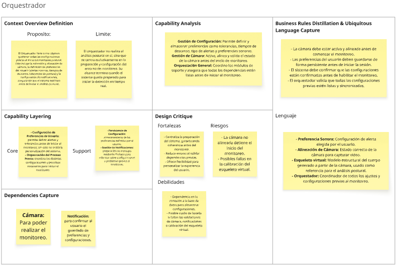
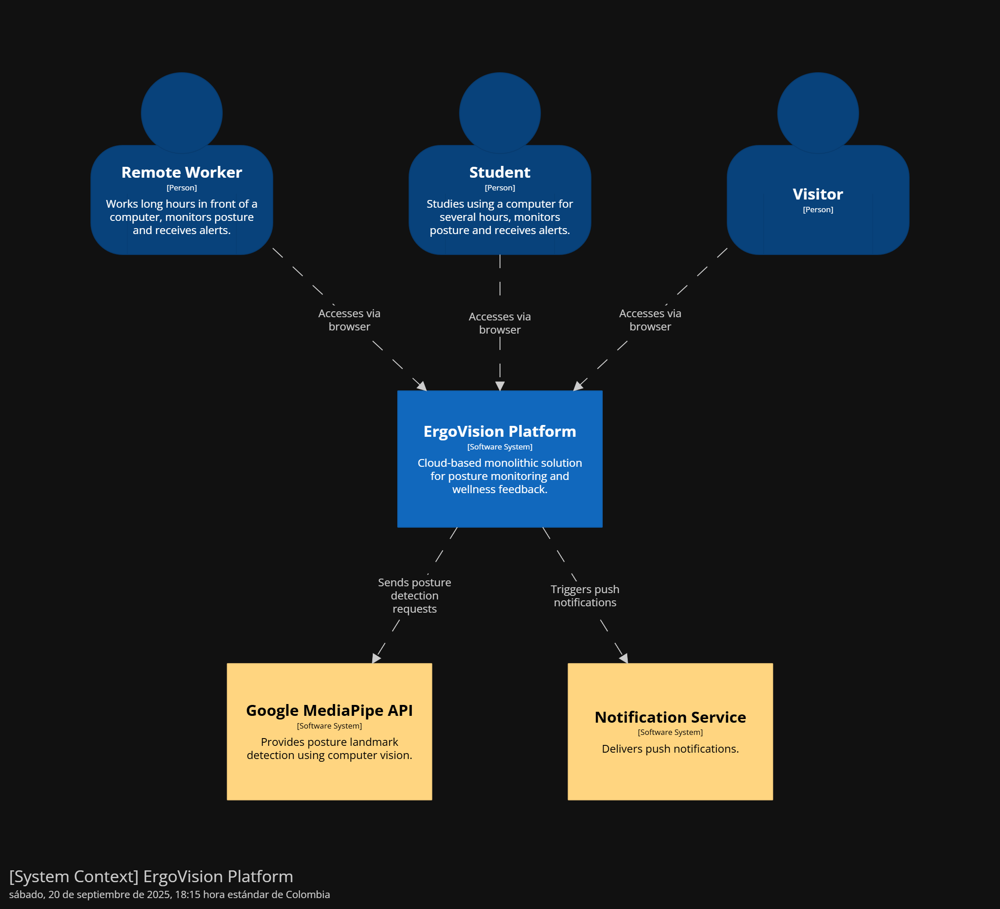

# Universidad Peruana de Ciencias Aplicadas

### **CURSO:** Arquitecturas De Software Emergentes

### **NRC**: 7291

### **Profesor:** Royer Edelwer Rojas Malasquez

### **Ingeniería de software**

## Informe de -

### **Nombre del startup:** NRG7

### **Nombre del producto:** -

## **Integrantes**

| **Nombre**                                | **Codigo** |
| ----------------------------------------- | ---------- |
| **Astonitas Díaz Juan Diego**             | U202110237 |
| **Casas Sanchez Gabriel Alexander**       | U202220033 |
| **Espinoza Delgado BárbaraAntonella**     | U201911727 |
| **Godofredo Quispe Tipon**                | u202120772 |
| **Pasquale Barrenechea Gianluca Santino** | U202112078 |

**Agosto 2025**

## Registro de Versiones del Informe

<table>
  <thead>
    <tr>
      <th>Versión</th>
      <th>Fecha</th>
      <th>Autor</th>
      <th>Descripción de modificación</th>
    </tr>
  </thead>
  <tbody>
    <tr>
      <td></td>
      <td></td>
      <td></td>
      <td></td>
    </tr>
  </tbody>
</table>

## Project Report Collaboration Insights

El enlace a github del reporte del proyecto es el siguiente: [https://github.com/NRG7-Emergentes/report](https://github.com/NRG7-Emergentes/report).

## Contenido

- [Student Outcome](#student-outcome)
- [Capítulo I: Introducción](#capítulo-i-introducción)
  - [1.1 Startup Profile](#11-startup-profile)
    - [1.1.1 Descripción de la Startup](#111-descripción-de-la-startup)
    - [1.1.2 Perfiles de integrantes del equipo](#112-perfiles-de-integrantes-del-equipo)
  - [1.2 Solution Profile](#12-solution-profile)
    - [1.2.1 Antecedentes y problemática](#121-antecedentes-y-problemática)
    - [1.2.2 Lean UX Process](#122-lean-ux-process)
      - [1.2.2.1 Lean UX Problem Statements](#1221-lean-ux-problem-statements)
      - [1.2.2.2 Lean UX Assumptions](#1222-lean-ux-assumptions)
      - [1.2.2.3 Lean UX Hypothesis Statements](#1223-lean-ux-hypothesis-statements)
      - [1.2.2.4 Lean UX Canvas](#1224-lean-ux-canvas)
  - [1.3 Segmentos objetivo](#13-segmentos-objetivo)
- [Capítulo II: Requirements Elicitation \& Analysis](#capítulo-ii-requirements-elicitation--analysis)
  - [2.1 Competidores](#21-competidores)
    - [2.1.1 Análisis competitivo](#211-análisis-competitivo)
    - [2.1.2 Estrategias y tácticas frente a competidores](#212-estrategias-y-tácticas-frente-a-competidores)
  - [2.2 Entrevistas](#22-entrevistas)
    - [2.2.1 Diseño de entrevistas](#221-diseño-de-entrevistas)
    - [2.2.2 Registro de entrevistas](#222-registro-de-entrevistas)
    - [2.2.3 Análisis de entrevistas](#223-análisis-de-entrevistas)
  - [2.3 Needfinding](#23-needfinding)
    - [2.3.1 User Personas](#231-user-personas)
    - [2.3.2 User Task Matrix](#232-user-task-matrix)
    - [2.3.3 Empathy Mapping](#233-empathy-mapping)
    - [2.3.4 As-is Scenario Mapping](#234-as-is-scenario-mapping)
  - [2.4 Ubiquitous Language](#24-ubiquitous-language)
- [Capítulo III: Requirements Specification](#capítulo-iii-requirements-specification)
  - [3.1 To-Be Scenario Mapping](#31-to-be-scenario-mapping)
  - [3.2 User Stories](#32-user-stories)
  - [3.3 Impact Mapping](#33-impact-mapping)
  - [3.4 Product Backlog](#34-product-backlog)
- [Capítulo IV: Strategic-Level Software Design](#capítulo-iv-strategic-level-software-design)
  - [4.1 Strategic-Level Attribute-Driven Design](#41-strategic-level-attribute-driven-design)
    - [4.1.1 Design Purpose](#411-design-purpose)
    - [4.1.2 Attribute-Driven Design Inputs](#412-attribute-driven-design-inputs)
      - [4.1.2.1 Primary Functionality (Primary User Stories)](#4121-primary-functionality-primary-user-stories)
      - [4.1.2.2 Quality attribute Scenarios](#4122-quality-attribute-scenarios)
      - [4.1.2.3 Constraints](#4123-constraints)
    - [4.1.3 Architectural Drivers Backlog](#413-architectural-drivers-backlog)
    - [4.1.4 Architectural Design Decisions](#414-architectural-design-decisions)
    - [4.1.5 Quality Attribute Scenario Refinements](#415-quality-attribute-scenario-refinements)
  - [4.2 Strategic-Level Domain-Driven Design](#42-strategic-level-domain-driven-design)
    - [4.2.1 EventStorming](#421-eventstorming)
    - [4.2.2 Candidate Context Discovery](#422-candidate-context-discovery)
    - [4.2.3 Domain Message Flows Modeling](#423-domain-message-flows-modeling)
    - [4.2.4 Bounded Context Canvases](#424-bounded-context-canvases)
    - [4.2.5 Context Mapping](#425-context-mapping)
  - [4.3 Software Architecture](#43-software-architecture)
    - [4.3.1 Software Architecture System Landscape Diagram](#431-software-architecture-system-landscape-diagram)
    - [4.3.2 Software Architecture Context Level Diagrams](#432-software-architecture-context-level-diagrams)
    - [4.3.3 Software Architecture Container Level Diagrams](#433-software-architecture-container-level-diagrams)
    - [4.3.4 Software Architecture Deployment Diagrams](#434-software-architecture-deployment-diagrams)
- [Conclusiones](#conclusiones)
- [Bibliografía](#bibliografía)
- [Anexos](#anexos)

## Student Outcome

El curso contribuye al cumplimiento del Student Outcome ABET:

**ABET – EAC - Student Outcome 3**

Criterio: _Capacidad de comunicarse efectivamente con un rango de audiencias._
En el siguiente cuadro se describe las acciones realizadas y enunciados de
conclusiones por parte del grupo, que permiten sustentar el haber alcanzado el logro
del ABET – EAC - Student Outcome 3.

<table>
  <thead>
    <tr>
      <th style="text-align: left;">Criterio específico</th>
      <th style="text-align: left;">Acciones realizadas</th>
      <th style="text-align: left;">Conclusiones</th>
    </tr>
  </thead>
  <tbody>
    <tr>
      <td><strong>Comunica oralmente sus ideas y/o resultados con objetividad a público de diferentes especialidades y niveles jerarquicos, en el marco del desarrollo de un proyecto en ingeniería.</strong></td>
      <td>
        -
      </td>
      <td>
        -
      </td>
    </tr>
    <tr>
      <td><strong>Comunica en forma escrita ideas y/o resultados con objetividad a público de diferentes especialidades y niveles jerarquicos, en el marco del desarrollo de un proyecto eningeniería.</strong></td>
      <td>
        -
      </td>
      <td>
        -
      </td>
    </tr>
  </tbody>
</table>

## Capítulo I: Introducción

### 1.1 Startup Profile

#### 1.1.1 Descripción de la Startup

#### 1.1.2 Perfiles de integrantes del equipo

### 1.2 Solution Profile

#### 1.2.1 Antecedentes y problemática

#### 1.2.2 Lean UX Process

##### 1.2.2.1 Lean UX Problem Statements

##### 1.2.2.2 Lean UX Assumptions

##### 1.2.2.3 Lean UX Hypothesis Statements

##### 1.2.2.4 Lean UX Canvas

### 1.3 Segmentos objetivo

## Capítulo II: Requirements Elicitation & Analysis

### 2.1 Competidores

#### 2.1.1 Análisis competitivo

#### 2.1.2 Estrategias y tácticas frente a competidores

### 2.2 Entrevistas

#### 2.2.1 Diseño de entrevistas

#### 2.2.2 Registro de entrevistas

#### 2.2.3 Análisis de entrevistas

### 2.3 Needfinding

#### 2.3.1 User Personas

#### 2.3.2 User Task Matrix

#### 2.3.3 Empathy Mapping

#### 2.3.4 As-is Scenario Mapping

### 2.4 Ubiquitous Language

## Capítulo III: Requirements Specification

### 3.1 To-Be Scenario Mapping

### 3.2 User Stories

### 3.3 Impact Mapping

### 3.4 Product Backlog

## Capítulo IV: Strategic-Level Software Design

### 4.1 Strategic-Level Attribute-Driven Design

El enfoque Attribute-Driven Design (ADD) permite estructurar la arquitectura de una solución priorizando los atributos de calidad que impulsan las decisiones clave de diseño. En esta sección se presenta el proceso a nivel estratégico, donde se establecen los drivers arquitectónicos, se justifican las decisiones de diseño y se ilustran los escenarios de atributos de calidad, concluyendo con una primera vista de la arquitectura de alto nivel.

#### 4.1.1 Design Purpose

El propósito del proceso de diseño en ErgoVision es establecer una arquitectura de solución que aborde de manera integral la problemática de los riesgos ergonómicos derivados del uso prolongado de dispositivos digitales. Este diseño se orienta a garantizar que la plataforma cumpla con los requerimientos de monitoreo postural en tiempo real, retroalimentación inmediata del comportamiento del usuario. De esta manera, se busca responder a las necesidades específicas de los segmentos objetivo, usuarios expuestos a posturas inadecuadas durante jornadas de trabajo o estudio, mediante un sistema que fomente hábitos saludables y prevenga lesiones. Al mismo tiempo, el proceso de diseño asegura la alineación con los objetivos estratégicos del negocio, fortaleciendo la propuesta de valor en el marco de la transformación digital aplicada a la salud y el bienestar.

#### 4.1.2 Attribute-Driven Design Inputs

En esta sección se fundamentará la identificación y análisis de insumos clave que orientan las decisiones arquitectónicas. Estos insumos constituyen la base para garantizar que la solución responda tanto a los requerimientos funcionales como a los atributos de calidad y restricciones que condicionan el diseño. En el caso de ErgoVision, los inputs se organizan en tres categorías: las funcionalidades primarias representadas por las historias de usuario más relevantes, los escenarios de atributos de calidad que reflejan las propiedades críticas de la solución, y las restricciones tecnológicas, organizacionales y de entorno que delimitan el espacio de diseño.

##### 4.1.2.1 Primary Functionality (Primary User Stories)

La primary user stories se refiere a aquellas historias de usuario que tienen un impacto directo en el cómo se va a estructurar la arquitectura de aplicación. Las primary user stories identificadas son las siguientes:

| User Story ID | Título                                     | Descripción                                                                                                                                                  | Criterios de Aceptación                                                                                                                                                                                                                                                                                                                                                                                                                                                                                    | Epic ID |
|---------------|--------------------------------------------|--------------------------------------------------------------------------------------------------------------------------------------------------------------|------------------------------------------------------------------------------------------------------------------------------------------------------------------------------------------------------------------------------------------------------------------------------------------------------------------------------------------------------------------------------------------------------------------------------------------------------------------------------------------------------------|---------|
| US-001        | Acceso a la Cámara                         | Como usuario, quiero permitir el acceso a mi cámara web para que el sistema pueda comenzar a analizar mi postura.                                            | <b>Escenario 1: Permiso concedido</b> Dado que el usuario ha iniciado sesión, Cuando inicia el monitoreo, Entonces el navegador solicita permiso para acceder a la cámara y, al concederlo, el feed de video se muestra en la interfaz. <b>Escenario 2: Permiso denegado</b> Dado que el navegador solicita acceso a la cámara, Cuando el usuario deniega el permiso, Entonces se muestra un mensaje de error claro con instrucciones para habilitar el acceso manualmente.    | EP-001  |
| US-002        | Visualización del Esqueleto en Tiempo Real | Como usuario, quiero ver una superposición del esqueleto detectado sobre mi imagen de video para entender cómo el sistema interpreta mi postura.             | <b>Escenario 1: Renderizado del modelo</b>Dado que la cámara está activa y el usuario está en el campo de visión,Cuando MediaPipe Pose detecta los 33 landmarks,Entonces se dibuja un esqueleto semitransparente que se ajusta en tiempo real a los movimientos del usuario.                                                                                                                                                                                                                               | EP-001  |
| US-003        | Detección de Postura Encorvada             | Como usuario, quiero que el sistema detecte automáticamente cuando mis hombros están desalineados o encorvados para poder corregirlo.                        | <b>Escenario 1: Detección de encorvamiento</b> Dado que el usuario está siendo monitoreado, Cuando la inclinación de sus hombros supera el umbral configurado, Entonces el sistema registra el evento como una "mala postura" y lo almacena para su análisis. <b>Escenario 2: Postura correcta</b> Dado que el usuario estaba encorvado, Cuando corrige su postura y sus hombros vuelven a estar alineados, Entonces el sistema deja de registrar el evento de "mala postura". | EP-001  |
| US-004        | Detección de Proximidad a la Pantalla      | Como usuario, quiero que el sistema me alerte cuando mi rostro está demasiado cerca de la pantalla para prevenir fatiga visual.                              | <b>Escenario 1: Rostro demasiado cerca</b> Dado que la cámara está calibrada, Cuando la distancia estimada entre su rostro y la pantalla es menor a 50 cm, Entonces el sistema activa una alerta de proximidad. <b>Escenario 2: Distancia correcta</b> Dado que su rostro estaba demasiado cerca, Cuando se aleja a una distancia mayor a 50 cm, Entonces la alerta de proximidad se desactiva.                                                                                | EP-001  |
| US-009        | Alertas Visuales para Mala Postura         | Como usuario, quiero recibir alertas visuales no intrusivas cuando mi postura es incorrecta, para corregirla inmediatamente sin interrupciones bruscas.      | <b>Escenario 1: Alerta visual activa</b> Dado que el sistema detecta una mala postura, Cuando se activa el evento de alerta, Entonces aparece un borde de color suave alrededor de la interfaz indicando el tipo de error postural. <b>Escenario 2: Alerta persistente</b> Dado que la mala postura continúa, Cuando pasan más de 5 segundos sin corrección, Entonces la alerta visual aumenta ligeramente su intensidad para reforzar la notificación.                        | EP-002  |
| US-010        | Alertas Sonoras Personalizables            | Como usuario, quiero asignar sonidos diferentes para cada tipo de error postural, para identificar rápidamente el problema específico sin mirar la pantalla. | <b>Escenario 1: Sonido de encorvamiento</b> Dado que se detecta espalda encorvada, Cuando se activa la alerta, Entonces se reproduce el sonido específico configurado para "encorvamiento". <b>Escenario 2: Sonido de proximidad</b> Dado que se detecta proximidad excesiva a la pantalla, Cuando se activa la alerta, Entonces se reproduce un sonido diferente configurado para "proximidad".                                                                               | EP-002  |
| US-015        | Calibración Inicial de Postura             | Como usuario, quiero realizar una calibración inicial de mi postura correcta para que el sistema reconozca mi posición ideal al sentarme.                    | <b>Escenario 1: Calibración exitosa</b> Dado que el usuario inicia el wizard de calibración, Cuando mantiene una postura correcta durante 5 segundos, Entonces el sistema registra esta posición como referencia para futuras comparaciones.                                                                                                                                                                                                                                                   | EP-003  |
| US-020        | Panel Principal de Estadísticas            | Como usuario, quiero ver un dashboard con mis métricas principales de postura para tener una visión general de mi progreso diario.                           | <b>Escenario 1: Visualización de métricas</b> Dado que el usuario ha usado el sistema por más de 1 hora, Cuando accede al panel principal, Entonces ve porcentaje de postura correcta, tiempo total de uso y número de alertas recibidas.                                                                                                                                                                                                                                                      | EP-004  |
| US-023        | Recordatorio de Pausas Activas             | Como usuario, quiero recibir recordatorios automáticos para tomar pausas activas cada cierto tiempo para prevenir la fatiga y mejorar mi bienestar postural. | <b>Escenario: Recordatorio cada 45 minutos</b> Dado que el usuario ha estado trabajando continuamente, Cuando transcurren 45 minutos de actividad, Entonces el sistema muestra una notificación sugiriendo una pausa activa de 5 minutos.                                                                                                                                                                                                                                                      | EP-005  |

##### 4.1.2.2 Quality attribute Scenarios

Los escenarios de atributos de calidad de ErgoVision constituyen un insumo crítico para el diseño arquitectónico, ya que permiten anticipar cómo debe comportarse el sistema ante condiciones específicas relacionadas con el uso real. Estos escenarios reflejan las propiedades clave que aseguran la efectividad de la solución.

| **Atributo**       | **Fuente**    | **Estímulo**                                                              | **Artefacto**              | **Entorno**                              | **Respuesta**                                                               | **Medida**                                                          |
|--------------------|---------------|---------------------------------------------------------------------------|----------------------------|------------------------------------------|-----------------------------------------------------------------------------|---------------------------------------------------------------------|
| **Rendimiento**    | Usuario       | El usuario habilita la cámara para iniciar monitoreo postural.            | Módulo de IA + Cámara      | Operación normal del sistema.            | El sistema procesa video y muestra esqueleto en tiempo real.                | Latencia ≤ 200 ms en la visualización del esqueleto.                |
| **Usabilidad**     | Usuario       | El usuario recibe una notificación de postura incorrecta.                 | Interfaz de Alertas        | Durante el uso continuo del sistema.     | El sistema despliega alerta visual no intrusiva y clara.                    | El 90% de usuarios entiende y actúa en < 3 segundos tras la alerta. |
| **Disponibilidad** | Usuario       | El usuario utiliza la app en una jornada de 8 horas.                      | Plataforma completa        | Carga de trabajo prolongada.             | El sistema mantiene el monitoreo sin interrupciones críticas.               | Uptime ≥ 99% durante sesiones de 8h.                                |
| **Escalabilidad**  | Administrador | La base de usuarios crece de 100 a 10,000 en 6 meses.                     | Infraestructura en la nube | Escenario de crecimiento progresivo.     | El sistema mantiene tiempos de respuesta consistentes al aumentar usuarios. | Tiempo de respuesta ≤ 500 ms con 10,000 usuarios concurrentes.      |
| **Fiabilidad**     | Usuario       | El sistema detecta un fallo en la conexión de cámara.                     | Módulo de Captura de Video | Cámara desconectada o error de hardware. | El sistema informa al usuario y permite reconectar automáticamente.         | Reconexión exitosa en < 10 segundos en el 95% de los casos.         |
| **Privacidad**     | Usuario       | El usuario configura su cuenta para no almacenar imágenes, solo métricas. | Módulo de Persistencia     | Configuración personalizada habilitada.  | El sistema guarda únicamente datos agregados sin imágenes sensibles.        | 100% de cumplimiento con la preferencia del usuario.                |

##### 4.1.2.3 Constraints

El proceso de diseño de ErgoVisión debe considerar restricciones no negociables que han sido impuestas tanto por las necesidades del negocio como por requerimientos técnicos mínimos para garantizar la viabilidad de la solución. Estas restricciones actúan como guías ineludibles para orientar la arquitectura hacia una plataforma confiable, segura y escalable, asegurando el cumplimiento de normativas y la alineación con las capacidades actuales del equipo de desarrollo y la infraestructura disponible. A continuación, se detallan las principales restricciones identificadas:

<table>
  <thead>
    <tr>
      <th>Technical Story ID</th>
      <th>Título</th>
      <th>Descripción</th>
      <th>Criterios de Aceptación</th>
      <th>Relacionado con (Epic ID)</th>
    </tr>
  </thead>
  <tbody>
    <tr>
        <td>TS-001</td>
        <td>Integración de MediaPipe Pose</td>
        <td>Como developer, debo utilizar exclusivamente MediaPipe Pose para la detección de landmarks corporales, ya que es la tecnología central que define las capacidades de análisis postural del sistema.</td>
        <td>
            <b>Escenario: Dependencia tecnológica</b> 
            Dado que MediaPipe es el core tecnológico, 
            Cuando se implementa el análisis postural, 
            Entonces no se pueden utilizar alternativas o complementos de otros proveedores de IA.
        </td>
        <td>EP-001</td>
    </tr>
    <tr>
        <td>TS-002</td>
        <td>Manejo de Permisos de Cámara</td>
        <td>Como developer, debo implementar el acceso a cámara como requisito obligatorio, ya que el sistema no puede funcionar sin este recurso hardware.</td>
        <td>
            <b>Escenario: Dependencia de hardware</b> 
            Dado que la cámara es esencial, 
            Cuando el usuario deniega el permiso, 
            Entonces la aplicación no puede ofrecer funcionalidad alguna de monitoreo.
        </td>
        <td>EP-001</td>
    </tr>
    <tr>
        <td>TS-007</td>
        <td>Optimización de Rendimiento</td>
        <td>Como developer, debo garantizar que el consumo de CPU no exceda el 30% en equipos de gama media, ya que es un requisito de performance crítico para la usabilidad.</td>
        <td>
            <b>Escenario: Límite de consumo recursos</b> 
            Dado que es una aplicación web, 
            Cuando se procesa video en tiempo real, 
            Entonces el uso de CPU debe mantenerse bajo el umbral definido.
        </td>
        <td>EP-001</td>
    </tr>
    <tr>
        <td>TS-025</td>
        <td>Almacenamiento Persistente de Datos</td>
        <td>Como developer, debo implementar el almacenamiento local para datos de postura, ya que la arquitectura prohibe el envío de video o imágenes a servidores externos por privacidad.</td>
        <td>
            <b>Escenario: Restricción de privacidad</b> 
            Dado que se procesa video personal, 
            Cuando se almacenan datos, 
            Entonces toda la información debe permanecer en el dispositivo del usuario.
        </td>
        <td>EP-004</td>
    </tr>
    <tr>
        <td>TS-032</td>
        <td>Sistema de Verificación de Email</td>
        <td>Como developer, debo implementar verificación por email como requisito obligatorio para activar cuentas, ya que es una restricción de seguridad no negociable.</td>
        <td>
            <b>Escenario: Constraint de seguridad</b> 
            Dado que se manejan datos personales, 
            Cuando un usuario se registra, 
            Entonces debe verificar su email antes de poder usar la aplicación.
        </td>
        <td>EP-006</td>
    </tr>
    <tr>
        <td>TS-037</td>
        <td>Manejo de Sesiones Seguras</td>
        <td>Como developer, debo implementar autenticación con tokens JWT como estándar obligatorio, ya que es una restricción arquitectural para garantizar seguridad en todas las comunicaciones.</td>
        <td>
            <b>Escenario: Standard de seguridad</b> 
            Dado que se maneja información sensible, 
            Cuando se autentica un usuario, 
            Entonces todas las comunicaciones deben usar tokens JWT firmados.
        </td>
        <td>EP-006</td>
    </tr>
  </tbody>
</table>

#### 4.1.3 Architectural Drivers Backlog

El proceso de identificación de Architectural Drivers se desarrolló de manera iterativa mediante un Quality Attribute Workshop, en el cual el equipo analizó los requisitos funcionales clave, los atributos de calidad prioritarios y las restricciones no negociables que condicionan el diseño de ErgoVisión.

El resultado de este análisis se consolida en un backlog de drivers arquitecturales, el cual sirve como guía estratégica para la definición y evolución de la solución. Dichos drivers se han clasificado según su importancia para los stakeholders y su impacto en la complejidad técnica de la arquitectura, priorizando aquellos con mayor influencia en ambas dimensiones.

Se siguió la siguiente leyenda para los drivers ID: FD = Functional Driver, QD = Quality Driver, TS = Technical Story.

| Driver ID | Título de Driver                    | Descripción                                                                                                                                                                                          | Importancia para Stakeholders | Impacto en Architecture Technical Complexity |
|-----------|-------------------------------------|------------------------------------------------------------------------------------------------------------------------------------------------------------------------------------------------------|-------------------------------|----------------------------------------------|
| FD-01     | Monitoreo postural en tiempo real   | Permite capturar y analizar la postura del usuario mediante IA, identificando desviaciones en hombros, cabeza y distancia a la pantalla.                                                             | High                          | High                                         |
| FD-02     | Sistema de alertas y notificaciones | Proporciona retroalimentación inmediata (visual, sonora o push) para corregir la postura y prevenir riesgos.                                                                                         | High                          | Medium                                       |
| FD-03     | Personalización y calibración       | Facilita un proceso de configuración inicial y ajustes de sensibilidad según el usuario.                                                                                                             | Medium                        | Medium                                       |
| FD-04     | Seguimiento de progreso y analytics | Ofrece paneles con métricas de evolución, hábitos y patrones de error.                                                                                                                               | Medium                        | Medium                                       |
| FD-05     | Gestión de bienestar y prevención   | Incluye recordatorios de pausas activas y guías de estiramiento.                                                                                                                                     | Medium                        | Low                                          |
| FD-06     | Gestión de usuario y perfil         | Permite registro, login, recuperación de contraseña y preferencias de cuenta.                                                                                                                        | High                          | Medium                                       |
| QD-01     | Performance y baja latencia         | El sistema debe procesar video y emitir alertas en menos de 200 ms.                                                                                                                                  | High                          | High                                         |
| QD-02     | Usabilidad y accesibilidad          | La interfaz debe ser clara, accesible y adaptada a usuarios con diferentes perfiles.                                                                                                                 | High                          | Medium                                       |
| QD-03     | Escalabilidad                       | La plataforma debe soportar un incremento progresivo de usuarios y dispositivos IoT.                                                                                                                 | High                          | High                                         |
| QD-04     | Seguridad de datos                  | Los datos de postura y salud deben almacenarse y transmitirse de forma encriptada.                                                                                                                   | High                          | High                                         |
| QD-05     | Disponibilidad                      | El sistema debe mantener un uptime mínimo de 99.5% en entorno cloud.                                                                                                                                 | High                          | Medium                                       |
| QD-06     | Interoperabilidad IoT               | La plataforma debe integrarse con sensores IoT heterogéneos.                                                                                                                                         | Medium                        | High                                         |
| TS-01     | Integración de MediaPipe Pose       | Como developer, debo utilizar exclusivamente MediaPipe Pose para la detección de landmarks corporales, ya que es la tecnología central que define las capacidades de análisis postural del sistema.  | High                          | High                                         |
| TS-02     | Manejo de Permisos de Cámara        | Como developer, debo implementar el acceso a cámara como requisito obligatorio, ya que el sistema no puede funcionar sin este recurso hardware.                                                      | High                          | Medium                                       |
| TS-07     | Optimización de Rendimiento         | Como developer, debo garantizar que el consumo de CPU no exceda el 30% en equipos de gama media, ya que es un requisito de performance crítico para la usabilidad.                                   | High                          | Medium                                       |
| TS-25     | Almacenamiento Persistente de Datos | Como developer, debo implementar el almacenamiento local para datos de postura, ya que la arquitectura prohibe el envío de video o imágenes a servidores externos por privacidad.	                   | Medium                        | Medium                                       |
| TS-32     | Sistema de Verificación de Email    | Como developer, debo implementar verificación por email como requisito obligatorio para activar cuentas, ya que es una restricción de seguridad no negociable.	                                      | Medium                        | Medium                                       |
| TS-37     | Manejo de Sesiones Seguras          | Como developer, debo implementar autenticación con tokens JWT como estándar obligatorio, ya que es una restricción arquitectural para garantizar seguridad en todas las comunicaciones.	             | High                          | High                                         |

#### 4.1.4 Architectural Design Decisions

Las Architectural Design Decisions de ErgoVision representan una especificación detallada de las elecciones arquitectónicas clave que guiaran el diseño de la solución y las alternativas que se tomaron en cuenta |

| Driver ID | Driver                              | Decisión Relacionada                                       | Motivación                                                                             | Alternativas Consideradas                         | Estado   |
|-----------|-------------------------------------|------------------------------------------------------------|----------------------------------------------------------------------------------------|---------------------------------------------------|----------|
| FD-01     | Monitoreo postural en tiempo real   | DD1: Uso de Google AI Mediapipe Pose Landmark              | Aprovechar un modelo probado de visión por computadora para detección precisa y rápida | Desarrollar un modelo propio de IA, usar OpenPose | Aprobada |
| FD-02     | Sistema de alertas y notificaciones | DD2: Uso de Firebase Cloud Messaging                       | Permite notificaciones push en tiempo real en múltiples dispositivos                   | Socket.io, servicios de terceros de mensajería    | Aprobada |
| FD-06     | Gestión de usuario y perfil         | DD3: Base de datos PostgreSQL                              | Ofrece robustez, consistencia ACID y buena integración con Spring Boot                 | MySQL, MongoDB                                    | Aprobada |
| QD-01     | Performance y baja latencia         | DD4: Arquitectura monolítica con Spring Boot               | Reduce complejidad y overhead, garantizando menor latencia en despliegues iniciales    | Arquitectura de microservicios                    | Aprobada |
| QD-01     | Performance y baja latencia         | DD10: Uso de Redis como caché en memoria                   | Permite reducir la carga de PostgreSQL y acelerar la respuesta a consultas frecuentes  | Memcached, solo acceso directo a Postgres         | Aprobada |
| QD-02     | Usabilidad y accesibilidad          | DD5: Frontend en Angular + Tailwind                        | Permite una UI escalable, responsive y de fácil mantenimiento                          | React, NextJS                                     | Aprobada |
| QD-03     | Escalabilidad                       | DD6: Contenerización con Docker y orquestación con Compose | Facilita replicación del servicio en distintos entornos y despliegues ágiles           | Kubernetes, despliegue manual sin contenedores    | Aprobada |
| QD-04     | Seguridad de datos                  | DD7: Nginx como balanceador + TLS                          | Provee capa de seguridad y manejo eficiente de tráfico entrante                        | Apache HTTP Server, Caddy                         | Aprobada |
| QD-05     | Disponibilidad                      | DD8: Hosting en Render con autoescalado básico             | Plataforma gestionada que ofrece despliegue sencillo con redundancia mínima            | AWS EC2, Azure App Services                       | Aprobada |
| QD-06     | Interoperabilidad IoT               | DD9: Uso de webcam externa estándar                        | Garantiza compatibilidad amplia con librerías de visión por computadora                | Cámaras IP propietarias, sensores personalizados  | Aprobada |
| TS-01     | Integración de MediaPipe Pose       | DD1: Uso de Google AI Mediapipe Pose Landmark              | Aprovechar un modelo probado de visión por computadora para detección precisa y rápida | Desarrollar un modelo propio de IA, usar OpenPose | Aprobada |
| TS-02     | Manejo de Permisos de Cámara        | DD9: Uso de webcam externa estándar                        | Garantiza compatibilidad amplia con librerías de visión por computadora                | Cámaras IP propietarias, sensores personalizados  | Aprobada |
| TS-07     | Optimización de Rendimiento         | DD7: Nginx como balanceador + TLS                          | Provee capa de seguridad y manejo eficiente de tráfico entrante                        | Apache HTTP Server, Caddy                         | Aprobada |
| TS-25     | Almacenamiento Persistente de Datos | DD8: DB Hosting en Render con autoescalado básico          | Plataforma gestionada que ofrece despliegue sencillo con redundancia mínima            | AWS EC2, Azure App Services                       | Aprobada |
| TS-32     | Sistema de Verificación de Email    | DD11: Spring Mail como herramienta de envío de correo      | Integración nativa con Spring Boot y configuración sencilla para envío de emails       | Servicios de terceros (SendGrid, MailChimp)       | Aprobada |
| TS-37     | Manejo de Sesiones Seguras          | DD12: JWT como herramienta de autenticación                | Estándar industry para autenticación stateless, seguro y escalable                     | Session-based auth, OAuth2 con terceros           | Aprobada |

#### 4.1.5 Quality Attribute Scenario Refinements

Los escenarios refinados de atributos de calidad de ErgoVision representan una especificación detallada de cómo los atributos deben manifestarse en situaciones de uso concretas. A través de su refinamiento, se convierten en condiciones medibles y verificables, que permiten evaluar de manera objetiva el desempeño del sistema bajo distintos estímulos.

| Atributo de Calidad | Estímulo                                              | Escenario Refinado                                           | Evaluación Esperada                      |
|---------------------|-------------------------------------------------------|--------------------------------------------------------------|------------------------------------------|
| Rendimiento         | Usuario habilita la cámara para iniciar monitoreo.    | El sistema procesa video y muestra esqueleto en <200 ms.     | 95% de las pruebas cumplen con ≤200 ms.  |
| Usabilidad          | Usuario recibe notificación de postura incorrecta.    | El sistema despliega alerta clara y entendible en <3 s.      | 90% de usuarios comprenden y reaccionan. |
| Disponibilidad      | Usuario utiliza la app durante una jornada de 8 h.    | El sistema mantiene monitoreo continuo sin interrupciones.   | Uptime ≥99.5% en jornadas de 8h.         |
| Escalabilidad       | La base de usuarios crece de 100 a 10,000 en 6 meses. | El sistema mantiene tiempos de respuesta ≤500 ms.            | Respuesta ≤500 ms con 10k usuarios.      |
| Fiabilidad          | El sistema detecta un fallo en la conexión de cámara. | El sistema informa al usuario y reconecta en <10 s.          | Reconexión exitosa en ≥95% de casos.     |
| Privacidad          | Usuario configura su cuenta para no guardar imágenes. | El sistema guarda únicamente datos agregados y no sensibles. | 100% cumplimiento GDPR e ISO 27001.      |

### 4.2 Strategic-Level Domain-Driven Design

#### 4.2.1 EventStorming

Para la sección de Event Storming el equipo de desarrollo tuvo una reunión donde expusimos ideas acerca de las funcionalidades y caracteristicas a implementar en el proyecto. En el transcurso de la reunión, se lograron plantar varias ideas para la plataforma y la aplicación mobil, además de las primeras versiones para los bounded context.

En esta etapa, se identificaron los eventos clave que representan las acciones significativas dentro de la solución IoT. La herramienta utilizada fue Miro.

1.  Define the Purpose
    En esta fase se generan ideas relacionadas con el objetivo del proyecto, aprovechando la lluvia de ideas como recurso clave.

    

2.  Timelines
    Durante esta fase, los eventos identificados fueron agrupados en subgrupos liderados por un evento en general que encapsula la función principal del grupo.

    

3.  Paint Points
    En este proceso, se identificaron paint points o puntos problemáticos, que son áreas donde los usuarios pueden experimentar dificultados o fricciones en su interacción con la aplicación. Estos puntos son cruciales para mejorar la experiencia del usuario y optimizar el diseño del sistema.

    

4.  Pivotal points
    Se señalaron los pivotal points o puntos clave, que son eventos críticos que marcan hitos improtantes en el flujo de la plataforma. Estos eventos tienden a ser significativos en el comportamiento del sistema o en la experiencia del usuario.

    

5.  Commands
    Cada evento se asoció a un comando en específico que lo desencadena y un actor que lo realiza. Esto ayudó a tener un mejor reconocimiento de cómo interactúan los diferentes usuarios con el sistema.

    

6.  Policies
    Durante esta etapa, se identifican las politicas relevantes para cada contexto del sistema. Estas politicas pueden incluir restricciones de negocio, reglas de validación, etc.

    

7.  Read Models
    Durante esta fase, se diseñan y desarrollan lso modelos de lectura para cada contexto de sistema, asegurando que proporcionen la información necesaria de manera eficiente y coherente.

    

8.  External Systems
    Durante esta etapa, se identifican los sistemas externos relevantes para la plataforma y se establecen las interfaces necesarias para integrarlos de manera efectiva.

    

9.  Aggregates
    Durante esta etapa, se definen aggregates para cada contexto del sistema, asegurando que representen correctamente las transacciones y operaciones coherentes dentro del sistema.
    

El enlace al Miro: [https://miro.com/app/board/uXjVJIOOJ5E=/](https://miro.com/app/board/uXjVJIOOJ5E=/).

#### 4.2.2 Candidate Context Discovery

A continuación, elegimos utilizar la técnica de start-with-value ya que el equipo de desarrollo decidió empezar por el valor de la aplicación (core), esto es importante para tener una mejor visión del producto.

- **Identificación de Valores del Negocio** : Analizamos los valores clave del negocio, como la experiencia del usuario al estar en su entorno de trabajo/estudio y monitorear su postura, la alertas/notificaciones y la eficiencia en la gestión de usuarios.
- **Identificación de Funcionalidades clave** : Identificar las funcionalidades esenciales de la aplicación, el monitoreo postura correcta, notificaciones/alertas y registro de su proceso que contribuyen directamente a la mejora de salud e eficioencia en su entorno.

**Candidate para Bounded Context: IAM**

Este contexto está encargado de manejar el ciclo de vida de los usuarios en la plataforma, desde el registro hasta la validación de credenciales y el acceso a la plataforma, de acuerdo con su rol, ya sea estudiante o trabajador remoto. Se cubren tres políticas clave: Política de Registro , Registro de Roles y Política de Autenticación.

Posibles responsabilidades del Bounded Context:

- Gestionar el registro y autenticación de usuarios.
- Definir y aplicar políticas de roles para asegurarse de que cada usuario tenga las capacidades correctas dentro del sistema.
- Proveer un sistema de validación de credenciales utilizando estándares de seguridad como JWT.
- Facilitar el acceso a la plataforma basado en los roles asignados al usuario al registrarse.

**Candidate para Bounded Context: Orquestrador**

Este contexto se encarga de administrar y coordinar las configuraciones externas a la plataforma, garantizando que los dispositivos y el entorno estén correctamente preparados para el monitoreo.

Posibles responsabilidades del Bounded Context:

- Gestionar la configuración de la cámara web (posición, encuadre, resolución).
- Ajustar la iluminación y otros parámetros del entorno que influyen en la detección postural.
- Coordinar la comunicación entre los distintos módulos (Monitoreo, Notificaciones, Estadísticas).

**Candidate para Bounded Context: Monitoreo**

Este contexto se encarga de supervisar en tiempo real la postura del usuario durante sus actividades frente a la estación de trabajo/estudio, utilizando modelos de visión por computadora.

Posibles responsabilidades del Bounded Context:

- Capturar datos de video y extraer puntos clave del cuerpo del usuario.
- Analizar la postura del usuario en función de umbrales de confort previamente definidos.
- Detectar desviaciones o malas posturas de forma continua.
- Registrar la evolución de la postura del usuario a lo largo de la sesión de trabajo.

**Candidate para Bounded Context: Notificaciones**

Este contexto se encarga de alertar y comunicar al usuario cuando se detecta una postura inadecuada, ofreciendo recordatorios y sugerencias de corrección.

Posibles responsabilidades del Bounded Context:

- Emitir notificaciones en tiempo real al detectar malas posturas.
- Generar recordatorios de pausas activas o microdescansos.
- Adaptar la frecuencia e intensidad de las alertas según la severidad de la desviación postural.
- Permitir personalización de notificaciones (tono).

**Candidate para Bounded Context: Estadisticas**

Este contexto se encarga de recolectar, procesar y presentar métricas relacionadas con el comportamiento postural del usuario, con el fin de apoyar la mejora continua y la prevención de lesiones.

Posibles responsabilidades del Bounded Context:

- Generar reportes semanales o mensuales sobre la postura del usuario.
- Consolidar métricas de tiempo en buena/mala postura.
- Identificar patrones de riesgo o tendencias a lo largo del tiempo.
- Proveer visualizaciones de datos para el usuario y/o administradores.

Vista completa:

#### 4.2.3 Domain Message Flows Modeling

#### 4.2.4 Bounded Context Canvases

**Estadísticas**

El diseño del bounded context se centra en proporcionar visibilidad del comportamiento postural de los usuarios a través de métricas y reportes. Al ser parte del dominio Core, el valor del sistema depende en gran medida de la capacidad de ofrecer retroalimentación clara y confiable que permita prevenir problemas de salud relacionados con la ergonomía. La solución está orientada a consolidar datos de monitoreo en información útil y visualizaciones que promuevan la mejora continua.

1. **Propósito (Purpose):**

El contexto está diseñado para gestionar la recolección, procesamiento y visualización de estadísticas posturales, permitiendo a los usuarios conocer su comportamiento a lo largo del tiempo y tomar decisiones que favorezcan una postura saludable.

2. **Clasificación Estratégica (Strategic Classification):**

- **Dominio:** Core, ya que la interpretación de los datos de monitoreo es fundamental para cumplir con el objetivo del sistema: mejorar la salud postural de los usuarios.
- **Modelo de Negocio:** Funciona como un decision enabler, al transformar datos en información que guía la prevención de riesgos.
- **Evolución:** Clasificado como custom build, ya que las métricas y reportes deben adaptarse al contexto específico del monitoreo ergonómico y a las necesidades de usuarios remotos.

3. **Roles del Dominio (Domain Roles):**

El contexto actúa bajo el rol de Analytical Context, donde los usuarios consumen reportes y visualizaciones para comprender patrones de comportamiento y tendencias relacionadas con su postura.

4. **Comunicación Entrante (Inbound Communication):**

Los datos provienen principalmente de los módulos de **Monitoreo** e **IAM**.
Mensajes clave entrantes:

- Posture session data
- Metrics request
- User identification

5. **Comunicación Saliente (Outbound Communication):**

El sistema genera salidas hacia el **Frontend** y potencialmente al módulo de **Notificaciones**.
Mensajes clave salientes:

- Statistics report generated
- Trend visualization ready
- Risk pattern identified

6. **Lenguaje Ubicuo (Ubiquitous Language):**

- **Métrica (Metric):** Valor cuantitativo que refleja un aspecto del comportamiento postural.
- **Reporte (Report):** Resumen visual o textual de las métricas en un período definido.
- **Tendencia (Trend):** Variación de una métrica en el tiempo.
- **Sesión (Session):** Intervalo en el que se recopilan datos de monitoreo postural.

7. **Decisiones de Negocio (Business Decisions):**

- Los reportes deben segmentarse en diferentes períodos (día, semana, mes).
- Los datos históricos se deben preservar para comparación a largo plazo.
- Solo los usuarios autenticados pueden acceder a sus propias estadísticas.
- La detección de tendencias de riesgo debe generar recomendaciones preventivas.

8. **Suposiciones (Assumptions):**

- Los datos de monitoreo son confiables y están previamente validados.
- Los reportes generados son utilizados activamente por los usuarios para mejorar su postura.
- El sistema debe ser capaz de manejar un volumen creciente de datos históricos.

9. Métricas de Verificación (Verification Metrics):

El éxito del contexto se medirá por:

- El número de reportes generados y consultados por los usuarios.
- El nivel de interacción de los usuarios con las visualizaciones de tendencias.
- La reducción de alertas por malas posturas a lo largo del tiempo (como efecto indirecto).
- La satisfacción de los usuarios con la claridad y utilidad de los reportes generados.

 

**Orquestador**

El diseño del bounded context se centra en garantizar que todas las dependencias, configuraciones y recursos necesarios estén alineados y listos antes de iniciar el monitoreo postural en tiempo real. Al ser parte del dominio Core, su valor radica en asegurar la preparación del sistema, evitando fallos operativos y mejorando la fiabilidad del proceso de detección. La solución está orientada a coordinar validaciones previas que permitan un inicio de sesión fluido y sin interrupciones.

1. **Propósito (Purpose):**

El contexto está diseñado para coordinar y validar dependencias, configuraciones y recursos (como cámara y notificaciones) antes de iniciar el monitoreo postural, asegurando que el sistema funcione correctamente desde el primer momento.

2. **Clasificación Estratégica (Strategic Classification):**

 - **Dominio:** Core, ya que la preparación del sistema es fundamental para el éxito del monitoreo postural.

 - **Modelo de Negocio:** Actúa como un enabler, asegurando que las condiciones previas estén listas y sincronizadas.

 - **Evolución:** Clasificado como custom build, porque las validaciones y configuraciones deben adaptarse al contexto específico del sistema.

3. **Roles del Dominio (Domain Roles):**

El contexto cumple el rol de Orchestrator Context, coordinando y confirmando configuraciones antes de que comience el monitoreo en tiempo real.

4. **Comunicación Entrante (Inbound Communication):**

Los mensajes provienen de módulos de soporte y del usuario.

Mensajes clave entrantes:

 - Configuration preferences set

 - Camera status check

5. **Comunicación Saliente (Outbound Communication):**

El sistema envía información hacia el módulo de Monitoreo y Notificaciones.

Mensajes clave salientes:

 - Configurations ready

 - Camera enabled

6. **Lenguaje Ubicuo (Ubiquitous Language):**

 - Preferencia Sonora (Sound Preference): Configuración de alertas auditivas definidas por el usuario.

 - Alineación de Cámara (Camera Alignment): Estado correcto de la cámara frente al esqueleto virtual.

 - Esqueleto Virtual (Virtual Skeleton): Representación digital del usuario necesaria para validar la cámara.

 - Orquestador (Orchestrator): Módulo que centraliza y confirma las dependencias y configuraciones antes del inicio del monitoreo.

7. **Decisiones de Negocio (Business Decisions):**

 - El monitoreo no puede comenzar si la cámara no está alineada.

 - Las preferencias del usuario deben estar confirmadas antes de la sesión.

 - Todas las dependencias deben estar sincronizadas en tiempo real.

 - El sistema debe notificar al usuario cuando todo esté listo para iniciar.

8. **Suposiciones (Assumptions):**

 - La cámara estará disponible y alineada.

 - El usuario confirma sus configuraciones previas antes de iniciar.

 - Los módulos de soporte responden sin fallos.

Métricas de Verificación (Verification Metrics):

9. **El éxito del contexto se medirá por:**

 - El porcentaje de sesiones iniciadas sin errores de configuración.

 - El tiempo promedio requerido para validar configuraciones y comenzar el monitoreo.

 - La reducción de fallos en la ejecución debido a configuraciones incompletas.

 - El nivel de satisfacción de los usuarios respecto a la preparación del sistema.

 

**IAM (Identity and Access Management)**

El diseño del bounded context IAM se centra en gestionar la identificación y autenticación de los usuarios de la plataforma, asegurando que cada interacción esté apropiada para cada usuario/contexto. Este contexto maneja identidades verificadas y permisos de acceso.

1. **Propósito (Purpose):** El contexto está diseñado para gestionar la identificación y autenticación de usuarios, asegurando que solo usuarios autorizados puedan acceder a los recursos del sistema y manteniendo la seguridad de las sesiones.

2. **Clasificación Estratégica (Strategic Classification):**
   - **Dominio:** Support, ya que proporciona servicios de autenticación y autorización necesarios para el funcionamiento del sistema.
   - **Modelo de Negocio:** Funciona como compliance enforcer, garantizando que el acceso a los recursos se realice de manera segura y controlada.
   - **Evolución:** Clasificado como commodity, utilizando patrones estándar de autenticación y autorización.

3. **Roles del Dominio (Domain Roles):** El contexto actúa bajo el rol de Gateway Context, controlando el acceso y validando credenciales antes de permitir interacciones con otros contextos del sistema.

4. **Comunicación Entrante (Inbound Communication):** Los datos provienen de las interfaces de usuario y otros contextos que requieren validación. Mensajes clave entrantes:
   - Login request
   - Token validation request
   - User registration request

5. **Comunicación Saliente (Outbound Communication):** El sistema genera tokens de autenticación y respuestas de autorización hacia otros contextos. Mensajes clave salientes:
   - Authentication token issued
   - Access granted/denied
   - User session established

6. **Lenguaje Ubicuo (Ubiquitous Language):**
   - **Usuario:** Entidad que interactúa con la plataforma (cliente, mecánico, visitante, técnico).
   - **Rol:** Conjunto de permisos asignados a un usuario (ej. admin, mecánico, cliente).
   - **Sesión:** Período activo de interacción entre el usuario autenticado y la plataforma.
   - **Permiso:** Autorización para realizar acciones.

7. **Decisiones de Negocio (Business Decisions):**
   - Todos los usuarios deben tener una identidad única asociada a un correo o número de referencia.
   - Un usuario puede decidir si mayor/menor acceso sin restricción.
   - Los roles determinan los permisos de acceso a cada contexto.
   - Las sesiones expiran automáticamente por inactividad o al llegar a un tiempo máximo definido.

8. **Suposiciones (Assumptions):**
   - Los usuarios proporcionan información de registro válida.
   - Las credenciales se almacenan de forma segura y encriptada.
   - El sistema debe manejar múltiples sesiones concurrentes por usuario.

9. **Métricas de Verificación (Verification Metrics):** El éxito del contexto se medirá por:
   - Tiempo de respuesta de autenticación menor a 2 segundos.
   - Tasa de éxito en la validación de credenciales superior al 99%.
   - Número de intentos de acceso no autorizado bloqueados.
   - Disponibilidad del servicio de autenticación superior al 99.9%.

**Monitoreo**

El diseño del bounded context Monitoreo se centra en la gestión del usuario durante su sesión de trabajo, mediante el uso de inteligencia artificial (IA) y una cámara web para detectar malas posturas.

1. **Propósito (Purpose):** Monitorear en tiempo real la postura del usuario durante su sesión mediante inteligencia artificial y una cámara web, detectando malas posturas para prevenir problemas de salud relacionados con la ergonomía.

2. **Clasificación Estratégica (Strategic Classification):**
   - **Dominio:** Core, ya que la detección y análisis de posturas es fundamental para el propósito principal del sistema.
   - **Modelo de Negocio:** Funciona como innovation differentiator, proporcionando valor único a través de la detección automática de posturas.
   - **Evolución:** Clasificado como custom build, ya que requiere desarrollo específico de algoritmos de IA para análisis postural.

3. **Roles del Dominio (Domain Roles):** El contexto actúa como Processing Context, donde se procesan datos de video para generar información sobre la postura del usuario en tiempo real.

4. **Comunicación Entrante (Inbound Communication):** Los datos provienen de cámaras web y sensores del dispositivo del usuario. Mensajes clave entrantes:
   - Video stream data
   - Session start/stop commands
   - User calibration data

5. **Comunicación Saliente (Outbound Communication):** El sistema envía resultados del análisis hacia **Notificaciones** y **Estadísticas**. Mensajes clave salientes:
   - Posture analysis completed
   - Bad posture detected
   - Session monitoring data

6. **Lenguaje Ubicuo (Ubiquitous Language):**
   - **Landmarks Corporales:** Los puntos clave del cuerpo utilizados para detectar posturas (cabeza, hombros, espalda).
   - **Pausa Activa:** Interrupción manual o programada del monitoreo.
   - **Sesión de Monitoreo:** Período durante el cual el sistema analiza la postura del usuario.
   - **Procesamiento Local:** Análisis en el dispositivo sin envío de datos externos.
   - **Umbral Probabilístico:** Nivel de confianza mínimo para considerar una detección de postura válida.

7. **Decisiones de Negocio (Business Decisions):**
   - Una sesión de monitoreo solo puede iniciarse con acceso autenticado a la cámara.
   - Una postura solo será análisis para ser reportada para detectar una incidencia.
   - El análisis postural debe ser en tiempo real mediante un procesamiento streaming.
   - El procesamiento de video debe ocurrir localmente por privacidad streaming.

8. **Suposiciones (Assumptions):**
   - Los usuarios tienen acceso a una cámara web funcional.
   - La iluminación del entorno es suficiente para el análisis.
   - Los modelos de IA son precisos en la detección de posturas.
   - El dispositivo del usuario tiene capacidad de procesamiento suficiente.

9. **Métricas de Verificación (Verification Metrics):** El éxito del contexto se medirá por:
   - Precisión en la detección de posturas superior al 90%.
   - Latencia de procesamiento menor a 100ms.
   - Disponibilidad del servicio de monitoreo superior al 95%.
   - Satisfacción del usuario con la precisión de las detecciones.

**Notificaciones**

El diseño del bounded context Notificaciones se centra únicamente en gestionar la comunicación entre la plataforma y los usuarios, asegurando que reciban alertas, recordatorios y actualizaciones pertinentes en el momento adecuado.

1. **Propósito (Purpose):** Gestionar la comunicación entre la plataforma y los usuarios, enviando notificaciones push, correos electrónicos, SMS y otros métodos de comunicación para mantener a los usuarios informados sobre alertas críticas y recordatorios.

2. **Clasificación Estratégica (Strategic Classification):**
   - **Dominio:** Support, ya que facilita la comunicación pero no es parte del core business del monitoreo postural.
   - **Modelo de Negocio:** Funciona como engagement driver, manteniendo a los usuarios conectados y conscientes de su comportamiento postural.
   - **Evolución:** Clasificado como commodity/product, utilizando servicios estándar de notificación disponibles en el mercado.

3. **Roles del Dominio (Domain Roles):** El contexto actúa como Communication Context, distribuyendo información relevante a los usuarios a través de múltiples canales de comunicación.

4. **Comunicación Entrante (Inbound Communication):** Los datos provienen principalmente de **Monitoreo** y **Estadísticas**. Mensajes clave entrantes:
   - Bad posture alert triggered
   - Report generation completed
   - User threshold exceeded

5. **Comunicación Saliente (Outbound Communication):** El sistema envía notificaciones a través de múltiples canales hacia los usuarios. Mensajes clave salientes:
   - Push notification sent
   - Email notification delivered

6. **Lenguaje Ubicuo (Ubiquitous Language):**
   - **Notificación:** Mensaje enviado a un usuario por la plataforma.
   - **Alerta:** Notificación de alta prioridad (ej. postura crítica).
   - **Recordatorio:** Notificación programada para reforzar hábitos (ej. descansar cada 45 min).
   - **Preferencias:** Configuración elegida por el usuario sobre qué mensajes recibe.

7. **Decisiones de Negocio (Business Decisions):**
   - Todo mensaje debe estar asociado a un usuario autenticado y activo.
   - El usuario puede configurar la frecuencia y tipo de notificaciones que desea recibir.
   - Las alertas críticas tienen prioridad sobre los recordatorios.
   - Las notificaciones deben personalizarse en el historial del usuario.

8. **Suposiciones (Assumptions):**
   - Los usuarios tienen dispositivos capaces de recibir notificaciones.
   - Los servicios de notificación externos están disponibles.
   - Los usuarios revisan y actúan sobre las notificaciones recibidas.
   - El sistema puede acceder a los canales de comunicación necesarios.

9. **Métricas de Verificación (Verification Metrics):** El éxito del contexto se medirá por:
   - Tasa de entrega exitosa de notificaciones superior al 95%.
   - Tiempo de entrega de notificaciones críticas menor a 30 segundos.
   - Tasa de apertura de notificaciones por parte de los usuarios.
   - Reducción en comportamientos de riesgo postural tras recibir alertas.

#### 4.2.5 Context Mapping

### 4.3 Software Architecture

#### 4.3.1 Software Architecture System Landscape Diagram

#### 4.3.2 Software Architecture Context Level Diagrams

#### 4.3.3 Software Architecture Container Level Diagrams

#### 4.3.4 Software Architecture Deployment Diagrams

## Conclusiones

## Bibliografía

## Anexos
